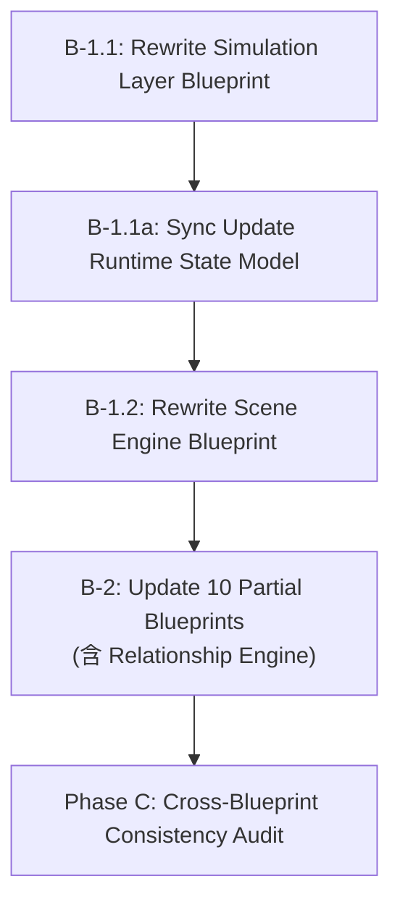
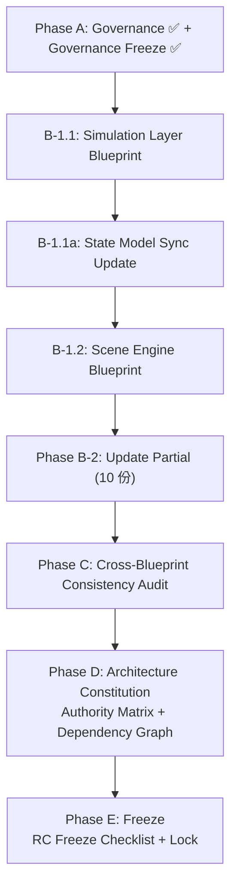

# 交接文档：架构治理阶段

**创建时间：** 2026-07-14  
**适用对话：** 下一轮 AI 对话（架构继续推进）  
**当前阶段：** Phase A 完成 + Governance Freeze → Phase B-1 待启动

---

## 0. 快速定位

| 你需要什么 | 去哪里看 |
|-----------|---------|
| 整个文档集有哪些文档？哪些需要重写？ | [Architecture Migration Matrix](../02_Architecture/Architecture_Migration_Matrix.md) |
| 某个制品归谁？谁生产谁消费？ | [Runtime Artifact Ownership Matrix](../02_Architecture/Runtime_Artifact_Ownership_Matrix.md) |
| 冻结前要检查什么？ | [RC Freeze Checklist](../02_Architecture/RC_Freeze_Checklist.md) |
| 整个流水线怎么跑？从哪开始读？ | [Runtime Pipeline Blueprint](../02_Architecture/Runtime_Pipeline_Blueprint.md) |
| 术语定义在哪？ | [Runtime Glossary](../02_Architecture/Runtime_Glossary.md) |
| 基础设施组件有哪些？ | [Runtime Infrastructure Blueprint](../02_Architecture/Runtime_Infrastructure_Blueprint.md) |
| 下一步做什么？ | 本文 §5 |

---

## 1. 项目背景

### 项目名称

AI Narrative RPG Engine — 模拟驱动的叙事 RPG 引擎

### 核心架构哲学

1. **Simulation Before Generation** — 模拟产生事实，生成只负责表达
2. **5-Layer Authority Pipeline** — Intent → Execution → Simulation → Reality → State，严格无环
3. **Infrastructure serves. Infrastructure does not decide.** — 基础设施服务，不决策
4. **State Is Fact. Generated content is expression.** — 状态是事实，生成内容是表达
5. **Relationship is the core driver** — 关系是整个引擎的核心驱动

### 协作模式

- **用户**：项目决策者，确定方向和优先级
- **GPT**：合作架构师，提供独立审查意见和分级建议
- **本 AI（CatPaw）**：合作架构师，负责文档设计、编写、审计和执行

三方共同以架构师身份协作。用户会在 GPT 和本 AI 之间传递反馈。

---

## 2. 当前文档集状态

### 2.1 架构 Blueprint（20 份）

| 文档 | 版本 | 迁移状态 | 说明 |
|------|------|---------|------|
| Runtime Pipeline Blueprint | v1.0 Draft | ✅ Current | 流水线导航图，5 层权威定义 |
| Runtime Infrastructure Blueprint | v1.0 RC2 | ✅ Current | 8 个基础设施组件，质量属性框架 |
| Runtime Glossary | v1.0 Draft | ✅ Current | 61 个术语，8 个分类 |
| Action Registry | RC2 | ✅ Current | 类型定义、Schema、发现机制 |
| Action Execution Model | RC1 | ✅ Current | 执行权威，Action 生命周期 |
| Runtime State Model Blueprint | v1.0 Draft | ⚠️ Partial | 需添加 Pipeline 引用，去 Copy-on-Write |
| Runtime Architecture Blueprint | v1.2 Draft | ⚠️ Partial | 需替换旧流程图 |
| Overall Architecture Blueprint | v2.1 Draft | ⚠️ Partial | 需添加 Pipeline 引用 |
| Narrative Director Blueprint | v2.3 Draft | ⚠️ Partial | 需替换旧流程图，消费 SimulationResult |
| Relationship Engine Blueprint | v2.3 Draft | ⚠️ Partial | 需定位为 Simulation 子系统 |
| Memory Architecture Blueprint | v1.4 Draft | ⚠️ Partial | 需从 Event commit 触发而非 Scene Complete |
| LLM Runtime Blueprint | v1.2 Draft | ⚠️ Partial | 需验证 Pipeline 对齐 |
| Prompt Builder Blueprint | v2.1 Draft | ⚠️ Partial | 需验证 Pipeline 对齐 |
| **Simulation Layer Blueprint** | v1.2 Draft | **❌ Legacy** | **需完全重写** |
| **Scene Engine Blueprint** | v1.2 Draft | **❌ Legacy** | **需完全重写** |
| Overall Architecture Overview | v1.0 Active | ⚠️ Partial | 需添加 Pipeline 引用 |
| Runtime Architecture Overview | v1.0 Active | ⚠️ Partial | 需添加 Pipeline 引用 |
| GPU Scheduler | v0.1 Draft | ⬜ Stub | 空占位 |
| Image Pipeline | v0.1 Draft | ⬜ Stub | 空占位 |
| Renderer Layer | v0.1 Draft | ⬜ Stub | 空占位 |

### 2.2 Data Schema（5 份）

| 文档 | 版本 | 迁移状态 |
|------|------|---------|
| Action Object Schema | Locked | ✅ Current |
| SimulationResult Schema | Draft | ⚠️ 需验证 Pipeline 对齐 |
| Event Object Schema | RC4 | ✅ Current |
| Character State Schema | RC | ✅ Current |
| Relationship State Schema | RC3 | ✅ Current |

### 2.3 治理文档（3 份，本轮新建 + GPT 审查后修正）

| 文档 | 版本 | 用途 |
|------|------|------|
| Architecture Migration Matrix | v1.0 | 全文档集世代分类（一次性迁移工具，迁移完成后归档） |
| Runtime Artifact Ownership Matrix | v1.1 | 26 个制品的归属矩阵 + Confidence 列（长期维护） |
| RC Freeze Checklist | v1.1 | 集合级 48 项 + 文档级 38 项检查（长期治理标准） |

> **Governance Freeze 已宣布（2026-07-14）：** 治理层不再新增文档或章节。后续问题优先在 Blueprint 中修复，仅在出现影响整个文档集的治理缺陷时才回头调整治理层。

---

## 3. 5-Layer Authority Pipeline 速览

```
① Intent     →  ② Execution  →  ③ Simulation  →  ④ Reality  →  ⑤ State
   Planner       AEM              Simulation       Timeline      State
                  Registry         Layer            Manager       Management
                  Dispatcher       Snapshot Mgr     Event Bus     Snapshot Mgr
                  Log Mgr          Seed Mgr         Log Mgr
```

### 流水线制品流

```
Action Object → Action Record → SimulationResult → Event Object → State Mutation
     ①              ②                  ③                 ④              ⑤
```

### 关键规则

- **严格无环**：Action → SimulationResult → Event → State，不可逆向
- **每层一个权威**：不可共享决策权
- **State 提供上下文给 Planner**：这是读取，不是流水线依赖
- **Infrastructure 不参与决策**：只提供平台（快照、日志、调度、传输）

---

## 4. Phase A 产出摘要

### 4.1 Migration Matrix 关键结论

- **2 份 Legacy**：Simulation Layer、Scene Engine — 建立在 Pipeline 前范式，需完全重写
- **10 份 Partial**：核心概念正确，需局部更新（添加 Pipeline/Glossary 引用，替换旧流程图）
- **8 份 Current**：已具备 Freeze 候选资格
- **3 份 Stub**：空占位，暂缓

**门控规则：** Phase C（一致性审计）在 Phase B-1（Legacy 重写）完成前不得开始。

### 4.2 Artifact Ownership Matrix 关键发现

- 26 个制品，7 个类别（Pipeline、State、Session、Infrastructure、Generation、Memory）
- **Confidence 列（v1.1 新增）**：5 个核心 Pipeline 制品 = Confirmed；10 个 Session/Generation/Memory 制品 = Provisional；5 个 State/Generation 制品 = Future
- **"Timeline Store" 改为 "Future Timeline Storage"**：该存储尚无 Blueprint 定义，不应写成已存在
- **Relationship Engine 定位**：在 Simulation Authority 内部，但状态变更必须通过 State Authority
- **Memory Object 触发源**：应由 Event commit 触发，而非 Scene Complete
- **Infrastructure 拥有存储表示，不拥有数据语义**

### 4.3 RC Freeze Checklist 结构（v1.1）

- **Part A（集合级）**：10 节 48 项检查 — 迁移完整性、流水线一致性、制品归属一致性（规则式 + Matrix 作证据）、术语一致性、交叉引用完整性（Referenced By 降级为 Non-blocking）、边界不重叠、基础设施对齐、Schema 对齐、治理完整性、**架构健康度（A10 新增：无重复权威/无重复归属/无循环依赖/无孤立文档）**
- **Part B（文档级）**：9 节 38 项检查 — 结构完整性（新增 B1.9 Lifecycle Status）、流水线对齐、术语、归属清晰度、实现独立性、基础设施引用、内部一致性、交叉引用有效性、**决策归属（B9 新增：决策归属/决策委托/决策域不重叠）**
- **检查严重度**：Blocking（阻塞冻结）/ Non-blocking Warning（记录但不阻塞）

### 4.4 GPT 联合审查结论

GPT 对三份治理文档评分：Migration Matrix 9.5/10、Artifact Ownership Matrix 8.8→9.2/10（修正后）、RC Freeze Checklist 9.7/10。三方达成以下共识：

1. **Confidence 列**：GPT 最赞同的升级——防止将架构意图误认为架构事实
2. **A3 改为规则式**：Checklist 是标准，Matrix 是证据，不互相依赖
3. **A5.2 Referenced By 降级为 Non-blocking**：保留导航价值，降低维护阻塞
4. **B9 Decision Ownership 新增**：检查逻辑权威边界，不仅检查数据归属
5. **A10 Architecture Health 新增**：CI 可自动检查的集合健康度指标
6. **Governance 字段改名**："Reviewers" → "Architecture Reviewers"，"Approval" → "Architecture Approval"，新增 "Last Reviewed"
7. **Relationship Engine 留在 B-2**：它是 Partial 不是 Legacy，不需要完全重写
8. **不创建 Runtime Dependency Matrix**：依赖信息纳入 Checklist A5.6，不新增文档
9. **Governance Freeze**：治理层收口，精力转向 Blueprint 重写

---

## 5. 下一步工作（Phase B-1）

### 前提：Governance Freeze 已宣布

治理层已冻结（2026-07-14）。后续精力集中在 Blueprint 重写，不再扩展治理文档。

### Phase B 执行顺序（GPT 审查后修正）



#### B-1.1 Simulation Layer Blueprint（最高优先）

**为什么先做：** 它是 Simulation Authority（第③层），所有其他 Blueprint 都引用它。Pipeline 的核心。

**当前问题：**
- 使用旧流程图（Player Action → Scene Engine → Simulation → Narrative Director）
- 没有 Action Record 作为输入的概念
- 没有 SimulationResult 作为输出的概念
- 缺少 Relationship Engine 作为子系统的定位
- 缺少 Timeline Manager 作为下游的概念
- 缺少 Infrastructure 引用（Snapshot Manager, Seed Manager, Log Manager）
- Rule Engine 部分与 Relationship Engine 职责重叠

**重写目标：**
- 明确定位为 Pipeline 第③层 Simulation Authority
- 输入：Action Record + State Snapshot + Deterministic Seed
- 输出：SimulationResult
- 包含 Relationship Engine 作为内部子系统
- 包含 Event Factory 作为内部子组件（SimulationResult Schema 定义）
- 引用 Infrastructure Blueprint、Pipeline Blueprint、Glossary
- 符合 RC Freeze Checklist Part B 全部 38 项检查
- 目标行数：600-800 行

**关键引用文档（重写时需要读取）：**
- `Runtime_Pipeline_Blueprint.md` — Pipeline 第③阶段定义
- `Runtime_Infrastructure_Blueprint.md` — 基础设施支持
- `Runtime_Artifact_Ownership_Matrix.md` — 制品归属
- `SimulationResult_Schema.md` — 输出 Schema
- `Action_Execution_Model.md` — 上游（输入来源）
- `Relationship_Engine_Blueprint.md` — 内部子系统
- `Runtime_State_Model_Blueprint.md` — 状态域定义
- `Runtime_Glossary.md` — 术语

#### B-1.1a Runtime State Model Blueprint（同步更新，GPT 建议新增）

**为什么同步做：** State Model 定义状态域归属和变更规则，与 Simulation Layer 紧耦合。Simulation Layer 重写后，State Model 必须立即对齐。

**更新内容：**
- 添加 Pipeline / Glossary / Infrastructure 交叉引用
- 对齐 Artifact Ownership Matrix 中的归属定义
- 去实现化（Copy-on-Write → 需求级描述）
- 更新 Ownership Matrix（§8）引用 Pipeline 层级

#### B-1.2 Scene Engine Blueprint（Simulation + State Model 稳定后）

**为什么后做：** Scene Engine 大量引用 SimulationResult、Snapshot、Rollback、Commit、Transaction，必须等 Simulation Layer 和 State Model 稳定后才能重写。

**当前问题：**
- 旧生命周期（11 个状态包括 Directing, Generating, Memory Processing）
- 没有 Authority Pipeline 引用
- Scene Event Model 使用旧结构而非 Event Object Schema
- 缺少 Infrastructure 引用（Snapshot Manager 用于事务，Log Manager）

**重写目标：**
- 定位为 Scene Transaction Container
- 引用 5-Layer Authority Pipeline
- 简化生命周期对齐 Pipeline 阶段
- 引用 Infrastructure Blueprint、Pipeline Blueprint、Glossary
- 符合 RC Freeze Checklist Part B 全部 38 项检查

---

## 6. 后续 Phase 路线图



### Phase B-2: Update Partial Blueprints（10 份）

重写 Legacy 后，对 10 份 Partial 文档进行局部更新：
1. 添加 Pipeline / Glossary / Infrastructure 交叉引用
2. 替换旧流程图
3. 对齐 Artifact Ownership Matrix 中的归属定义
4. 去实现化（Copy-on-Write 等）

### Phase C: Cross-Blueprint Consistency Audit

在所有文档迁移到同一代架构后，运行 RC Freeze Checklist Part A 的 48 项检查。

### Phase D: Architecture Constitution

- Authority Matrix
- Dependency Graph
- Sequence Graph
- Runtime Data Flow

### Phase E: Freeze

- RC Freeze Checklist 全部通过
- ADR Index
- Version Matrix
- 整个 Blueprint Collection 进入 Locked

---

## 7. 重要约定

### 文档格式约定

- 所有 Blueprint 使用双语标题（中英文）
- 每个 Blueprint 必须包含：Purpose, Document Governance, Responsibilities, Boundary Definition, Design Principles, References, Revision History
- Mermaid 图表用于流程可视化
- 表格用于结构化定义
- 版本号格式：v[主版本].[次版本] [状态]（如 v1.0 RC2）

### 架构约定

- **不写实现细节**：用需求级语言（"must support"），不用实现级语言（"use Copy-on-Write"）
- **不指定技术栈**：除非在明确标记的 "Implementation Notes" 中
- **Infrastructure 不决策**：只提供平台服务
- **严格无环数据流**：Action → SimulationResult → Event → State
- **每个制品有且只有一个拥有者**

### 协作约定

- 本 AI 和 GPT 都是合作架构师，有想法要主动提出
- 用户会在两者之间传递反馈
- 重大决策需要用户确认
- 文档变更需要更新 Revision History

---

## 8. 文件索引

### 治理文档
```
docs/02_Architecture/Architecture_Migration_Matrix.md
docs/02_Architecture/Runtime_Artifact_Ownership_Matrix.md
docs/02_Architecture/RC_Freeze_Checklist.md
```

### 核心 Blueprint（Current）
```
docs/02_Architecture/Runtime_Pipeline_Blueprint.md
docs/02_Architecture/Runtime_Infrastructure_Blueprint.md
docs/02_Architecture/Runtime_Glossary.md
docs/02_Architecture/Action_Registry.md
docs/02_Architecture/Action_Execution_Model.md
```

### 需要重写的 Legacy Blueprint
```
docs/02_Architecture/Simulation_Layer_Blueprint.md
docs/02_Architecture/Scene_Engine_Blueprint.md
```

### 需要更新的 Partial Blueprint
```
docs/02_Architecture/Runtime_State_Model_Blueprint.md
docs/02_Architecture/Runtime_Architecture_Blueprint.md
docs/02_Architecture/Overall_Architecture_Blueprint.md
docs/02_Architecture/Narrative_Director_Blueprint.md
docs/02_Architecture/Relationship_Engine_Blueprint.md
docs/02_Architecture/Memory_Architecture_Blueprint.md
docs/02_Architecture/LLM_Runtime_Blueprint.md
docs/02_Architecture/Prompt_Builder_Blueprint.md
docs/02_Architecture/Overall_Architecture_Overview.md
docs/02_Architecture/Runtime_Architecture_Overview.md
```

### Data Schema
```
docs/03_Data/Action_Object_Schema.md        (Locked)
docs/03_Data/SimulationResult_Schema.md      (Draft)
docs/03_Data/Event_Object_Schema.md          (RC4)
docs/03_Data/Character_State_Schema.md       (RC)
docs/03_Data/Relationship_State_Schema.md    (RC3)
```

---

## 9. 新对话启动指引

如果你是新对话的 AI，请按以下步骤开始：

1. **读取本文档**了解全局状态
2. **读取 `Runtime_Pipeline_Blueprint.md`** 了解架构范式
3. **读取 `Architecture_Migration_Matrix.md`** 了解文档集状态
4. **确认下一步任务**：用户可能会说"继续重写 Simulation Layer Blueprint"
5. **开始工作时**：先读取所有相关引用文档（见 §5 中的关键引用文档列表）
6. **遵循 RC Freeze Checklist Part B** 的要求编写文档

### 给新对话的第一条建议

> 建议用户确认后，立即开始重写 `Simulation_Layer_Blueprint.md`。这是 Phase B-1 的第一步，也是整个 Blueprint Collection 能否进入 Freeze 的关键阻塞项。重写时应以 `Runtime_Pipeline_Blueprint.md` 第③阶段定义为权威输入，参考 `Runtime_Infrastructure_Blueprint.md` 的基础设施支持，并确保符合 `RC_Freeze_Checklist.md` Part B 的全部 38 项检查。重写完成后立即同步更新 `Runtime_State_Model_Blueprint.md`（B-1.1a），然后进入 Scene Engine 重写（B-1.2）。
