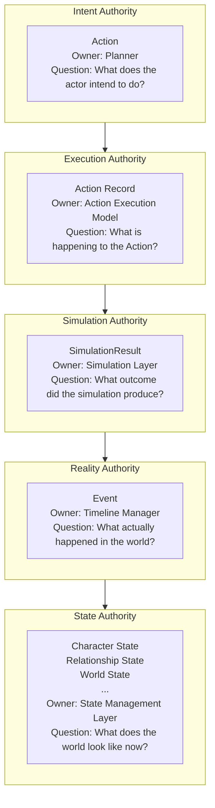
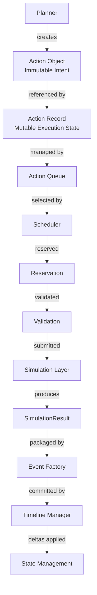
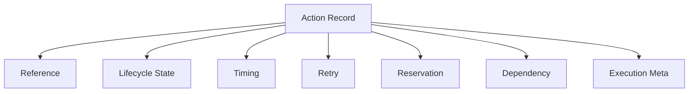
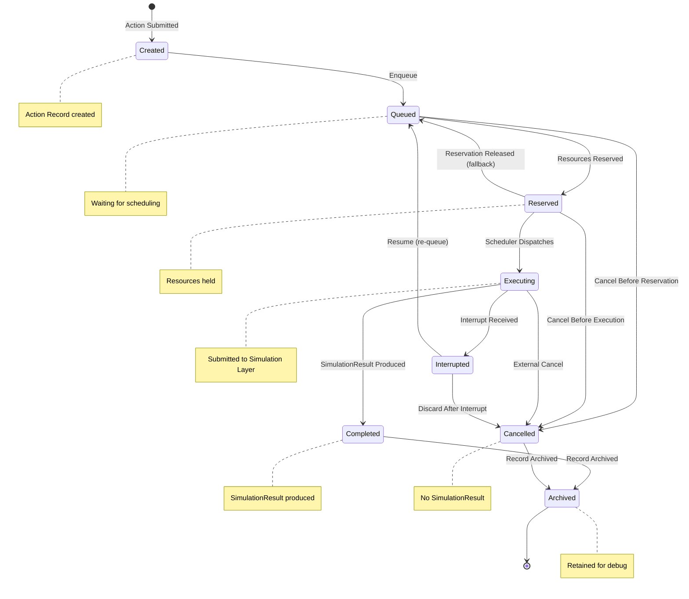
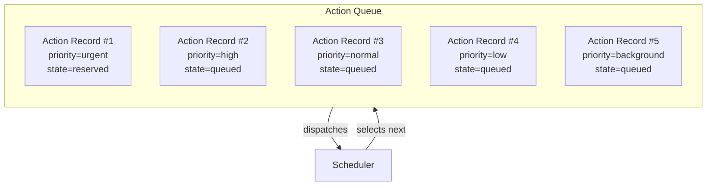
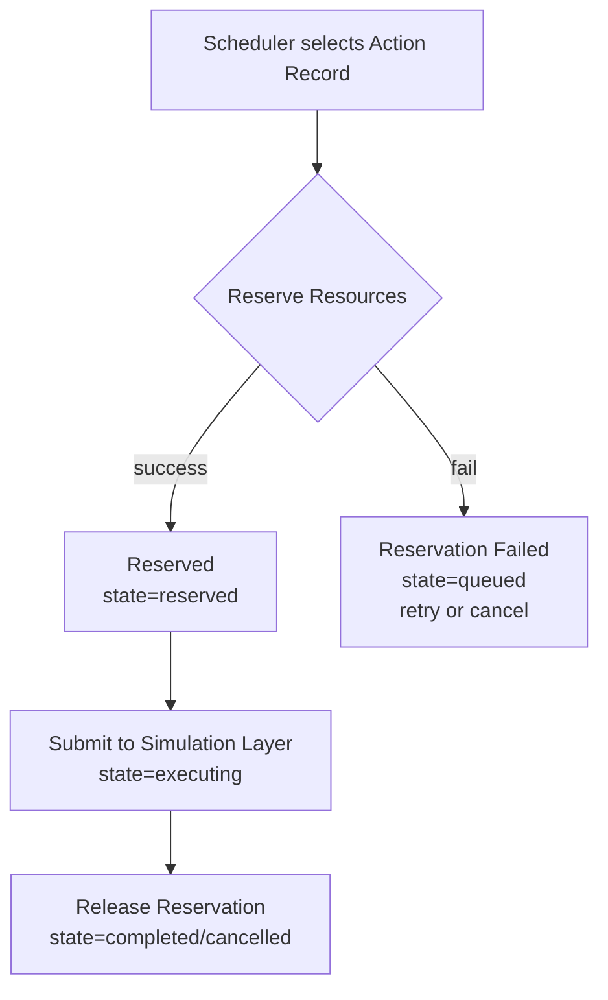
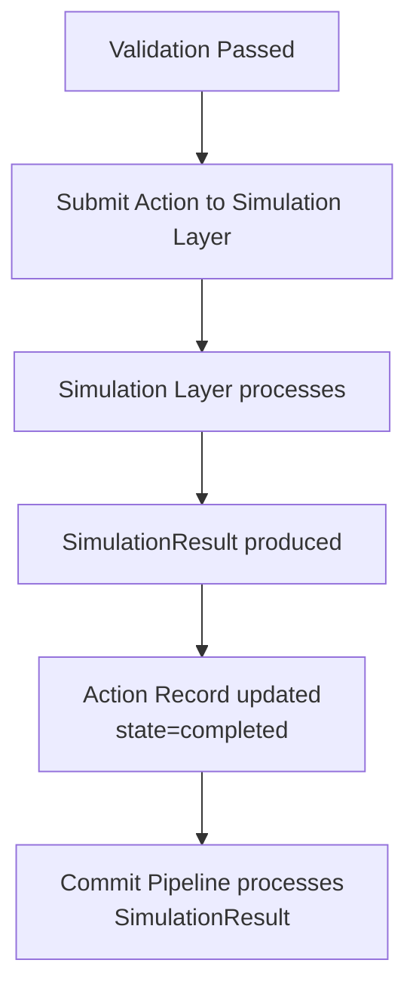
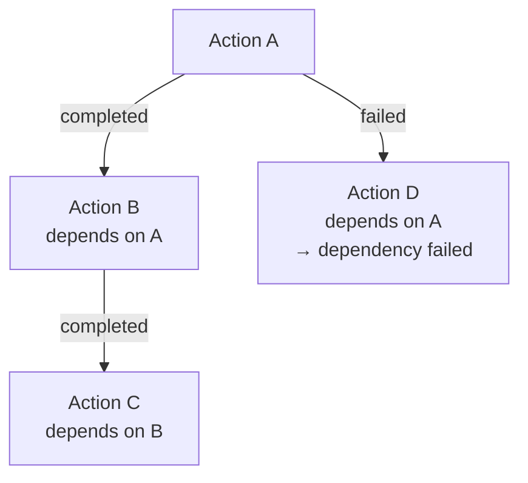

# Action Execution Model

**Version:** v1.0 RC1  
**Status:** Release Candidate  
**Last Updated:** 2026-07-13

**Depends On:** [Action Object Schema v1.0](../03_Data/Action_Object_Schema.md), [SimulationResult Schema v1.0 Draft](../03_Data/SimulationResult_Schema.md)

---

## 1. Purpose（文档目的）

Define the Execution Authority of the AI Narrative RPG Engine — the runtime behavior that governs how Action Objects are queued, validated, reserved, scheduled, executed, retried, cancelled, interrupted, and committed.

定义 AI Narrative RPG Engine 的执行权威层 — 管理 Action Object 如何入队、验证、预留、调度、执行、重试、取消、中断和提交的运行时行为。

### Core Definition（核心定义）

**Action Execution Model owns Execution Authority.**

Action Execution Model 拥有执行权威。

Action Execution Model is the **foundational Runtime Behavior Specification** in the Engine. Previous documents (Character State Schema, Relationship State Schema, Event Object Schema, SimulationResult Schema, Action Object Schema) defined *what data exists*. This document defines *how the Runtime behaves*.

Action Execution Model 是引擎中**基础运行时行为规范**。之前的文档定义了*存在什么数据*。本文档定义*运行时如何行为*。

### Core Philosophy（核心理念）

**Execution is not Intent. Execution is not Simulation. Execution is not Reality.**

执行不是意图。执行不是模拟。执行不是现实。

Execution Authority tracks the journey of an Action through the Runtime — from submission to completion or cancellation. It does not decide what the actor wants (that is Intent), what the simulation computed (that is Simulation), or what the world recorded (that is Reality). It only tracks *where the Action is in its execution lifecycle*.

---

## 2. Runtime Authority Layers（运行时权威层）

### Single Authority Principle（单一权威原则）

> **Every Runtime Object owns exactly one layer of authority. No Runtime Object may assume authority belonging to another layer.**
>
> 每一个 Runtime Object 恰好拥有一种 Authority（最终解释权）。任何 Runtime Object 不得跨层拥有其他 Layer 的 Authority。

This is the Engine's **First Architectural Principle**. All other architectural rules are consequences of this principle.

这是引擎的**第一架构原则**。所有其他架构规则都是这条原则的推论。

- Authority is exclusive — one object, one layer.
- Authority cannot overlap — no two objects share a layer.
- Authority defines ownership boundaries — who has final say.

### Authority Layers（权威层）

### Authority Separation Rules（权威分离规则）

| Authority | May Not Assume |
|-----------|---------------|
| Intent | Execution, Simulation, Reality, State |
| Execution | Intent, Simulation, Reality, State |
| Simulation | Intent, Execution, Reality, State |
| Reality | Intent, Execution, Simulation, State |
| State | Intent, Execution, Simulation, Reality |

### Derived Architectural Rules（派生架构规则）

The following existing rules are **logical consequences** of the Single Authority Principle:

| Rule | Derivation |
|------|-----------|
| Action Has No Lifecycle | Lifecycle belongs to Execution Authority. Intent Authority cannot declare execution state. |
| Action Is Immutable | Intent Authority is declared once. Intent does not evolve. Execution evolves. |
| SimulationResult Does Not Commit | Commit belongs to Reality Authority. Simulation Authority can calculate outcomes but cannot declare reality. |
| Event Does Not Mutate State | Event owns Reality Authority. Character State owns State Authority. Reality cannot directly assume State Authority. |
| Metadata Cannot Affect Replay | Metadata owns no Authority. Metadata is observational only. |
| Execution Hint Does Not Determine Validity | Hints originate from Intent Authority. Validation belongs to Execution Authority. Intent may suggest; Execution decides. |

---

## 3. Execution Authority（执行权威）

### What Execution Authority Owns（执行权威拥有什么）

Execution Authority owns the **runtime tracking** of Action execution:

| Owned | Description |
|-------|-------------|
| Queue State | Action 在队列中的位置和状态 |
| Scheduling Priority | 实际调度优先级（可能不同于 Hint 中的请求） |
| Resource Reservation | 资源预留状态 |
| Validation Result (structural) | Action 的结构合法性检查结果 |
| Execution Progress | 执行进度（是否已提交到 Simulation Layer） |
| Retry Tracking | 重试次数和历史 |
| Cancellation State | 取消状态和原因 |
| Interruption State | 中断状态和原因 |
| Dependency Resolution | 依赖解析状态 |
| Tick Tracking | 入队、执行、完成的 Tick 编号 |

### What Execution Authority Does NOT Own（执行权威不拥有什么）

| Not Owned | Belongs To |
|-----------|------------|
| What the actor wants to do | Intent Authority (Action) |
| What the simulation computed | Simulation Authority (SimulationResult) |
| What happened in the world | Reality Authority (Event) |
| What the world looks like now | State Authority (Character/Relationship/World State) |

### Execution Authority Pipeline Position（执行权威的流水线位置）

---

## 4. Action Record（行为记录）

### Definition（定义）

**Action Record is the Runtime-owned execution state associated with an immutable Action. It tracks execution progress without modifying the Action itself.**

Action Record 是 Runtime 拥有的、与不可变 Action 关联的执行状态。它追踪执行进度，不修改 Action 本身。

> **"Associated With":** Action Record uses `action_id` to reference an Action Object. It does not contain, own, or wrap the Action. The relationship is associative — Action Record knows which Action it tracks, but the Action Object is unaware of Action Record's existence. This is consistent with the `action_id` reference design in Action Object Schema.

### Action Record Structure（行为记录结构）

| Field | Description | Mutability |
|-------|-------------|------------|
| action_id | 关联的 Action Object ID（引用，不嵌入） | Immutable |
| record_id | Action Record 自身的唯一标识 (UUID) | Immutable |
| queue_state | 队列状态（`created`, `queued`, `reserved`, `executing`, `completed`, `cancelled`, `archived`） | Mutable |
| enqueue_tick | 入队时的 Simulation Tick | Set once at enqueue |
| execution_tick | 提交到 Simulation Layer 时的 Tick | Set once at execution |
| completion_tick | 完成（或取消）时的 Tick | Set once at terminal state |
| retry_count | 重试次数 | Mutable (incremented on retry) |
| retry_history | 重试历史（每次重试的原因和结果） | Append-only |
| reservation_status | 资源预留状态（`none`, `pending`, `reserved`, `released`, `failed`） | Mutable |
| reservation_details | 预留详情（哪些资源被预留） | Mutable |
| dependency_status | 依赖状态（`none`, `waiting`, `resolved`, `failed`） | Mutable |
| dependency_blocked_by | 阻塞此 Action 的 Action ID 列表 | Mutable |
| assigned_priority | 实际分配的调度优先级（可能与 Hint 不同） | Mutable |
| cancellation_reason | 取消原因（如果被取消） | Set once at cancellation |
| interruption_source | 中断来源（如果被中断） | Set once at interruption |

> **action_id is Reference, Not Embed:** Action Record stores `action_id` — a UUID reference to the Action Object. It does not embed the Action Object itself. The Action Object is retrieved from the Runtime Log when needed. The Action Type Definition is retrieved from the Action Registry when needed. This ensures:
> - Action Object's Immutability is guaranteed by Planner, not by Action Record.
> - Action Record can be serialized independently of Action Object.
> - Replay recreates Action Records, not Action Objects.

> **record_id:** Action Record has its own `record_id` (UUID), distinct from `action_id`. This allows:
> - Multiple Action Records to reference the same Action (in different Replay contexts).
> - Action Record to be archived and queried independently.
> - Clear type separation: `action_id` identifies intent; `record_id` identifies execution tracking.

### Execution Identity（执行标识）

Action Record 与 Action Object 共同使用三个 ID。每个 ID 拥有不同的身份语义：

| ID | Identity Type | Scope | Description |
|----|--------------|-------|-------------|
| `action_id` | Intent Identity | Permanent | 标识「actor 想做什么」。由 Planner 创建，不可变，存在于 Action Object 上。重试不变，Replay 不变。 |
| `record_id` | Execution Identity | Transient | 标识「Runtime 如何追踪这次执行」。每次重试、每次 Replay 都创建新的 `record_id`。终态后归档。 |
| `correlation_id` | Logical Workflow Identity | Permanent | 标识「同一次事务链」。从 Action → SimulationResult → Event → Memory 全程共享。重试不变，跨 Retry 不变。 |

> **Why Three IDs:** `action_id` answers *what is being done* (Intent). `record_id` answers *which execution attempt is this* (Execution). `correlation_id` answers *which transaction does this belong to* (Workflow). Conflating any two leads to ambiguity: e.g., using `action_id` as execution identity makes it impossible to distinguish retry attempts; using `record_id` as workflow identity breaks the correlation chain across retries.

### Action Record Rules（行为记录规则）

| Rule | Description |
|------|-------------|
| Exactly one active Action Record per Action | 一个 Action 在运行期间最多对应一个活跃的 Action Record。Replay 创建新的 Action Record，但原 Record 必须先进入终态。 |
| Action Record is mutable | Action Record 是可变的 — 它的职责就是追踪执行状态的变化。 |
| Action Record is transient | Action Record 是瞬态运行时对象 — Scene 结束后进入 Archived 状态，保留于 Runtime Memory 中供 Debug。Replay 时从 Action Object 重新创建。 |
| Action Record never modifies Action | Action Record 永远不修改关联的 Action Object。它只追踪执行状态。 |
| Action Record is not persisted to storage | Action Record 不写入持久化存储 — 它是 Runtime Memory 对象，非 Persistent Storage 对象。持久化的只有 Action Object。 |

> **Exactly One Invariant:** At any point in time, at most one **active** Action Record exists for a given Action. An Action Record is "active" when its `queue_state` is one of: `created`, `queued`, `reserved`, `executing`. Once an Action Record reaches a Terminal Business State (`completed`, `cancelled`) or Post-Terminal Administrative State (`archived`), it is no longer active, and a new Action Record may be created for the same Action (e.g., during Replay). This prevents concurrent execution tracking for the same Action.

---

## 5. Lifecycle（生命周期）

Action Record's lifecycle is the state machine that tracks an Action's journey through the Runtime.

Action Record 的生命周期是追踪 Action 在 Runtime 中旅程的状态机。

### State Machine（状态机）

### State Categories（状态分类）

Lifecycle states are categorized into three groups:

| Category | States | Description |
|----------|--------|-------------|
| Active | `created`, `queued`, `reserved`, `executing`, `interrupted` | Action Record 正在执行旅程中。At most one active Record per Action. `interrupted` 是 Active 的瞬态子状态 — 可恢复到 `queued` 或转为 `cancelled`。 |
| Terminal Business | `completed`, `cancelled` | 业务终态 — Action 的执行结果已确定（成功或取消）。不可回退到 Active 状态。Reservation 已释放。允许创建新的 Action Record（Retry / Replay）。 |
| Post-Terminal Administrative | `archived` | 归档态 — Record 从活跃运行时内存归档，保留供 Debug。不写入持久化存储。这是生命周期的最终状态。 |

### Lifecycle States（生命周期状态）

| State | Category | Description | Has Reservation? | Submitted to Simulation? | Produces Result? |
|-------|----------|-------------|------------------|--------------------------|------------------|
| Created | Active | Action Record 刚创建，尚未入队 | No | No | No |
| Queued | Active | 已入队，等待调度 | No | No | No |
| Reserved | Active | 资源已预留，等待执行 | Yes | No | No |
| Executing | Active | 已提交到 Simulation Layer | Yes | Yes | In progress |
| Completed | Terminal Business | SimulationResult 已产出 | Released | Yes | Yes |
| Cancelled | Terminal Business | 被取消，不产出 SimulationResult | Released | No | No |
| Interrupted | Active (Transient) | 被中断，等待恢复或取消。属于 Active 的瞬态子状态。 | Held | Maybe | No |
| Archived | Post-Terminal Administrative | 已归档，保留于 Runtime Memory 供 Debug。不写入持久化存储。 | Released | N/A | N/A |

### Lifecycle Rules（生命周期规则）

| Rule | Description |
|------|-------------|
| Terminal Business States are irreversible | Completed / Cancelled 是业务终态 — 不可回退到 Active 状态。 |
| Archived is Post-Terminal Administrative | Terminal Business States 转入 Archived（归档态）。Archived 是生命周期的最终状态，不可回退到任何其他状态。 |
| Interrupted is non-terminal | Interrupted 是中间态 — 可恢复到 Queued，或转为 Cancelled。 |
| Cancel can happen at any pre-execution state | 在 Created / Queued / Reserved 阶段均可取消。Executing 阶段取消取决于 Interrupt Policy。 |
| Reservation released on Terminal Business | 进入 Terminal Business State（Completed / Cancelled）时，预留资源必须释放。 |
| All records eventually reach Archived | 所有 Terminal Business States 最终转入 Archived — 保留于 Runtime Memory 供 Debug，不写入持久化存储。 |
| Lifecycle belongs to Action Record, not Action | 生命周期状态存储在 Action Record 上，不在 Action Object 上。Action Object 始终不可变。 |

---

## 6. Action Queue（行为队列）

Action Queue is the data structure that stores Action Records awaiting scheduling.

Action Queue 是存储等待调度的 Action Record 的数据结构。

### Queue Structure（队列结构）

### Queue Rules（队列规则）

| Rule | Description |
|------|-------------|
| Queue stores Action Records, not Actions | 队列存储 Action Record，不直接存储 Action Object。Action Object 通过 `action_id` 引用。 |
| Queue is per-Scene | 每个 Scene 拥有独立的 Action Queue。Scene 结束时队列清空（所有记录归档）。 |
| Queue is not persisted | 队列不持久化 — Scene 中断时未执行的 Action 被取消或挂起。 |
| Queue ordering is determined by Scheduler | 队列内部排序由 Scheduler 决定，不是 FIFO。 |
| Queue capacity is implementation-defined | 队列容量由实现决定，但必须有溢出策略（拒绝新 Action 或降级）。 |

### Queue Operations（队列操作）

| Operation | Description | Pre-state | Post-state |
|-----------|-------------|-----------|------------|
| Enqueue | 将 Action Record 加入队列 | Created | Queued |
| Dequeue | Scheduler 取出下一个 Action Record | Queued | Reserved |
| Remove | 从队列中移除（取消） | Queued | Cancelled |
| Requeue | 中断后重新入队 | Interrupted | Queued |
| Peek | 查看队列头部（不移除） | Any | No change |

---

## 7. Scheduling（调度）

Scheduler selects which Action Record to execute next from the Action Queue.

Scheduler 从 Action Queue 中选择下一个执行的 Action Record。

### Scheduling Rules（调度规则）

| Rule | Description |
|------|-------------|
| Scheduler reads Execution Hint, decides independently | Scheduler 读取 Action 的 Execution Hint（priority），但有权分配不同的实际优先级。 |
| Assigned priority may differ from hint | `assigned_priority` 存储在 Action Record 上，可能与 Hint 中的 `priority` 不同。 |
| Hint never causes rejection | Scheduler 不可仅因为 Hint 无法满足而拒绝 Action。 |
| Scheduling is deterministic | 相同的队列状态 + 相同的调度规则 = 相同的选择。 |
| One Action per Simulation Tick | 每个 Simulation Tick 只执行一个 Action（除非批量模式 — 未来扩展）。 |

### Scheduling Algorithm（调度算法）

The specific scheduling algorithm is implementation-defined. The Schema only defines constraints:

| Constraint | Description |
|------------|-------------|
| Deterministic | 给定相同队列状态和相同规则，选择结果相同。 |
| Priority-aware | 考虑 Action 的 Hint priority 和实际 assigned priority。 |
| Fairness | 长时间等待的 Action 应有合理的执行机会（防饥饿）。 |
| Dependency-aware | 被依赖阻塞的 Action 不被调度。 |

> **Scheduling is Execution Authority:** The Scheduler's decisions belong to Execution Authority. The Planner's `priority` hint belongs to Intent Authority. The Scheduler may honor, downgrade, or ignore the hint. This is consistent with "Hint Never Determines Validity" — and extends it to "Hint Never Determines Scheduling Outcome".

---

## 8. Reservation（资源预留）

Reservation holds resources required by an Action before it is submitted to Simulation Layer.

Reservation 在 Action 提交到 Simulation Layer 之前预留所需资源。

### Reservation Flow（预留流程）

### Reservation Rules（预留规则）

| Rule | Description |
|------|-------------|
| Reservation uses Hint as estimate | 预留基于 Execution Hint 中的 `reservation_requirement` 和 `estimated_cost`。 |
| Actual cost may differ | 预留量是估计值。Simulation Layer 计算的实际消耗可能不同。 |
| Reservation is per-Action | 每个 Action 独立预留资源。 |
| Reservation is released on terminal | Action Record 进入终态时释放预留。 |
| Reservation failure does not cancel Action | 预留失败不取消 Action — Action 回到 Queued 状态等待重试。 |
| Reservation failure is not validation failure | 预留失败属于资源不足，不属于 Action 无效。 |

### Reservation Status（预留状态）

| Status | Description |
|--------|-------------|
| `none` | 未请求预留 |
| `pending` | 预留请求中 |
| `reserved` | 预留成功 |
| `released` | 预留已释放 |
| `failed` | 预留失败（资源不足） |

---

## 9. Validation（验证）

Validation checks whether an Action is structurally and semantically valid **before** submission to Simulation Layer.

Validation 在提交到 Simulation Layer 之前检查 Action 是否结构和语义合法。

### Validation Scope（验证范围）

| Check | Description | Belongs To |
|-------|-------------|------------|
| Schema validation | Action 字段是否完整、类型是否正确 | Execution Authority |
| Target existence | target_entity_ids 指向的实体是否存在 | Execution Authority |
| Actor availability | actor_id 指向的 Character 是否 Active | Execution Authority |
| Action Type registry | action_type 是否在 Action Registry 中注册 | Execution Authority |
| Parameter schema | parameters 是否符合 Action Type 的参数 schema | Execution Authority |
| Dependency satisfied | 依赖的 Action 是否已完成 | Execution Authority |
| Execution preconditions | 执行前置条件：actor 是否存在、actor 是否 active、registry 是否已加载、dependency 是否 resolved | Execution Authority |
| Simulation feasibility | 模拟是否可行（如技能冷却、视线检查、法力消耗） | **Not** Execution Authority — Simulation Layer decides |

> **Validation vs Simulation:** Execution Authority validates *can this Action be submitted?* (structural and precondition checks). Simulation Authority decides *what happens when it's submitted?* (gameplay rules). An Action may pass Validation but produce a `failure` SimulationResult (e.g., skill on cooldown, insufficient mana, target out of sight). An Action that fails Validation never reaches Simulation.
>
> **Validation Must Not Become Mini-Simulation:** Validation checks are limited to structural and precondition checks — does the Action reference real entities, is the actor available, is the dependency resolved. Validation must never check gameplay rules (skill cooldown, line of sight, resource sufficiency). Those belong to Simulation Authority. If Validation starts checking gameplay rules, it will eventually become a mini-simulation, duplicating Simulation Layer's authority and violating the Single Authority Principle.

### Validation Rules（验证规则）

| Rule | Description |
|------|-------------|
| Validation is mandatory before execution | 所有 Action 必须通过验证才能提交到 Simulation Layer。 |
| Validation does not check Hint | Execution Hint 不参与验证。Hint 被忽略。 |
| Validation failure → Cancelled | 验证失败的 Action 进入 Cancelled 状态，不提交到 Simulation Layer。 |
| Validation is deterministic | 相同 Action + 相同 State = 相同验证结果。 |
| Validation result is recorded | 验证结果记录在 Action Record 中（用于 Debug）。 |

---

## 10. Execution（执行）

Execution is the act of submitting a validated Action to the Simulation Layer.

Execution 是将已验证的 Action 提交到 Simulation Layer 的行为。

### Execution Flow（执行流程）

### Execution Rules（执行规则）

| Rule | Description |
|------|-------------|
| One Action per submission | 每次提交一个 Action 到 Simulation Layer。 |
| Submission is synchronous from Action Execution Model's perspective | Action Execution Model 等待 SimulationResult 产出（Simulation Layer 可能异步处理，但 AEM 等待结果）。 |
| Execution Tick is recorded | 提交时的 Simulation Tick 记录在 Action Record 的 `execution_tick` 中。 |
| SimulationResult is linked | 产出的 SimulationResult 的 `source_action_id` 指向被执行的 Action。 |
| Execution failure produces SimulationResult | 如果 Simulation Layer 内部出错，仍然产出 SimulationResult（status=`failure`）。AEM 不自己判断失败 — 它信任 SimulationResult。 |

> **Execution Authority Boundary:** Action Execution Model submits the Action and receives the SimulationResult. It does not interpret the SimulationResult — it does not read Deltas, does not check Status, does not decide whether to commit. The Commit Pipeline (owned by Simulation Layer's downstream) handles all of that. AEM's job ends when SimulationResult is produced and `queue_state` is set to `completed`.

---

## 11. Retry（重试）

Retry re-submits an Action that produced a `failure` or `interrupted` SimulationResult.

Retry 重新提交产出 `failure` 或 `interrupted` SimulationResult 的 Action。

### Retry Rules（重试规则）

| Rule | Description |
|------|-------------|
| Retry creates new Action Record, not new Action | 重试创建新的 Action Record（新的 `record_id`），引用同一个 `action_id`。Action Object 不变。 |
| Previous Record MUST be terminal before retry | 在创建重试 Action Record 之前，前一个 Action Record **必须**已进入 Terminal Business State（Completed / Cancelled）或 Post-Terminal Administrative State（Archived）。这保证了「Exactly One Active Action Record」不变量在重试场景下仍然成立。 |
| Retry count is tracked | `retry_count` 在新 Action Record 中递增。 |
| Retry preserves correlation_id | 重试的 Action 保留原始 `correlation_id`。不重新生成。 |
| Retry is optional | AEM 可配置重试策略（重试次数、间隔、触发条件）。 |
| Retry only for transient failures | 仅对瞬时失败（TIMEOUT, STATE_CONFLICT）重试。硬错误（RULE_VIOLATION, PRECONDITION_FAILED）不重试。 |
| Max retry is bounded | 最大重试次数有上限，超过后 Action 进入 Cancelled。 |

### Retry Decision Matrix（重试决策矩阵）

| SimulationResult Status | Failure Code | Retry? |
|-------------------------|-------------|--------|
| `failure` | `PRECONDITION_FAILED` | No — 硬错误 |
| `failure` | `RULE_VIOLATION` | No — 硬错误 |
| `failure` | `STATE_CONFLICT` | Yes — 瞬时 |
| `failure` | `INVALID_DELTA` | No — 计算错误 |
| `failure` | `VALIDATION_FAILED` | No — 状态不一致 |
| `failure` | `RESOURCE_EXHAUSTED` | Yes — 可能恢复 |
| `failure` | `SIMULATION_ERROR` | Maybe — 取决于策略 |
| `failure` | `TIMEOUT` | Yes — 瞬时 |
| `interrupted` | — | Yes — 默认重试 |
| `cancelled` | — | No — 不可重试取消的 Action |

> **Retry is Execution Authority:** Retry decisions belong to Execution Authority. The Planner's `interrupt_policy` hint is consulted but not binding. The Simulation Layer's failure code is read but the retry decision is made by AEM.

---

## 12. Cancellation（取消）

Cancellation terminates an Action's execution before it completes.

Cancellation 在 Action 完成之前终止其执行。

### Cancellation Sources（取消来源）

| Source | Description |
|--------|-------------|
| Planner Cancel | Planner 主动取消（玩家改主意、AI 重新规划） |
| Validation Failure | 验证失败导致自动取消 |
| Max Retry Exceeded | 重试次数超限导致自动取消 |
| Scene Abort | Scene 被中止，所有未完成 Action 被取消 |
| External Cancel | 系统级取消（引擎关闭、内存压力） |

### Cancellation Rules（取消规则）

| Rule | Description |
|------|-------------|
| Cancel is external to Action Object | 取消操作在 Action Record 上执行，不修改 Action Object。 |
| Cancel records reason | `cancellation_reason` 记录在 Action Record 中。 |
| Cancelled Actions produce no SimulationResult | 被取消的 Action 不产出 SimulationResult。 |
| Cancel releases reservation | 取消时释放已预留的资源。 |
| Cancel is irreversible | 一旦 Cancelled，不可恢复。如需重新执行，创建新 Action Record。 |
| Cancel during Executing depends on interrupt_policy | 如果 Action 正在 Executing 状态，是否能取消取决于 Hint 中的 `interrupt_policy`。 |

---

## 13. Interruption（中断）

Interruption pauses an Action that is currently in Executing state.

Interruption 暂停当前处于 Executing 状态的 Action。

### Interruption Sources（中断来源）

| Source | Description |
|--------|-------------|
| Higher Priority Action | 高优先级 Action 抢占（如果 interrupt_policy 允许） |
| Scene Event | Scene 级事件中断（如战斗开始中断对话） |
| System Interrupt | 系统级中断（如引擎暂停） |

### Interruption Rules（中断规则）

| Rule | Description |
|------|-------------|
| Interruption respects interrupt_policy | 中断检查 Action Hint 中的 `interrupt_policy`。`non_interruptible` 的 Action 不可被中断。 |
| Interrupted is non-terminal | Interrupted 是中间态，可恢复到 Queued 或转为 Cancelled。 |
| Interrupted Action may re-queue | 中断后可选择重新入队（Requeue），保留原 `action_id` 和 `correlation_id`。 |
| Interrupted Action may cancel | 中断后可选择取消（转为 Cancelled）。 |
| Interruption source is recorded | `interruption_source` 记录在 Action Record 中。 |
| Interruption does not produce SimulationResult | 被中断的 Action 不产出 SimulationResult（除非 Simulation Layer 已经部分计算）。 |

> **Interrupt Policy is Hint:** `interrupt_policy` in Execution Hint is a suggestion. The Simulation Layer may interrupt even an `non_interruptible` Action if the Scene is being aborted (Scene-level authority overrides Action-level hint). However, under normal conditions, the interrupt policy is respected.

---

## 14. Dependency（依赖）

Dependency declares that an Action depends on the completion of other Actions.

Dependency 声明一个 Action 依赖于其他 Action 的完成。

### Dependency Model（依赖模型）

### Dependency Rules（依赖规则）

| Rule | Description |
|------|-------------|
| Dependency is declared via parent_action_id | 依赖通过 Action Object 的 `parent_action_id` 声明。Action Record 追踪依赖解析状态。 |
| Dependent Action is blocked until parent completes | 被依赖阻塞的 Action 不会被 Scheduler 调度。 |
| Parent failure cascades | 如果 parent Action 产出 `failure` SimulationResult 或被 Cancelled，dependent Action 的依赖状态变为 `failed`。 |
| Failed dependency → Cancelled | 依赖失败的 Action 进入 Cancelled 状态。 |
| Dependency is not recursive composition | 依赖是 Action 之间的引用关系，不是 Action 内部的嵌套结构。与 Action Object Schema 的 "No recursive composition" 一致。 |
| Dependency resolution is Execution Authority | 依赖解析属于 Execution Authority — Action Execution Model 决定何时解除阻塞。 |

### Dependency Status（依赖状态）

| Status | Description |
|--------|-------------|
| `none` | 无依赖 |
| `waiting` | 等待 parent Action 完成 |
| `resolved` | parent Action 已成功完成，依赖已解除 |
| `failed` | parent Action 失败或被取消 |

---

## 15. Determinism & Replay（确定性与重放）

### Deterministic Execution Rules（确定性执行规则）

| Rule | Description |
|------|-------------|
| Same Queue State + Same Rules = Same Selection | 给定相同队列状态和相同调度规则，Scheduler 选择相同的 Action Record。 |
| Same Action + Same Snapshot + Same Seed = Same SimulationResult | 这是 SimulationResult Schema 的保证。AEM 依赖此保证。 |
| Retry is deterministic | 相同的失败 + 相同的重试策略 = 相同的重试决策。 |
| Scheduling is seed-independent | 调度不依赖随机种子 — 它完全由队列状态和规则决定。 |

### Replay Rules（重放规则）

| Rule | Description |
|------|-------------|
| Replay regenerates Action Records | Replay 从 Runtime Log 中的 Action Objects 重新创建 Action Records。不保存原始 Action Records。 |
| Replay does not restore queue history | Replay 的目标不是恢复调度历史。Replay 的目标是重新执行 Intent。 |
| Replay produces identical SimulationResults | 给定相同的 Action + Snapshot + Seed，产出的 SimulationResult 与原始一致。 |
| Action Record is not replay input | Action Record 不属于 Replay Input Set。Replay Input Set 是：Action Object + Runtime State Snapshot + Seed。 |
| Metadata is not replay input | Action Metadata 不属于 Replay Input Set（与 Action Object Schema 一致）。 |

### Prediction Rules（预测规则）

| Rule | Description |
|------|-------------|
| Prediction uses forked state | 预测在 Forked State 上执行，不影响主 Timeline。 |
| Prediction creates separate Action Records | 预测创建独立的 Action Records，与活跃 Action Records 隔离。 |
| Prediction Results are never committed | 预测产出的 SimulationResult 的 `commit_scope=prediction`，不进入 Commit Pipeline。 |
| Prediction Actions are real Actions | 预测使用的 Action Objects 与正式执行的结构完全相同。 |

---

## 16. Runtime Guarantees（运行时保证）

### Structural Guarantees（结构保证）

- **Action Record is Mutable:** Action Record is the only mutable Runtime Object in the execution pipeline. All mutability is contained here.
- **Action Object Remains Immutable:** Action Execution Model never modifies Action Object. All state changes are on Action Record.
- **Exactly One Active Action Record:** At most one active Action Record exists for a given Action at any time.
- **Terminal Business States are Irreversible:** Once Completed or Cancelled, an Action Record cannot return to an active state. Archived is a post-terminal administrative state — the final state, also irreversible.

### Authority Guarantees（权威保证）

- **Execution Authority is Respected:** Action Execution Model owns queue state, scheduling, reservation, validation, retry, cancellation, interruption, and dependency. No other module may modify these.
- **Intent Authority is Respected:** Action Execution Model never modifies Action Object fields.
- **Simulation Authority is Respected:** Action Execution Model submits Actions to Simulation Layer but does not interpret SimulationResults. It reads Status for retry decisions but does not modify Deltas or Events.
- **Reality Authority is Respected:** Action Execution Model does not commit Events. Commit is handled by Timeline Manager.
- **State Authority is Respected:** Action Execution Model does not modify Character/Relationship/World State. State mutation is handled by Commit Pipeline applying Deltas.

### Determinism Guarantees（确定性保证）

- **Deterministic Scheduling:** Same queue state + same rules = same selection.
- **Deterministic Retry:** Same failure + same policy = same retry decision.
- **Replay Integrity:** Replay regenerates Action Records from Action Objects. No Action Record persistence required.

### Safety Guarantees（安全保证）

- **No Concurrent Execution:** An Action is never submitted to Simulation Layer more than once simultaneously.
- **Reservation Always Released:** Resources are released when Action Record enters any Terminal Business State (Completed or Cancelled).
- **Cancellation is Final:** A cancelled Action cannot be resurrected. A new Action Record for the same action_id may be created for retry, but the cancelled record remains in history.
- **Validation Before Execution:** No Action reaches Simulation Layer without passing validation.

---

## 17. Lock Policy（锁定策略）

This document will follow a staged lock approach:

本文档采用分阶段锁定策略：

| Stage | Description |
|-------|-------------|
| ~~Draft → RC~~ ✅ | Action Record 结构、Lifecycle 状态机、Queue 规则经过 Architecture Review 后稳定。Terminal State 术语精炼完成。 |
| RC → Locked | 当实现验证通过，且与 Action Object Schema 和 SimulationResult Schema 的集成验证完成 |

### Lock Conditions（锁定条件）

| Condition | Description |
|-----------|-------------|
| Action Record structure stable | action_id 引用、lifecycle states、retry tracking 结构不再变更 |
| Lifecycle state machine stable | 状态转换图不再变更 |
| Authority boundaries validated | Execution Authority 与其他四层 Authority 的边界经过实现验证 |
| SimulationResult integration verified | AEM 提交 Action → SimulationResult 产出的链路经过验证 |
| Replay verified | Replay 从 Action Object 重建 Action Record 的链路经过验证 |

### Post-Lock Governance（锁定后治理）

| Rule | Description |
|------|-------------|
| No Authority boundary changes | 不接受改变 Execution Authority 边界的修改。 |
| No Action Object mutation | 不接受任何允许 AEM 修改 Action Object 的修改。 |
| No Action Record persistence | 不接受将 Action Record 持久化的修改（它应保持瞬态）。 |
| Structural changes | 任何结构修改需通过 ADR 审批。 |

---

## 18. Non-Goals（非目标）

This document intentionally does **not** define the following:

本文档有意**不**定义以下内容：

| Non-Goal | Owned By |
|----------|----------|
| Action Object structure | Action Object Schema (Locked) |
| SimulationResult structure | SimulationResult Schema |
| Simulation rules and computation | Simulation Layer Blueprint |
| Event structure and commit | Event Object Schema + Timeline Manager |
| State mutation (Character/Relationship/World) | State Management Layer / Commit Pipeline |
| Action Type definitions | Action Registry (RC2) |
| Player Intent parsing | Future: Planner / Intent Parser |
| Narrative planning | Narrative Director Blueprint |
| Memory generation | Memory Architecture Blueprint |
| Perception pipeline | Future: Perception Blueprint |

> **Boundary Summary:** Action Execution Model owns *how Actions are processed* — queue, schedule, reserve, validate, execute, retry, cancel, interrupt, depend. It does not own *what Actions are* (Action Object Schema), *what simulation produces* (SimulationResult Schema), *what the world records* (Event Object Schema), or *what the world looks like* (State Schemas).

---

## 19. References

**Depends On:**

- [Action Object Schema v1.0](../03_Data/Action_Object_Schema.md)
- [SimulationResult Schema](../03_Data/SimulationResult_Schema.md)
- [Event Object Schema](../03_Data/Event_Object_Schema.md)
- [Simulation Layer Blueprint](./Simulation_Layer_Blueprint.md)
- [Runtime State Model Blueprint](./Runtime_State_Model_Blueprint.md)
- [Glossary](../00_Project/Glossary.md)
- [Action Registry v1.0 RC2](./Action_Registry.md)

**Referenced By:**

- Action Registry (Validation Integration uses AEM)
- Simulation Layer Blueprint (Action as simulation input)
- SimulationResult Schema (source_action_id linkage)
- Future: Runtime Pipeline (Execution stage)

---

## 20. Revision History

| Version | Date | Description |
|---------|------|-------------|
| v1.0 Draft | 2026-07-13 | Initial document: Runtime Authority Layers framework (Single Authority Principle, 5 layers, derived rules), Action Record as formal Runtime Object (associated with Action via action_id), 8-state Lifecycle, Queue, Scheduling, Reservation, Validation, Execution, Retry, Cancellation, Interruption, Dependency, Determinism & Replay, Runtime Guarantees, Lock Policy, Non-Goals. Foundational Runtime Behavior Specification. |
| v1.0 Draft (Rev 1) | 2026-07-13 | Architecture Review fixes: (1) Added Execution Identity section explaining action_id / record_id / correlation_id coexistence. (2) Added retry invariant: previous Record MUST be terminal before retry. (3) Unified Archived definition: Runtime Memory only, not persistent storage. (4) Renamed Rule pre-check → Execution Preconditions; added explicit boundary against Mini-Simulation. (5) Changed 'first' → 'foundational' Runtime Behavior Specification. |
| v1.0 RC1 | 2026-07-13 | Terminal State terminology refinement: distinguished Terminal Business States (Completed, Cancelled) from Post-Terminal Administrative State (Archived). Added State Categories table. Updated all references across Lifecycle Rules, Runtime Guarantees, Retry Rules, and Exactly One Invariant. Promoted to Release Candidate after Architecture Review approval. |
| v1.0 RC1 (Fix) | 2026-07-14 | Readability fix: added `interrupted` to Active category in State Categories table with transient note. Unified category label as "Active (Transient)" in Lifecycle States table. RC frozen — no further terminology changes. |

---

## 21. Document Governance（文档治理）

**Status:** Release Candidate (RC1)

**Status Values:** Draft → RC → Locked → Deprecated

**Owner:** Runtime Architect

**Architecture Reviewers:**

- Engine Architect
- Simulation Architect
- Narrative Architect

**Architecture Approval:** Architecture Review Required

**Update Policy:** Changes affecting Authority boundaries, Action Record structure, Lifecycle state machine, or Determinism rules require ADR approval.

**Parent Blueprint:** [Runtime State Model Blueprint](./Runtime_State_Model_Blueprint.md)
