# Action Registry

**Version:** v1.0 RC2  
**Status:** Release Candidate  
**Last Updated:** 2026-07-14

**Depends On:** [Action Object Schema v1.0](../03_Data/Action_Object_Schema.md), [Action Execution Model v1.0 RC1](./Action_Execution_Model.md), [SimulationResult Schema v1.0 Draft](../03_Data/SimulationResult_Schema.md)

---

## 1. Purpose（文档目的）

Define the authoritative registry of executable Action Types in the AI Narrative RPG Engine — their parameter schemas, default execution hints, capability declarations, versioning rules, lifecycle management, query semantics, cache requirements, type resolution pipeline, failure model, and extension points.

定义 AI Narrative RPG Engine 中可执行 Action Type 的权威注册表 — 包括参数 Schema、默认执行提示、能力声明、版本管理规则、生命周期管理、查询语义、缓存模型、类型解析管道、失败模型和扩展点。

### Core Definition（核心定义）

**Action Registry is the authoritative source of executable Action Types.**

Action Registry 是可执行 Action Type 的唯一权威来源。

Action Registry is a **supporting service** consulted by multiple Runtime layers. It is not part of the 5-layer Authority pipeline (Intent → Execution → Simulation → Reality → State). Instead, it provides **Type Definitions** that multiple layers consult:

Action Registry 是一个**支撑服务**，被多个 Runtime 层查询。它不属于五层权威流水线（Intent → Execution → Simulation → Reality → State）。它提供**类型定义**，供多个层查询：

| Layer | How it uses Registry |
|-------|---------------------|
| Planner | 查询可用 Action Type、参数 Schema、Capability 声明，用于规划 |
| Action Execution Model (Validation) | 验证 action_type 是否已注册、parameters 是否符合 Schema |
| Simulation Layer | 查询 Action Type 的 handler binding，确定如何模拟 |
| Narrative Director | 查询 Action Type 的语义标签，用于叙事生成 |

### Core Philosophy（核心理念）

**Registry defines types. It does not execute them.**

Registry 定义类型。它不执行类型。

Action Registry is a **catalogue**, not an executor. It answers *"what kinds of Actions exist and what do they look like?"* It never answers *"what should the actor do?"* (Planner), *"is this Action valid?"* (Execution), *"what happens when executed?"* (Simulation), or *"what changed?"* (Reality/State).

---

## 2. Authority（权威）

### Registry Authority（注册权威）

Action Registry owns **Registry Authority** — the authority over what Action Types are defined and their structural schemas.

Action Registry 拥有**注册权威** — 定义哪些 Action Type 存在及其结构 Schema 的权威。

### What Registry Authority Owns（注册权威拥有什么）

| Owned | Description |
|-------|-------------|
| Action Type registration | 哪些 action_type 字符串是合法的 |
| Parameter Schema | 每个 Action Type 的 parameters 结构定义 |
| Default Execution Hint | 每个 Action Type 的默认执行提示（Planner 可覆盖） |
| Capability Declaration | 每个 Action Type 的能力声明（目标要求、资源需求等） |
| Type Versioning | Action Type 的版本管理 |
| Type Lifecycle | Action Type 的注册、弃用、移除 |
| Handler Binding | action_type → handler_id 的绑定标识（handler 本身的注册和生命周期属于 Simulation Layer） |

### What Registry Authority Does NOT Own（注册权威不拥有什么）

| Not Owned | Belongs To |
|-----------|------------|
| Actor 选择哪个 Action | Intent Authority (Planner) |
| Action 是否可执行 | Execution Authority (Action Execution Model) |
| Action 执行后发生什么 | Simulation Authority (Simulation Layer) |
| 世界记录了什么 | Reality Authority (Event) |
| 世界当前状态 | State Authority (Character/Relationship/World State) |

### Registry & 5-Layer Authority Relationship（Registry 与五层权威关系）

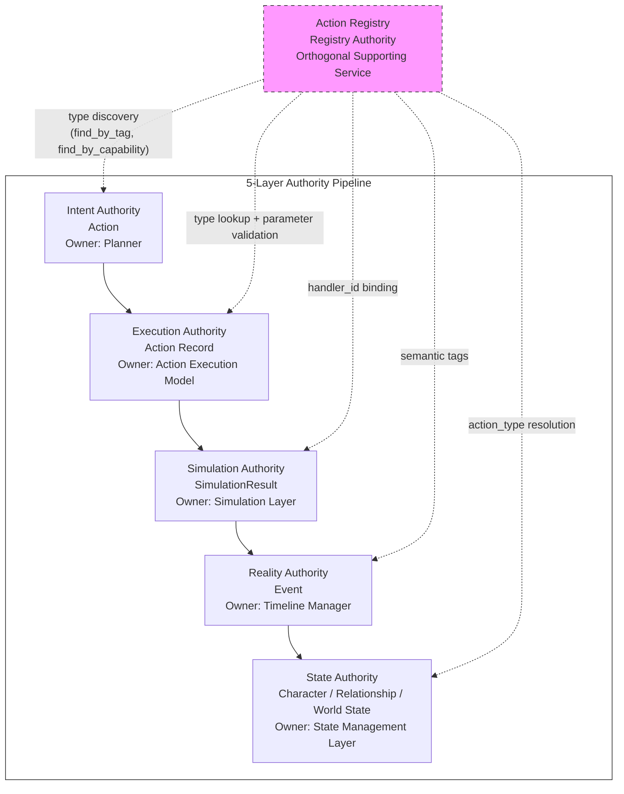

> **Registry is Orthogonal to the Pipeline:** Action Registry is not a stage in the Runtime pipeline. It is a supporting service consulted by multiple stages. All connections are **dashed lines** — Registry provides query service only, never participates in data flow through the pipeline. This is why Registry Authority is separate from the 5 pipeline authorities — it does not process Actions, it defines what Action Types exist.
>
> **Registry 属于正交支撑服务：** Action Registry 不是 Runtime 流水线中的一个阶段。它是一个被多个阶段查询的支撑服务。所有连接均为**虚线** — Registry 仅提供查询服务，从不参与流水线中的数据流动。

---

## 3. Registry Architecture（注册表架构）

### Architecture Overview（架构概览）

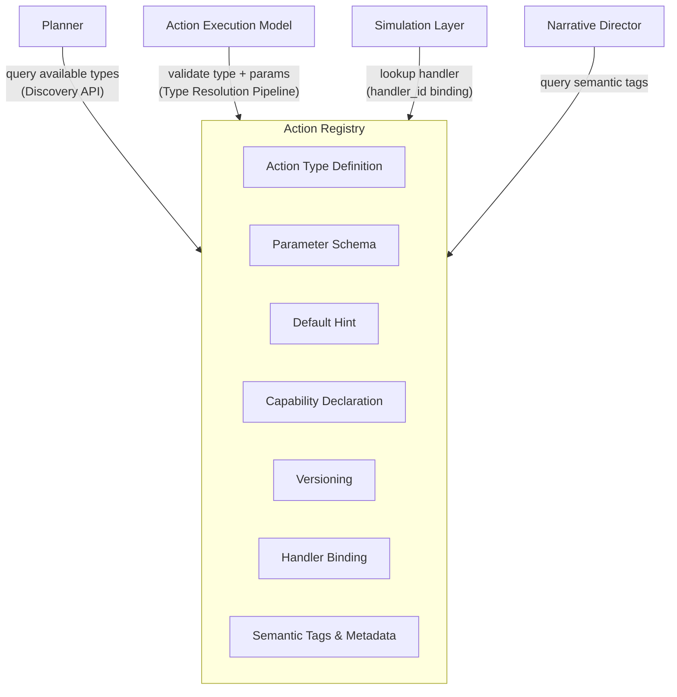

### Registry Structure（注册表结构）

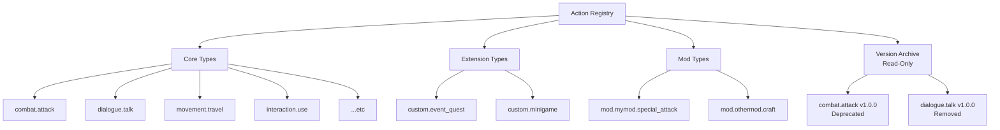

| Registry Section | Description | Mutability |
|-----------------|-------------|------------|
| Core Types | 引擎内置 Action Type（如 `attack`, `dialogue`, `movement`） | Registered at engine init |
| Extension Types | 扩展 Action Type（如剧本自定义事件、小游戏） | Registered at runtime |
| Mod Types | Mod 自定义 Action Type（命名空间 `mod.*`） | Registered at mod load |
| Version Archive | 已移除或旧版本 Action Type 的只读归档 | Read-only (Replay only) |

---

## 4. Action Type Definition（Action Type 定义）

### Definition Structure（定义结构）

Each registered Action Type is defined by the following structure:

每个注册的 Action Type 由以下结构定义：

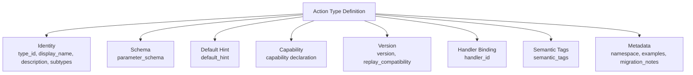

| Field | Description | Required |
|-------|-------------|----------|
| type_id | Action Type 的唯一标识符（如 `combat.attack`） | Yes |
| display_name | 人类可读名称（如 "Attack"） | Yes |
| description | 类型描述 | Yes |
| subtypes | 允许的 subtype 列表（如 `melee`, `ranged`, `spell`） | No (default: empty) |
| parameter_schema | parameters 字段的 JSON Schema 定义 | Yes |
| default_hint | 默认 Execution Hint（Planner 可覆盖） | Yes |
| capability | 能力声明（目标要求、资源需求等） | Yes |
| version | Type 版本号（如 `1.0.0`） | Yes |
| handler_id | Simulation Layer handler 的绑定标识 | Yes |
| semantic_tags | 语义标签（供 Narrative Director 使用，如 `["combat", "hostile"]`） | No (default: empty) |
| deprecated | 是否已弃用 | No (default: false) |
| deprecation_message | 弃用说明和替代方案 | No |
| replay_compatibility | 此版本可正确 Replay 的最低引擎版本 | No (default: current) |
| examples | 示例参数集列表（供文档和测试使用） | No (default: empty) |
| migration_notes | 从前一版本迁移的说明（breaking change 时必填） | No (default: empty) |
| namespace | 类型所属命名空间（从 type_id 自动推导，显式声明用于查询） | Yes |

### Example: Action Type Definition（示例：Action Type 定义）

```yaml
type_id: "combat.attack"
display_name: "Attack"
description: "Perform a hostile action against a target entity"
subtypes: ["melee", "ranged", "spell"]
namespace: "combat"
parameter_schema:
  type: object
  required: [skill_id]
  properties:
    skill_id:
      type: string
      description: "The skill to use for this attack"
    stance:
      type: string
      enum: [aggressive, defensive, balanced]
      default: balanced
    charge_level:
      type: integer
      minimum: 1
      maximum: 5
      default: 1
default_hint:
  priority: normal
  estimated_cost: { stamina: 10, time: 1 }
  reservation_requirement: {}
  execution_mode: queued
  interrupt_policy: interruptible
capability:
  requires_target_entity: true
  requires_target_location: false
  max_targets: 1
  min_targets: 1
  resource_types: [stamina, mana]
  is_interruptible_default: true
version: "1.0.0"
handler_id: "sim.handlers.combat.attack"
semantic_tags: ["combat", "hostile", "physical"]
deprecated: false
replay_compatibility: "1.0"
examples:
  - description: "Basic melee attack"
    parameters: { skill_id: "sword_slash", stance: "aggressive" }
  - description: "Charged ranged attack"
    parameters: { skill_id: "longbow_shot", stance: "balanced", charge_level: 3 }
migration_notes: ""
```

> **type_id Naming Convention:** Core types use dot-separated hierarchical names (e.g., `combat.attack`, `dialogue.talk`). Mod types use the `mod.<mod_id>.<type_name>` namespace (e.g., `mod.mymod.special_attack`). This prevents collisions and makes ownership clear.
>
> **Subtypes are Open-Ended:** The `subtypes` list declares known subtypes. Unknown subtypes are not automatically rejected — the Simulation Layer may choose to handle them. This allows forward compatibility: a new subtype can be added without updating the Registry.
>
> **examples are Non-Normative:** The `examples` field provides illustrative parameter sets for documentation, testing, and Planner hints. They are not validated against `parameter_schema` at registration time — they are human-readable references. The Simulation Layer must not use `examples` as simulation inputs.

---

## 5. Registration Rules（注册规则）

### Registration Sources（注册来源）

| Source | When | Namespace |
|--------|------|-----------|
| Engine Core | Engine initialization | `*` (root namespace) |
| Game Content Pack | Content load | `content.*` |
| Mod | Mod load | `mod.<mod_id>.*` |
| Runtime Registration | Any time at runtime | Caller-defined (must be namespaced) |

### Registration Rules（注册规则）

| Rule | Description |
|------|-------------|
| type_id must be unique | 同一 type_id 不可重复注册。尝试注册已存在的 type_id 会失败（除非是 override 模式）。 |
| type_id must be namespaced | Mod types 必须使用 `mod.<mod_id>.<type_name>` 命名空间。Core types 使用根命名空间。 |
| parameter_schema must be valid JSON Schema | parameter_schema 必须是合法的 JSON Schema 定义。 |
| default_hint must be complete | default_hint 必须包含所有 Execution Hint 字段。 |
| handler_id must be non-empty | handler_id 必须指向一个已注册的 Simulation Handler。 |
| Version must follow SemVer | version 必须遵循 Semantic Versioning（`MAJOR.MINOR.PATCH`）。 |
| Core types cannot be overridden | 引擎内置 Core Types 不可被 Mod 覆盖。Mod 可以注册新类型，但不能覆盖 `combat.attack` 等。 |

### Override Rules（覆盖规则）

| Rule | Description |
|------|-------------|
| Mod types can be overridden by the same mod | 同一 Mod 可以覆盖自己的 type 定义（用于版本升级）。覆盖创建新版本，旧版本进入 Deprecated 状态。 |
| Mod types cannot override other mods' types | 一个 Mod 不可覆盖另一个 Mod 的 type 定义。 |
| Mod types cannot override core types | Mod 不可覆盖引擎 Core Types。 |
| Content packs can extend core types | Content Pack 可以扩展 Core Type 的 subtype 列表，但不能修改 parameter_schema。 |
| Override preserves old version | Override 创建新版本时，旧版本必须保留在 Registry 中（进入 Deprecated），不可直接替换。这保证已创建的旧 Action 仍可 Replay。 |
| Hot update does not interrupt executing Actions | Mod 热更新时，正在队列中或正在执行的 Action Records 按原版本 schema 完成 Validation 和 Simulation。新版本仅影响后续创建的新 Action。 |

> **Override is Type-Level, Not Field-Level:** Override replaces the entire Action Type Definition. Partial override (e.g., only changing `default_hint` while keeping `parameter_schema`) is not supported. This prevents configuration fragmentation — if a mod wants to change behavior, it must redeclare the full type.

---

## 6. Parameter Schema（参数 Schema）

### Schema Definition Rules（Schema 定义规则）

Parameter Schema defines the structure of the `parameters` field in Action Object's Definition domain.

Parameter Schema 定义 Action Object Definition 域中 `parameters` 字段的结构。

| Rule | Description |
|------|-------------|
| Must be valid JSON Schema | parameter_schema 必须是合法的 JSON Schema（draft 07 或更高）。 |
| Must declare required fields | required 字段必须明确声明。可选字段也必须列出。 |
| Must declare types | 每个字段必须有明确的 type。 |
| Must declare constraints | 约束（minimum, maximum, enum, pattern）应尽量声明。 |
| May use `$ref` | 可以使用 `$ref` 引用共享的 Schema 片段。 |
| No runtime-computed fields | parameters 不可包含需要 Runtime 计算的字段（与 Action Object Schema 的 Field Admission Rule 一致）。 |
| Must be serializable | parameter_schema 本身必须可序列化（JSON 格式）。 |

### Parameter Schema vs Action Object Schema（参数 Schema 与 Action Object Schema 的关系）

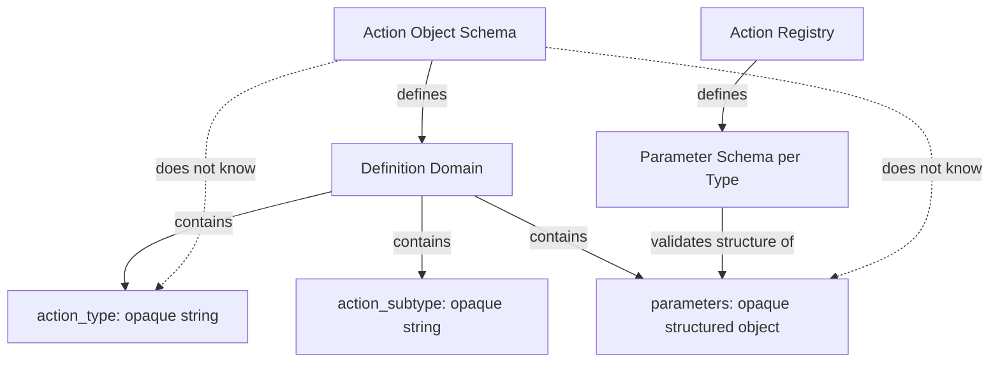

| Aspect | Action Object Schema | Action Registry Parameter Schema |
|--------|---------------------|--------------------------------|
| What it defines | parameters 是不透明结构化对象 | parameters 的具体结构 |
| Lifecycle | Locked, gameplay-agnostic | 可变，随 Action Type 注册而扩展 |
| Scope | 所有 Action Type 共用 | 每个 Action Type 独立 |
| Authority | Intent Authority (structure) | Registry Authority (type-specific schema) |

> **Two-Layer Opacity:** The Action Object Schema treats `parameters` as opaque — it does not parse or validate the content. The Action Registry Parameter Schema provides the type-specific schema that makes `parameters` interpretable. This two-layer design keeps the Action Object Schema stable while allowing unlimited Action Type extensibility.

---

## 7. Capability Declaration（能力声明）

### What Capability Declaration Is（能力声明是什么）

Capability Declaration describes the **structural requirements** of an Action Type — what kind of targets it needs, what resources it consumes, how many targets it can affect. This is metadata about the Action Type, not about any specific Action instance.

Capability Declaration 描述 Action Type 的**结构需求** — 需要什么类型的目标、消耗什么资源、能影响多少目标。这是关于 Action Type 的元数据，不是关于具体 Action 实例的。

### Capability Fields（能力字段）

| Field | Description | Example |
|-------|-------------|---------|
| requires_target_entity | 是否必须有目标实体 | `true` for `attack`, `false` for `wait` |
| requires_target_location | 是否必须有目标地点 | `true` for `movement`, `false` for `dialogue` |
| max_targets | 最大目标实体数 | `1` for single-target, `5` for AoE, `0` for self |
| min_targets | 最小目标实体数 | `1` for most attacks |
| resource_types | 消耗的资源类型列表 | `["stamina", "mana"]` |
| is_interruptible_default | 默认是否可中断 | `true` for most, `false` for cutscene actions |

### Capability vs Validation vs Simulation（能力 vs 验证 vs 模拟）

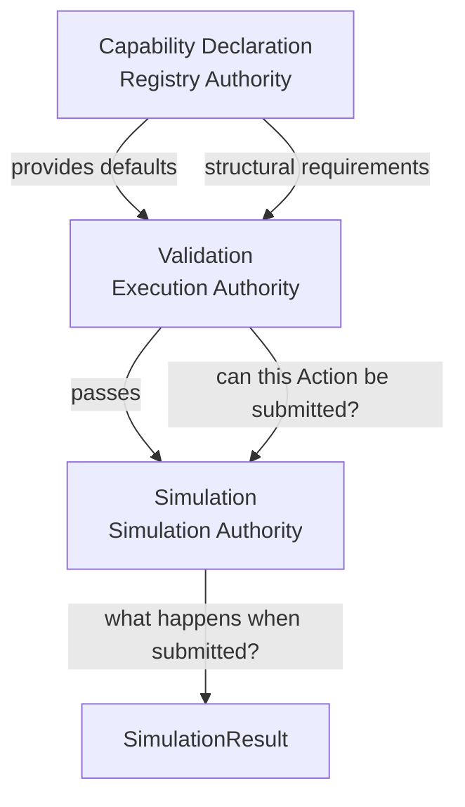

| Layer | Question | Example |
|-------|----------|---------|
| Capability Declaration | 这个 Action Type 需要什么结构？ | `attack` requires at least 1 target entity |
| Validation (Execution) | 这个 Action 实例满足结构要求吗？ | Does this Action have target_entity_ids? |
| Simulation (Simulation) | 这个 Action 执行后发生什么？ | Target takes 30 damage, stamina -10 |

> **Capability is Structural, Not Gameplay:** Capability Declaration declares structural requirements (does it need a target? how many?). It does not declare gameplay rules (how much damage? cooldown? range? line of sight? adjacency?). Gameplay rules belong to Simulation Authority. This is consistent with the "Validation Must Not Become Mini-Simulation" principle in Action Execution Model.
>
> **Removed from Capability:** `requires_line_of_sight` and `requires_adjacency` were considered but rejected — they are gameplay rules that depend on scene geometry, spatial model, and runtime state. They belong to Simulation Authority, not Registry Authority. Including them would allow AEM Validation to check spatial conditions, creating a Mini-Simulation.
>
> **resource_types is Declarative, Not Validated:** `resource_types` declares which resource types an Action Type *may* consume. It does not declare how much, and AEM Validation must not check whether the actor has sufficient resources. Resource sufficiency belongs to Simulation Authority.

---

## 8. Versioning（版本管理）

### Type Versioning Rules（类型版本规则）

| Rule | Description |
|------|-------------|
| Each Type Definition has a version | 每个 Action Type Definition 必须有 SemVer 版本号。 |
| Major version = breaking change | parameter_schema 的 breaking change（删除字段、改变类型）需要 major 版本升级。 |
| Minor version = additive change | 新增可选字段、新增 subtype 是 minor 版本升级。 |
| Patch version = fix | 修复 description、默认值等不改变结构的变化是 patch 版本升级。 |
| Multiple versions can coexist | 同一 type_id 可以有多个版本同时注册（如 `combat.attack` v1.0.0 和 v2.0.0）。 |
| Action Object carries schema_version | Action Object 的 `schema_version` 字段记录 Action Object Schema 自身版本（如 "1.0"），**不是** Type version。Type version 由 Registry 管理。 |
| Deprecated types remain queryable | 已弃用的 Type 仍可查询（用于 Replay 旧 Action），但不可创建新 Action。 |

### Version Compatibility（版本兼容性）

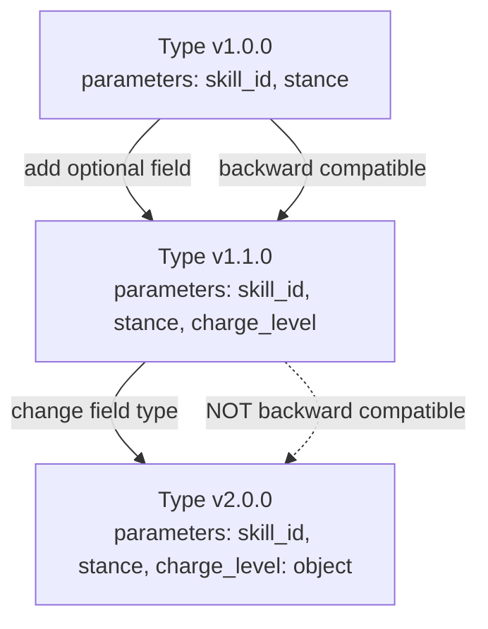

| Change Type | Version Bump | Backward Compatible | Replay Impact |
|-------------|-------------|--------------------|---------------|
| Add optional field | Minor | Yes | Old Actions replay correctly (new field defaults) |
| Add required field | Major | No | Old Actions may fail validation |
| Remove field | Major | No | Old Actions with that field are still valid (ignored) |
| Change field type | Major | No | Old Actions may fail parameter schema validation |
| Add subtype | Minor | Yes | No impact |
| Change default_hint | Patch | Yes | New Actions use new defaults; old Actions unaffected |

### Replay Versioning Rules（重放版本规则）

| Rule | Description |
|------|-------------|
| Replay uses the version at Action creation time | Replay 使用 Action 创建时的 Type 版本进行验证和模拟。 |
| Type version is resolved via Runtime Log | Action Object 不携带 Type version（`schema_version` 是 Action Object Schema 版本，不是 Type 版本）。Replay 时，Type 版本通过 Runtime Log 中记录的 Action 创建时 Registry 快照确定。如果快照不可用，回退到当前 Registry 中该 type_id 的最早兼容版本。 |
| Old versions must remain registered | 旧版本必须保留在 Registry 中（标记为 Deprecated），以支持 Replay。 |
| Removed versions enter Version Archive | Type 版本被移除后，进入 Version Archive — 只读归档，支持 Replay 查询，不支持创建新 Action。 |
| Version removal requires migration | 将版本从 Registry 完全移除（包括 Version Archive）需要提供迁移方案（ADR 审批）。 |
| replay_compatibility field | Type Definition 的 `replay_compatibility` 字段声明此版本可正确 Replay 的最低引擎版本。Replay 时，引擎检查当前版本是否满足此约束。 |

---

## 9. Registry Lifecycle（注册表生命周期）

### Type Lifecycle States（Type 生命周期状态）

```mermaid
stateDiagram-v2
    [*] --> Registered: Register Type
    Registered --> Active: Handler Bound
    Active --> Deprecated: Mark Deprecated
    Deprecated --> Removed: After Migration
    Deprecated --> Active: Undo Deprecation
    Removed --> [*]

    note right of Registered: Type definition exists
    note right of Active: Ready for use
    note right of Deprecated: No new Actions; Replay still works
    note right of Removed: In Version Archive; Replay only
```

| State | Description | Can create new Actions? | Can Replay old Actions? |
|-------|-------------|------------------------|------------------------|
| Registered | Type definition 已注册，但 handler 尚未绑定 | No | No |
| Active | Type 定义完整，handler 已绑定 | Yes | Yes |
| Deprecated | Type 已弃用，不建议使用，但仍可用 | Yes (with warning) | Yes |
| Removed | Type 已从 Registry 活跃列表移除，进入 Version Archive | No | Yes (via Version Archive) |

### Lifecycle Rules（生命周期规则）

| Rule | Description |
|------|-------------|
| Registration is idempotent | 重复注册同一 type_id + version 是幂等的 — 不报错，返回现有定义。 |
| Deprecation is reversible | 弃用可以撤销（恢复到 Active）。 |
| Removal enters Version Archive | 移除的 Type 进入 Version Archive — 只读归档，仍可查询用于 Replay，但不支持创建新 Action。 |
| Removal is irreversible | 从活跃列表移除后不可恢复到 Active。从 Version Archive 完全清除需要 ADR 审批。 |
| Core types cannot be removed | 引擎 Core Types 不可移除。 |
| Mod types are removed on unload | Mod 卸载时，其注册的 Type 进入 Removed 状态（进入 Version Archive）。 |
| Mod unload cancels active Action Records | Mod 卸载时，关联的 Active Action Records 被 Cancelled（cancellation_reason = `type_removed`）。 |
| No type removal during Scene | Type 移除只能在 Scene transition 时进行，不可在 Scene 执行中移除 Active Type。 |

### Registry Initialization（注册表初始化）

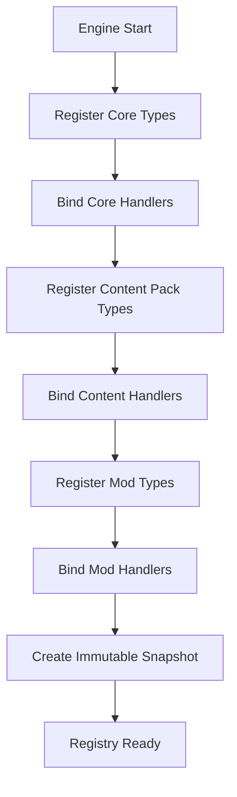

| Phase | Description |
|-------|-------------|
| Core Registration | 引擎启动时注册所有内置 Action Types |
| Content Registration | 加载游戏内容包时注册扩展 Action Types |
| Mod Registration | 加载 Mod 时注册 Mod Action Types |
| Snapshot Creation | 所有注册完成后创建不可变快照，供 Runtime 查询 |
| Ready | Registry 就绪，可以接受查询和验证 |

---

## 10. Registry Query Semantics（注册表查询语义）

Registry provides two categories of query operations: **Lookup API** (direct type_id access) and **Discovery API** (filter-based exploration). The Discovery API is essential for Narrative Planners that need to explore available Action Types dynamically.

Registry 提供两类查询操作：**Lookup API**（直接 type_id 访问）和 **Discovery API**（基于过滤的探索）。Discovery API 对于需要动态探索可用 Action Type 的 Narrative Planner 至关重要。

### 10.1 Lookup API（直接查询接口）

Lookup API provides O(1) or O(log n) direct access to Type Definitions by type_id.

Lookup API 提供基于 type_id 的 O(1) 或 O(log n) 直接访问。

| Operation | Input | Output | Used By |
|-----------|-------|--------|---------|
| `get_type(type_id, version?)` | type_id, optional version | Action Type Definition | Planner, Validation, Simulation |
| `validate_parameters(type_id, parameters)` | type_id, parameters | Validation Result (valid/invalid + errors) | Action Execution Model (Validation) |
| `get_default_hint(type_id)` | type_id | Default Execution Hint | Planner |
| `get_capability(type_id)` | type_id | Capability Declaration | Planner, Validation |
| `get_handler(type_id, version?)` | type_id, optional version | handler_id | Simulation Layer |
| `get_subtypes(type_id)` | type_id | List of subtypes | Planner |
| `is_deprecated(type_id)` | type_id | boolean | Planner (warnings) |
| `get_semantic_tags(type_id)` | type_id | List of tags | Narrative Director |
| `get_version(type_id)` | type_id | Current Active version string | Replay, Debug |

### 10.2 Discovery API（发现接口）

Discovery API enables **exploratory queries** — finding Action Types by characteristics rather than by exact type_id. This is critical for Narrative Planners and AI-driven content generation.

Discovery API 支持**探索性查询** — 通过特征而非精确 type_id 查找 Action Type。这对 Narrative Planner 和 AI 驱动的内容生成至关重要。

| Operation | Input | Output | Used By |
|-----------|-------|--------|---------|
| `find_by_tag(tag)` | semantic tag string | List of type_ids matching tag | Narrative Director, Planner |
| `find_by_capability(capability_field, value)` | capability field name + expected value | List of type_ids whose capability matches | Planner |
| `find_by_namespace(namespace)` | namespace string (e.g., `"combat"`, `"mod.mymod"`) | List of type_ids in namespace | Planner, Mod System |
| `find_by_version(type_id, version_range)` | type_id + SemVer range | List of versions matching range | Replay System |
| `find_all_active()` | — | List of all Active type_ids | Planner (full catalogue) |
| `find_deprecated()` | — | List of all Deprecated type_ids | Debug, Migration Tools |
| `find_removed()` | — | List of all Removed type_ids (in Version Archive) | Replay, Debug |
| `supports_capability(type_id, capability_field)` | type_id + capability field name | boolean | Planner (quick check) |
| `list_namespaces()` | — | List of all registered namespaces | Mod System, Debug |
| `get_type_tree(namespace?)` | optional namespace | Hierarchical tree of type_ids | Planner (browsing) |

> **Convenience API:** `supports_capability(type_id, capability_field)` is a convenience wrapper around `get_capability(type_id)`. It returns a boolean for quick checks, reducing caller cognitive load. It does not expose new Registry capability.
>
> **Consumer Classification:** `find_deprecated()`, `find_removed()`, and `get_type_tree()` have **Primary Consumer: Tooling / Editor / Migration** and **Secondary Consumer: Runtime**. They remain in the unified Discovery API — no separate Admin API surface is created.

### 10.3 Query Result Types（查询结果类型）

Discovery API queries can return different result depths depending on the caller's needs:

| Result Type | Description | When to Use |
|-------------|-------------|-------------|
| `type_id_list` | 仅返回 type_id 列表 | Planner 快速过滤 |
| `type_summary` | type_id + display_name + version + deprecated + tags | Planner 浏览可用类型 |
| `full_definition` | 完整 Action Type Definition | Validation, Simulation |
| `metadata_only` | type_id + tags + namespace + description | Narrative Director 语义查询 |

> **Lightweight Query Result:** `metadata_only` is designed for Editor, Inspector, and UI consumers that need type metadata (name, namespace, description, tags) without the overhead of full parameter_schema, version, or deprecation details.
>
> **Discovery API is Read-Only:** All Discovery API operations are read-only. They never modify Registry state. Discovery results reflect the current Registry Snapshot — they are consistent within a single Scene transaction.
>
> **Discovery Performance:** `find_by_tag` and `find_by_capability` SHALL provide O(1) or O(k) complexity where k is the number of matching types — not O(n) scan. Implementation mechanism is deferred to Runtime Infrastructure Blueprint.

### 10.4 Query Semantics Rules（查询语义规则）

| Rule | Description |
|------|-------------|
| All queries are read-only | 查询操作不修改 Registry 状态。 |
| Lookup is O(1) or O(log n) | type_id 查询必须是 O(1) 或 O(log n) — 不可线性扫描。 |
| Discovery is O(1) + O(k) | Discovery API 查询复杂度为 O(1) + O(k)，k 为结果数量 — 不可线性扫描。 |
| Queries are thread-safe | Registry 查询必须线程安全 — 多个模块可并发查询。 |
| Unknown type_id returns null | 查询不存在的 type_id 返回 null（不抛异常）。 |
| Version lookup falls back to latest | 不指定 version 时返回最新 Active 版本。 |
| Discovery results are consistent within a Scene | 同一 Scene 内，Discovery 查询结果一致（基于不可变快照）。 |
| Removed types only appear in Version Archive queries | Removed 类型仅在 `find_removed()` 和指定 version 的 `find_by_version()` 中可见。 |

---

## 11. Registry Cache Requirements（注册表缓存需求）

Runtime queries the Registry on every Simulation Tick — for type resolution, parameter validation, and handler lookup. The Registry SHALL satisfy the following caching and concurrency requirements to ensure acceptable runtime performance. Implementation mechanisms (data structures, indexing, memory management) are deferred to Runtime Infrastructure Blueprint.

Runtime 在每个 Simulation Tick 都查询 Registry — 用于类型解析、参数验证和 handler 查找。Registry 须满足以下缓存和并发需求，以确保可接受的运行时性能。实现机制（数据结构、索引、内存管理）推迟至 Runtime Infrastructure Blueprint 定义。

### 11.1 Immutable Snapshot（不可变快照）

| Requirement | Description |
|-------------|-------------|
| **Immutable Snapshot** | After initialization, the Registry SHALL provide an immutable snapshot of all Type Definitions. All queries read from this snapshot. |
| **Read-Only** | The snapshot is read-only. No query operation can modify it. |
| **Consistent View** | All queries within a Scene transaction see the same snapshot — no partial updates. |

> **Why Immutable Snapshot?** If the Registry were a mutable data structure, concurrent reads during Mod hot-reload could see partially updated state — some types updated, others not yet. An immutable snapshot eliminates this class of race condition entirely. The specific implementation mechanism is deferred to Runtime Infrastructure Blueprint.

### 11.2 Concurrent Query Safety（并发查询安全）

| Requirement | Description |
|-------------|-------------|
| **Thread-Safe** | Multiple threads can query the Registry concurrently without data corruption or inconsistency. |
| **No Query Blocking** | No query operation blocks another query. Registration and hot reload operations do not block concurrent queries. |

### 11.3 Hot Reload Safety（热更新安全）

| Requirement | Description |
|-------------|-------------|
| **Build-then-Swap** | Hot reload (Mod load/unload) builds a complete new snapshot before making it visible. Callers never see a partially built snapshot. |
| **In-Flight Safety** | In-flight queries that have already started complete safely — they are not affected by snapshot replacement. |
| **Scene Boundary** | Hot reload only occurs at Scene boundaries (see §9 Lifecycle Rules). Within a Scene, the snapshot is fixed. |

### 11.4 Replay Version Archive（重放版本归档）

| Requirement | Description |
|-------------|-------------|
| **Version Archive** | Removed and Deprecated versions SHALL remain queryable in a read-only archive. Replay queries hit this archive without affecting the active snapshot. |
| **Replay Snapshot Isolation** | Replay queries use a dedicated snapshot that may include historical versions not in the active Registry. This snapshot is read-only and does not interfere with live queries. |

### 11.5 Query Performance Requirements（查询性能需求）

| Operation | Required Complexity |
|-----------|-------------------|
| `get_type(type_id)` | O(1) |
| `find_by_tag(tag)` | O(1) + O(k), where k = result count |
| `find_by_capability(field, value)` | O(1) + O(k) |
| `find_by_namespace(ns)` | O(1) + O(k) |
| `find_by_version(type_id, range)` | O(log n) |
| `validate_parameters(type_id, params)` | O(1) + O(m), where m = param size |

> **Implementation Deferred:** The specific data structures and indexing mechanisms used to meet these performance requirements are defined by the Runtime Infrastructure Blueprint, not by this document.

---

## 12. Type Resolution Pipeline（类型解析管道）

Type Resolution Pipeline describes the complete flow of resolving an Action's `action_type` through the Registry — from raw type_id string to a fully validated, handler-bound submission to the Simulation Layer.

Type Resolution Pipeline 描述了通过 Registry 解析 Action 的 `action_type` 的完整流程 — 从原始 type_id 字符串到完全验证、handler 绑定的 Simulation Layer 提交。

### 12.1 Resolution Flow（解析流程）

```mermaid
flowchart TD
    ACT[Action Object<br/>action_type: combat.attack<br/>parameters: { skill_id, stance }]
    ACT --> STEP1[Step 1: Resolve Type<br/>Registry.get_type action_type]
    STEP1 --> Q1{Type Found?}
    Q1 -->|No| FAIL1[Failure: TYPE_NOT_FOUND]
    Q1 -->|Yes| STEP2[Step 2: Load Definition<br/>Type Definition + Version]
    STEP2 --> Q2{Type State?}
    Q2 -->|Removed| FAIL2[Failure: TYPE_REMOVED]
    Q2 -->|Deprecated| WARN[Warning: TYPE_DEPRECATED<br/>Continue with warning]
    Q2 -->|Active| STEP3[Step 3: Validate Parameters<br/>Registry.validate_parameters]
    WARN --> STEP3
    STEP3 --> Q3{Parameters Valid?}
    Q3 -->|No| FAIL3[Failure: SCHEMA_INVALID]
    Q3 -->|Yes| STEP4[Step 4: Check Capability<br/>Registry.get_capability]
    STEP4 --> Q4{Capability Met?}
    Q4 -->|No| FAIL4[Failure: CAPABILITY_NOT_MET]
    Q4 -->|Yes| STEP5[Step 5: Resolve Handler<br/>Registry.get_handler]
    STEP5 --> Q5{Handler Found?}
    Q5 -->|No| FAIL5[Failure: HANDLER_NOT_FOUND]
    Q5 -->|Yes| STEP6[Step 6: Submit to Simulation<br/>handler_id + Action + Snapshot]
    STEP6 --> SIM[Simulation Layer<br/>Produces SimulationResult]

    style FAIL1 fill:#f99,stroke:#333
    style FAIL2 fill:#f99,stroke:#333
    style FAIL3 fill:#f99,stroke:#333
    style FAIL4 fill:#f99,stroke:#333
    style FAIL5 fill:#f99,stroke:#333
    style WARN fill:#ff9,stroke:#333
    style SIM fill:#9f9,stroke:#333
```

### 12.2 Resolution Steps（解析步骤）

| Step | Operation | Authority | Input | Output |
|------|-----------|-----------|-------|--------|
| 1. Resolve Type | `Registry.get_type(action_type)` | Registry | type_id string | Type Definition or TYPE_NOT_FOUND |
| 2. Load Definition | Check type state (Active/Deprecated/Removed) | Registry | Type Definition | Definition or TYPE_REMOVED |
| 3. Validate Parameters | `Registry.validate_parameters(action_type, parameters)` | Registry + Execution | parameters object | Validation Result or SCHEMA_INVALID |
| 4. Check Capability | `Registry.get_capability(action_type)` → AEM checks | Registry + Execution | capability declaration | Pass or CAPABILITY_NOT_MET |
| 5. Resolve Handler | `Registry.get_handler(action_type)` | Registry | type_id | handler_id or HANDLER_NOT_FOUND |
| 6. Submit to Simulation | Simulation Layer processes Action + Snapshot + Seed | Simulation | Action + handler_id | SimulationResult |

### 12.3 Authority Boundaries in Resolution（解析中的权威边界）

| Step | Registry Authority | Execution Authority | Simulation Authority |
|------|-------------------|--------------------|-----------------------|
| 1. Resolve Type | Provides Type Definition | — | — |
| 2. Load Definition | Provides type state | Reads state (does not decide) | — |
| 3. Validate Parameters | Provides schema + validator | Calls validation, reads result | — |
| 4. Check Capability | Provides capability declaration | Checks capability against Action instance | — |
| 5. Resolve Handler | Provides handler_id | Reads handler_id | — |
| 6. Submit to Simulation | — | Submits Action to Simulation | Processes and produces SimulationResult |

> **Registry Provides, Execution Decides:** In every step, the Registry *provides* information (type definition, schema, capability, handler_id). The Action Execution Model *decides* whether to proceed (validation pass/fail, capability met/not met). The Simulation Layer *executes*. This three-way separation ensures Registry never becomes a decision-maker — it is always a query service.
>
> **This Pipeline is Referenced by AEM:** Action Execution Model §9 (Validation) directly describes Steps 1-4. Action Execution Model §10 (Execution) describes Steps 5-6. The Type Resolution Pipeline is the visual unification of these AEM sections.

---

## 13. Registry Failure Model（注册表失败模型）

Registry Failure Model defines the **unified failure semantics** for all Registry-related errors. These codes are referenced by Action Execution Model Validation (§9) and may appear as `cancellation_reason` on Action Records.

Registry Failure Model 定义所有 Registry 相关错误的**统一失败语义**。这些代码被 Action Execution Model 验证（§9）引用，可能出现在 Action Record 的 `cancellation_reason` 中。

### 13.1 Failure Codes（失败代码）

| Code | Description | Triggered By | Severity |
|------|-------------|-------------|----------|
| `TYPE_NOT_FOUND` | action_type 不在 Registry 中 | Type Resolution Step 1 | Blocking |
| `VERSION_NOT_FOUND` | 指定版本不在 Registry 中（Replay 场景） | Replay version lookup | Blocking |
| `SCHEMA_INVALID` | parameters 不符合 parameter_schema | Type Resolution Step 3 | Blocking |
| `HANDLER_NOT_FOUND` | handler_id 无法解析到已注册的 Simulation Handler | Type Resolution Step 5 | Blocking |
| `TYPE_DEPRECATED` | type_id 已弃用（非阻塞警告） | Type Resolution Step 2 | Warning |
| `TYPE_REMOVED` | type_id 已从活跃列表移除 | Type Resolution Step 2 | Blocking |
| `CAPABILITY_NOT_MET` | Action 实例不满足 Type 的 Capability 声明 | Type Resolution Step 4 | Blocking |
| `NAMESPACE_CONFLICT` | type_id 命名空间冲突（注册时） | Registration | Blocking (Registration) |
| `REGISTRATION_INVALID` | Type Definition 不符合注册规则 | Registration | Blocking (Registration) |
| `HANDLER_BINDING_MISSING` | Type 处于 Active 但 handler_id 为空或无效 | Lifecycle transition | Blocking (Lifecycle) |

### 13.2 Failure Code vs SimulationResult Failure Code（Registry 失败码 vs SimulationResult 失败码）

Registry Failure Codes and SimulationResult Failure Codes (see SimulationResult Schema §9) operate at **different pipeline stages** and must not be conflated:

| Aspect | Registry Failure Codes | SimulationResult Failure Codes |
|--------|----------------------|-------------------------------|
| **Pipeline Stage** | Before Simulation (Type Resolution) | During/After Simulation |
| **Authority** | Registry Authority + Execution Authority | Simulation Authority |
| **Example** | `TYPE_NOT_FOUND`, `SCHEMA_INVALID` | `RULE_VIOLATION`, `PRECONDITION_FAILED` |
| **Effect** | Action never reaches Simulation Layer | Action reached Simulation, computation failed |
| **Recorded On** | Action Record (`cancellation_reason`) | SimulationResult (`failure_info.failure_code`) |

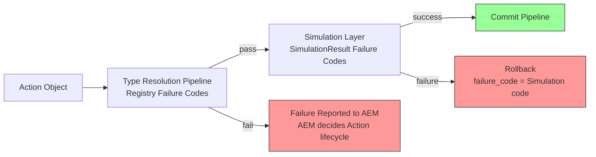

> **No Overlap:** An Action that fails Type Resolution never produces a SimulationResult. An Action that passes Type Resolution may still produce a `failure` SimulationResult. The two failure models are complementary, not overlapping. This is consistent with AEM §9: "An Action that fails Validation never reaches Simulation."

### 13.3 Failure Reporting Rules（失败报告规则）

Registry defines failure codes and their severity. The **handling** of these failures — whether an Action is Cancelled, Retried, or Rejected — is decided by Action Execution Model (see AEM §9 Validation Rules).

Registry 定义失败码及其严重性。这些失败的**处理** — Action 是否被 Cancelled、Retried 或 Rejected — 由 Action Execution Model 决定（见 AEM §9 验证规则）。

| Rule | Description |
|------|-------------|
| Blocking failures are reported to AEM | `TYPE_NOT_FOUND`, `SCHEMA_INVALID`, `HANDLER_NOT_FOUND`, `TYPE_REMOVED`, `CAPABILITY_NOT_MET` 为阻塞级失败。Registry 报告失败码，AEM 决定 Action 生命周期的后续处理。 |
| `TYPE_DEPRECATED` is non-blocking warning | 弃用类型仅产生警告。Registry 报告 `TYPE_DEPRECATED`，Action 是否继续执行由 AEM 决定。 |
| Failure reason is available for Action Record | Registry 失败码可被 AEM 记录在 Action Record 的 `cancellation_reason` 字段中（见 AEM §4）。 |
| Registration failures are isolated | `NAMESPACE_CONFLICT` 和 `REGISTRATION_INVALID` 是注册时错误，不影响已有 Action 的执行。 |
| `HANDLER_BINDING_MISSING` blocks Type activation | Type 无法从 Registered 进入 Active 状态，直到 handler 绑定。这是 Type 生命周期约束，不影响已有 Active 状态的 Type。 |
| Replay failures are distinct | Replay 中的 `VERSION_NOT_FOUND` 中止 Replay 并报告错误 — 它不通过 AEM 的 Action 生命周期处理。 |

---

## 14. Validation Integration（验证集成）

### How Action Execution Model Uses Registry（Action Execution Model 如何使用 Registry）

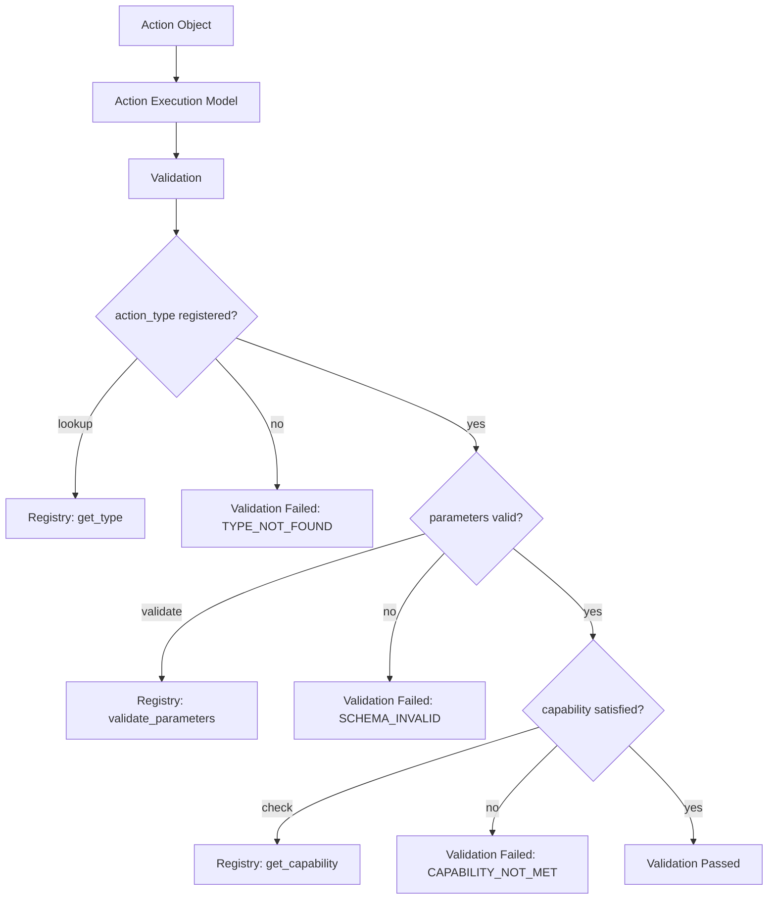

### Validation Checks Using Registry（使用 Registry 的验证检查）

| Check | Registry API | Failure Code | Belongs To |
|-------|-------------|-------------|------------|
| action_type is registered | `get_type(action_type)` | `TYPE_NOT_FOUND` | Execution Authority (Validation) |
| Type is not Removed | `get_type(action_type)` → check state | `TYPE_REMOVED` | Execution Authority (Validation) |
| action_subtype is valid for type | `get_subtypes(action_type)` | `SCHEMA_INVALID` | Execution Authority (Validation) |
| parameters match parameter_schema | `validate_parameters(action_type, parameters)` | `SCHEMA_INVALID` | Execution Authority (Validation) |
| target requirements met | `get_capability(action_type)` → check requires_target_entity, max_targets | `CAPABILITY_NOT_MET` | Execution Authority (Validation) |
| handler is bound | `get_handler(action_type)` | `HANDLER_NOT_FOUND` | Execution Authority (Validation) |

### What Registry Does NOT Validate（Registry 不验证什么）

| Check | Why Not | Belongs To |
|-------|---------|------------|
| Skill cooldown | Gameplay rule | Simulation Authority |
| Mana/stamina sufficient | Gameplay rule | Simulation Authority |
| Line of sight | Gameplay rule | Simulation Authority |
| Distance/range | Gameplay rule | Simulation Authority |
| Buff/debuff effects | Gameplay rule | Simulation Authority |
| Actor intent validity | Planner decision | Intent Authority |

> **Registry Provides Schema, Not Rules:** Registry validates that parameters are structurally correct (right types, required fields present). It does not validate gameplay rules. This maintains the "Validation Must Not Become Mini-Simulation" principle from Action Execution Model §9.

---

## 15. Runtime Guarantees（运行时保证）

### 15.1 Structural Guarantees（结构保证）

- **type_id Uniqueness:** No two Active Action Type Definitions share the same type_id + version.
- **Registry is Read-Only After Init:** After initialization, the Registry's core type set does not change during a Scene. Mod types may be added/removed during Scene transitions.
- **Handler Binding is Mandatory for Active:** A Type cannot be Active without a bound handler_id.
- **Definition Immutability:** Once a Type Definition is registered, it cannot be modified. Version upgrades create new definitions; old definitions are preserved (Deprecated or Archived), never overwritten.

### 15.2 Authority Guarantees（权威保证）

- **Registry Does Not Execute:** Registry never executes Actions, never produces SimulationResults, never creates Events, never mutates State.
- **Registry Does Not Select:** Registry never decides which Action Type the Planner should use.
- **Registry Does Not Simulate:** Registry never checks gameplay rules (cooldown, mana, distance).
- **Registry is Orthogonal:** Registry is not a stage in the 5-layer Authority pipeline. It is a supporting service queried by multiple stages.

### 15.3 Consistency Guarantees（一致性保证）

- **Lookup Determinism:** Same type_id + version always returns the same Type Definition within a single engine session.
- **Version Stability:** Registered versions do not disappear without ADR-approved migration. Deprecated versions remain queryable. Removed versions enter Version Archive.
- **Replay Compatibility:** Replay uses the Type version at Action creation time, not the current latest version. The `replay_compatibility` field declares minimum engine version for correct replay.
- **Deprecated Types Remain Available:** Deprecated types can still be queried and used for Replay.
- **Snapshot Consistency:** All queries within a Scene transaction see the same immutable snapshot — no partial updates visible.

### 15.4 Concurrency Guarantees（并发保证）

- **Thread Safety:** Registry queries are thread-safe — multiple modules can query concurrently without data corruption or inconsistency.
- **Hot Reload Isolation:** Hot reload (Mod load/unload) builds a new snapshot before making it visible. In-flight queries complete safely.
- **No Query Blocking:** No query operation blocks another query. Registration and hot reload operations do not block concurrent queries.

### 15.5 Extensibility Guarantees（扩展性保证）

- **Core Schema Unaffected:** Adding new Action Types to the Registry never modifies the Action Object Schema.
- **Namespace Isolation:** Mod types are namespaced and cannot interfere with core or other mods' types. Each namespace is an independent domain.
- **Forward Compatibility:** Unknown subtypes are not automatically rejected — the Simulation Layer may choose to handle them.
- **Forward Compatibility for Discovery:** Discovery API result types (`type_id_list`, `type_summary`, `full_definition`, `metadata_only`) allow callers to request only the data they need, reducing coupling to specific Definition fields.

### 15.6 Replay Guarantees（重放保证）

- **Replay Uses Original Version:** Replay uses the Type version at Action creation time, resolved via Runtime Log metadata.
- **Version Archive Supports Replay:** Removed versions remain in Version Archive for Replay queries.
- **Replay Schema Efficiency:** Replay SHALL not incur repeated schema parsing overhead for previously validated types.
- **Replay Snapshot Isolation:** Replay queries use a dedicated snapshot that may include historical versions, isolated from live Registry queries.

---

## 16. Extension Points（扩展点）

Action Registry is designed to support extension without structural changes. The following extension points are reserved.

Action Registry 设计为支持扩展而无需结构变更。以下扩展点为预留。

### 16.1 Reserved Extension Points（预留扩展点）

| Extension Point | Description | Structural Impact |
|----------------|-------------|-------------------|
| **Dynamic Registration** | 运行时 API 驱动的动态注册 | None — reuses existing Registration Rules |
| **Runtime Plugin** | 引擎运行时插件系统 | None — uses namespace isolation |
| **Remote Registry** | 从远程服务加载 Type Definition | None — new Registry Source only |
| **Marketplace** | 社区市场 Action Type 包 | None — uses `marketplace.<pkg_id>.*` namespace |
| **AI Generated Types** | AI 动态生成临时 Action Type | None — uses `ai.<model_id>.*` namespace, must pass Registration Rules |
| **Scripting Integration** | Lua / Python 脚本定义 Action Type | None — same Definition structure |
| **Mod Workshop** | 社区 Mod 创建和分享 | None — uses `mod.<workshop_mod_id>.*` namespace |
| **Type Inheritance** | Action Type 继承 | May require ADR — may extend Type Definition structure |

### 16.2 Extension Principles（扩展原则）

| Principle | Description |
|-----------|-------------|
| **All extensions use namespaced type_id** | 所有扩展源必须使用命名空间（`mod.*`, `marketplace.*`, `ai.*`）。不允许匿名注册。 |
| **All extensions pass Registration Rules** | 所有扩展必须通过现有注册规则验证 — valid JSON Schema, complete default_hint, non-empty handler_id, SemVer version。 |
| **Extensions cannot override Core Types** | 扩展类型不可覆盖引擎 Core Types。 |
| **Extensions are isolated by namespace** | 不同扩展源的 Type 之间通过 namespace 隔离。一个 Mod 不可影响另一个 Mod 的 Type。 |
| **Extension Type Definitions are structurally identical** | 扩展类型使用与 Core Type 完全相同的 Definition 结构。不引入特殊字段或特殊处理路径。 |

> **Extension Does Not Mean Complexity:** The key design decision is that all extension points reuse the existing Type Definition structure and Registration Rules. An AI-generated Action Type looks identical to a Core Action Type in the Registry — same fields, same validation, same lifecycle. This prevents the Registry from fragmenting into multiple type systems.

---

## 17. Type Definition Checklist（类型定义检查清单）

Every new Action Type registered in the Registry must satisfy the following checklist. This checklist serves as the **unified design specification** for all Action Type authors — engine developers, content creators, and mod authors.

每个在 Registry 中注册的新 Action Type 必须满足以下检查清单。此清单作为所有 Action Type 作者 — 引擎开发者、内容创建者和 Mod 作者 — 的**统一设计规范**。

### 17.1 Required Fields Checklist（必填字段检查清单）

| ✓ | Field | Requirement | Verification |
|---|-------|-------------|-------------|
| ☐ | `type_id` | 唯一、命名空间化（如 `combat.attack`, `mod.mymod.craft`） | Registration Rules: type_id must be unique + namespaced |
| ☐ | `display_name` | 人类可读名称 | Non-empty string |
| ☐ | `description` | 清晰描述 Action Type 的语义 | Non-empty string |
| ☐ | `namespace` | 从 type_id 推导或显式声明 | Must match type_id prefix |
| ☐ | `version` | SemVer 格式（`MAJOR.MINOR.PATCH`） | SemVer validation |
| ☐ | `parameter_schema` | 合法 JSON Schema，声明所有 required 和 optional 字段 | JSON Schema validation |
| ☐ | `default_hint` | 完整的 Execution Hint（priority, estimated_cost, reservation_requirement, execution_mode, interrupt_policy） | All 5 hint fields present |
| ☐ | `capability` | 结构需求声明（requires_target_entity, max_targets, min_targets, resource_types, is_interruptible_default） | All capability fields present |
| ☐ | `handler_id` | 非空，指向已注册的 Simulation Handler | Handler must exist before Type becomes Active |

### 17.2 Recommended Fields Checklist（推荐字段检查清单）

| ✓ | Field | Requirement | Purpose |
|---|-------|-------------|---------|
| ☐ | `subtypes` | 列出已知 subtype | 帮助 Planner 了解可用变体 |
| ☐ | `semantic_tags` | 至少一个语义标签 | Narrative Director 查询和分类 |
| ☐ | `examples` | 至少一个示例参数集 | 文档、测试、Planner 参考 |
| ☐ | `replay_compatibility` | 声明最低引擎版本 | Replay 版本兼容性检查 |
| ☐ | `migration_notes` | Breaking change 时必填 | 版本迁移指导 |

### 17.3 Design Verification Checklist（设计验证检查清单）

| ✓ | Verification Item | Question |
|---|-------------------|----------|
| ☐ | **No gameplay rules in Capability** | Capability 是否只包含结构需求？没有 cooldown, range, line_of_sight 等 gameplay 规则？ |
| ☐ | **Parameters are declarative** | parameters 是否只描述"做什么"，不描述"怎么做"？没有 damage_amount, mana_cost 等计算结果？ |
| ☐ | **Handler is identifier, not implementation** | handler_id 是否只是一个标识符？Registry 不包含 handler 的实现代码？ |
| ☐ | **Schema is serializable** | parameter_schema 是否可序列化为 JSON？没有函数引用、闭包等不可序列化内容？ |
| ☐ | **Forward compatible subtypes** | 未知 subtype 是否不会被自动拒绝？Simulation Layer 可以选择处理？ |
| ☐ | **Version follows SemVer** | 版本号是否遵循 Semantic Versioning？Breaking change 是否升级 major 版本？ |
| ☐ | **Replay safe** | 旧版本的 Type 是否可以正确 Replay？是否保留在 Registry 或 Version Archive 中？ |
| ☐ | **Namespace isolated** | type_id 是否使用了正确的命名空间？不会与 Core Types 或其他 Mod 冲突？ |
| ☐ | **Override is type-level** | 如果是覆盖，是否替换整个 Type Definition？不是部分字段覆盖？ |
| ☐ | **No Runtime derivation in parameters** | parameters 是否只包含 Planner 创建时已知的信息？通过 Field Admission Rule 验证？ |

### 17.4 Lifecycle Verification Checklist（生命周期验证检查清单）

| ✓ | Verification Item | Question |
|---|-------------------|----------|
| ☐ | **Handler binding before Active** | Type 是否在 handler 绑定后才进入 Active 状态？ |
| ☐ | **Deprecated type still queryable** | 弃用后是否仍然可以查询？Replay 仍然可用？ |
| ☐ | **Removed type enters Version Archive** | 移除后是否进入 Version Archive？Replay 仍然可用？ |
| ☐ | **No removal during Scene** | Type 移除是否只在 Scene transition 时进行？ |
| ☐ | **Mod unload handles active Records** | Mod 卸载时是否取消关联的 Active Action Records？ |

> **Checklist is Mandatory:** This checklist is not optional guidance — it is the **unified design specification** for Action Types. All engine developers, content creators, and mod authors must verify every new Action Type against this checklist before registration. Types that fail checklist verification should not be registered.

---

## 18. Lock Policy（锁定策略）

| Stage | Description |
|-------|-------------|
| ~~Draft → RC1~~ ✅ | Type Definition 结构、Parameter Schema 规则、Validation Integration 经过 Review 后稳定 |
| ~~RC1 → RC2~~ ✅ | Architecture Enhancement: Query Semantics (Discovery API), Cache Model, Type Resolution Pipeline, Failure Model, expanded Runtime Guarantees, Extension Points, Type Definition Checklist |
| ~~RC2 Finalization~~ ✅ | Architecture Convergence: de-implementation of Cache Model → Cache Requirements, Failure Handling → Failure Reporting (deferred to AEM), Concurrency Guarantees de-implementation, Query Performance → Requirements, Extension Points → Reserved, Convenience API / Consumer Classification annotations |
| RC2 → Locked | 当至少 3 个 Action Type（Move / Attack / Talk）实现验证通过，且与 Action Execution Model 的 Validation 集成验证完成 |

### Lock Conditions（锁定条件）

| Condition | Description |
|-----------|-------------|
| Type Definition structure stable | type_id, parameter_schema, capability, default_hint, examples, migration_notes 结构不再变更 |
| Validation Integration verified | AEM Validation 通过 Registry 查询的链路经过验证 |
| Type Resolution Pipeline verified | Type Resolution Pipeline 6 步流程经过实现验证 |
| Handler Binding verified | 至少 3 个 Action Type 的 handler binding 经过 Simulation 验证 |
| Versioning verified | 多版本共存和 Replay 版本回溯经过验证 |
| Mod namespacing verified | Mod 类型注册和隔离经过验证 |
| Discovery API verified | Discovery API 查询结果正确性经过验证 |
| Cache Requirements verified | 并发查询和 Hot Reload 隔离经过验证 |
| Failure Model verified | 所有 Failure Code 的触发和处理经过验证 |

### Post-Lock Governance（锁定后治理）

| Rule | Description |
|------|-------------|
| No core type removal | 不接受移除 Core Action Type 的修改。 |
| No schema downgrade | 不接受将 parameter_schema 降级为非 JSON Schema 的修改。 |
| No validation scope expansion | 不接受让 Registry 验证 gameplay rules 的修改。 |
| No Authority boundary changes | 不接受改变 Registry Authority 边界的修改。 |
| No Failure Code removal | 不接受删除已有 Failure Code 的修改（可新增）。 |
| No Discovery API removal | 不接受删除已有 Discovery API 操作的修改（可新增）。 |
| Structural changes | 任何 Type Definition 结构修改需通过 ADR 审批。 |

---

## 19. Non-Goals（非目标）

This document intentionally does **not** define the following:

本文档有意**不**定义以下内容：

| Non-Goal | Owned By |
|----------|----------|
| Action Object structure | Action Object Schema (Locked) |
| Action scheduling and execution | Action Execution Model (RC1) |
| Simulation rules and computation | Simulation Layer Blueprint |
| SimulationResult structure | SimulationResult Schema (Draft) |
| Event structure and commit | Event Object Schema + Timeline Manager |
| State mutation | State Management Layer / Commit Pipeline |
| Planner decision logic | Future: Planner / Intent Parser |
| Narrative generation | Narrative Director Blueprint |
| Memory generation | Memory Architecture Blueprint |
| Perception pipeline | Future: Perception Blueprint |
| Specific Action Type definitions (Move, Attack, Talk, etc.) | Future: Action Type Reference |
| Simulation Handler implementation | Simulation Layer Blueprint |
| Commit Pipeline implementation | Future: Commit Pipeline |
| Runtime Pipeline orchestration | Future: Runtime Pipeline (final summary document) |

> **Boundary Summary:** Action Registry owns *what Action Types exist and what they look like* — type registration, parameter schemas, default hints, capabilities, versioning, handler binding, query semantics, caching, type resolution, failure model, and extension points. It does not own *how Actions are selected* (Planner), *how Actions are executed* (Action Execution Model), *what simulation produces* (Simulation Layer), *what the world records* (Event), or *what the world looks like* (State).

---

## 20. References

**Depends On:**

- [Action Object Schema v1.0](../03_Data/Action_Object_Schema.md)
- [Action Execution Model v1.0 RC1](./Action_Execution_Model.md)
- [SimulationResult Schema v1.0 Draft](../03_Data/SimulationResult_Schema.md)
- [Glossary](../00_Project/Glossary.md)

**Referenced By:**

- Action Execution Model (Validation uses Registry; Type Resolution Pipeline unifies AEM §9-10)
- Simulation Layer Blueprint (Handler binding uses Registry)
- Action Object Schema (action_type opacity resolved by Registry)
- SimulationResult Schema (Failure Model boundary — Registry codes vs Simulation codes)
- Future: Action Type Reference (specific type definitions)
- Future: Runtime Pipeline (Registry as supporting service)
- Future: Planner / Intent Parser (type discovery via Discovery API)

---

## 21. Revision History

| Version | Date | Description |
|---------|------|-------------|
| v1.0 Draft | 2026-07-14 | Initial document: Registry Authority definition (orthogonal to 5-layer pipeline), Action Type Definition structure (13 fields), Registration Rules (4 sources, override rules), Parameter Schema (JSON Schema, two-layer opacity), Capability Declaration (structural requirements, not gameplay rules), Versioning (SemVer, replay versioning), Registry Lifecycle (4 states: Registered → Active → Deprecated → Removed), Lookup API (9 operations), Validation Integration (Registry provides schema, not rules), Runtime Guarantees, Lock Policy, Non-Goals. |
| v1.0 RC1 | 2026-07-14 | Architecture Review fixes: (1) Removed `requires_line_of_sight` and `requires_adjacency` from Capability Declaration — they are gameplay rules belonging to Simulation Authority; (2) Added `resource_types` declarative-only rule — AEM must not validate resource sufficiency; (3) Added `min_targets` and `is_interruptible_default` to YAML example; (4) Added Override preserves old version rule and Hot update does not interrupt executing Actions rule; (5) Clarified `schema_version` semantic — it refers to Action Object Schema version, not Type version; (6) Added Replay Versioning Rules with Version Archive concept for removed types; (7) Updated Removed state to enter Version Archive (Replay still supported); (8) Added Mod unload cancels active Action Records rule; (9) Added No type removal during Scene rule; (10) Clarified Handler Binding as identifier mapping, not handler lifecycle ownership. |
| v1.0 RC2 | 2026-07-14 | Major architecture enhancement — elevated Registry from "static configuration centre" to "Runtime core supporting service": (1) **Registry Query Semantics** (§10) — expanded Lookup API with Discovery API (find_by_tag, find_by_capability, find_by_namespace, find_by_version, find_all_active, find_deprecated, supports_capability, list_namespaces, get_type_tree) and Query Result Types; (2) **Registry Cache Model** (§11) — Immutable Snapshot, Thread-Safe concurrent reads, Hot Reload Isolation (build-then-swap), Version Cache for Replay, pre-built indexes, compiled JSON Schema cache, performance characteristics table; (3) **Type Resolution Pipeline** (§12) — 6-step resolution flow (Resolve Type → Load Definition → Validate Parameters → Check Capability → Resolve Handler → Submit to Simulation) with Mermaid diagram and Authority boundary table; (4) **Registry Failure Model** (§13) — 10 failure codes (TYPE_NOT_FOUND, VERSION_NOT_FOUND, SCHEMA_INVALID, HANDLER_NOT_FOUND, TYPE_DEPRECATED, TYPE_REMOVED, CAPABILITY_NOT_MET, NAMESPACE_CONFLICT, REGISTRATION_INVALID, HANDLER_BINDING_MISSING), failure code vs SimulationResult failure code distinction, failure handling rules; (5) **Expanded Runtime Guarantees** (§15) — added Definition Immutability, Lookup Determinism, Version Stability, Replay Compatibility, Thread Safety, Hot Reload Isolation, Namespace Isolation, Snapshot Consistency, Replay Snapshot Isolation; (6) **Enhanced 5-Layer Authority diagram** (§2) — all 5 pipeline layers shown with owners, Registry as orthogonal service with dashed connections to all layers, explicit query semantics annotations; (7) **Extension Points** (§16) — Dynamic Registration, Runtime Plugin, Remote Registry, Marketplace, AI Generated Types, Scripting Integration, Mod Workshop, Type Inheritance, with extension principles; (8) **Type Definition Checklist** (§17) — Required Fields, Recommended Fields, Design Verification, Lifecycle Verification checklists; (9) Added `examples`, `replay_compatibility`, `migration_notes`, `namespace` fields to Action Type Definition; (10) Added Version Archive to Registry Structure diagram; (11) Added Snapshot Creation phase to Registry Initialization. |
| v1.0 RC2 Finalization | 2026-07-14 | Architecture Convergence — de-implementation and boundary enforcement, guided by joint Architecture Audit (GLM + GPT): (1) **§11 Cache Model → Cache Requirements** — removed HashMap, TreeMap, Atomic Swap, Pointer Swap, Reference Counting, Epoch GC, Compiled Schema Cache, Singleton, pre-built index mermaid diagrams; rewrote as SHALL requirements with deferred implementation to Runtime Infrastructure Blueprint; (2) **§13.3 Failure Handling → Failure Reporting** — Registry no longer prescribes Action lifecycle (Cancelled/Retry/Rejected); only defines error codes and severity; AEM decides handling; removed "Blocking?" and "Recovery" columns from §13.1, replaced with "Severity"; updated §13.2 mermaid diagram; (3) **§15.4 Concurrency Guarantees de-implementation** — removed "without locks", "Immutable snapshot design guarantees this", "swapping"; (4) **§15.6 Replay Guarantees** — replaced "Compiled Schema Cache" with requirement-style "Replay Schema Efficiency"; (5) **§10.4 Query Rules** — replaced "pre-built indexes" with O(1)+O(k) requirement; (6) **§16 Extension Points → Reserved** — removed roadmap-style descriptions and "future capabilities" language; simplified to Reserved status with Structural Impact column; (7) **§10.2** — annotated `supports_capability` as Convenience API (retained, not deleted); annotated `find_deprecated`, `find_removed`, `get_type_tree` with Primary/Secondary Consumer classification (not split); (8) **§10.3** — annotated `metadata_only` as Lightweight Query Result for Editor/UI consumers (retained, not deleted). No new sections, APIs, or features added. |

---

## 22. Document Governance（文档治理）

**Status:** Release Candidate (RC2)

**Status Values:** Draft → RC → Locked → Deprecated

**Owner:** Runtime Architect

**Architecture Reviewers:**

- Engine Architect
- Simulation Architect
- Narrative Architect

**Architecture Approval:** Architecture Review Required

**Update Policy:** Changes affecting Type Definition structure, Parameter Schema rules, Validation Integration boundary, Versioning rules, Query Semantics API, Cache Requirements, Type Resolution Pipeline, Failure Model, or Extension Points require ADR approval.

**Parent Blueprint:** [Action Execution Model](./Action_Execution_Model.md)
