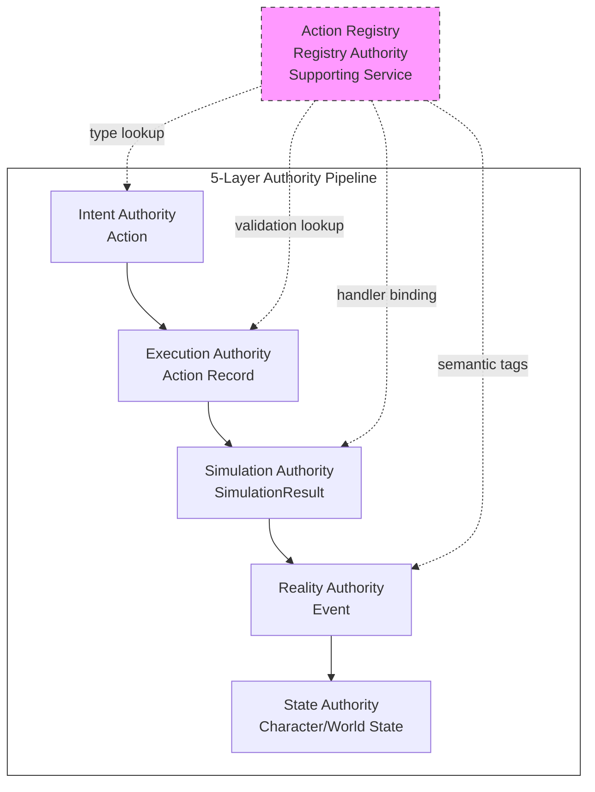
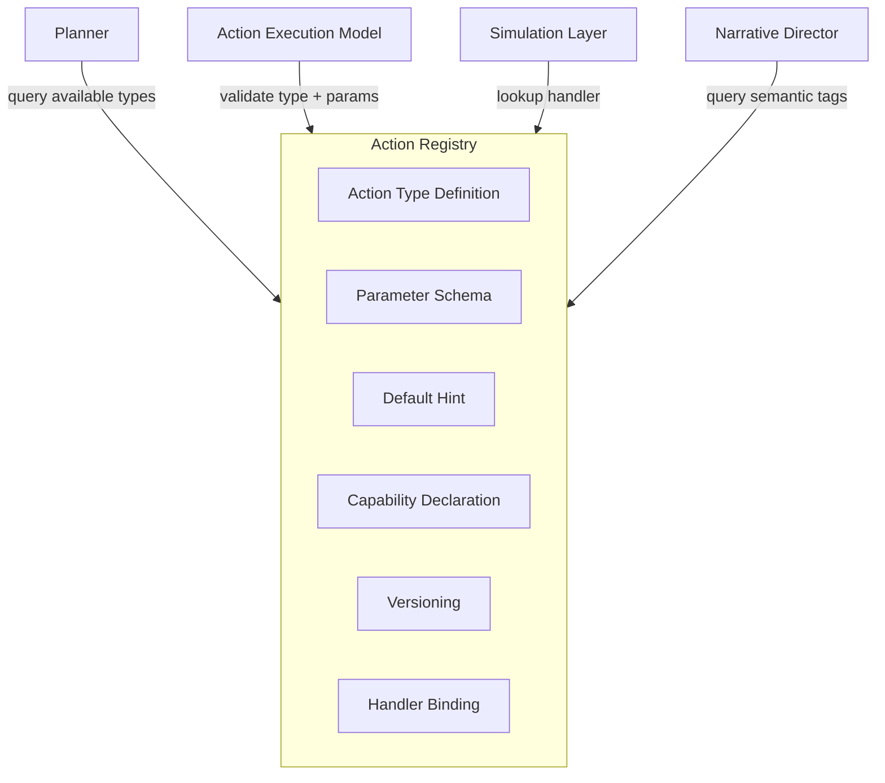
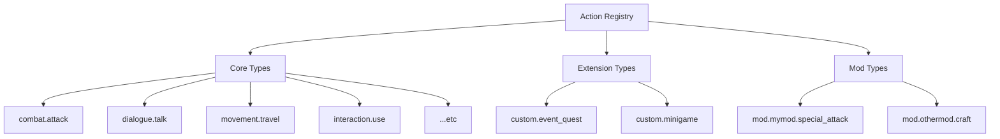
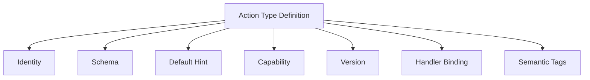
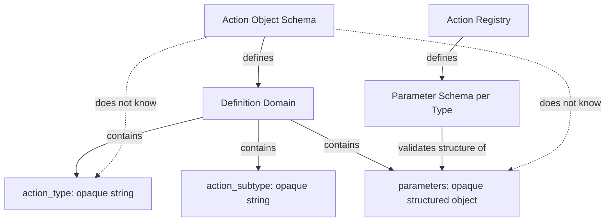
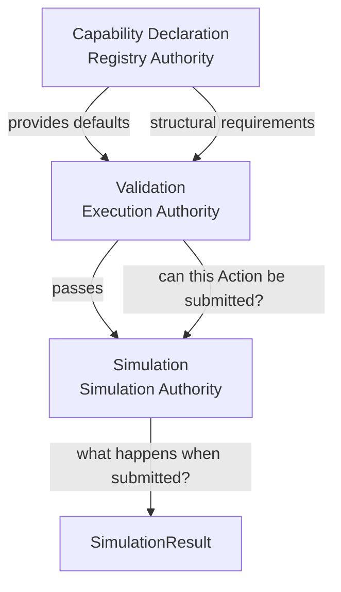
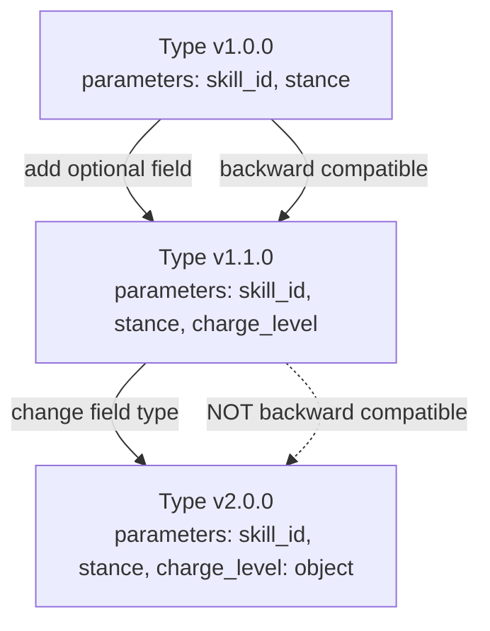
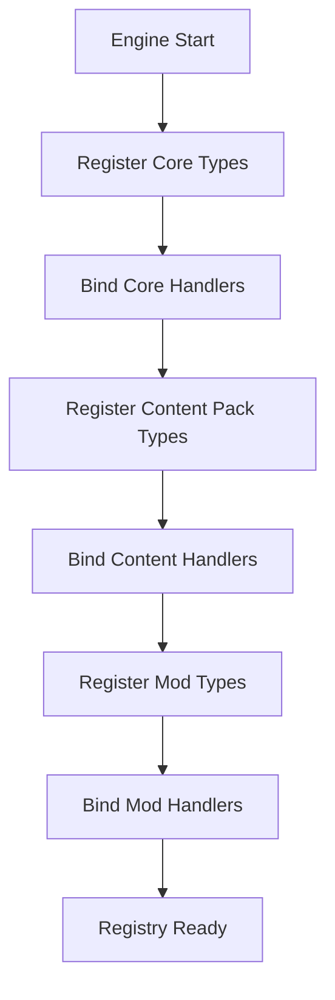

# Action Registry

**Version:** v1.0 RC1  
**Status:** Release Candidate  
**Last Updated:** 2026-07-14

**Depends On:** [Action Object Schema v1.0](../03_Data/Action_Object_Schema.md), [Action Execution Model v1.0 RC1](./Action_Execution_Model.md)

---

## 1. Purpose（文档目的）

Define the authoritative registry of executable Action Types in the AI Narrative RPG Engine — their parameter schemas, default execution hints, capability declarations, versioning rules, and lifecycle management.

定义 AI Narrative RPG Engine 中可执行 Action Type 的权威注册表 — 包括参数 Schema、默认执行提示、能力声明、版本管理规则和生命周期管理。

### Core Definition（核心定义）

**Action Registry is the authoritative source of executable Action Types.**

Action Registry 是可执行 Action Type 的唯一权威来源。

Action Registry is a **supporting service** consulted by multiple Runtime layers. It is not part of the 5-layer Authority pipeline (Intent → Execution → Simulation → Reality → State). Instead, it provides **Type Definitions** that multiple layers consult:

Action Registry 是一个**支撑服务**，被多个 Runtime 层查询。它不属于五层权威流水线（Intent → Execution → Simulation → Reality → State）。它提供**类型定义**，供多个层查询：

| Layer | How it uses Registry |
|-------|---------------------|
| Planner | 查询可用 Action Type、参数 Schema、Capability 声明，用于规划 |
| Action Execution Model (Validation) | 验证 action_type 是否已注册、parameters 是否符合 Schema |
| Simulation Layer | 查询 Action Type 的 handler binding，确定如何模拟 |
| Narrative Director | 查询 Action Type 的语义标签，用于叙事生成 |

### Core Philosophy（核心理念）

**Registry defines types. It does not execute them.**

Registry 定义类型。它不执行类型。

Action Registry is a **catalogue**, not an executor. It answers *"what kinds of Actions exist and what do they look like?"* It never answers *"what should the actor do?"* (Planner), *"is this Action valid?"* (Execution), *"what happens when executed?"* (Simulation), or *"what changed?"* (Reality/State).

---

## 2. Authority（权威）

### Registry Authority（注册权威）

Action Registry owns **Registry Authority** — the authority over what Action Types are defined and their structural schemas.

Action Registry 拥有**注册权威** — 定义哪些 Action Type 存在及其结构 Schema 的权威。

### What Registry Authority Owns（注册权威拥有什么）

| Owned | Description |
|-------|-------------|
| Action Type registration | 哪些 action_type 字符串是合法的 |
| Parameter Schema | 每个 Action Type 的 parameters 结构定义 |
| Default Execution Hint | 每个 Action Type 的默认执行提示（Planner 可覆盖） |
| Capability Declaration | 每个 Action Type 的能力声明（目标要求、资源需求等） |
| Type Versioning | Action Type 的版本管理 |
| Type Lifecycle | Action Type 的注册、弃用、移除 |
| Handler Binding | action_type → handler_id 的绑定标识（handler 本身的注册和生命周期属于 Simulation Layer） |

### What Registry Authority Does NOT Own（注册权威不拥有什么）

| Not Owned | Belongs To |
|-----------|------------|
| Actor 选择哪个 Action | Intent Authority (Planner) |
| Action 是否可执行 | Execution Authority (Action Execution Model) |
| Action 执行后发生什么 | Simulation Authority (Simulation Layer) |
| 世界记录了什么 | Reality Authority (Event) |
| 世界当前状态 | State Authority (Character/Relationship/World State) |

### Authority Position（权威位置）



> **Registry is Orthogonal to the Pipeline:** Action Registry is not a stage in the Runtime pipeline. It is a supporting service consulted by multiple stages. This is why Registry Authority is separate from the 5 pipeline authorities — it does not process Actions, it defines what Action Types exist.

---

## 3. Registry Architecture（注册表架构）

### Architecture Overview（架构概览）



### Registry Structure（注册表结构）



| Registry Section | Description | Mutability |
|-----------------|-------------|------------|
| Core Types | 引擎内置 Action Type（如 `attack`, `dialogue`, `movement`） | Registered at engine init |
| Extension Types | 扩展 Action Type（如剧本自定义事件、小游戏） | Registered at runtime |
| Mod Types | Mod 自定义 Action Type（命名空间 `mod.*`） | Registered at mod load |

---

## 4. Action Type Definition（Action Type 定义）

### Definition Structure（定义结构）

Each registered Action Type is defined by the following structure:

每个注册的 Action Type 由以下结构定义：



| Field | Description | Required |
|-------|-------------|----------|
| type_id | Action Type 的唯一标识符（如 `combat.attack`） | Yes |
| display_name | 人类可读名称（如 "Attack"） | Yes |
| description | 类型描述 | Yes |
| subtypes | 允许的 subtype 列表（如 `melee`, `ranged`, `spell`） | No (default: empty) |
| parameter_schema | parameters 字段的 JSON Schema 定义 | Yes |
| default_hint | 默认 Execution Hint（Planner 可覆盖） | Yes |
| capability | 能力声明（目标要求、资源需求等） | Yes |
| version | Type 版本号（如 `1.0.0`） | Yes |
| handler_id | Simulation Layer handler 的绑定标识 | Yes |
| semantic_tags | 语义标签（供 Narrative Director 使用，如 `["combat", "hostile"]`） | No (default: empty) |
| deprecated | 是否已弃用 | No (default: false) |
| deprecation_message | 弃用说明和替代方案 | No |

### Example: Action Type Definition（示例：Action Type 定义）

```yaml
type_id: "combat.attack"
display_name: "Attack"
description: "Perform a hostile action against a target entity"
subtypes: ["melee", "ranged", "spell"]
parameter_schema:
  type: object
  required: [skill_id]
  properties:
    skill_id:
      type: string
      description: "The skill to use for this attack"
    stance:
      type: string
      enum: [aggressive, defensive, balanced]
      default: balanced
    charge_level:
      type: integer
      minimum: 1
      maximum: 5
      default: 1
default_hint:
  priority: normal
  estimated_cost: { stamina: 10, time: 1 }
  reservation_requirement: {}
  execution_mode: queued
  interrupt_policy: interruptible
capability:
  requires_target_entity: true
  requires_target_location: false
  max_targets: 1
  min_targets: 1
  resource_types: [stamina, mana]
  is_interruptible_default: true
version: "1.0.0"
handler_id: "sim.handlers.combat.attack"
semantic_tags: ["combat", "hostile", "physical"]
deprecated: false
```

> **type_id Naming Convention:** Core types use dot-separated hierarchical names (e.g., `combat.attack`, `dialogue.talk`). Mod types use the `mod.<mod_id>.<type_name>` namespace (e.g., `mod.mymod.special_attack`). This prevents collisions and makes ownership clear.

> **Subtypes are Open-Ended:** The `subtypes` list declares known subtypes. Unknown subtypes are not automatically rejected — the Simulation Layer may choose to handle them. This allows forward compatibility: a new subtype can be added without updating the Registry.

---

## 5. Registration Rules（注册规则）

### Registration Sources（注册来源）

| Source | When | Namespace |
|--------|------|-----------|
| Engine Core | Engine initialization | `*` (root namespace) |
| Game Content Pack | Content load | `content.*` |
| Mod | Mod load | `mod.<mod_id>.*` |
| Runtime Registration | Any time at runtime | Caller-defined (must be namespaced) |

### Registration Rules（注册规则）

| Rule | Description |
|------|-------------|
| type_id must be unique | 同一 type_id 不可重复注册。尝试注册已存在的 type_id 会失败（除非是 override 模式）。 |
| type_id must be namespaced | Mod types 必须使用 `mod.<mod_id>.<type_name>` 命名空间。Core types 使用根命名空间。 |
| parameter_schema must be valid JSON Schema | parameter_schema 必须是合法的 JSON Schema 定义。 |
| default_hint must be complete | default_hint 必须包含所有 Execution Hint 字段。 |
| handler_id must be non-empty | handler_id 必须指向一个已注册的 Simulation Handler。 |
| Version must follow SemVer | version 必须遵循 Semantic Versioning（`MAJOR.MINOR.PATCH`）。 |
| Core types cannot be overridden | 引擎内置 Core Types 不可被 Mod 覆盖。Mod 可以注册新类型，但不能覆盖 `combat.attack` 等。 |

### Override Rules（覆盖规则）

| Rule | Description |
|------|-------------|
| Mod types can be overridden by the same mod | 同一 Mod 可以覆盖自己的 type 定义（用于版本升级）。覆盖创建新版本，旧版本进入 Deprecated 状态。 |
| Mod types cannot override other mods' types | 一个 Mod 不可覆盖另一个 Mod 的 type 定义。 |
| Mod types cannot override core types | Mod 不可覆盖引擎 Core Types。 |
| Content packs can extend core types | Content Pack 可以扩展 Core Type 的 subtype 列表，但不能修改 parameter_schema。 |
| Override preserves old version | Override 创建新版本时，旧版本必须保留在 Registry 中（进入 Deprecated），不可直接替换。这保证已创建的旧 Action 仍可 Replay。 |
| Hot update does not interrupt executing Actions | Mod 热更新时，正在队列中或正在执行的 Action Records 按原版本 schema 完成 Validation 和 Simulation。新版本仅影响后续创建的新 Action。 |

> **Override is Type-Level, Not Field-Level:** Override replaces the entire Action Type Definition. Partial override (e.g., only changing `default_hint` while keeping `parameter_schema`) is not supported. This prevents configuration fragmentation — if a mod wants to change behavior, it must redeclare the full type.

---

## 6. Parameter Schema（参数 Schema）

### Schema Definition Rules（Schema 定义规则）

Parameter Schema defines the structure of the `parameters` field in Action Object's Definition domain.

Parameter Schema 定义 Action Object Definition 域中 `parameters` 字段的结构。

| Rule | Description |
|------|-------------|
| Must be valid JSON Schema | parameter_schema 必须是合法的 JSON Schema（draft 07 或更高）。 |
| Must declare required fields | required 字段必须明确声明。可选字段也必须列出。 |
| Must declare types | 每个字段必须有明确的 type。 |
| Must declare constraints | 约束（minimum, maximum, enum, pattern）应尽量声明。 |
| May use `$ref` | 可以使用 `$ref` 引用共享的 Schema 片段。 |
| No runtime-computed fields | parameters 不可包含需要 Runtime 计算的字段（与 Action Object Schema 的 Field Admission Rule 一致）。 |
| Must be serializable | parameter_schema 本身必须可序列化（JSON 格式）。 |

### Parameter Schema vs Action Object Schema（参数 Schema 与 Action Object Schema 的关系）



| Aspect | Action Object Schema | Action Registry Parameter Schema |
|--------|---------------------|--------------------------------|
| What it defines | parameters 是不透明结构化对象 | parameters 的具体结构 |
| Lifecycle | Locked, gameplay-agnostic | 可变，随 Action Type 注册而扩展 |
| Scope | 所有 Action Type 共用 | 每个 Action Type 独立 |
| Authority | Intent Authority (structure) | Registry Authority (type-specific schema) |

> **Two-Layer Opacity:** The Action Object Schema treats `parameters` as opaque — it does not parse or validate the content. The Action Registry Parameter Schema provides the type-specific schema that makes `parameters` interpretable. This two-layer design keeps the Action Object Schema stable while allowing unlimited Action Type extensibility.

---

## 7. Capability Declaration（能力声明）

### What Capability Declaration Is（能力声明是什么）

Capability Declaration describes the **structural requirements** of an Action Type — what kind of targets it needs, what resources it consumes, how many targets it can affect. This is metadata about the Action Type, not about any specific Action instance.

Capability Declaration 描述 Action Type 的**结构需求** — 需要什么类型的目标、消耗什么资源、能影响多少目标。这是关于 Action Type 的元数据，不是关于具体 Action 实例的。

### Capability Fields（能力字段）

| Field | Description | Example |
|-------|-------------|---------|
| requires_target_entity | 是否必须有目标实体 | `true` for `attack`, `false` for `wait` |
| requires_target_location | 是否必须有目标地点 | `true` for `movement`, `false` for `dialogue` |
| max_targets | 最大目标实体数 | `1` for single-target, `5` for AoE, `0` for self |
| min_targets | 最小目标实体数 | `1` for most attacks |
| resource_types | 消耗的资源类型列表 | `["stamina", "mana"]` |
| is_interruptible_default | 默认是否可中断 | `true` for most, `false` for cutscene actions |

### Capability vs Validation vs Simulation（能力 vs 验证 vs 模拟）



| Layer | Question | Example |
|-------|----------|---------|
| Capability Declaration | 这个 Action Type 需要什么结构？ | `attack` requires at least 1 target entity |
| Validation (Execution) | 这个 Action 实例满足结构要求吗？ | Does this Action have target_entity_ids? |
| Simulation (Simulation) | 这个 Action 执行后发生什么？ | Target takes 30 damage, stamina -10 |

> **Capability is Structural, Not Gameplay:** Capability Declaration declares structural requirements (does it need a target? how many?). It does not declare gameplay rules (how much damage? cooldown? range? line of sight? adjacency?). Gameplay rules belong to Simulation Authority. This is consistent with the "Validation Must Not Become Mini-Simulation" principle in Action Execution Model.
>
> **Removed from Capability:** `requires_line_of_sight` and `requires_adjacency` were considered but rejected — they are gameplay rules that depend on scene geometry, spatial model, and runtime state. They belong to Simulation Authority, not Registry Authority. Including them would allow AEM Validation to check spatial conditions, creating a Mini-Simulation.
>
> **resource_types is Declarative, Not Validated:** `resource_types` declares which resource types an Action Type *may* consume. It does not declare how much, and AEM Validation must not check whether the actor has sufficient resources. Resource sufficiency belongs to Simulation Authority.

---

## 8. Versioning（版本管理）

### Type Versioning Rules（类型版本规则）

| Rule | Description |
|------|-------------|
| Each Type Definition has a version | 每个 Action Type Definition 必须有 SemVer 版本号。 |
| Major version = breaking change | parameter_schema 的 breaking change（删除字段、改变类型）需要 major 版本升级。 |
| Minor version = additive change | 新增可选字段、新增 subtype 是 minor 版本升级。 |
| Patch version = fix | 修复 description、默认值等不改变结构的变化是 patch 版本升级。 |
| Multiple versions can coexist | 同一 type_id 可以有多个版本同时注册（如 `combat.attack` v1.0.0 和 v2.0.0）。 |
| Action Object carries schema_version | Action Object 的 `schema_version` 字段记录 Action Object Schema 自身版本（如 "1.0"），**不是** Type version。Type version 由 Registry 管理。 |
| Deprecated types remain queryable | 已弃用的 Type 仍可查询（用于 Replay 旧 Action），但不可创建新 Action。 |

### Version Compatibility（版本兼容性）



| Change Type | Version Bump | Backward Compatible | Replay Impact |
|-------------|-------------|--------------------|---------------|
| Add optional field | Minor | Yes | Old Actions replay correctly (new field defaults) |
| Add required field | Major | No | Old Actions may fail validation |
| Remove field | Major | No | Old Actions with that field are still valid (ignored) |
| Change field type | Major | No | Old Actions may fail parameter schema validation |
| Add subtype | Minor | Yes | No impact |
| Change default_hint | Patch | Yes | New Actions use new defaults; old Actions unaffected |

### Replay Versioning Rules（重放版本规则）

| Rule | Description |
|------|-------------|
| Replay uses the version at Action creation time | Replay 使用 Action 创建时的 Type 版本进行验证和模拟。 |
| Type version is resolved via Runtime Log | Action Object 不携带 Type version（`schema_version` 是 Action Object Schema 版本，不是 Type 版本）。Replay 时，Type 版本通过 Runtime Log 中记录的 Action 创建时 Registry 快照确定。如果快照不可用，回退到当前 Registry 中该 type_id 的最早兼容版本。 |
| Old versions must remain registered | 旧版本必须保留在 Registry 中（标记为 Deprecated），以支持 Replay。 |
| Removed versions enter Version Archive | Type 版本被移除后，进入 Version Archive — 只读归档，支持 Replay 查询，不支持创建新 Action。 |
| Version removal requires migration | 将版本从 Registry 完全移除（包括 Version Archive）需要提供迁移方案（ADR 审批）。 |

---

## 9. Registry Lifecycle（注册表生命周期）

### Type Lifecycle States（Type 生命周期状态）

```mermaid
stateDiagram-v2
    [*] --> Registered: Register Type
    Registered --> Active: Handler Bound
    Active --> Deprecated: Mark Deprecated
    Deprecated --> Removed: After Migration
    Removed --> [*]

    note right of Registered: Type definition exists
    note right of Active: Ready for use
    note right of Deprecated: No new Actions; Replay still works
    note right of Removed: In Version Archive; Replay only
```



| State | Description | Can create new Actions? | Can Replay old Actions? |
|-------|-------------|------------------------|------------------------|
| Registered | Type definition 已注册，但 handler 尚未绑定 | No | No |
| Active | Type 定义完整，handler 已绑定 | Yes | Yes |
| Deprecated | Type 已弃用，不建议使用，但仍可用 | Yes (with warning) | Yes |
| Removed | Type 已从 Registry 活跃列表移除，进入 Version Archive | No | Yes (via Version Archive) |

### Lifecycle Rules（生命周期规则）

| Rule | Description |
|------|-------------|
| Registration is idempotent | 重复注册同一 type_id + version 是幂等的 — 不报错，返回现有定义。 |
| Deprecation is reversible | 弃用可以撤销（恢复到 Active）。 |
| Removal enters Version Archive | 移除的 Type 进入 Version Archive — 只读归档，仍可查询用于 Replay，但不支持创建新 Action。 |
| Removal is irreversible | 从活跃列表移除后不可恢复到 Active。从 Version Archive 完全清除需要 ADR 审批。 |
| Core types cannot be removed | 引擎 Core Types 不可移除。 |
| Mod types are removed on unload | Mod 卸载时，其注册的 Type 进入 Removed 状态（进入 Version Archive）。 |
| Mod unload cancels active Action Records | Mod 卸载时，关联的 Active Action Records 被 Cancelled（cancellation_reason = `type_removed`）。 |
| No type removal during Scene | Type 移除只能在 Scene transition 时进行，不可在 Scene 执行中移除 Active Type。 |

### Registry Initialization（注册表初始化）



| Phase | Description |
|-------|-------------|
| Core Registration | 引擎启动时注册所有内置 Action Types |
| Content Registration | 加载游戏内容包时注册扩展 Action Types |
| Mod Registration | 加载 Mod 时注册 Mod Action Types |
| Ready | Registry 就绪，可以接受查询和验证 |

---

## 10. Lookup API（查询接口）

### Lookup Operations（查询操作）

| Operation | Input | Output | Used By |
|-----------|-------|--------|---------|
| `get_type(type_id, version?)` | type_id, optional version | Action Type Definition | Planner, Validation, Simulation |
| `list_types(filter?)` | optional filter (namespace, tags, active_only) | List of type_ids | Planner (discovery) |
| `validate_parameters(type_id, parameters)` | type_id, parameters | Validation Result (valid/invalid + errors) | Action Execution Model (Validation) |
| `get_default_hint(type_id)` | type_id | Default Execution Hint | Planner |
| `get_capability(type_id)` | type_id | Capability Declaration | Planner, Validation |
| `get_handler(type_id, version?)` | type_id, optional version | handler_id | Simulation Layer |
| `get_subtypes(type_id)` | type_id | List of subtypes | Planner |
| `is_deprecated(type_id)` | type_id | boolean | Planner (warnings) |
| `get_semantic_tags(type_id)` | type_id | List of tags | Narrative Director |

### Lookup Rules（查询规则）

| Rule | Description |
|------|-------------|
| Lookup is read-only | 查询操作不修改 Registry 状态。 |
| Lookup is O(1) or O(log n) | type_id 查询必须是 O(1) 或 O(log n) — 不可线性扫描。 |
| Lookup is thread-safe | Registry 查询必须线程安全 — 多个模块可并发查询。 |
| Unknown type_id returns null | 查询不存在的 type_id 返回 null（不抛异常）。 |
| Version lookup falls back to latest | 不指定 version 时返回最新 Active 版本。 |

---

## 11. Validation Integration（验证集成）

### How Action Execution Model Uses Registry（Action Execution Model 如何使用 Registry）


### Validation Checks Using Registry（使用 Registry 的验证检查）

| Check | Registry API | Belongs To |
|-------|-------------|------------|
| action_type is registered | `get_type(action_type)` | Execution Authority (Validation) |
| action_subtype is valid for type | `get_subtypes(action_type)` | Execution Authority (Validation) |
| parameters match parameter_schema | `validate_parameters(action_type, parameters)` | Execution Authority (Validation) |
| target requirements met | `get_capability(action_type)` → check requires_target_entity, max_targets | Execution Authority (Validation) |
| Type is not Removed | `get_type(action_type)` → check state | Execution Authority (Validation) |

### What Registry Does NOT Validate（Registry 不验证什么）

| Check | Why Not | Belongs To |
|-------|---------|------------|
| Skill cooldown | Gameplay rule | Simulation Authority |
| Mana/stamina sufficient | Gameplay rule | Simulation Authority |
| Line of sight | Gameplay rule | Simulation Authority |
| Distance/range | Gameplay rule | Simulation Authority |
| Buff/debuff effects | Gameplay rule | Simulation Authority |
| Actor intent validity | Planner decision | Intent Authority |

> **Registry Provides Schema, Not Rules:** Registry validates that parameters are structurally correct (right types, required fields present). It does not validate gameplay rules. This maintains the "Validation Must Not Become Mini-Simulation" principle from Action Execution Model §9.

---

## 12. Runtime Guarantees（运行时保证）

### Structural Guarantees（结构保证）

- **type_id Uniqueness:** No two Active Action Type Definitions share the same type_id + version.
- **Registry is Read-Only After Init:** After initialization, the Registry's core type set does not change during a Scene. Mod types may be added/removed during Scene transitions.
- **Handler Binding is Mandatory for Active:** A Type cannot be Active without a bound handler_id.

### Authority Guarantees（权威保证）

- **Registry Does Not Execute:** Registry never executes Actions, never produces SimulationResults, never creates Events, never mutates State.
- **Registry Does Not Select:** Registry never decides which Action Type the Planner should use.
- **Registry Does Not Simulate:** Registry never checks gameplay rules (cooldown, mana, distance).

### Consistency Guarantees（一致性保证）

- **Lookup is Deterministic:** Same type_id + version always returns the same Type Definition within a single engine session.
- **Replay Uses Original Version:** Replay uses the Type version at Action creation time, not the current latest version.
- **Deprecated Types Remain Available:** Deprecated types can still be queried and used for Replay.

### Extensibility Guarantees（扩展性保证）

- **Core Schema Unaffected:** Adding new Action Types to the Registry never modifies the Action Object Schema.
- **Mod Isolation:** Mod types are namespaced and cannot interfere with core or other mods' types.
- **Forward Compatibility:** Unknown subtypes are not automatically rejected — the Simulation Layer may choose to handle them.

---

## 13. Lock Policy（锁定策略）

| Stage | Description |
|-------|-------------|
| Draft → RC | ✅ Type Definition 结构、Parameter Schema 规则、Validation Integration 经过 Review 后稳定 |
| RC → Locked | 当至少 3 个 Action Type（Move / Attack / Talk）实现验证通过，且与 Action Execution Model 的 Validation 集成验证完成 |

### Lock Conditions（锁定条件）

| Condition | Description |
|-----------|-------------|
| Type Definition structure stable | type_id, parameter_schema, capability, default_hint 结构不再变更 |
| Validation Integration verified | AEM Validation 通过 Registry 查询的链路经过验证 |
| Handler Binding verified | 至少 3 个 Action Type 的 handler binding 经过 Simulation 验证 |
| Versioning verified | 多版本共存和 Replay 版本回溯经过验证 |
| Mod namespacing verified | Mod 类型注册和隔离经过验证 |

### Post-Lock Governance（锁定后治理）

| Rule | Description |
|------|-------------|
| No core type removal | 不接受移除 Core Action Type 的修改。 |
| No schema downgrade | 不接受将 parameter_schema 降级为非 JSON Schema 的修改。 |
| No validation scope expansion | 不接受让 Registry 验证 gameplay rules 的修改。 |
| Structural changes | 任何 Type Definition 结构修改需通过 ADR 审批。 |

---

## 14. Non-Goals（非目标）

This document intentionally does **not** define the following:

本文档有意**不**定义以下内容：

| Non-Goal | Owned By |
|----------|----------|
| Action Object structure | Action Object Schema (Locked) |
| Action scheduling and execution | Action Execution Model (RC1) |
| Simulation rules and computation | Simulation Layer Blueprint |
| Event structure and commit | Event Object Schema + Timeline Manager |
| State mutation | State Management Layer / Commit Pipeline |
| Planner decision logic | Future: Planner / Intent Parser |
| Narrative generation | Narrative Director Blueprint |
| Memory generation | Memory Architecture Blueprint |
| Perception pipeline | Future: Perception Blueprint |
| Specific Action Type definitions (Move, Attack, Talk, etc.) | Future: Action Type Reference |
| Simulation Handler implementation | Simulation Layer Blueprint |

> **Boundary Summary:** Action Registry owns *what Action Types exist and what they look like* — type registration, parameter schemas, default hints, capabilities, versioning, handler binding. It does not own *how Actions are selected* (Planner), *how Actions are executed* (Action Execution Model), *what simulation produces* (Simulation Layer), *what the world records* (Event), or *what the world looks like* (State).

---

## 15. References

**Depends On:**

- [Action Object Schema v1.0](../03_Data/Action_Object_Schema.md)
- [Action Execution Model v1.0 RC1](./Action_Execution_Model.md)
- [SimulationResult Schema](../03_Data/SimulationResult_Schema.md)
- [Glossary](../00_Project/Glossary.md)

**Referenced By:**

- Action Execution Model (Validation uses Registry)
- Simulation Layer Blueprint (Handler binding uses Registry)
- Action Object Schema (action_type opacity resolved by Registry)
- Future: Action Type Reference (specific type definitions)
- Future: Runtime Pipeline (Registry as supporting service)
- Future: Planner / Intent Parser (type discovery)

---

## 16. Revision History

| Version | Date | Description |
|---------|------|-------------|
| v1.0 Draft | 2026-07-14 | Initial document: Registry Authority definition (orthogonal to 5-layer pipeline), Action Type Definition structure (13 fields), Registration Rules (4 sources, override rules), Parameter Schema (JSON Schema, two-layer opacity), Capability Declaration (structural requirements, not gameplay rules), Versioning (SemVer, replay versioning), Registry Lifecycle (4 states: Registered → Active → Deprecated → Removed), Lookup API (9 operations), Validation Integration (Registry provides schema, not rules), Runtime Guarantees, Lock Policy, Non-Goals. |
| v1.0 RC1 | 2026-07-14 | Architecture Review fixes: (1) Removed `requires_line_of_sight` and `requires_adjacency` from Capability Declaration — they are gameplay rules belonging to Simulation Authority; (2) Added `resource_types` declarative-only rule — AEM must not validate resource sufficiency; (3) Added `min_targets` and `is_interruptible_default` to YAML example; (4) Added Override preserves old version rule and Hot update does not interrupt executing Actions rule; (5) Clarified `schema_version` semantic — it refers to Action Object Schema version, not Type version; (6) Added Replay Versioning Rules with Version Archive concept for removed types; (7) Updated Removed state to enter Version Archive (Replay still supported); (8) Added Mod unload cancels active Action Records rule; (9) Added No type removal during Scene rule; (10) Clarified Handler Binding as identifier mapping, not handler lifecycle ownership. |

---

## 17. Document Governance（文档治理）

**Status:** Release Candidate (RC1)

**Status Values:** Draft → RC → Locked → Deprecated

**Owner:** Runtime Architect

**Reviewers:**

- Engine Architect
- Simulation Architect
- Narrative Architect

**Approval:** Architecture Review Required

**Update Policy:** Changes affecting Type Definition structure, Parameter Schema rules, Validation Integration boundary, or Versioning rules require ADR approval.

**Parent Blueprint:** [Action Execution Model](./Action_Execution_Model.md)
