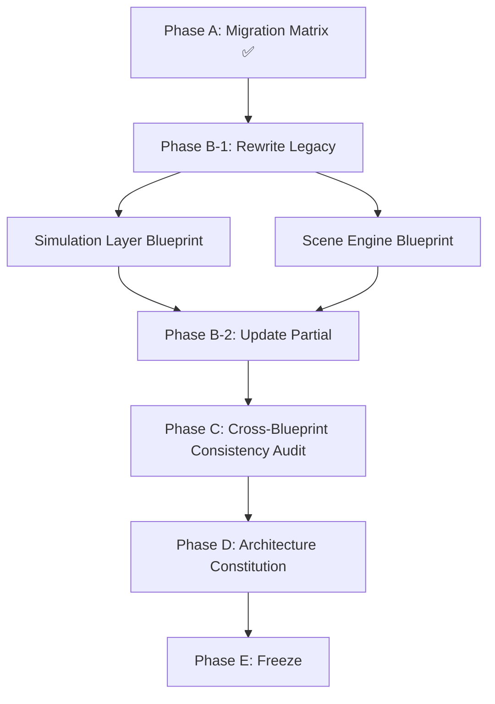

# Architecture Migration Matrix

**Version:** v1.0  
**Status:** Active  
**Last Updated:** 2026-07-14

---

## 1. Purpose（文档目的）

This document classifies every Blueprint, Schema, and Overview in the AI Narrative RPG Engine documentation set by its **architecture generation** — whether it aligns with the current 5-Layer Authority Pipeline paradigm.

本文档将 AI Narrative RPG Engine 文档集中每一份 Blueprint、Schema 和 Overview 按**架构世代**分类——即是否与当前五层权威流水线范式对齐。

### Why Generation Matters（为什么世代很重要）

A Consistency Audit assumes all documents share the same architectural paradigm. If some documents were written before the Pipeline was established, auditing them produces findings that will be invalidated by the inevitable rewrite.

一致性审计的前提是所有文档共享同一架构范式。如果部分文档在流水线建立之前编写，审计它们产出的 Finding 会在必然的重写后失效。

**This Matrix prevents wasted audit effort by identifying which documents need migration before audit.**

**本矩阵通过识别哪些文档需要迁移来防止审计浪费。**

---

## 2. Classification Criteria（分类标准）

| Classification | Meaning | Action |
|---------------|---------|--------|
| ✅ **Current** | Document aligns with 5-Layer Authority Pipeline. References Pipeline, Glossary, and Infrastructure where appropriate. | Continue — eligible for RC |
| ⚠️ **Partial** | Core concepts are sound, but document references old flow diagrams, old terminology, or pre-Pipeline module relationships. | Update — targeted edits to align |
| ❌ **Legacy** | Document is built on pre-Pipeline architecture. Module relationships, data flow, and terminology are fundamentally different. | Rewrite — full architectural migration |
| ⬜ **Stub** | Document is empty or placeholder only. | Create — design from scratch |

---

## 3. Architecture Blueprints（架构 Blueprint）

| # | Document | Version | Classification | Reason | Action |
|---|----------|---------|---------------|--------|--------|
| 1 | Runtime Pipeline Blueprint | v1.0 Draft | ✅ Current | Created in Pipeline era. Defines the 5-Layer Authority Pipeline itself. | Continue |
| 2 | Runtime Infrastructure Blueprint | v1.0 RC2 | ✅ Current | Post-Pipeline. "Infrastructure serves. Infrastructure does not decide." Quality Attributes framework established. | Continue → Freeze Candidate |
| 3 | Runtime Glossary | v1.0 Draft | ✅ Current | Created in Pipeline era. Unifies terminology across all Blueprints. | Continue |
| 4 | Action Registry | RC2 | ✅ Current | Authority-fied. Type definitions, schemas, capabilities, discovery are stable. | Continue → Freeze Candidate |
| 5 | Action Execution Model | RC1 | ✅ Current | Execution Authority. Action lifecycle, validation, dispatch rules aligned with Pipeline. | Continue → Freeze Candidate |
| 6 | Runtime State Model Blueprint | v1.0 Draft | ⚠️ Partial | Core concepts sound (Persistent/Session split, ownership matrix). But: no Pipeline reference, no Glossary reference, Copy-on-Write in hardware section (implementation detail), ownership matrix needs alignment with Artifact Ownership Matrix. | Update |
| 7 | Simulation Layer Blueprint | v1.2 Draft | ❌ Legacy | Pre-Pipeline. Uses old flow (Player Action → Scene Engine → Simulation → Narrative Director). No concept of Action Record as input or SimulationResult as output. Missing: Relationship Engine as subsystem, Timeline Manager as downstream, Infrastructure references. Rule Engine section duplicates Relationship Engine. | **Rewrite** |
| 8 | Scene Engine Blueprint | v1.2 Draft | ❌ Legacy | Pre-Pipeline. Old lifecycle (11 states including Directing, Generating, Memory Processing). No Authority Pipeline reference. Scene Event Model uses old structure instead of Event Object Schema. Missing: Infrastructure references (Snapshot Manager for transaction, Log Manager). | **Rewrite** |
| 9 | Runtime Architecture Blueprint | v1.2 Draft | ⚠️ Partial | Core principles sound. But Runtime Lifecycle flow diagram is old (linear: Action → Scene → Simulation → Relationship → Narrative → Generation). No Pipeline reference. Scene State Machine is old version. | Update |
| 10 | Overall Architecture Blueprint | v2.1 Draft | ⚠️ Partial | Highest-level document. Need to verify: does it reference Authority Pipeline? Does it use old layered model? Likely needs Pipeline/Glossary references added. | Update |
| 11 | Narrative Director Blueprint | v2.3 Draft | ⚠️ Partial | Core philosophy sound ("Narrative never changes reality"). But runtime position diagram uses old flow. No Pipeline reference. Consumes "Simulation Events" not "SimulationResult". | Update |
| 12 | Relationship Engine Blueprint | v2.3 Draft | ⚠️ Partial | Core concepts sound (multi-dimensional, deterministic, rule-driven). But positioned as "subsystem inside Simulation Layer" without Pipeline context. Old runtime position diagram. No Pipeline/Infrastructure/Glossary references. | Update |
| 13 | Memory Architecture Blueprint | v1.4 Draft | ⚠️ Partial | Excellent core concepts (Quality Model, Activation, Consolidation). But write pipeline references "Scene Complete" instead of Event commit. No Pipeline reference. Should reference Event Object as trigger for Memory Extraction. | Update |
| 14 | LLM Runtime Blueprint | v1.2 Draft | ⚠️ Partial | Model abstraction layer. Likely sound core, but needs Pipeline/Glossary alignment verification. | Update |
| 15 | Prompt Builder Blueprint | v2.1 Draft | ⚠️ Partial | Translation layer. Core likely sound, but needs Pipeline/Glossary alignment verification. | Update |
| 16 | GPU Scheduler | v0.1 Draft | ⬜ Stub | Empty placeholder. | Create |
| 17 | Image Pipeline | v0.1 Draft | ⬜ Stub | Empty placeholder. | Create |
| 18 | Renderer Layer | v0.1 Draft | ⬜ Stub | Empty placeholder. | Create |
| 19 | Overall Architecture Overview | v1.0 Active | ⚠️ Partial | Overview document. References old architecture flow. Needs Pipeline reference. | Update |
| 20 | Runtime Architecture Overview | v1.0 Active | ⚠️ Partial | Overview document. References old runtime flow. Needs Pipeline reference. | Update |

---

## 4. Data Schemas（数据 Schema）

| # | Document | Version | Classification | Reason | Action |
|---|----------|---------|---------------|--------|--------|
| 1 | Action Object Schema | Locked | ✅ Current | Declarative intent structure. Stable. | Continue → Frozen |
| 2 | SimulationResult Schema | Draft | ⚠️ Partial | Need to verify alignment with Pipeline's Simulation Authority output definition. May need Pipeline reference. | Review |
| 3 | Event Object Schema | RC4 | ✅ Current | Committed reality, Timeline entry. Stable. | Continue → Freeze Candidate |
| 4 | Character State Schema | RC | ✅ Current | Character state structure. Stable. | Continue → Freeze Candidate |
| 5 | Relationship State Schema | RC3 | ✅ Current | Relationship state structure. Stable. | Continue → Freeze Candidate |

---

## 5. Summary Statistics（统计汇总）

| Classification | Count | Documents |
|---------------|-------|-----------|
| ✅ Current | 8 | Pipeline, Infrastructure, Glossary, Registry, AEM, Action Object Schema, Event Object Schema, Character State Schema, Relationship State Schema |
| ⚠️ Partial | 10 | State Model, Runtime Architecture, Overall Architecture, Narrative Director, Relationship Engine, Memory Architecture, LLM Runtime, Prompt Builder, Overall Overview, Runtime Overview |
| ❌ Legacy | 2 | **Simulation Layer Blueprint, Scene Engine Blueprint** |
| ⬜ Stub | 3 | GPU Scheduler, Image Pipeline, Renderer Layer |

---

## 6. Migration Priority（迁移优先级）

### Phase B-1: Rewrite Legacy Blueprints（最高优先）

These two documents are **blocking the entire Blueprint collection from Freeze**. They are core Pipeline stages.

| Priority | Document | Why Blocking |
|----------|----------|-------------|
| B-1.1 | **Simulation Layer Blueprint** | Simulation Authority (Layer ③). Every other Blueprint references it. Cannot audit Pipeline consistency without it. |
| B-1.2 | **Scene Engine Blueprint** | Scene Transaction Container. Defines the atomic unit of execution. Simulation Layer rewrite depends on it. |

### Phase B-2: Update Partial Blueprints（次高优先）

These documents have sound foundations but need targeted updates to reference the Pipeline, Glossary, and Infrastructure.

| Priority | Document | Key Update |
|----------|----------|------------|
| B-2.1 | Runtime State Model Blueprint | Add Pipeline/Glossary refs, remove Copy-on-Write, align ownership matrix |
| B-2.2 | Runtime Architecture Blueprint | Replace old lifecycle flow with Pipeline flow, add Pipeline/Glossary refs |
| B-2.3 | Overall Architecture Blueprint | Add Pipeline reference, verify layering model |
| B-2.4 | Relationship Engine Blueprint | Position within Simulation Authority, add Pipeline/Glossary refs |
| B-2.5 | Narrative Director Blueprint | Replace old flow diagram, consume SimulationResult, add Pipeline/Glossary refs |
| B-2.6 | Memory Architecture Blueprint | Trigger from Event commit not Scene complete, add Pipeline/Glossary refs |
| B-2.7 | LLM Runtime Blueprint | Verify Pipeline alignment, add Glossary ref |
| B-2.8 | Prompt Builder Blueprint | Verify Pipeline alignment, add Glossary ref |
| B-2.9 | SimulationResult Schema | Verify Pipeline alignment |
| B-2.10 | Overall Architecture Overview | Add Pipeline reference |
| B-2.11 | Runtime Architecture Overview | Add Pipeline reference |

### Phase B-3: Create Stubs（低优先）

| Priority | Document | Notes |
|----------|----------|-------|
| B-3.1 | GPU Scheduler | Create when GPU resource management is needed |
| B-3.2 | Image Pipeline | Create when image generation pipeline is designed |
| B-3.3 | Renderer Layer | Create when rendering layer is designed |

---

## 7. Migration Workflow（迁移工作流）

> **Gate Rule:** Phase C (Consistency Audit) cannot begin until Phase B-1 (Legacy Rewrite) is complete. Phase B-2 (Partial Update) can proceed in parallel with B-1 but must complete before Phase C.

> **门控规则：** Phase C（一致性审计）在 Phase B-1（遗留重写）完成前不得开始。Phase B-2（局部更新）可与 B-1 并行推进，但必须在 Phase C 前完成。

---

## References

**Depends On:**

- All Architecture Blueprints (see §3)
- All Data Schemas (see §4)
- [Runtime Pipeline Blueprint](./Runtime_Pipeline_Blueprint.md)
- [Runtime Glossary](./Runtime_Glossary.md)

**Referenced By:**

- RC Freeze Checklist
- Future Consistency Audit Report
- Future Architecture Constitution

---

## Revision History

| Version | Date | Description |
|---------|------|-------------|
| v1.0 | 2026-07-14 | Initial Migration Matrix. Classified 20 Architecture Blueprints + 5 Data Schemas. Identified 2 Legacy, 10 Partial, 8 Current, 3 Stub. |
