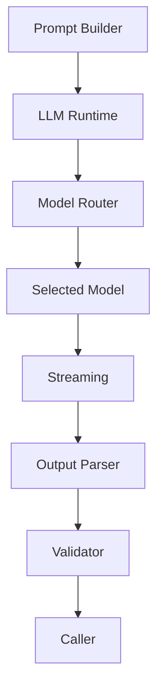
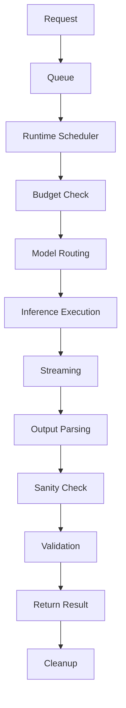

# LLM Runtime Blueprint

**Version:** v1.3  
**Status:** Draft  
**Last Updated:** 2026-07-14

**Depends On:** [Runtime Pipeline Blueprint](./Runtime_Pipeline_Blueprint.md), [Runtime Infrastructure Blueprint](./Runtime_Infrastructure_Blueprint.md), [Prompt Builder Blueprint](./Prompt_Builder_Blueprint.md), [Runtime Glossary](./Runtime_Glossary.md), [Runtime Artifact Ownership Matrix](./Runtime_Artifact_Ownership_Matrix.md)

---

## 1. Purpose（文档目的）

Define the responsibilities, boundaries, runtime lifecycle, resource governance, and inference infrastructure of the LLM Runtime.

定义 LLM Runtime 的职责、边界、运行时生命周期、资源治理和推理基础设施。

### Core Definition（核心定义）

The LLM Runtime is the **Model Abstraction & Inference Infrastructure** of the AI Narrative RPG Engine.

LLM Runtime 是 AI Narrative RPG Engine 的模型抽象与推理基础设施。

It provides a stable execution layer between the deterministic Engine and external AI models.

它在确定性引擎与外部 AI 模型之间提供稳定的执行层。

The Runtime hides provider-specific implementations while exposing a unified inference interface.

Runtime 隐藏不同提供商的具体实现，对外暴露统一的推理接口。

It enables the Engine to remain model-agnostic, resource-aware, and production-ready.

它使引擎保持模型无关、资源感知和生产就绪。

### Core Philosophy（核心理念）

Inference is computation.

Inference is not game logic.

Inference produces outputs.

It never modifies Runtime State.

State changes are always performed by higher-level Engine modules.

推理是计算，不是游戏逻辑。推理只产生输出，永远不修改运行时状态。

---

## 2. Responsibilities（职责）

### Responsible For（负责）

- Model Abstraction
- Model Routing
- Inference Execution
- Session Management
- Context Window Management
- Token Budget Management
- Streaming Output
- Output Parsing
- Output Validation
- Retry Management
- Fallback Routing
- Cost Monitoring
- Runtime Metrics
- Resource Scheduling

### Not Responsible For（不负责）

- Prompt Construction
- Narrative Planning
- Relationship Calculation
- Memory Retrieval
- State Modification
- Database Updates
- Business Logic
- Image Generation

The Runtime executes inference. It never decides gameplay.

---

## 3. Document Governance（文档治理）

**Owner:** AI Runtime Architect

**Architecture Reviewers:**

- Runtime Architect
- Prompt Architect
- Infrastructure Architect

**Architecture Approval:** Architecture Review Required

**Last Reviewed:** 2026-07-14

**Parent Blueprint:** [Runtime Pipeline Blueprint](./Runtime_Pipeline_Blueprint.md)

**Update Policy:** Changes affecting runtime interfaces, model abstraction, retry strategy, resource scheduling, or session lifecycle require ADR approval.

---

## 4. Design Principles（设计原则）

| Principle | Description |
|-----------|-------------|
| Model Agnostic | 引擎永不依赖特定 LLM 提供商。The Engine must never depend on a specific LLM provider. |
| Inference Is Side-Effect Free | 推理返回数据，永不修改运行时状态。Inference returns data, never modifies Runtime State. |
| Resource Awareness | 运行时持续监控资源。Runtime must continuously monitor resources. |
| Stream First | 流式输出为默认模式。Streaming should be the default generation mode. |
| Structured Output | 尽可能要求结构化输出。Whenever possible, require structured outputs. |
| Graceful Degradation | 单一模型失败永不停止运行时。Failure of one model must never stop the Runtime. |

---

## 5. Boundary Definition（边界定义）

### Owns（拥有）

- Model Adapters
- Model Sessions
- Runtime State（Runtime 内部状态）
- Streaming
- Token Budget
- Context Window
- Retry Logic
- Output Parsing
- Output Validation
- Runtime Metrics

### Does NOT Own（不拥有）

- Prompt Data
- Narrative Meaning
- World State
- Character State
- Relationship State
- Memory State
- Business Rules

The Runtime is execution infrastructure. It is not a decision-making system.

---

## 6. Runtime Position（运行时定位）

The Runtime is the execution layer between Prompt Builder and AI models.

It converts prompts into validated outputs while remaining independent from gameplay logic.

Every inference request passes through exactly one Runtime instance.

The Runtime never bypasses Prompt Builder.

The Runtime never writes directly to Engine State.

---

## 7. Model Abstraction Layer（模型抽象层）

The LLM Runtime exposes a unified Model Interface for all supported providers.

The Engine communicates only with this interface.

Individual model implementations are hidden behind adapters.

### Standard Request（标准请求）

Every inference request contains:

| Field | Description |
|-------|-------------|
| Prompt | 提示词内容 |
| System Prompt | 系统提示 |
| Generation Parameters | 生成参数 |
| Context Window | 上下文窗口 |
| Output Schema | 输出模式（可选） |
| Tools | 工具定义（可选） |

Generation Parameters may include:

- Temperature
- Top P
- Max Tokens
- Stop Sequences
- Seed (Optional)

### Standard Response（标准响应）

Every model returns a normalized response.

| Field | Description |
|-------|-------------|
| Stream Chunks | 流式分片 |
| Final Content | 最终内容 |
| Finish Reason | 完成原因 |
| Token Usage | Token 用量 |
| Latency Metrics | 延迟指标 |
| Error Information | 错误信息（如有） |

### Model Capability Discovery（模型能力发现）

Each adapter exposes its capabilities.

| Capability | Description |
|------------|-------------|
| Supports Streaming | 支持流式输出 |
| Supports JSON Mode | 支持 JSON 模式 |
| Supports Function Calling | 支持函数调用 |
| Supports Vision | 支持视觉输入 |
| Supports Reasoning | 支持推理 |
| Supports Tool Calling | 支持工具调用 |

The Engine queries capabilities instead of checking model names.

Business logic must never depend on provider-specific behavior.

### Adapter Implementations（适配器实现）

Possible adapters include:

- OpenAI Adapter
- Anthropic Adapter
- DeepSeek Adapter
- GLM Adapter
- Gemini Adapter
- Ollama Adapter
- Local Runtime Adapter

New providers should only require new adapters. Existing Runtime logic remains unchanged.

---

## 8. Request Lifecycle（请求生命周期）

Every inference request follows the same lifecycle.

### Queue（队列）

Incoming requests enter the Runtime Queue.

Requests are ordered according to priority.

### Runtime Scheduler（运行时调度器）

The Scheduler controls:

| Function | Description |
|----------|-------------|
| Queue Management | 队列管理 |
| Request Priority | 请求优先级 |
| Concurrency | 并发控制 |
| Cancellation | 取消 |
| Timeout | 超时 |
| Resource Reservation | 资源预留 |

The Scheduler prevents resource starvation.

### Budget Check（预算检查）

Before inference starts, Runtime verifies:

- Available Context Window
- Available Token Budget
- Available VRAM
- Active Sessions

If resources are insufficient:

- Reduce generation size
- Delay execution
- Switch model
- Reject gracefully

### Model Routing（模型路由）

The Router selects the most appropriate model according to:

- Required Capability
- Hardware Availability
- User Configuration
- Runtime Load
- Cost Policy

### Cleanup（清理）

After completion:

- Release session resources
- Update runtime statistics
- Record metrics
- Return scheduler capacity

---

## 9. Resource Management（资源管理）

The Runtime continuously manages finite resources.

### Token Budget（Token 预算）

The Runtime enforces:

- Maximum Prompt Tokens
- Maximum Completion Tokens
- Reserved Safety Buffer

Prompt Builder provides estimates. Runtime performs final enforcement.

### Context Window（上下文窗口）

If context exceeds limits, priority is preserved. Low-priority context is removed first.

Possible strategies include:

| Strategy | Description |
|----------|-------------|
| Sliding Window | 滑动窗口 |
| Hierarchical Compression | 分层压缩 |
| Memory Re-query | 记忆重新查询 |

### Session Management（会话管理）

Each inference belongs to a Runtime Session.

| Field | Description |
|-------|-------------|
| Conversation Context | 对话上下文 |
| Runtime Metadata | 运行时元数据 |
| Generation Parameters | 生成参数 |
| Usage Statistics | 使用统计 |

Sessions remain isolated.

### Concurrency（并发控制）

Runtime limits concurrent requests according to:

- GPU Memory
- CPU Load
- Active Models

Additional requests remain queued.

---

## 10. Stream Processing（流处理）

Streaming is the default output mode.

The Runtime processes tokens incrementally.

Responsibilities include:

| Function | Description |
|----------|-------------|
| Chunk Assembly | 分片组装 |
| UTF-8 Validation | UTF-8 验证 |
| Markdown Parsing | Markdown 解析 |
| XML Parsing | XML 解析 |
| JSON Assembly | JSON 组装 |
| Event Dispatch | 事件分发 |

Streaming allows:

- Progressive UI Rendering
- Typing Animation
- Voice Synchronization
- Early Cancellation

---

## 11. Output Validation（输出验证）

LLM output is never trusted directly.

Every response passes through multiple validation stages.

### Parser（解析器）

The Parser reconstructs structured output.

Supported formats include:

- JSON
- XML
- Markdown
- Tagged Text

### Sanity Check（健全性检查）

The Runtime performs lightweight health checks.

| Check | Description |
|-------|-------------|
| Empty Response | 空响应 |
| Infinite Repetition | 无限重复 |
| Broken JSON | 损坏的 JSON |
| Broken XML | 损坏的 XML |
| Truncated Output | 截断输出 |
| Invalid UTF-8 | 无效 UTF-8 |
| Prompt Leakage Indicators | Prompt 泄漏指标 |

Responses failing sanity checks enter Retry logic.

### Schema Validation（模式验证）

When Output Schema is defined, responses must satisfy:

- Required Fields
- Data Types
- Structural Constraints

Invalid outputs are rejected.

### Constraint Validation（约束验证）

Runtime verifies:

- Maximum Length
- Stop Conditions
- Output Format
- Safety Constraints

Validation never changes output. It only accepts or rejects it.

---

## 12. Retry & Fallback Strategy（重试与降级策略）

Failures are expected.

The Runtime must recover automatically whenever possible.

### Retry Conditions（重试条件）

Retry may occur when:

| Condition | Description |
|-----------|-------------|
| Network Timeout | 网络超时 |
| API Failure | API 失败 |
| Rate Limit | 速率限制 |
| Empty Response | 空响应 |
| Validation Failure | 验证失败 |
| Streaming Interrupted | 流式中断 |

### Retry Policy（重试策略）

Retries use exponential backoff.

Maximum retry count is configurable.

### Fallback Strategy（降级策略）

If retries fail, the Runtime may:

- Switch to Backup Model
- Reduce Context Size
- Reduce Completion Length
- Disable Optional Features

Gameplay should continue whenever possible.

### Failure Isolation（故障隔离）

Failure of one adapter must never interrupt:

- Other Sessions
- Other Models
- Other Runtime Components

Every inference request remains isolated.

---

## 13. Runtime Observability（运行时可观测性）

The Runtime continuously records operational metrics.

### Key Metrics（关键指标）

| Metric | Description |
|--------|-------------|
| TTFT | Time To First Token（首 Token 延迟） |
| Tokens Per Second | 每秒 Token 数 |
| Prompt Tokens | 输入 Token 数 |
| Completion Tokens | 输出 Token 数 |
| Total Latency | 总延迟 |
| Queue Waiting Time | 队列等待时间 |
| Retry Count | 重试次数 |
| Fallback Count | 降级次数 |
| Validation Failures | 验证失败次数 |
| Error Rate | 错误率 |

These metrics support:

- Performance Optimization
- Capacity Planning
- Cost Analysis
- Runtime Debugging

Observability must never modify Runtime behavior.

---

## 14. Hardware Considerations（硬件考量）

The Runtime is designed to operate across multiple deployment environments.

### Reference Platform（参考平台）

| Spec | Value |
|------|-------|
| GPU | NVIDIA RTX 5060 8GB |
| CPU | Consumer Desktop CPU |
| OS | Windows / Linux |

The architecture remains hardware-agnostic.

### Resource Awareness（资源感知）

The Runtime continuously monitors:

- Available VRAM
- System Memory
- CPU Utilization
- Active Sessions
- Queue Length

### Local Model Optimization（本地模型优化）

For local inference, the Runtime may support:

- 4-bit Quantization
- 8-bit Quantization
- CPU Offloading
- KV Cache Reuse
- Prompt Cache
- Streaming Generation

These optimizations are implementation-specific. The Blueprint defines behavior rather than implementation.

### Cloud Model Optimization（云端模型优化）

When using cloud providers:

- Streaming should be enabled whenever available.
- Prompt caching should be utilized if supported.
- Token usage should be monitored continuously.
- Cost budgets may influence routing decisions.

### Performance Goals（性能目标）

The Runtime should minimize:

- Time To First Token (TTFT)
- Total Response Latency
- VRAM Fragmentation
- Idle GPU Time

Runtime scheduling should maximize overall responsiveness rather than raw throughput.

---

## 15. Runtime Guarantees（运行时保证）

The LLM Runtime guarantees:

### Interface Stability（接口稳定性）

The public Runtime Interface remains stable across compatible versions.

Model-specific differences are hidden behind adapters.

### Side-Effect Free Inference（无副作用推理）

Inference never modifies:

- World State
- Character State
- Relationship State
- Memory State
- Persistent Storage

The Runtime returns results only. State updates are performed by higher-level Engine components.

### Resource Safety（资源安全）

Runtime never intentionally exceeds configured limits.

Examples include:

- Context Window
- Token Budget
- VRAM Budget
- Concurrent Session Limit

Graceful degradation is preferred over runtime failure.

### Deterministic Runtime Behavior（确定性运行时行为）

Given identical Runtime Configuration, Prompt, Generation Parameters, and Selected Model, the Runtime always follows the same execution pipeline.

Model output itself may remain probabilistic unless deterministic generation is requested.

### Error Isolation（错误隔离）

Failure of one model, one adapter, one session, or one request must never interrupt unrelated Runtime activities.

### Observability（可观测性）

Every inference request should produce runtime telemetry.

Observability must never affect inference results.

---

## 16. Future Extensibility（未来扩展）

The Runtime is designed for long-term evolution.

### Tool Calling（工具调用）

Native execution of structured tools.

Examples: Database Query, Calendar, Memory Lookup, World Query.

### Function Calling（函数调用）

Support standardized structured function interfaces compatible with OpenAI, Anthropic, GLM, DeepSeek, and future providers.

### Multi-Agent Runtime（多智能体运行时）

Support independent Runtime Workers.

Example: Dialogue Agent, Narration Agent, Planning Agent, Memory Agent.

Each agent maintains independent Runtime Sessions.

### Speculative Decoding（推测解码）

Support cooperative generation using a Small Draft Model and Large Verification Model to reduce latency.

### Distributed Inference（分布式推理）

Support execution across Multiple GPUs, Multiple Processes, and Remote Inference Servers without changing Engine architecture.

### Adaptive Routing（自适应路由）

Future Runtime versions may automatically choose models based on Task Complexity, Cost Budget, Hardware Availability, User Preferences, and Historical Performance.

---

## References

**Depends On:**

- [Runtime Pipeline Blueprint](./Runtime_Pipeline_Blueprint.md) — defines Pipeline (LLM is post-Pipeline generation)
- [Runtime Infrastructure Blueprint](./Runtime_Infrastructure_Blueprint.md) — defines platform services
- [Prompt Builder Blueprint](./Prompt_Builder_Blueprint.md) — provides Prompt Package input
- [Runtime Glossary](./Runtime_Glossary.md) — defines terminology
- [Runtime Artifact Ownership Matrix](./Runtime_Artifact_Ownership_Matrix.md) — defines artifact ownership (LLM Output = Provisional)
- Overall Architecture Blueprint
- Runtime Architecture Blueprint
- Narrative Director Blueprint

**Referenced By:**

- Image Pipeline Blueprint
- Dialogue Runtime Specification
- AI Service Layer
- Agent Runtime (Future)

---

## Revision History

| Version | Date | Description |
|----------|------------|--------------------------------------------------------------|
| v1.3 | 2026-07-14 | **Phase B-2 sync update:** Added Pipeline Blueprint, Infrastructure, Glossary, Artifact Ownership Matrix to Depends On. Updated Governance fields. LLM Runtime is post-Pipeline generation — produces expression, not facts. |
| v1.2 | 2026-07-13 | Documentation enhancement: bilingual headings, Mermaid flowcharts, tables, consistent terminology |
| v1.1 | 2026-07-13 | Added Runtime Scheduler, Capability Discovery, Side-Effect Free Inference, Sanity Check, Runtime Observability, unified Model Interface, enhanced resource management and validation pipeline |
| v1.0 | 2026-07-13 | Initial Engineering Blueprint |
