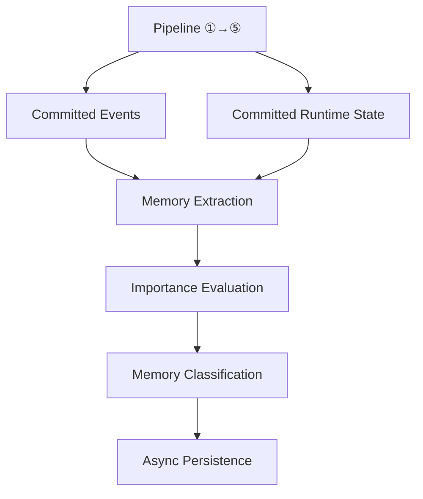
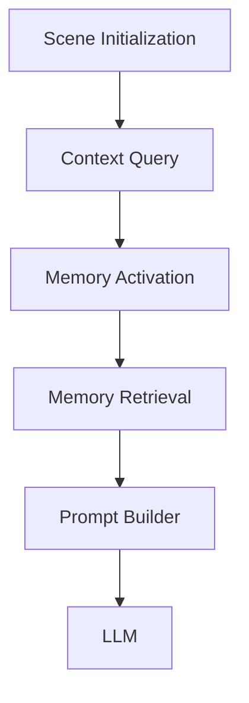

# Memory Architecture Blueprint

**Version:** v1.5  
**Status:** Draft  
**Last Updated:** 2026-07-14

**Depends On:** [Runtime Pipeline Blueprint](./Runtime_Pipeline_Blueprint.md), [Runtime Infrastructure Blueprint](./Runtime_Infrastructure_Blueprint.md), [Simulation Layer Blueprint](./Simulation_Layer_Blueprint.md), [Runtime State Model Blueprint](./Runtime_State_Model_Blueprint.md), [Scene Engine Blueprint](./Scene_Engine_Blueprint.md), [Runtime Glossary](./Runtime_Glossary.md), [Runtime Artifact Ownership Matrix](./Runtime_Artifact_Ownership_Matrix.md)

---

## 1. Purpose（文档目的）

Define the responsibilities, boundaries, runtime behavior, and architecture of the Memory System.

定义 Memory System 的职责、边界、运行时行为和架构。

### Core Definition（核心定义）

The Memory System is the **Long-term Experience Persistence Layer** of the AI Narrative RPG Engine.

Memory System 是 AI Narrative RPG Engine 的长期体验持久化层。

It transforms completed Scenes into structured, evolving memories that influence future simulation, relationship evolution, and narrative generation.

它将已完成的 Scene 转化为结构化、持续演化的记忆，从而影响未来的模拟、关系演化和叙事生成。

Memory is one of the core runtime domains of the Engine. It provides persistent cognitive continuity across scenes, gameplay sessions, and long-term character development.

### Core Philosophy（核心理念）

Memory is **not conversation history**.

Memory is structured experience with quality attributes that simulate human cognitive processes.

| Process | Description |
|---------|-------------|
| Encoding | 编码 |
| Retrieval | 检索 |
| Reinforcement | 强化 |
| Decay | 衰减 |
| Activation | 激活 |
| Distortion | 扭曲 |

The Engine remembers experiences rather than conversations.

引擎记住的是经历，而不是对话记录。

---

## 2. Responsibilities（职责）

### Responsible For（负责）

- Memory Extraction
- Memory Classification
- Importance Evaluation
- Memory Quality Modeling
- Memory Persistence
- Memory Retrieval
- Memory Consolidation
- Memory Activation
- Memory Lifecycle Management
- Memory Ownership Management
- Memory Visibility Control

#### Memory Ownership（记忆归属）

Every Memory belongs to one or more runtime entities.

| Owner | Description |
|-------|-------------|
| Character | 角色 |
| NPC | NPC |
| Player | 玩家 |
| Organization | 组织 |
| World | 世界 |

Ownership determines:

- who can retrieve the memory
- who may update memory quality
- who may reference the memory during Runtime

#### Memory Visibility（记忆可见性）

| Level | Description |
|-------|-------------|
| Private | 私有 |
| Shared | 共享 |
| Public | 公开 |
| World-level | 世界级 |

Visibility determines retrieval scope rather than storage location.

### Not Responsible For（不负责）

The Memory System does **NOT** perform:

- Relationship Calculation
- World Simulation
- Narrative Planning
- Prompt Construction
- Dialogue Generation
- Image Generation
- Raw Chat Log Storage

Raw conversation history belongs to Persistence Layer rather than Memory System.

---

## 3. Document Governance（文档治理）

**Owner:** Memory Architect

**Architecture Reviewers:**

- Runtime Architect
- Simulation Architect
- AI Runtime Architect

**Architecture Approval:** Architecture Review Required

**Last Reviewed:** 2026-07-14

**Parent Blueprint:** [Runtime Pipeline Blueprint](./Runtime_Pipeline_Blueprint.md)

**Update Policy:** The following changes require ADR approval:

- Memory lifecycle changes
- Retrieval mechanism changes
- Memory quality model changes
- Persistence strategy changes
- Ownership model changes
- Visibility model changes

Implementation tuning does not require ADR.

---

## 4. Design Principles（设计原则）

| Principle | Description |
|-----------|-------------|
| Experience Before Conversation | 引擎记住经历，而非对话记录。The Engine remembers experiences rather than dialogue transcripts. |
| Selective Persistence | 并非每个 Scene 都成为 Memory。Not every Scene becomes a Memory. Only meaningful experiences above the persistence threshold are stored. |
| Structured Memory | Memory 是运行时数据，不是自由文本。Memory is runtime data, not free-form text. |
| Retrieval Before Generation | 相关记忆必须在 Prompt Builder 构建之前检索。Relevant memories must be retrieved before Prompt Builder constructs prompts. |
| Memory Evolves | 记忆随时间变化。Memory changes over time through reinforcement, decay, activation, consolidation, and distortion. |
| Quality-aware Retrieval | 检索依赖记忆质量，而非仅依赖语义相似度。Retrieval depends on Memory Quality rather than semantic similarity alone. |
| Rule-driven Importance | 重要性评估必须是确定性的。Importance evaluation must be deterministic. LLM never decides whether a memory should exist. |
| Ownership First | 每个 Memory 都有明确的归属。Every Memory has an explicit Owner. |
| Runtime Independence | Memory 独立于任何特定 LLM。Memory exists independently from any specific LLM. |

---

## 5. Boundary Definition（边界定义）

### Owns（拥有）

- Memory Objects
- Memory Index
- Memory Metadata
- Memory Quality Attributes
- Memory Retrieval Logic
- Memory Consolidation Logic
- Memory Activation Logic
- Ownership Metadata
- Visibility Metadata

### Does NOT Own（不拥有）

- Character State mutation (owned by State Authority ⑤)
- Relationship State mutation (owned by State Authority ⑤)
- World State mutation (owned by State Authority ⑤)
- Narrative Planning (owned by Narrative Director)
- Prompt Construction (owned by Prompt Builder)
- Simulation Rules (owned by Simulation Authority ③)
- Event Commit (owned by Timeline Manager ④)
- Raw Chat History

> **Memory SHALL NOT mutate Persistent State.** Memory extraction produces Memory Objects only. It reads committed Events and State as input; it never writes to Character State, Relationship State, World State, or any other Persistent State domain. See [Artifact Ownership Matrix](./Runtime_Artifact_Ownership_Matrix.md) and [Scene Engine Blueprint §12](./Scene_Engine_Blueprint.md).

The Memory System provides information. It never changes Runtime State directly.

---

## 6. Runtime Position（运行时定位）

The Memory System operates in two independent runtime phases. Both phases are **post-Pipeline** — they operate on committed Events and Runtime State, not on in-flight Simulation Results.

Memory System 运行在两个独立的运行时阶段。两个阶段都是**流水线后**——它们操作已提交的 Event 和 Runtime State，而非进行中的 SimulationResult。

### Write Pipeline（写入流水线）

> **Trigger:** Memory extraction is triggered by committed Events from the Pipeline (Layer ④ Reality), not by Scene completion alone. This ensures Memory sees the final, committed state — never uncommitted or rolled-back results.

### Read Pipeline（读取流水线）

Memory writing and memory retrieval are completely decoupled.

Memory persistence must never block Scene completion.

Memory retrieval must complete before Prompt Builder begins prompt assembly.

The Memory System serves as the cognitive bridge between past experiences and future behavior.

---

## 7. Memory Lifecycle（记忆生命周期）

Every Memory follows a strict lifecycle:

| Step | Phase | Description |
|------|-------|-------------|
| 1 | Experience | A Scene completes and produces structured runtime results. |
| 2 | Evaluation | The Importance Score is calculated using deterministic rules. |
| 3 | Extraction | Structured Memory Objects are generated from Scene Results. |
| 4 | Classification | Memories are categorized (Episodic, Relationship, World, Personal, etc.). |
| 5 | Persistence | Memory Objects are written asynchronously into long-term storage. |
| 6 | Activation | Runtime triggers dynamically increase or decrease recall probability. |
| 7 | Retrieval | Relevant memories are recalled during future Scene execution. |
| 8 | Consolidation | Similar memories may be merged into higher-level abstractions. |
| 9 | Decay | Memory Quality attributes gradually evolve over time. |
| 10 | Archive | Inactive memories move into cold storage or subconscious layers. |

---

## 8. Memory Types（记忆类型）

The Memory System supports multiple memory domains.

| Type | Description | Examples |
|------|-------------|----------|
| Episodic Memory | 具体经历 | First Meeting, First Kiss, Battle at Dawn, Festival Night |
| Relationship Memory | 直接影响人际关系的事件 | Saved My Life, Betrayed Trust, Shared Secret, Confession |
| World Memory | 游戏世界中的重要变化 | Kingdom Fell, War Began, City Destroyed, New Era Started |
| Personal Memory | 角色特定经历 | Childhood Trauma, Learned Swordsmanship, Overcame Fear, Lost Family |
| Shared Memory | 多角色同时拥有的记忆 | Vacation, Graduation, Wedding, Team Victory |

---

## 9. Importance Evaluation（重要性评估）

Not every Scene becomes a Memory.

The Memory System evaluates every completed Scene using deterministic rules.

### Evaluation Factors（评估因素）

| Factor | Description |
|--------|-------------|
| Emotional Impact | 情感影响 |
| Relationship Change | 关系变化 |
| Narrative Importance | 叙事重要性 |
| Character Growth | 角色成长 |
| World Impact | 世界影响 |
| Player Choice Significance | 玩家选择重要性 |
| Future Narrative Potential | 未来叙事潜力 |

Only memories exceeding the persistence threshold become long-term memories.

Importance Evaluation is entirely rule-driven. LLMs never decide what should be remembered.

---

## 10. Memory Retrieval（记忆检索）

Memory Retrieval is Context-Aware Recall.

The system searches for memories using multiple runtime signals.

### Retrieval Inputs（检索输入）

| Input | Description |
|-------|-------------|
| Current Scene Context | 当前场景上下文 |
| Character State | 角色状态 |
| Relationship State | 关系状态 |
| Narrative Goal | 叙事目标 |
| Emotional Context | 情感上下文 |
| Active Quest | 当前任务 |
| Character Personality | 角色性格 |
| Timeline Position | 时间线位置 |

Retrieval produces an ordered candidate list instead of a single result.

### Ranking Factors（排序因素）

| Factor | Description |
|--------|-------------|
| Semantic Relevance | 语义相关性 |
| Memory Quality | 记忆质量 |
| Runtime State | 运行时状态 |
| Narrative Needs | 叙事需求 |
| Recency | 近期性 |

The exact scoring algorithm is implementation-defined and intentionally left open for future optimization.

---

## 11. Memory Quality Model（记忆质量模型）— Key Feature

Every Memory contains quality attributes that evolve over time.

These attributes simulate human cognition rather than database storage.

### Quality Attributes（质量属性）

| Attribute | Description |
|-----------|-------------|
| Strength | 记忆编码强度。Higher Strength makes memories resistant to forgetting. |
| Accuracy | 记忆准确度。Represents how faithfully the stored memory reflects the original event. |
| Emotional Weight | 情感权重。High Emotional Weight increases retrieval priority. |
| Accessibility | 可访问性。Represents how easily a memory can be recalled. Naturally decreases over time. Repeated retrieval increases Accessibility. |
| Recency | 近期性。Recent memories receive temporary retrieval priority. |

### Behavioral Effects（行为效应）

#### Forgetting（遗忘）

When Accessibility becomes extremely low, memories move into subconscious storage instead of immediate retrieval.

#### Flashbulb Memory（闪光灯记忆）

Highly emotional memories resist decay.

Examples: Death, Trauma, Marriage, First Love.

#### Distortion（扭曲）

A memory may have High Strength but Low Accuracy — the character strongly believes something that is objectively incorrect.

This enables future mechanics such as:

- Unreliable narration
- Lies
- Manipulation
- Memory alteration
- Dream sequences

#### Reinforcement（强化）

Whenever a memory is recalled or reinforced by new experiences:

- Strength increases
- Accessibility increases
- Emotional Weight may increase or decrease

Memory quality continuously evolves throughout gameplay.

---

## 12. Memory Consolidation（记忆巩固）

To prevent unlimited memory growth, the system continuously consolidates memories.

Consolidation simulates long-term human learning.

### Process（流程）

**Example:**

Five individual memories: "He helped me."

↓

One abstract memory: "He is reliable."

Detailed events become generalized knowledge.

Consolidation preserves meaning while reducing storage complexity.

---

## 13. Memory Activation（记忆激活）— Key Feature

Memory Activation determines which memories become active during runtime reasoning.

Unlike traditional retrieval systems, Activation simulates subconscious recall.

Activation does not retrieve memories directly. Instead, it adjusts their probability of participating in runtime reasoning.

### Activation Triggers（激活触发器）

| Trigger | Description | Example |
|---------|-------------|---------|
| Current Scene | 场景中的物体、地点或氛围激活相关记忆 | Fireworks → First Date |
| Emotional Context | 当前情绪偏向特定回忆 | Fear → Past Trauma |
| Relationship State | 关系变化激活相关人际记忆 | High Trust → Shared Secret |
| Narrative Goal | 叙事目标使某些记忆更相关 | Reconciliation → Previous Conflict |
| Player Action | 玩家选择唤醒遗忘的经历 | Giving Flowers → Past Romance |
| Environmental Trigger | 视觉、音频或环境线索提高激活概率 | Rain, Music, Smell, Childhood Home, Festival |

### Runtime Behavior（运行时行为）

Activation modifies retrieval priority.

It does not change historical facts.

It does not create new memories.

It only determines which existing memories are most likely to influence current reasoning.

This allows the Runtime to simulate natural, context-sensitive recall rather than deterministic database queries.

---

## 14. Memory Influence（记忆影响）

Retrieved memories serve as structured inputs to other runtime systems.

| Consumer | How Memory Is Used |
|----------|-------------------|
| Relationship Engine | Updates Trust, Affection, Respect, and other dimensions based on recalled experiences. |
| Narrative Director | Uses recalled memories to influence pacing, emotional tone, callbacks, and scene selection. |
| Prompt Builder | Injects only the highest-priority memories into prompt context. |
| Simulation Layer | May reference historical memories when evaluating certain rules or event triggers. |

**Rule:** Memory never changes historical facts. It only influences future reasoning, simulation, and presentation.

---

## 15. Runtime Guarantees（运行时保证）

The Memory System guarantees:

| Guarantee | Description |
|-----------|-------------|
| Immutability | Historical memory content cannot be modified after persistence. Only quality attributes and accessibility may evolve. |
| Asynchronous Persistence | Memory writing must never block Scene completion. Persistence failures may be retried asynchronously. |
| Deterministic Extraction | Identical Scene Results always produce identical Memory Objects. |
| Deterministic Retrieval | Given the same runtime context and activation state, retrieval order is reproducible. |
| Isolation | Memory failures must not interrupt Runtime execution. |
| Data Integrity | Corrupted memory records must not crash the engine. Invalid memories may be skipped or quarantined. |

---

## 16. Architecture & Hardware（架构与硬件）

### Architecture（架构）

The Memory System is implementation-agnostic.

| Technology | Purpose |
|------------|---------|
| Vector Index | Semantic retrieval |
| Structured Storage | Memory metadata, quality attributes, runtime indexes |
| Graph Index (Optional) | Relationship between memories, story event graph, character memory graph |

Implementations may choose SQLite, DuckDB, PostgreSQL, Neo4j, or other equivalent technologies without changing this Blueprint.

### Hardware Considerations（硬件考量）

**Target Hardware:** RTX 5060 8GB (Reference Platform)

| Design Goal | Description |
|-------------|-------------|
| CPU-oriented indexing | CPU 导向的索引与检索 |
| Low-latency activation | 低延迟激活 |
| Background persistence | 后台持久化 |
| Scalable memory storage | 可扩展存储 |
| Minimal runtime overhead | 最小运行时开销 |

**Target Retrieval Latency:** Memory Activation + Retrieval < 200ms under normal gameplay conditions.

---

## 17. Future Extensibility（未来扩展）

The architecture is designed for future expansion.

| Module | Description |
|--------|-------------|
| Semantic Memory | Stores abstract knowledge instead of experiences. Example: "The capital of the kingdom is Aster." |
| Procedural Memory | Stores learned skills and habits. Example: "Knows how to play piano." |
| False Memory | Supports narrative devices such as brainwashing, hallucination, dream sequences, memory implantation. |
| Dream Processing | Allows memories to consolidate during sleep or downtime. May strengthen, weaken, merge, or distort memories without modifying historical facts. |
| Memory Graph | Represents relationships between memories. Supports causal reasoning, emotional chains, thematic clustering, and long-term story analysis. |

---

## References

**Depends On:**

- [Runtime Pipeline Blueprint](./Runtime_Pipeline_Blueprint.md) — defines Pipeline structure
- [Runtime Infrastructure Blueprint](./Runtime_Infrastructure_Blueprint.md) — defines storage platform
- [Simulation Layer Blueprint](./Simulation_Layer_Blueprint.md) — defines SimulationResult (source of extraction)
- [Runtime State Model Blueprint](./Runtime_State_Model_Blueprint.md) — defines committed state (source of extraction)
- [Scene Engine Blueprint](./Scene_Engine_Blueprint.md) — defines transaction context
- [Runtime Glossary](./Runtime_Glossary.md) — defines terminology
- [Runtime Artifact Ownership Matrix](./Runtime_Artifact_Ownership_Matrix.md) — defines artifact ownership (Memory Object = Provisional)
- Overall Architecture Blueprint
- Runtime Architecture Blueprint

**Referenced By:**

- [Narrative Director Blueprint](./Narrative_Director_Blueprint.md) — consumes retrieved memories
- [Relationship Engine Blueprint](./Relationship_Engine_Blueprint.md) — uses memories for relationship evolution
- [Prompt Builder Blueprint](./Prompt_Builder_Blueprint.md) — injects memories into prompt context
- [Simulation Layer Blueprint](./Simulation_Layer_Blueprint.md) — may reference historical memories
- Memory Schema (Future)
- LLM Runtime Blueprint (Future)

---

## Revision History

| Version | Date | Description |
|----------|------------|------------------------------------------------------------|
| v1.5 | 2026-07-14 | **Phase B-2 sync update:** (1) Pipeline alignment — added Pipeline Blueprint reference, updated §6 Write Pipeline to show committed Events as trigger (not just Scene Complete). (2) State mutation boundary — added "Persistent State mutation" to Does NOT Own with ownership attribution. Added Memory SHALL NOT mutate Persistent State constraint. (3) Artifact ownership — added Ownership Matrix reference, Memory Object marked as Provisional. (4) Cross references — added Pipeline, Infrastructure, State Model, Glossary, Artifact Ownership Matrix to Depends On; expanded Referenced By with links. (5) Governance fields updated. |
| v1.4 | 2026-07-13 | Documentation enhancement: bilingual headings, Mermaid flowcharts, tables, consistent terminology |
| v1.3 | 2026-07-13 | Added Memory Activation, refined Accuracy definition, clarified asynchronous persistence, storage-agnostic architecture, deterministic retrieval guarantees |
| v1.2 | 2026-07-13 | Added Memory Activation, refined Accuracy definition, clarified asynchronous persistence, storage-agnostic architecture, deterministic retrieval guarantees |
| v1.1 | 2026-07-13 | Added Memory Quality Model (Strength, Accessibility, Emotional Weight, etc.) |
| v1.0 | 2026-07-13 | Initial Engineering Blueprint |
