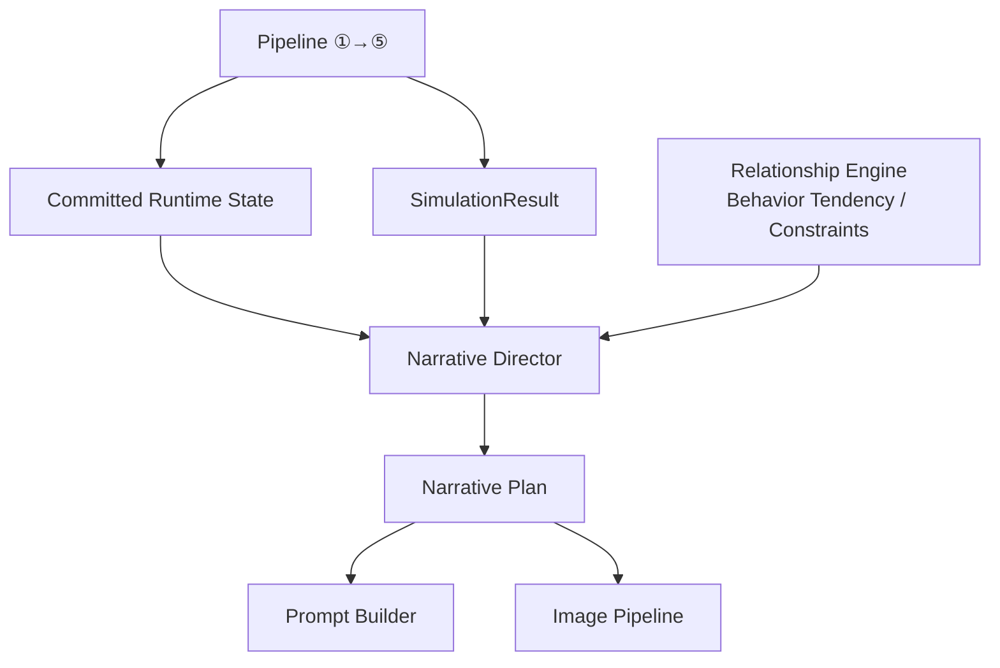

# Narrative Director Blueprint

**Version:** v2.4  
**Status:** Draft  
**Last Updated:** 2026-07-14

**Depends On:** [Runtime Pipeline Blueprint](./Runtime_Pipeline_Blueprint.md), [Simulation Layer Blueprint](./Simulation_Layer_Blueprint.md), [Runtime State Model Blueprint](./Runtime_State_Model_Blueprint.md), [Scene Engine Blueprint](./Scene_Engine_Blueprint.md), [Relationship Engine Blueprint](./Relationship_Engine_Blueprint.md), [Runtime Glossary](./Runtime_Glossary.md), [Runtime Artifact Ownership Matrix](./Runtime_Artifact_Ownership_Matrix.md)

---

## 1. Purpose（文档目的）

Define the responsibilities, boundaries, runtime behavior, and decision-making process of the Narrative Director.

定义 Narrative Director 的职责、边界、运行时行为和决策流程。

### Core Definition（核心定义）

The Narrative Director is the **story orchestration layer** of the AI Narrative RPG Engine.

Narrative Director 是 AI Narrative RPG Engine 的故事编排层。

It transforms simulation results into coherent, emotionally engaging narrative experiences.

它将模拟结果转化为连贯的、有情感感染力的叙事体验。

It is **not** responsible for changing world state.

它不负责改变世界状态。

### Core Philosophy（核心理念）

Narrative never changes reality.

Simulation determines what happened.

Narrative determines how the player experiences what happened.

叙事不改变事实。模拟决定发生了什么，叙事决定玩家如何体验发生的事情。

---

## 2. Responsibilities（职责）

### Responsible For（负责）

- Story Planning
- Narrative Goal Selection
- Scene Pacing
- Emotional Rhythm
- Event Prioritization
- Dialogue Intent Planning
- CG Trigger Decision
- Narrative Continuity
- Experience Quality

### Not Responsible For（不负责）

- World Simulation
- Relationship Calculation
- Character State Update
- Memory Storage
- Prompt Rendering
- Dialogue Generation
- Image Generation

---

## 3. Document Governance（文档治理）

**Owner:** Narrative Architect

**Architecture Reviewers:**

- Runtime Architect
- Simulation Architect
- Product Architect

**Architecture Approval:** Architecture Review Required

**Last Reviewed:** 2026-07-14

**Parent Blueprint:** [Runtime Pipeline Blueprint](./Runtime_Pipeline_Blueprint.md)

**Update Policy:** Changes affecting narrative decision flow, planning logic, or module boundaries require ADR approval.

---

## 4. Design Principles（设计原则）

| Principle | Description |
|-----------|-------------|
| Story Follows State | 叙事永不改变现实。Narrative never changes reality. Simulation determines what happened; Narrative determines how the player experiences it. |
| Simulation Before Narrative | Narrative Director 总是消费 SimulationResult，永不修改模拟结果。Narrative Director always consumes SimulationResult. It never modifies Simulation Results or any Persistent State. |
| Emotion Before Information | 叙事应优化情感体验，而非最大化信息传递。Narrative should optimize emotional experience rather than maximize information delivery. |
| Relationship Driven | Relationship State 是叙事基调、节奏和场景选择的主要驱动。Relationship State is the primary driver of narrative tone, pacing, and scene selection. |
| Player Agency Matters | 玩家选择通过 Simulation 影响未来叙事。Player choices influence future narrative through Simulation. Narrative never invalidates meaningful player decisions. |
| One Story, Multiple Expressions | 同一 Simulation Result 可因不同因素而以不同方式表达。The same Simulation Result may be expressed differently depending on Character Personality, Relationship State, Narrative Goal, and Content Profile. |

---

## 5. Boundary Definition（边界定义）

Narrative Director is a Planning Layer.

### Owns（拥有）

- Story Planning
- Emotional Planning
- Scene Flow
- Narrative Goal
- Event Ordering

### Does NOT Own（不拥有）

- World Rules (owned by Simulation Authority)
- State Transition / Mutation (owned by State Authority ⑤)
- Relationship Calculation (owned by Relationship Engine subsystem)
- Event Commit (owned by Timeline Manager ④)
- Memory Extraction (owned by Memory System)
- Prompt Rendering (owned by Prompt Builder)
- LLM Output (owned by LLM Runtime)
- Image Generation (owned by Image Pipeline)

---

## 6. Runtime Position（运行时定位）

Narrative Director sits between deterministic simulation and probabilistic generation. It is a **post-Pipeline consumer** — it consumes committed Runtime State and SimulationResult, and produces Narrative Plans for generation.

Narrative Director 位于确定性模拟和概率性生成之间。它是**流水线后消费方**——消费已提交的 Runtime State 和 SimulationResult，产出 Narrative Plan 供生成使用。

> **Post-Pipeline:** Narrative Director does not participate in Authority decisions. It consumes committed facts (State, Events, SimulationResult) and produces expressions (Narrative Plans). Generation results are regenerable. See [Pipeline Blueprint](./Runtime_Pipeline_Blueprint.md).
>
> **流水线后：** Narrative Director 不参与权威决策。它消费已提交的事实（State、Event、SimulationResult）并产出表达（Narrative Plan）。生成结果是可重新生成的。

---

## 7. Runtime Inputs（运行时输入）

The Director consumes the following data:

| Input | Description |
|-------|-------------|
| Scene Context | 当前地点、参与者、环境 |
| Character State | 参与角色的健康、状态、物品 |
| Relationship State | 好感、信任、活跃冲突 |
| SimulationResult | 刚刚计算的 SimulationResult（含 deltas、event candidates、status） |
| Behavior Tendency | 来自 Relationship Engine 的行为倾向（Confidence: Provisional） |
| Player Intent | 从最近玩家行为推导的意图（如 "Aggressive", "Inquisitive"） |
| Player Experience Profile | 用户偏好（如偏好慢节奏恋爱、高战斗紧张感） |
| Quest State | 当前活跃目标、关键路径标志 |
| Simulation Events | 刚刚发生的事件列表（如 "Sword broke", "Entered combat"） |
| Timeline | 当前故事时代 |

---

## 8. Narrative Goal（叙事目标）

Every Scene has exactly one Primary Narrative Goal.

叙事目标只影响呈现方式，永远不改变 Simulation Result。

| Goal | Description |
|------|-------------|
| Build Trust | 建立信任 |
| Increase Suspense | 增加悬念 |
| Reveal Character | 揭示角色 |
| Resolve Conflict | 解决冲突 |
| Create Romance | 创造浪漫 |
| Deepen Relationship | 深化关系 |
| Deliver Reward | 给予奖励 |
| Prepare Future Plot | 铺垫未来剧情 |

---

## 9. Narrative Planning（叙事规划）

Narrative Planning determines:

| Decision | Description |
|----------|-------------|
| Event Ordering | 哪个事件先出现 |
| Emotion Emphasis | 哪些情感被强调 |
| Character Focus | 哪个角色获得焦点 |
| Memory Recall | 哪些记忆被回忆 |
| Dialogue Style | 使用什么对话风格 |

It never invents events that Simulation rejected.

---

## 10. Emotional Orchestration（情感编排）

Narrative Director controls emotional rhythm.

| Curve | Description |
|-------|-------------|
| Calm → Warm | 平静 → 温暖 |
| Warm → Romantic | 温暖 → 浪漫 |
| Suspense → Relief | 悬念 → 释然 |
| Conflict → Reconciliation | 冲突 → 和解 |
| Mystery → Revelation | 谜团 → 揭示 |
| Hope → Failure → Determination | 希望 → 失败 → 决心 |

Emotion is pacing. Emotion is not state.

---

## 11. Event Selection（事件选择）

Simulation may produce multiple candidate events.

| Candidate Event | Description |
|-----------------|-------------|
| Character notices player injury | 角色注意到玩家受伤 |
| Character remembers previous promise | 角色记起之前的承诺 |
| Phone rings | 电话响起 |
| Rain starts | 开始下雨 |
| Enemy approaches | 敌人靠近 |

Narrative Director chooses:

- which event occurs first
- which event is delayed
- which event is omitted
- which event becomes the narrative focus

It cannot create invalid events.

---

## 12. Relationship Influence（关系影响）

Relationship Engine provides structured Behavior Tendency.

Behavior Tendency（行为倾向）— Relationship Engine 产出的结构化运行时输出，描述角色当前最可能采取的行为倾向，而不是最终行为。

| Tendency | Description |
|----------|-------------|
| willingness_to_help | 帮助意愿 |
| openness | 开放度 |
| trust_level | 信任等级 |
| emotional_distance | 情感距离 |
| jealousy | 嫉妒 |
| dependency | 依赖 |

Narrative Director converts these tendencies into narrative decisions.

**High Trust → Friendly Tone → Longer Conversation → Private Scene**

**Low Trust → Short Answers → More Distance → Guarded Body Language**

---

## 13. Content Profile Adaptation（内容模式适配）

Different Content Profiles use the same Narrative Plan.

| Profile | Expression Style |
|---------|-----------------|
| General | Adventure-oriented expression |
| Romance | Relationship-oriented expression |
| Mature | Adult emotional expression |

Simulation State remains identical. Only presentation changes.

---

## 14. CG Planning（CG 规划）

Narrative Director determines whether a Scene deserves a CG.

### Evaluation Factors（评估因素）

| Factor | Description |
|--------|-------------|
| Emotional Peak | 情感峰值 |
| Story Importance | 故事重要性 |
| Relationship Milestone | 关系里程碑 |
| Visual Value | 视觉价值 |
| Gallery Progression | 图鉴进度 |

### Output（输出）

It outputs: **CG Requested** or **No CG**.

Image generation is performed later.

---

## 15. Failure Handling（失败处理）

If Prompt Builder fails, LLM fails, or Image generation fails:

- Narrative Director remains unchanged.
- Planning results can be reused.
- Planning must be deterministic.
- Generation may be retried.

---

## 16. Runtime Guarantees（运行时保证）

Narrative Director guarantees:

- Never modifies any Persistent State (State Authority ⑤ owns all mutations)
- Never modifies SimulationResult (immutable, see [Simulation Layer §8](./Simulation_Layer_Blueprint.md))
- Never bypasses Scene Engine
- Never bypasses Prompt Builder
- Produces deterministic Narrative Plans
- Supports replay using identical committed runtime state
- Generation retry reuses the same committed state — SHALL NOT re-run Simulation

---

## 17. Hardware Considerations（硬件考量）

Designed for CPU execution.

No GPU dependency.

Planning latency should remain negligible compared with LLM generation.

Image generation remains asynchronous.

---

## 18. Future Extensibility（未来扩展）

Future extensions include:

- Dynamic Story Arcs
- Multi-thread Narrative
- Parallel Character Goals
- Director Personalities
- AI Dungeon Master Mode
- Cooperative Multiplayer Narrative

---

## References

**Depends On:**

- [Runtime Pipeline Blueprint](./Runtime_Pipeline_Blueprint.md) — defines Pipeline structure and post-Pipeline positioning
- [Simulation Layer Blueprint](./Simulation_Layer_Blueprint.md) — defines SimulationResult (consumed)
- [Runtime State Model Blueprint](./Runtime_State_Model_Blueprint.md) — defines state consumed (read-only)
- [Scene Engine Blueprint](./Scene_Engine_Blueprint.md) — defines transaction context
- [Relationship Engine Blueprint](./Relationship_Engine_Blueprint.md) — defines Behavior Tendency / Constraints (consumed)
- [Runtime Glossary](./Runtime_Glossary.md) — defines terminology
- [Runtime Artifact Ownership Matrix](./Runtime_Artifact_Ownership_Matrix.md) — defines artifact ownership (Narrative Plan = Provisional)
- Overall Architecture Blueprint
- Runtime Architecture Blueprint

**Referenced By:**

- [Prompt Builder Blueprint](./Prompt_Builder_Blueprint.md) — consumes Narrative Plan
- [Scene Engine Blueprint](./Scene_Engine_Blueprint.md) — Scene triggers Narrative Director
- Image Pipeline — consumes CG Request
- Future Narrative Planner

---

## Revision History

| Version | Date | Description |
|----------|------------|----------------------------------------------|
| v2.4 | 2026-07-14 | **Phase B-2 sync update:** (1) Pipeline alignment — added Pipeline reference, positioned as post-Pipeline consumer. Replaced old flowchart with Pipeline-aligned diagram showing committed State + SimulationResult as inputs. (2) State mutation boundary — updated §16 from "Never modifies Simulation State" to "Never modifies any Persistent State (State Authority ⑤ owns all mutations)". Added SimulationResult immutability reference. (3) Artifact ownership — added Ownership Matrix reference, marked Narrative Plan as Provisional. (4) Cross references — added Pipeline, State Model, Glossary, Artifact Ownership Matrix to Depends On; expanded Referenced By with links. (5) Governance fields updated. (6) Added generation retry rule (reuse committed state, never re-run Simulation). |
| v2.3 | 2026-07-13 | Documentation enhancement: bilingual headings, Mermaid flowcharts, tables, consistent terminology |
| v2.2 | 2026-07-13 | Strengthened narrative planning boundaries and runtime workflow |
| v2.1 | 2026-07-13 | Added Relationship Influence and Content Profile adaptation |
| v2.0 | 2026-07-13 | Initial Engineering Blueprint |
