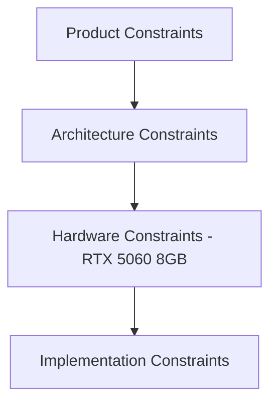
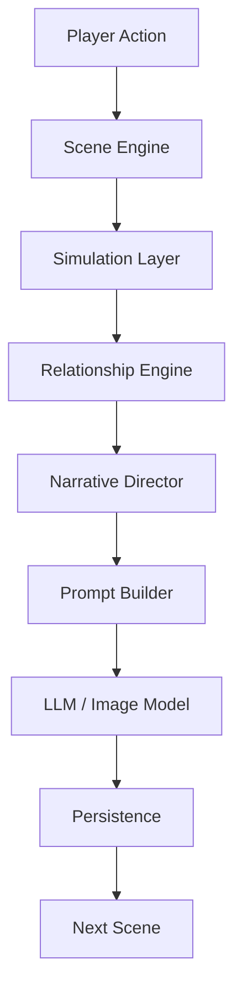
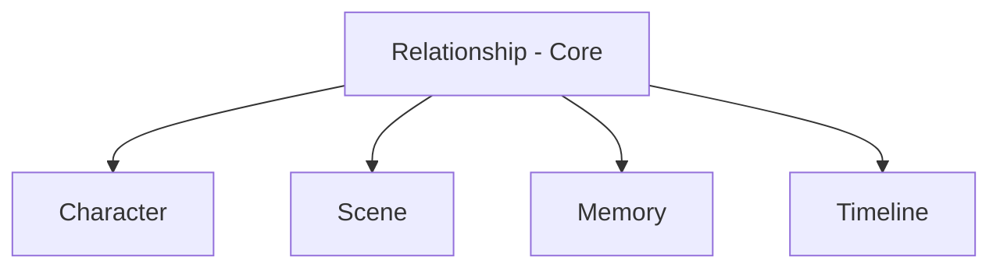
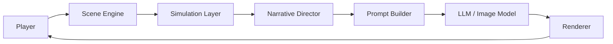

# Overall Architecture Blueprint

**Version:** v2.1  
**Status:** Draft  
**Last Updated:** 2026-07-13

---

## 1. Purpose（文档目的）

Define the overall architecture framework of the AI Narrative RPG Engine, providing the highest-level guidance for all subsequent Architecture, Data, and Development documents.

定义 AI Narrative RPG Engine 的整体架构框架，为所有后续 Architecture、Data 和 Development 文档提供最高指导。

### Core Definition（核心定义）

This document defines the system layering, boundaries, data flow, and hardware constraints of the entire Engine.

本文档定义整个引擎的系统分层、边界、数据流和硬件约束。

### Core Philosophy（核心理念）

The Engine is not a chat application. It is a simulation-driven narrative RPG engine where relationships, memories, and stories emerge from structured simulation rather than prompt engineering.

引擎不是聊天应用，而是模拟驱动的叙事 RPG 引擎。关系、记忆和故事来自结构化模拟，而非 Prompt 工程。

---

## 2. Responsibilities（职责）

### Responsible For（负责）

- Defining system layering, boundaries, and data flow
- Ensuring alignment with Design Constitution and Project Vision
- Providing unified blueprint for subsequent module design

### Not Responsible For（不负责）

- Specific code implementation
- Database schema design
- Prompt templates
- UI design

---

## 3. Document Governance（文档治理）

**Owner:** Chief Architect

**Reviewers:**

- Product Architect
- Engine Architect

**Approval:** Architecture Review Required

**Update Policy:** Only update after ADR approval if architectural principles change.

---

## 4. Assumptions（假设）

| Assumption | Value |
|------------|-------|
| Mode | Offline First |
| Platform | Windows |
| GPU | RTX 5060 8GB |
| RAM | 32GB |
| AI | Local LLM & Image Generation |

---

## 5. Design Goals（架构目标）

| Goal | Description |
|------|-------------|
| Long-term Immersion First | 长期沉浸优先 |
| Character & Relationship Persistence | 角色与关系持久化 |
| Hardware Constraints First | 硬件约束优先 |
| Model Agnostic | 模型无关 |
| One Engine, Multiple Experiences | 一个引擎，多种体验 |

---

## 6. Architecture Principles（架构原则）

| Principle | Description |
|-----------|-------------|
| Simulation Before Generation | 模拟优先于生成。Simulation determines facts before any generation occurs. |
| Narrative Director Before LLM | Narrative Director 先于 LLM。Narrative Director controls story; LLM produces expression. |
| Python Owns Logic, LLM Owns Expression | Python 管逻辑，LLM 管表达。 |
| Data First, Prompt Last | 数据优先，Prompt 最后。 |
| Relationship Driven | 关系驱动。Relationship is the core driver of all experiences. |
| Scene as Smallest Runtime Unit | Scene 是最小运行单位。 |

---

## 7. Constraint Hierarchy（约束层级）

---

## 8. Runtime Architecture（运行时架构）

描述一次完整 Scene 的生命周期（核心流程）。

---

## 9. Architecture Views（架构视图）

| View | Description |
|------|-------------|
| Conceptual View | 概念视图 |
| Logical View | 逻辑视图 |
| Runtime View | 运行时视图 |
| Data View | 数据视图 |
| Deployment View | 部署视图（未来） |

---

## 10. Core Runtime Domain（核心运行域）

**Relationship** 作为核心驱动（提升一级），Character、Scene、Memory、Timeline 等围绕 Relationship 展开。

---

## 11. Module Responsibilities（模块职责）

明确 Python、Narrative Director、LLM、Image Pipeline、Persistence 等的边界。

| Module | Responsibility |
|--------|---------------|
| Simulation Layer | State Transition |
| Relationship Engine | Relationship Evolution & Behavior Tendency |
| Narrative Director | Experience Planning |
| Prompt Builder | Prompt Assembly |
| LLM Runtime | Inference Execution |
| Image Pipeline | Visual Generation |
| Memory System | Experience Persistence |
| Persistence Layer | Data Storage |

---

## 12. Data Flow（数据流）

定义数据流动方向和禁止跨层行为。

**Rule:** Data flows strictly forward. No module may bypass upstream layers.

---

## 13. Cross-cutting Concerns（横切关注点）

| Concern | Description |
|---------|-------------|
| GPU Scheduling | GPU 调度 |
| Content Profile | 内容模式 |
| Logging | 日志 |
| Configuration | 配置 |
| Error Handling | 错误处理 |

---

## 14. Quality Attributes（质量属性）

| Attribute | Description |
|-----------|-------------|
| Consistency | 一致性 |
| Maintainability | 可维护性 |
| Extensibility | 可扩展性 |
| Offline First | 离线优先 |
| Privacy | 隐私 |
| Determinism | 确定性 |

---

## 15. Runtime Guarantees（运行时保证）

- Every Scene must update Relationship & Memory before Next Scene.
- All long-term state changes must go through Simulation Layer.

---

## 16. Extensibility（可扩展性）

支持未来新模型、新 Profile 的机制。

---

## 17. One Engine Principle（单一引擎原则）

**One Engine. One Runtime. Multiple Experiences.**

General / Romance / Mature 等 Profile 共享同一套 Simulation、Narrative Director、Relationship、Memory、Scene。

禁止 Fork Engine 或独立 Mature Engine。

---

## References

**Depends On:**

- Design Constitution
- Project Vision
- Glossary
- PRD Blueprint

**Referenced By:**

- Simulation Layer
- Narrative Director
- Character Schema
- Relationship Schema
- Scene Engine
- Image Pipeline

---

## Revision History

| Version | Date | Description |
|---------|------|-------------|
| v2.1 | 2026-07-13 | Documentation enhancement: bilingual headings, Mermaid flowcharts, tables, consistent terminology |
| v2.0 | 2026-07-12 | 增加工程化元数据、Constraint Hierarchy、Quality Attributes、Runtime Guarantees、One Engine Principle |
