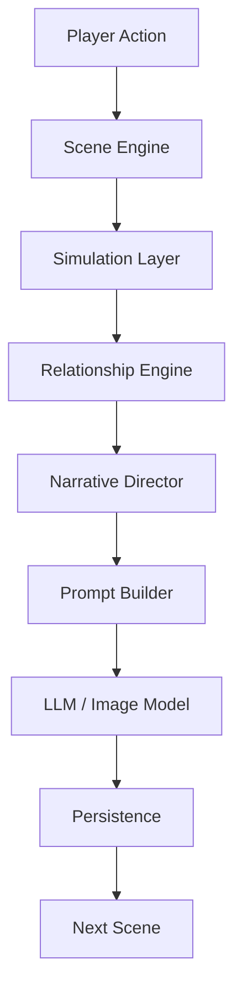

# Overall Architecture Overview

**Version:** v1.1  
**Status:** Active  
**Last Updated:** 2026-07-14

---

## Purpose（文档目的）

本文档是 AI Narrative RPG Engine 整体架构的**入口概览**。

它提供系统分层、模块关系和数据流的快速参考。

详细工程规范请参阅 [Overall Architecture Blueprint](Overall_Architecture_Blueprint.md)。

---

## Engine Identity（引擎定位）

**AI Narrative RPG Engine** 不是聊天工具，而是一个模拟驱动的叙事 RPG 引擎。

- 模拟产生事实，生成只负责表达
- 关系是核心驱动
- Scene 是最小运行单位
- Simulation computes, Generation expresses

---

## System Layers（系统分层）

| Layer | Module | Responsibility |
|-------|--------|---------------|
| Execution | Scene Engine | 场景生命周期编排、事务完整性 |
| Simulation | Simulation Layer | 状态转换、规则评估、事件解析 |
| Simulation | Relationship Engine | 关系演化、行为倾向产出 |
| Orchestration | Narrative Director | 叙事规划、情感编排、CG 决策 |
| Translation | Prompt Builder | Prompt 组装、上下文压缩 |
| Inference | LLM Runtime | 模型抽象、推理执行、输出验证 |
| Visual | Image Pipeline | CG 生成 |
| Persistence | Persistence Layer | 数据存储、状态快照 |

---

## Runtime Flow（运行时流程）

---

## Core Runtime State（核心运行时状态）

| State | Description |
|-------|-------------|
| **Relationship State** | **核心驱动 — 多维度关系状态** |
| Character State | 角色人格、情绪、目标 |
| World State | 时间、地点、环境、全局事件 |
| Scene State | 当前场景执行状态 |
| Memory State | 结构化经历与质量属性 |
| Timeline State | 连续时间线 |

---

## Architecture Principles（架构原则）

- Simulation Before Generation
- Narrative Director Before LLM
- Python Owns Logic, LLM Owns Expression
- Data First, Prompt Last
- Relationship Driven
- Scene as Smallest Runtime Unit

---

## One Engine Principle（单一引擎原则）

**One Engine. One Runtime. Multiple Experiences.**

General / Romance / Mature 等 Profile 共享同一套 Runtime。禁止 Fork Engine。

---

## References

**Detailed Specification:** [Overall Architecture Blueprint](Overall_Architecture_Blueprint.md)

**Depends On:**

- [Runtime Pipeline Blueprint](./Runtime_Pipeline_Blueprint.md) — defines 5-Layer Authority Pipeline
- [Overall Architecture Blueprint](./Overall_Architecture_Blueprint.md) — detailed specification
- [Runtime Glossary](./Runtime_Glossary.md) — defines terminology
- Design Constitution
- Project Vision

**Referenced By:**

- All Architecture Blueprints
- All Data Schemas
- PRD

---

## Revision History

| Version | Date | Description |
|---------|------|-------------|
| v1.1 | 2026-07-14 | Phase B-2 sync: added Pipeline Blueprint and Glossary to Depends On. Overview content references Pipeline-aligned Blueprint. |
| v1.0 | 2026-07-13 | Created as Overview; detailed spec moved to Blueprint |
