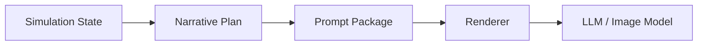
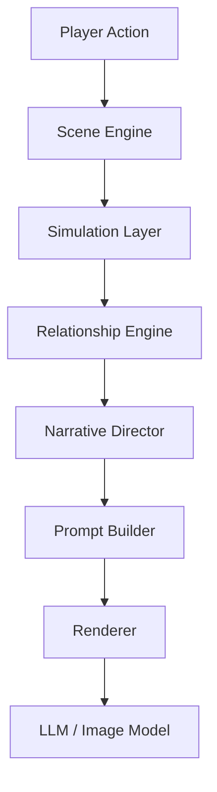
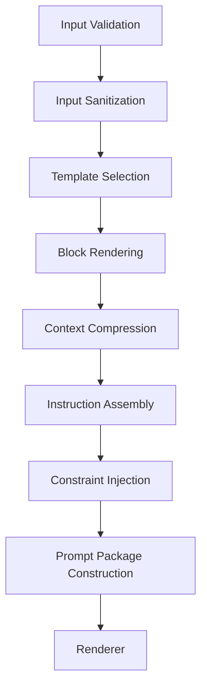
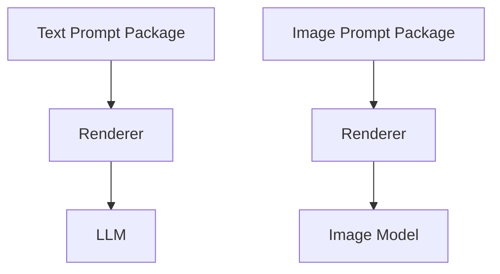

# Prompt Builder Blueprint

**Version:** v2.1  
**Status:** Draft  
**Last Updated:** 2026-07-13

---

## 1. Purpose（文档目的）

Define the responsibilities, boundaries, runtime workflow, and interfaces of the Prompt Builder.

定义 Prompt Builder 的职责、边界、运行时工作流和接口。

### Core Definition（核心定义）

The Prompt Builder is the **translation layer** between the deterministic AI Narrative RPG Engine and generative AI models.

Prompt Builder 是确定性引擎与生成式 AI 模型之间的翻译层。

It transforms structured Runtime data into model-ready Prompt Packages without introducing new business logic.

它将结构化运行时数据转化为模型就绪的 Prompt Package，不引入新的业务逻辑。

### Core Philosophy（核心理念）

Prompt Builder converts:

It never creates facts. It only describes facts.

它不创造事实，只描述事实。

---

## 2. Responsibilities（职责）

### Responsible For（负责）

- Transform structured Runtime data into Prompt Packages
- Assemble prompt blocks
- Apply Content Profiles
- Apply Prompt Templates
- Build Text Prompt Packages
- Build Image Prompt Packages
- Context Compression
- Token Budget Management
- Prompt Formatting
- Prompt Sanitization

### Not Responsible For（不负责）

- World Simulation
- Relationship Calculation
- Narrative Planning
- State Modification
- Memory Retrieval
- Dialogue Generation
- Image Generation
- Model Inference

---

## 3. Document Governance（文档治理）

**Owner:** AI Runtime Architect

**Reviewers:**

- Runtime Architect
- Narrative Architect
- AI Infrastructure Architect

**Approval:** Architecture Review Required

**Update Policy:** Changes affecting Prompt Package structure, Builder interfaces, or Runtime workflow require ADR approval.

---

## 4. Design Principles（设计原则）

| Principle | Description |
|-----------|-------------|
| Data Before Prompt | 数据优先于 Prompt。All long-term state must be stored as structured data. Prompt is only the rendering layer. |
| Prompt Is Read-only | Prompt 是只读的。Prompt Builder never modifies Runtime State. |
| Prompt Is Disposable | Prompt 是一次性的。Every Prompt Package is reconstructed from Runtime State. |
| No Business Logic | 无业务逻辑。Prompt Builder introduces no new business logic. |
| Template Driven | 模板驱动。Prompts are assembled from reusable templates. |
| Model Agnostic | 模型无关。Prompt Packages are independent of specific models. |
| Content Profile Driven | 内容模式驱动。Presentation differs by Content Profile. |
| Deterministic Assembly | 确定性组装。Identical inputs produce identical Prompt Packages. |

---

## 5. Prompt Philosophy（Prompt 哲学）

Prompt is temporary.

Runtime State is persistent.

Narrative Plan is deterministic.

Prompt Builder never stores prompts.

Every Prompt Package is reconstructed from Runtime State.

The prompt is a temporary representation of the Engine, not the Engine itself.

---

## 6. Boundary Definition（边界定义）

### Owns（拥有）

- Prompt Templates
- Prompt Assembly
- Context Compression
- Token Budget
- Prompt Formatting
- Prompt Sanitization
- Prompt Package Construction

### Does NOT Own（不拥有）

- World State
- Character Logic
- Relationship Logic
- Narrative Decisions
- Memory Selection
- LLM Output
- Image Generation

Prompt Builder is a **pure transformation layer**.

---

## 7. Runtime Position（运行时定位）

Prompt Builder is the final Engine component before model inference.

---

## 8. Runtime Inputs（运行时输入）

Prompt Builder receives:

| Input | Description |
|-------|-------------|
| Narrative Plan | 叙事计划 |
| Scene Context | 场景上下文 |
| Character State | 角色状态 |
| Relationship State | 关系状态 |
| Behavior Tendency | 行为倾向 |
| Relevant Memory | 相关记忆 |
| World State | 世界状态 |
| Active Quest | 当前任务 |
| Timeline | 时间线 |
| Content Profile | 内容模式 |
| Runtime Configuration | 运行时配置 |
| Token Budget | Token 预算 |

---

## 9. Prompt Assembly Pipeline（Prompt 组装流水线）

Prompt Builder never communicates directly with language models.

---

## 10. Prompt Package Model（Prompt Package 模型）

Prompt Builder outputs a structured Prompt Package.

| Field | Description |
|-------|-------------|
| System Prompt | 系统提示 |
| Character Context | 角色上下文 |
| Relationship Context | 关系上下文 |
| Scene Context | 场景上下文 |
| Memory Context | 记忆上下文 |
| Narrative Goal | 叙事目标 |
| Style Instructions | 风格指令 |
| Constraints | 约束条件 |
| Output Schema | 输出模式 |
| Metadata | 元数据 |

Renderer converts the Prompt Package into model-specific requests.

---

## 11. Prompt Block System（Prompt Block 系统）

Prompt Packages are composed from reusable blocks.

| Block | Description |
|-------|-------------|
| System Block | 系统块 |
| World Block | 世界块 |
| Character Block | 角色块 |
| Relationship Block | 关系块 |
| Scene Block | 场景块 |
| Memory Block | 记忆块 |
| Narrative Block | 叙事块 |
| Style Block | 风格块 |
| Constraint Block | 约束块 |
| Output Block | 输出块 |

Blocks remain independent and reusable.

Blocks may be enabled or disabled according to runtime requirements.

---

## 12. Context Compression（上下文压缩）

Prompt Builder manages limited context windows.

### Priority Order（优先级排序）

| Priority | Content |
|----------|---------|
| 1 | Current Scene |
| 2 | Narrative Goal |
| 3 | Relationship State |
| 4 | Active Quest |
| 5 | Relevant Memory |
| 6 | Character Summary |
| 7 | World Summary |

### Compression Strategies（压缩策略）

| Strategy | Description |
|----------|-------------|
| Summarization | 摘要 |
| Pruning | 修剪 |
| Prioritization | 优先级排序 |
| Structured Formatting | 结构化格式化 |

Prompt Builder never removes mandatory Runtime information.

---

## 13. Content Profiles（内容模式）

Presentation differs by Content Profile.

| Profile | Description |
|---------|-------------|
| General | 通用模式 |
| Romance | 恋爱模式 |
| Mature | 成人模式 |

All profiles share identical Runtime State. Only presentation changes. Business logic remains identical.

---

## 14. Multi-Modal Prompt Pipeline（多模态 Prompt 流水线）

Different output targets may use different templates while sharing identical Runtime State.

---

## 15. Prompt Sanitization（Prompt 净化）

Prompt Builder validates all external text before prompt assembly.

| Responsibility | Description |
|----------------|-------------|
| Escaping Reserved Tokens | 转义保留 Token |
| Normalizing Formatting | 规范化格式 |
| Isolating Player Input | 隔离玩家输入 |
| Preventing Prompt Injection | 防止 Prompt 注入 |
| Protecting System Instructions | 保护系统指令 |

Sanitization protects Prompt integrity. It never changes Runtime State.

---

## 16. Runtime Guarantees（运行时保证）

Prompt Builder guarantees:

- Deterministic Prompt Assembly
- Stable Prompt Structure
- No Runtime State Modification
- No Hidden Business Logic
- No Fabricated Facts
- Model-independent Prompt Packages
- Token Budget Compliance
- Reproducible Prompt Construction

---

## 17. Hardware Considerations（硬件考量）

**Target Platform:** RTX 5060 8GB

| Responsibility | Description |
|----------------|-------------|
| Efficient Context Compression | 高效上下文压缩 |
| Minimize Unnecessary Token Usage | 最小化不必要的 Token 使用 |
| Support Streaming Generation | 支持流式生成 |
| Support Asynchronous Image Generation | 支持异步图像生成 |
| Keep Builder Latency Negligible | 保持 Builder 延迟可忽略 |

Prompt Builder is CPU-oriented and independent of GPU scheduling.

---

## 18. Future Extensibility（未来扩展）

Future extensions include:

- Prompt Cache
- Dynamic Prompt Optimization
- Few-shot Example Selection
- Tool Calling Support
- Function Calling Support
- Multi-Agent Prompt Composition
- Multi-Model Routing

These features must not violate the core principle: Prompt Builder remains a pure transformation layer.

---

## References

**Depends On:**

- Overall Architecture
- Runtime Architecture
- Narrative Director Blueprint
- Relationship Engine Blueprint
- Glossary

**Referenced By:**

- Renderer Specification
- Prompt Templates
- LLM Runtime
- Image Pipeline
- Content Profile Specification

---

## Revision History

| Version | Date | Description |
|----------|------------|------------------------------------------------|
| v2.1 | 2026-07-13 | Documentation enhancement: bilingual headings, Mermaid flowcharts, tables, consistent terminology |
| v2.0 | 2026-07-13 | Unified architecture with Prompt Package, Prompt Philosophy, Multi-modal Pipeline, Sanitization, and deterministic transformation model |
| v1.0 | 2026-07-13 | Initial Blueprint |
