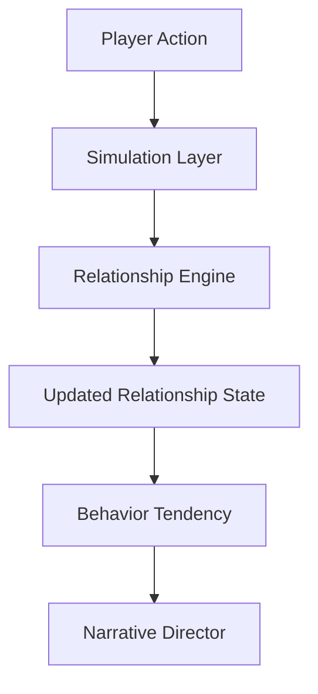
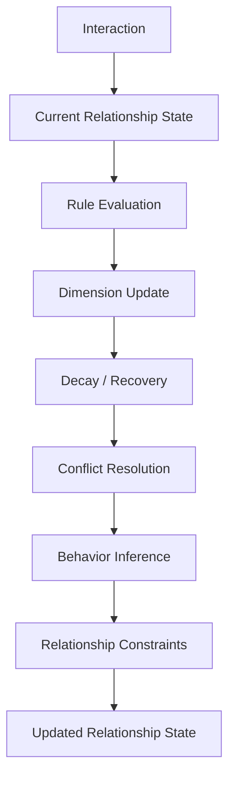
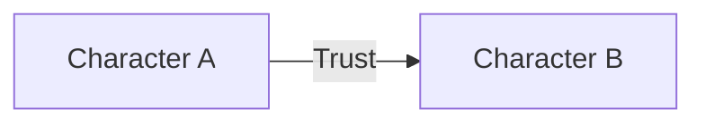

# Relationship Engine Blueprint

**Version:** v2.3  
**Status:** Draft  
**Last Updated:** 2026-07-13

---

## 1. Purpose（文档目的）

Define the responsibilities, boundaries, runtime mechanisms, and data model of the Relationship Engine.

定义 Relationship Engine 的职责、边界、运行时机制和数据模型。

### Core Definition（核心定义）

The Relationship Engine is the **long-term relationship simulation core** of the AI Narrative RPG Engine.

Relationship Engine 是 AI Narrative RPG Engine 的长期关系模拟核心。

It transforms interactions, memories, and time into persistent relationship states, providing the foundation for character behavior, narrative progression, and emotional consistency.

它将交互、记忆和时间转化为持久的关系状态，为角色行为、叙事推进和情感一致性提供基础。

### Core Philosophy（核心理念）

Relationship is **not dialogue**, **not prompt**, and **not a single score**.

关系不是对话，不是 Prompt，不是单一分数。

It is a continuously evolving runtime domain.

关系是一个持续演化的运行时域。

---

## 2. Responsibilities（职责）

### Responsible For（负责）

- Managing persistent Relationship State
- Calculating relationship evolution
- Maintaining relationship consistency
- Producing Behavior Tendency
- Producing Relationship Constraints
- Applying decay and recovery
- Resolving relationship conflicts
- Supporting long-term emotional progression

### Not Responsible For（不负责）

- World Simulation
- Character Internal Simulation
- Dialogue Generation
- Image Generation
- Memory Storage
- Narrative Writing

---

## 3. Document Governance（文档治理）

**Owner:** Relationship Architect

**Reviewers:**

- Runtime Architect
- Simulation Architect

**Approval:** Architecture Review Required

**Update Policy:**

- Adding relationship dimensions requires ADR.
- Changing evolution rules requires ADR.
- Parameter tuning (weights, decay, caps) only requires changelog updates.

---

## 4. Design Principles（设计原则）

| Principle | Description |
|-----------|-------------|
| Multi-dimensional Relationship | 关系是多维度的。Relationship is not a single score but a collection of independent dimensions. |
| Relationship Before Narrative | 关系优先于叙事。Relationship State is the primary driver of narrative tone and scene selection. |
| Simulation Before Generation | 模拟优先于生成。Relationship changes are calculated by rules, not generated by LLM. |
| Deterministic Evolution | 确定性演化。Identical inputs always produce identical relationship changes. |
| State Is Ground Truth | 状态是唯一事实来源。Relationship State is the single source of truth for all relationship-related decisions. |
| Long-term Consistency | 长期一致性。Relationship evolves gradually and maintains consistency across sessions. |
| Rule-driven Evolution | 规则驱动演化。Relationship evolution is rule-driven. LLM cannot bypass Rule Engine. |

---

## 5. Boundary Definition（边界定义）

### Owns（拥有）

- Relationship Dimensions
- Relationship Rules
- Behavior Tendency
- Relationship Constraints
- Evolution Logic

### Does NOT Own（不拥有）

- Dialogue
- Story Writing
- Images
- UI
- Prompt Construction
- Character Internal State

---

## 6. Runtime Position（运行时定位）

Relationship Engine is a core subsystem inside the Simulation Layer.



Narrative Director consumes Relationship outputs but never modifies Relationship State directly.

---

## 7. Runtime Model（运行时模型）

Relationship Runtime follows a deterministic pipeline.



---

## 8. Relationship State Model（关系状态模型）

Relationship State consists of multiple independent dimensions.

### Core Dimensions（核心维度）

| Dimension | Description |
|-----------|-------------|
| Trust | 信任 |
| Respect | 尊重 |
| Familiarity | 熟悉度 |
| Attachment | 依恋 |
| Affection | 好感 |
| Intimacy | 亲密 |

### Dynamic Dimensions（动态维度）

| Dimension | Description |
|-----------|-------------|
| Emotional Momentum | 情感动量 |
| Dependency | 依赖 |
| Fear | 恐惧 |
| Curiosity | 好奇 |
| Jealousy | 嫉妒 |

### Derived Metrics（派生指标）

| Metric | Description |
|--------|-------------|
| Relationship Score | UI 显示用，非真实来源 |
| Future Expectation | 未来期望 |
| Stability Index | 稳定度指数 |

Relationship Score is never used as the source of truth.

---

## 9. Relationship Graph（关系图谱）

Relationship Engine internally maintains a dynamic social graph.

Each Relationship represents one edge between runtime entities.



Future supported entities include:

- Character
- Player
- Faction
- Organization
- Guild
- Kingdom
- Pet
- World Event

Current implementation focuses on Character relationships while keeping the data model extensible.

---

## 10. Relationship Evolution（关系演化）

Relationship changes are driven by:

| Driver | Description |
|--------|-------------|
| Direct Interaction | 直接交互 |
| Time Passage | 时间流逝 |
| Shared Events | 共同经历 |
| Memory Recall | 记忆回忆 |
| Character Personality | 角色性格 |
| World Events | 世界事件 |

**Example Formula:**

New Value = Old Value + Interaction Impact + Memory Bonus − Time Decay

Different dimensions have different decay rates:

| Dimension | Decay Rate |
|-----------|------------|
| Familiarity | Slow decay |
| Emotional Momentum | Fast changes |
| Attachment | Rarely decreases naturally |

---

## 11. Rule Engine（规则引擎）

Relationship evolution is rule-driven.

### Rule Types（规则类型）

| Rule Type | Description |
|-----------|-------------|
| Interaction Rules | 交互规则 |
| Personality Rules | 性格规则 |
| World Rules | 世界规则 |
| Event Rules | 事件规则 |
| Constraint Rules | 约束规则 |

Future: Plugin Rules, Mod Rules.

LLM cannot bypass Rule Engine.

---

## 12. Behavior Tendency（行为倾向）

Behavior Tendency（行为倾向）— Relationship Engine 产出的结构化运行时输出，描述角色当前最可能采取的行为倾向，而不是最终行为。

Behavior Tendency is the primary runtime output.

```json
{
  "willingness_to_help": 0.82,
  "hostility": 0.05,
  "openness": 0.63,
  "initiative": 0.71,
  "tone_modifier": "friendly_but_cautious",
  "suggested_actions": [
    "share_secret",
    "invite_walk"
  ]
}
```

Behavior Tendency guides Narrative Director. It does not generate dialogue.

---

## 13. Relationship Constraints（关系约束）

Relationship Engine also produces hard runtime constraints.

```json
{
  "constraints": [
    "cannot_confess",
    "cannot_share_secret",
    "cannot_invite_home"
  ]
}
```

Constraints prevent Narrative Director from violating relationship logic.

| Condition | Constraint |
|-----------|------------|
| Low Trust | Cannot Share Secret |
| Low Respect | Refuse Orders |
| Low Intimacy | No Romantic Actions |

Constraints are mandatory. Narrative Director must respect them.

---

## 14. Relationship Influence（关系影响）

Relationship State directly influences:

| Target | Influence |
|--------|-----------|
| Narrative Planning | 叙事规划 |
| Dialogue Tone | 对话基调 |
| Scene Availability | 场景可用性 |
| Character Behavior | 角色行为 |
| Quest Unlock | 任务解锁 |
| CG Trigger | CG 触发 |
| Event Probability | 事件概率 |

Relationship never directly generates text.

---

## 15. Runtime Guarantees（运行时保证）

Relationship Engine guarantees:

| Guarantee | Description |
|-----------|-------------|
| Atomic State Updates | 原子状态更新 |
| Deterministic Results | 确定性结果 |
| Traceable Changes | 可追溯变更 |
| Replayable Evolution | 可重放演化 |
| Persistent Consistency | 持久一致性 |

No external module may modify Relationship State directly.

---

## 16. Hardware Considerations（硬件考量）

**Target Platform:** RTX 5060 8GB

| Characteristic | Description |
|----------------|-------------|
| CPU-first | CPU 优先 |
| Lightweight | 轻量 |
| GPU Independent | 不依赖 GPU |
| High Frequency | 高频执行 |
| Background Friendly | 后台友好 |

---

## 17. Future Extensibility（未来扩展）

Future features include:

- Group Relationships
- Social Networks
- Family Trees
- Political Systems
- Reputation Systems
- Mod-defined Relationship Dimensions

---

## References

**Depends On:**

- Simulation Layer Blueprint
- Runtime Architecture
- Overall Architecture
- Glossary

**Referenced By:**

- Narrative Director Blueprint
- Character System Blueprint
- Relationship State Schema
- Scene Engine
- Memory Architecture

---

## Revision History

| Version | Date | Description |
|----------|------------|-------------|
| v2.3 | 2026-07-13 | Documentation enhancement: bilingual headings, Mermaid flowcharts, tables, consistent terminology |
| v2.2 | 2026-07-13 | Added Relationship Graph, Constraints, Runtime Model, Future Extensibility |
| v2.1 | 2026-07-13 | Added Behavior Tendency and detailed dimensions |
| v2.0 | 2026-07-13 | Initial Engineering Blueprint |
