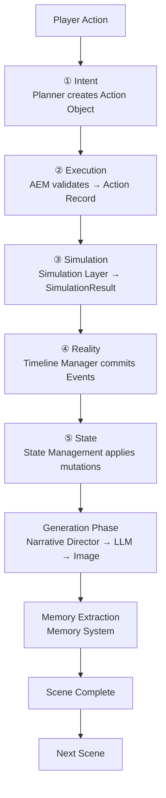
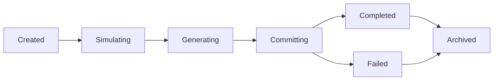
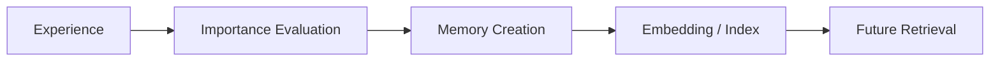

# Runtime Architecture Blueprint

**Version:** v1.2  
**Status:** Draft  
**Last Updated:** 2026-07-14

**Depends On:** [Runtime Pipeline Blueprint](./Runtime_Pipeline_Blueprint.md), [Runtime Infrastructure Blueprint](./Runtime_Infrastructure_Blueprint.md), [Simulation Layer Blueprint](./Simulation_Layer_Blueprint.md), [Runtime State Model Blueprint](./Runtime_State_Model_Blueprint.md), [Scene Engine Blueprint](./Scene_Engine_Blueprint.md), [Runtime Glossary](./Runtime_Glossary.md)

---

## 1. Purpose（文档目的）

Define the runtime lifecycle and core runtime mechanisms of the AI Narrative RPG Engine.

定义 AI Narrative RPG Engine 的运行时生命周期和核心运行机制。

### Core Definition（核心定义）

This document answers:

本文档回答以下核心问题：

| Question | Description |
|----------|-------------|
| How does a Scene run completely? | 一个 Scene 如何完整运行？ |
| How do World State, Relationship, and Memory evolve? | 世界状态、Relationship、Memory 如何演化？ |
| How does Narrative Director make decisions? | Narrative Director 如何决策？ |
| How does data flow and persist? | 数据如何在各模块间流动并持久化？ |

本文档是所有具体 Layer 文档（Scene Engine、Simulation Layer、Relationship Engine 等）的运行时基础。

### Core Philosophy（核心理念）

Runtime is simulation-driven, not prompt-driven.

运行时是模拟驱动的，而非 Prompt 驱动的。

> **Pipeline Alignment:** The runtime follows the [5-Layer Authority Pipeline](./Runtime_Pipeline_Blueprint.md): ① Intent → ② Execution → ③ Simulation → ④ Reality → ⑤ State. Simulation computes facts; State applies mutations; Scene Engine orchestrates the transaction; Generation expresses; Memory extracts.
>
> **流水线对齐：** 运行时遵循[五层权威流水线](./Runtime_Pipeline_Blueprint.md)：① Intent → ② Execution → ③ Simulation → ④ Reality → ⑤ State。模拟计算事实；状态应用变更；Scene Engine 编排事务；生成表达；记忆提取。

---

## 2. Responsibilities（职责）

### Responsible For（负责）

- Defining Runtime Flow and State Transition
- Defining Scene lifecycle
- Defining module call order and responsibility boundaries
- Defining Runtime Guarantees

### Not Responsible For（不负责）

- Specific data schema
- Prompt templates
- UI implementation
- Model-specific optimization

---

## 3. Document Governance（文档治理）

**Owner:** Runtime Architect

**Architecture Reviewers:**

- Engine Architect
- Simulation Architect

**Architecture Approval:** Architecture Review Required

**Last Reviewed:** 2026-07-14

**Parent Blueprint:** [Runtime Pipeline Blueprint](./Runtime_Pipeline_Blueprint.md)

**Update Policy:** Changes affecting runtime flow, Pipeline alignment, Scene lifecycle, or module boundaries require ADR approval.

---

## 4. Runtime Principles（运行时原则）

| Principle | Description |
|-----------|-------------|
| Simulation Before Generation | 模拟优先于生成。Simulation determines facts before any generation occurs. Facts before expressions. |
| 5-Layer Authority Pipeline | 五层权威流水线。① Intent → ② Execution → ③ Simulation → ④ Reality → ⑤ State. Each layer has exactly one Authority. See [Pipeline Blueprint](./Runtime_Pipeline_Blueprint.md). |
| State Is Fact | 状态是事实，文本是表现。State is fact; text is representation. Generated content (narrative, images) is regenerable expression. |
| Scene Is Atomic Unit | Scene 是最小不可分割事务单位。Scene is the atomic transaction unit. See [Scene Engine Blueprint](./Scene_Engine_Blueprint.md). |
| Simulation Computes, State Mutates | 模拟计算，状态变更。Simulation Authority (Layer ③) computes deltas; State Authority (Layer ⑤) applies mutations. No module may bypass State Authority. |
| Memory Is Selected History | 保存有价值经历，而非全部对话。Memory stores meaningful experiences, not all conversations. |
| Relationship Is Core Driver | 关系驱动一切体验。Relationship drives all experiences. Relationship Engine is a subsystem of Simulation Authority. |
| Infrastructure Serves, Not Decides | 基础设施服务，不决策。Infrastructure provides platform services (snapshot, log, seed, dispatch). It never participates in Authority decisions. |

---

## 5. Runtime Lifecycle（运行时生命周期）

一次完整 Scene 的运行流程（对齐 5-Layer Authority Pipeline）：

> **Transaction Boundary:** The entire flow executes within a Scene transaction managed by [Scene Engine Blueprint](./Scene_Engine_Blueprint.md). If any Pipeline stage fails, the Scene rolls back to its snapshot.

---

## 6. Runtime State Model（运行时状态模型）

Runtime State 分为 **Persistent State** 和 **Session State** 两个层级。

| Layer | State | Description |
|-------|-------|-------------|
| Persistent State | Character State | 角色状态 |
| Persistent State | **Relationship State** | **关系状态（核心）** |
| Persistent State | World State | 世界状态 |
| Persistent State | Progression State | 进度状态 |
| Persistent State | Timeline State | 时间线状态 |
| Session State | Scene State | 场景执行状态 |
| Session State | Runtime Events | 瞬态运行时事件 |
| Session State | Active Memory References | 活跃记忆引用 |
| Session State | Runtime Metadata | 运行时元数据 |

**Detailed Specification:** [Runtime State Model Blueprint](Runtime_State_Model_Blueprint.md)

---

## 7. Scene State Machine（Scene 状态机）

Scene 生命周期由 [Scene Engine Blueprint](./Scene_Engine_Blueprint.md) §9 定义，此处仅作概览：

> **Simplified Lifecycle:** 从 Legacy 的 7 状态简化为 6 状态。详见 [Scene Engine Blueprint §9](./Scene_Engine_Blueprint.md)。

---

## 8. Relationship Runtime（关系运行时）

定义 Relationship 如何影响：

| Target | Influence |
|--------|-----------|
| Event Probability | 事件概率 |
| Dialogue Tone | 对话基调 |
| Scene Availability | 场景可用性 |
| Character Behavior | 角色行为 |

---

## 9. Narrative Director Runtime（叙事导演运行时）

### Responsible For（负责）

- Goal Selection
- Event Selection
- Story Pacing
- Emotional Timing

### Not Responsible For（不负责）

- Text generation

---

## 10. Generation Pipeline（生成流水线）

| Component | Responsibility |
|-----------|---------------|
| LLM | 表达（Dialogue, Description） |
| Image Model | 视觉呈现（CG） |

**禁止：** 模型直接改变世界状态。

> **Generation is Post-Pipeline:** 生成阶段消费已提交的 Runtime State 和已提交的 Event。它不参与权威决策。生成结果（文本、图像）是可重新生成的表达，不是持久事实。

---

## 11. Memory Pipeline（记忆流水线）

---

## 12. Failure Handling（失败处理）

定义以下情况的恢复策略：

| Scenario | Description |
|----------|-------------|
| Generation Failed | 生成失败 |
| Model Timeout | 模型超时 |
| State Conflict | 状态冲突 |

---

## 13. Hardware Considerations（硬件考量）

针对 RTX 5060 8GB：

| Strategy | Description |
|----------|-------------|
| Sequential Generation | 串行生成 |
| Model Switching | 模型切换 |
| Image Async Queue | 图像异步队列 |

---

## 14. Runtime Guarantees（运行时保证）

- 每个 Scene 完成后必须更新 Relationship 和 Memory。
- 所有 Persistent State 变更必须经过 State Authority（第⑤层）。Simulation Authority（第③层）计算 delta；State Authority 应用变更。
- State 必须可恢复、可追溯、可重放。
- 生成内容（叙事、图像）是可重新生成的表达，不是持久事实。只有 Runtime State、Event、Memory 是持久的。

---

## References

**Depends On:**

- [Runtime Pipeline Blueprint](./Runtime_Pipeline_Blueprint.md) — defines 5-Layer Authority Pipeline
- [Runtime Infrastructure Blueprint](./Runtime_Infrastructure_Blueprint.md) — defines infrastructure platform
- [Simulation Layer Blueprint](./Simulation_Layer_Blueprint.md) — defines Layer ③ computation
- [Runtime State Model Blueprint](./Runtime_State_Model_Blueprint.md) — defines Layer ⑤ mutation
- [Scene Engine Blueprint](./Scene_Engine_Blueprint.md) — defines transaction container
- [Runtime Glossary](./Runtime_Glossary.md) — defines terminology
- [Runtime Artifact Ownership Matrix](./Runtime_Artifact_Ownership_Matrix.md) — defines artifact ownership
- Overall Architecture Blueprint
- Project Vision

**Referenced By:**

- [Runtime State Model Blueprint](./Runtime_State_Model_Blueprint.md)
- [Scene Engine Blueprint](./Scene_Engine_Blueprint.md)
- [Simulation Layer Blueprint](./Simulation_Layer_Blueprint.md)
- [Relationship Engine Blueprint](./Relationship_Engine_Blueprint.md)
- [Memory Architecture Blueprint](./Memory_Architecture_Blueprint.md)
- [Narrative Director Blueprint](./Narrative_Director_Blueprint.md)
- [LLM Runtime Blueprint](./LLM_Runtime_Blueprint.md)
- [Prompt Builder Blueprint](./Prompt_Builder_Blueprint.md)
- Image Pipeline

---

## Revision History

| Version | Date | Description |
|---------|------|-------------|
| v1.2 | 2026-07-13 | Updated Runtime State Model section to reference Runtime State Model Blueprint; split into Persistent/Session layers |
| v1.1 | 2026-07-13 | Documentation enhancement: bilingual headings, Mermaid flowcharts, tables, consistent terminology |
| v1.0 | 2026-07-12 | 初始 Blueprint |
| v1.3 | 2026-07-14 | **Phase B-2 sync update:** (1) Pipeline alignment — added 5-Layer Authority Pipeline reference, replaced old flowchart with Pipeline-aligned flow. (2) Authority ownership — added "Simulation Computes, State Mutates" and "Infrastructure Serves" principles. (3) Artifact ownership — added Artifact Ownership Matrix reference. (4) State mutation boundary — corrected "必须经过 Simulation Layer" to "必须经过 State Authority (Layer ⑤)". (5) Infrastructure references — added Infrastructure Blueprint to Depends On. (6) Glossary terminology — added Glossary reference. (7) Cross references — added Pipeline, Simulation, State Model, Scene Engine, Artifact Ownership Matrix to Depends On; expanded Referenced By with links. (8) De-implementation — generation content clarified as regenerable expression. Updated Scene State Machine to 6-state lifecycle. Governance fields updated. |
