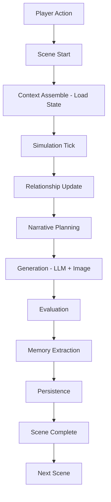
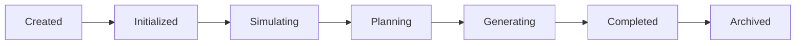
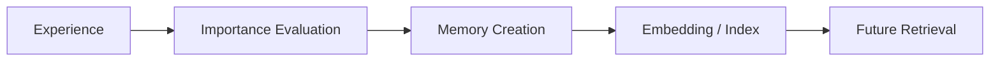

# Runtime Architecture Blueprint

**Version:** v1.1  
**Status:** Draft  
**Last Updated:** 2026-07-13

---

## 1. Purpose（文档目的）

Define the runtime lifecycle and core runtime mechanisms of the AI Narrative RPG Engine.

定义 AI Narrative RPG Engine 的运行时生命周期和核心运行机制。

### Core Definition（核心定义）

This document answers:

本文档回答以下核心问题：

| Question | Description |
|----------|-------------|
| How does a Scene run completely? | 一个 Scene 如何完整运行？ |
| How do World State, Relationship, and Memory evolve? | 世界状态、Relationship、Memory 如何演化？ |
| How does Narrative Director make decisions? | Narrative Director 如何决策？ |
| How does data flow and persist? | 数据如何在各模块间流动并持久化？ |

本文档是所有具体 Layer 文档（Scene Engine、Simulation Layer、Relationship Engine 等）的运行时基础。

### Core Philosophy（核心理念）

Runtime is simulation-driven, not prompt-driven.

运行时是模拟驱动的，而非 Prompt 驱动的。

---

## 2. Responsibilities（职责）

### Responsible For（负责）

- Defining Runtime Flow and State Transition
- Defining Scene lifecycle
- Defining module call order and responsibility boundaries
- Defining Runtime Guarantees

### Not Responsible For（不负责）

- Specific data schema
- Prompt templates
- UI implementation
- Model-specific optimization

---

## 3. Document Governance（文档治理）

**Owner:** Runtime Architect

**Reviewers:**

- Engine Architect
- Simulation Architect

**Approval:** Architecture Review Required

**Update Policy:** Changes affecting runtime flow, Scene lifecycle, or module boundaries require ADR approval.

---

## 4. Runtime Principles（运行时原则）

| Principle | Description |
|-----------|-------------|
| Simulation Before Generation | 模拟优先于生成。Simulation determines facts before any generation occurs. |
| State Before Text | 状态是事实，文本是表现。State is fact; text is representation. |
| Scene Is Atomic Unit | Scene 是最小不可分割运行单位。Scene is the atomic runtime unit. |
| Memory Is Selected History | 保存有价值经历，而非全部对话。Memory stores meaningful experiences, not all conversations. |
| Relationship Is Core Driver | 关系驱动一切体验。Relationship drives all experiences. |

---

## 5. Runtime Lifecycle（运行时生命周期）

一次完整 Scene 的运行流程：

---

## 6. Runtime State Model（运行时状态模型）

Runtime State 分为 **Persistent State** 和 **Session State** 两个层级。

| Layer | State | Description |
|-------|-------|-------------|
| Persistent State | Character State | 角色状态 |
| Persistent State | **Relationship State** | **关系状态（核心）** |
| Persistent State | World State | 世界状态 |
| Persistent State | Progression State | 进度状态 |
| Persistent State | Timeline State | 时间线状态 |
| Session State | Scene State | 场景执行状态 |
| Session State | Runtime Events | 瞬态运行时事件 |
| Session State | Active Memory References | 活跃记忆引用 |
| Session State | Runtime Metadata | 运行时元数据 |

**Detailed Specification:** [Runtime State Model Blueprint](Runtime_State_Model_Blueprint.md)

---

## 7. Scene State Machine（Scene 状态机）

---

## 8. Relationship Runtime（关系运行时）

定义 Relationship 如何影响：

| Target | Influence |
|--------|-----------|
| Event Probability | 事件概率 |
| Dialogue Tone | 对话基调 |
| Scene Availability | 场景可用性 |
| Character Behavior | 角色行为 |

---

## 9. Narrative Director Runtime（叙事导演运行时）

### Responsible For（负责）

- Goal Selection
- Event Selection
- Story Pacing
- Emotional Timing

### Not Responsible For（不负责）

- Text generation

---

## 10. Generation Pipeline（生成流水线）

| Component | Responsibility |
|-----------|---------------|
| LLM | 表达（Dialogue, Description） |
| Image Model | 视觉呈现（CG） |

**禁止：** 模型直接改变世界状态。

---

## 11. Memory Pipeline（记忆流水线）

---

## 12. Failure Handling（失败处理）

定义以下情况的恢复策略：

| Scenario | Description |
|----------|-------------|
| Generation Failed | 生成失败 |
| Model Timeout | 模型超时 |
| State Conflict | 状态冲突 |

---

## 13. Hardware Considerations（硬件考量）

针对 RTX 5060 8GB：

| Strategy | Description |
|----------|-------------|
| Sequential Generation | 串行生成 |
| Model Switching | 模型切换 |
| Image Async Queue | 图像异步队列 |

---

## 14. Runtime Guarantees（运行时保证）

- 每个 Scene 完成后必须更新 Relationship 和 Memory。
- 所有长期状态变化必须经过 Simulation Layer。
- State 必须可恢复、可追溯。

---

## References

**Depends On:**

- Overall Architecture
- Glossary
- Project Vision

**Referenced By:**

- Runtime State Model Blueprint
- Scene Engine
- Simulation Layer
- Relationship Engine
- Memory Architecture
- Narrative Director
- Image Pipeline

---

## Revision History

| Version | Date | Description |
|---------|------|-------------|
| v1.2 | 2026-07-13 | Updated Runtime State Model section to reference Runtime State Model Blueprint; split into Persistent/Session layers |
| v1.1 | 2026-07-13 | Documentation enhancement: bilingual headings, Mermaid flowcharts, tables, consistent terminology |
| v1.0 | 2026-07-12 | 初始 Blueprint |
