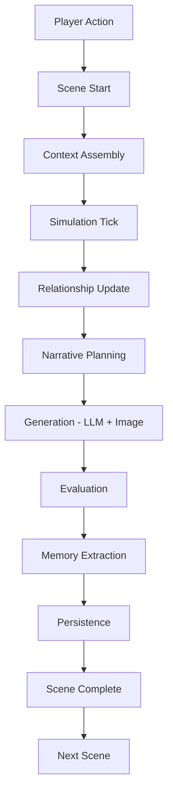
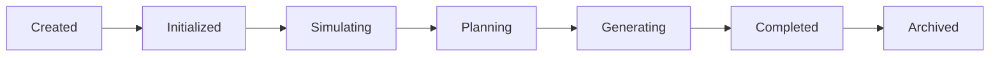

# Runtime Architecture Overview

**Version:** v1.0  
**Status:** Active  
**Last Updated:** 2026-07-13

---

## Purpose（文档目的）

本文档是 AI Narrative RPG Engine 运行时架构的**入口概览**。

它提供 Scene 生命周期、状态流转和模块调用顺序的快速参考。

详细工程规范请参阅 [Runtime Architecture Blueprint](Runtime_Architecture_Blueprint.md)。

---

## Engine Mental Model（引擎心智模型）

AI Narrative RPG Engine 不是一个文本生成系统，而是一个**拥有生成接口的状态模拟系统**。

| Role | Module |
|------|--------|
| 真实世界 | Simulation Layer |
| 导演 | Narrative Director |
| 演员 | LLM / Image Model |
| 记忆与历史 | Persistence & Memory System |

文本和图片只是**表现层**，状态才是**事实层**。

---

## Scene Lifecycle（Scene 生命周期）

---

## Scene State Machine（Scene 状态机）

---

## Runtime State Model（运行时状态模型）

| State | Description |
|-------|-------------|
| Character State | 角色状态 |
| **Relationship State** | **关系状态（核心）** |
| World State | 世界状态 |
| Scene State | 场景状态 |
| Memory State | 记忆状态 |
| Timeline State | 时间线状态 |

---

## Runtime Guarantees（运行时保证）

- 每个 Scene 完成后必须更新 Relationship 和 Memory，然后才能进入下一 Scene。
- 所有长期状态变化必须经过 Simulation Layer。
- State 必须可恢复、可追溯。

---

## Hardware Strategy（硬件策略）

目标硬件：RTX 5060 8GB

| Strategy | Description |
|----------|-------------|
| Sequential Generation | LLM 与 Image Model 严格串行 |
| Image Async Queue | 图像生成异步队列 |
| Background Tasks | 非核心任务后台执行 |

---

## References

**Detailed Specification:** [Runtime Architecture Blueprint](Runtime_Architecture_Blueprint.md)

**Depends On:**

- Overall Architecture Overview
- Glossary

**Referenced By:**

- Scene Engine Blueprint
- Simulation Layer Blueprint
- Relationship Engine Blueprint
- Memory Architecture Blueprint
- Narrative Director Blueprint

---

## Revision History

| Version | Date | Description |
|---------|------|-------------|
| v1.0 | 2026-07-13 | Created as Overview; detailed spec moved to Blueprint |
