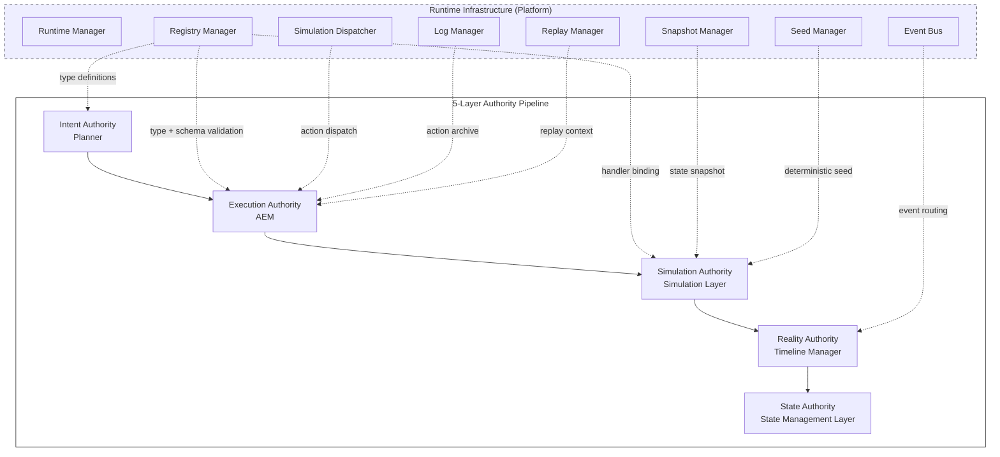
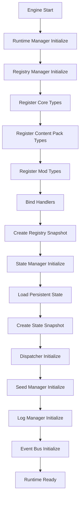
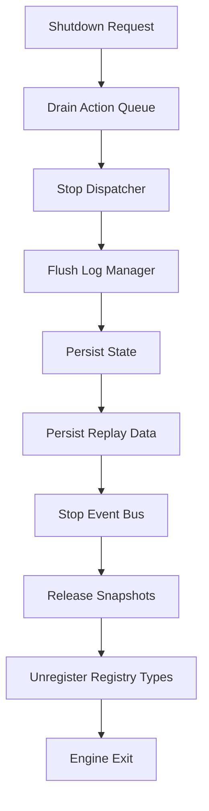
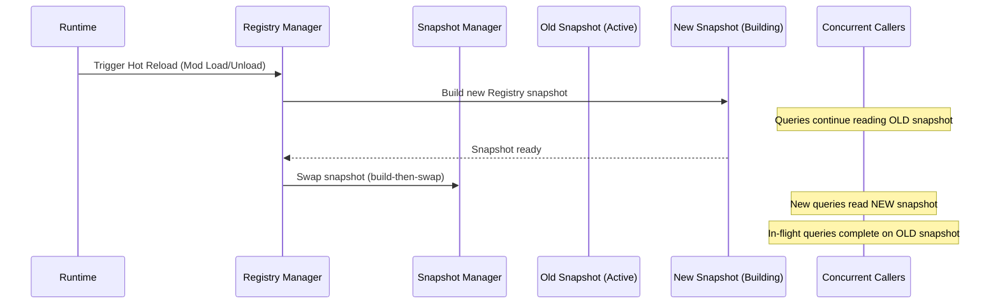

# Runtime Infrastructure Blueprint

**Version:** v1.0 RC2  
**Status:** RC  
**Last Updated:** 2026-07-14

**Depends On:** [Runtime Architecture Blueprint](./Runtime_Architecture_Blueprint.md), [Runtime State Model Blueprint](./Runtime_State_Model_Blueprint.md), [Action Execution Model v1.0 RC1](./Action_Execution_Model.md), [Action Registry v1.0 RC2](./Action_Registry.md), [Action Object Schema v1.0](../03_Data/Action_Object_Schema.md), [SimulationResult Schema v1.0 Draft](../03_Data/SimulationResult_Schema.md), [Event Object Schema v1.0 RC4](../03_Data/Event_Object_Schema.md), [Character State Schema v1.3](../03_Data/Character_State_Schema.md), [Relationship State Schema v1.0 RC3](../03_Data/Relationship_State_Schema.md)

---

## 1. Purpose（文档目的）

Define the infrastructure components, lifecycle management, and operational requirements of the AI Narrative RPG Engine Runtime — the platform on which all Authority layers execute.

定义 AI Narrative RPG Engine Runtime 的基础设施组件、生命周期管理和运营需求 — 所有权威层运行其上的平台。

### Core Definition（核心定义）

**Runtime Infrastructure is the platform, not the pipeline.**

Runtime Infrastructure 是平台，不是流水线。

The 5-Layer Authority Pipeline (Intent → Execution → Simulation → Reality → State) defines *what happens*. Runtime Infrastructure defines *where it runs, how it starts, how it stops, and how it stays stable*.

五层权威流水线（Intent → Execution → Simulation → Reality → State）定义*发生什么*。Runtime Infrastructure 定义*它在哪里运行、如何启动、如何停止、如何保持稳定*。

### Core Philosophy（核心理念）

**Infrastructure serves. Infrastructure does not decide.**

基础设施服务。基础设施不决策。

Runtime Infrastructure provides the runtime environment — component lifecycle, thread management, snapshot management, log management, and hot reload. It never decides which Action to execute (Intent Authority), whether an Action is valid (Execution Authority), what the simulation produces (Simulation Authority), what the world records (Reality Authority), or what the world looks like (State Authority). **Infrastructure never owns decision logic.**

Runtime Infrastructure 提供运行时环境 — 组件生命周期、线程管理、快照管理、日志管理和热更新。它从不决定执行哪个 Action（Intent Authority）、Action 是否有效（Execution Authority）、模拟产出什么（Simulation Authority）、世界记录什么（Reality Authority）、世界长什么样（State Authority）。**基础设施从不拥有决策逻辑。**

### Relationship to Authority Layers（与权威层的关系）



> **Dashed Lines Mean "Supports, Not Decides":** All Infrastructure connections are dashed. Infrastructure provides services (snapshots, seeds, logs, dispatch) to Authority layers. It never participates in Authority decisions. This is the fundamental separation between Platform and Pipeline.

---

## 2. Design Principles（设计原则）

| Principle | Description |
|-----------|-------------|
| **Infrastructure Serves, Does Not Decide** | Infrastructure provides platform capabilities. Authority decisions belong to the 5-layer pipeline. Infrastructure never owns decision logic. |
| **Requirements, Not Implementation** | This document defines what the Infrastructure SHALL provide, not how it is implemented (data structures, algorithms, memory management). |
| **Lifecycle Ownership** | Infrastructure owns component lifecycle (startup, shutdown, hot reload). It does not own data lifecycle (Action lifecycle, Event lifecycle, etc.). |
| **Orthogonal to Authority** | Infrastructure is orthogonal to the Authority pipeline — it supports all layers without belonging to any single layer. |
| **Deterministic Platform** | The Infrastructure SHALL provide a deterministic execution environment — same inputs produce same outputs, given the same seed. |
| **Hot Reload Safety** | Hot reload SHALL NOT interrupt in-flight operations. New code/data takes effect at the next safe boundary. |
| **Observable** | The Infrastructure SHALL provide observability hooks for debugging, profiling, and replay verification. |

---

## 3. Authority Boundaries（权威边界）

### What Infrastructure Owns（Infrastructure 拥有什么）

| Owned | Description |
|-------|-------------|
| Component Lifecycle | Engine startup, shutdown, and hot reload orchestration |
| Thread Model | Thread allocation, scheduling, and concurrency rules |
| Snapshot Management | Creating, storing, and swapping state snapshots |
| Seed Management | Deterministic seed generation and distribution |
| Log Management | Runtime Log stream, append ordering, retention, indexing |
| Replay Infrastructure | Replay session lifecycle, context restoration |
| Event Bus | Internal message routing between components (not to be confused with Event Object — this is infrastructure-level pub/sub) |
| Dispatch Infrastructure | Action dispatch from AEM to Simulation Layer (transport, not decision) |

### What Infrastructure Does NOT Own（Infrastructure 不拥有什么）

| Not Owned | Belongs To |
|-----------|------------|
| Action Type definitions | Registry Authority (Action Registry) |
| Action validation rules | Execution Authority (AEM) |
| Simulation rules and computation | Simulation Authority (Simulation Layer) |
| Event commit and Timeline | Reality Authority (Timeline Manager) |
| State mutation | State Authority (State Management Layer) |
| Action selection | Intent Authority (Planner) |
| Narrative planning | Narrative Director |
| Memory generation | Memory System |
| Decision logic | Authority Layers (all) |

> **Critical Boundary:** Infrastructure provides the *mechanisms* (snapshot creation, seed distribution, log persistence). Authority layers provide the *semantics* (what the snapshot contains, how the seed is used, what the log records). Infrastructure never interprets the content of the data it manages.

---

## 4. Runtime Components（运行时组件）

### 4.1 Runtime Manager（运行时管理器）

| Aspect | Description |
|--------|-------------|
| **Role** | Top-level coordinator for engine lifecycle |
| **Owns** | Startup sequence coordination, shutdown sequence coordination, runtime component list (ordering only) |
| **Does NOT Own** | Any Authority decision, any data semantics, component-internal lifecycle execution, component metadata |
| **Consumers** | All other components are coordinated by Runtime Manager |

> **Coordinator, Not Implementer:** Runtime Manager SHALL delegate component-specific lifecycle to each component. Runtime Manager coordinates startup/shutdown ordering; it does not execute component internals. Each component owns its own initialization and shutdown logic. This prevents Runtime Manager from becoming a God Object.
>
> **Process Coordinator, Not Component Manager:** Runtime Manager coordinates lifecycle ordering — `initialize(component)`, `shutdown(component)`, `order(components)`. It maintains a runtime component list for ordering purposes only. It does not own component metadata, component discovery, or component registration semantics. Registry Manager owns Action Type registration; Runtime Manager only coordinates the sequence.

### 4.2 Registry Manager（注册表管理器）

| Aspect | Description |
|--------|-------------|
| **Role** | Manages Action Registry lifecycle — registration, snapshot creation, hot reload |
| **Owns** | Registry initialization sequence, Registry snapshot lifecycle |
| **Does NOT Own** | Type definitions, validation rules, handler implementations |
| **Consumers** | Planner (Discovery API), AEM (Lookup API), Simulation Layer (handler binding) |
| **Requirements** | SHALL provide immutable snapshot, concurrent query safety, hot reload safety (see Action Registry §11) |

> **Deferred from Action Registry §11:** The specific data structures and indexing mechanisms used by Registry Manager to satisfy the Cache Requirements (§11.1–§11.5) are defined here as implementation concerns, not in the Action Registry document. Registry Manager SHALL satisfy all Cache Requirements defined in Action Registry §11.

### 4.3 Snapshot Manager（快照管理器）

| Aspect | Description |
|--------|-------------|
| **Role** | Manages Runtime State snapshots — creation, storage, fork, and archiving |
| **Owns** | Snapshot lifecycle (create → active → archived), fork management, archival management |
| **Does NOT Own** | State content (Character State, Relationship State, etc. — owned by State Authority), rollback policy (owned by Scene Engine / Transaction Manager), transaction recovery decisions |
| **Consumers** | Simulation Layer (snapshot for simulation), Scene Engine (transaction snapshot), Replay Manager (historical snapshot) |
| **Requirements** | SHALL avoid full state duplication when forking. Structural sharing or other efficient mechanisms MAY be used. SHALL guarantee snapshot consistency within a Scene transaction. |

> **Snapshot Provides, Transaction Decides:** Snapshot Manager provides restore points. Rollback is a transaction-level decision owned by Scene Engine or a future Transaction Manager. Snapshot Manager does not decide when to roll back — it provides the capability to restore.
>
> **Snapshot is a Storage Representation, Not a State Model:** Snapshot Manager stores immutable copies of state. State Authority produces state; Snapshot Manager stores it. A snapshot is a storage representation of state at a point in time — it is not itself the state model. State Authority owns the state model; Snapshot Manager owns the storage lifecycle.

### 4.4 Simulation Dispatcher（模拟调度器）

| Aspect | Description |
|--------|-------------|
| **Role** | Dispatches validated Actions from AEM to the Simulation Layer |
| **Owns** | Dispatch transport — the mechanism of delivering an Action + Snapshot + Seed to the Simulation Layer |
| **Does NOT Own** | Action validity (AEM decides), simulation rules (Simulation Layer decides), scheduling priority (AEM decides) |
| **Consumers** | AEM (submits via Dispatcher), Simulation Layer (receives via Dispatcher) |
| **Requirements** | SHALL guarantee dispatch ordering — Actions dispatched in the same order they were validated. SHALL support both synchronous and asynchronous dispatch modes. |

> **Transport Only:** Dispatcher transports validated Actions. Dispatcher never schedules, prioritizes, batches, retries, or transforms Actions. The Dispatcher is a transport layer, not a scheduler, not a priority queue, not a retry mechanism. Any scheduling or prioritization logic belongs to AEM.

### 4.5 Seed Manager（种子管理器）

| Aspect | Description |
|--------|-------------|
| **Role** | Generates and distributes deterministic seeds for Simulation Layer |
| **Owns** | Seed generation strategy, seed distribution to Simulation Ticks |
| **Does NOT Own** | How seeds are used in simulation (Simulation Layer's authority) |
| **Consumers** | Simulation Layer (seed for each SimulationResult), Replay Manager (seed restoration) |
| **Requirements** | SHALL produce reproducible seed sequences. SHALL guarantee that Replay uses the exact same seeds as the original execution. |

### 4.6 Log Manager（日志管理器）

| Aspect | Description |
|--------|-------------|
| **Role** | Manages the Runtime Log stream — the append-only infrastructure for archiving Runtime Objects |
| **Owns** | Runtime Log stream, log append ordering, log retention policy, log indexing |
| **Does NOT Own** | Log entry semantics, payload schema (Action Object content owned by Planner, Action Record content owned by AEM, SimulationResult content owned by Simulation Layer) |
| **Consumers** | AEM (archives Action Records), Simulation Layer (archives SimulationResults), Replay Manager (reads log for replay), Debug System (reads log for diagnostics) |
| **Requirements** | SHALL be append-only. SHALL guarantee log ordering matches execution ordering. SHALL support Replay queries (retrieve entries by tick, by correlation_id, by time range). |

> **Log Manager Owns the Stream, Not the Payload:** Log Manager owns the Runtime Log stream — its structure, ordering, retention, and indexing. It does not own the content of log entries. Action Objects, Action Records, and SimulationResults are log entry payloads; their semantics are owned by their respective Authority layers.

> **Runtime Log vs Event Timeline:** Runtime Log is infrastructure-level — it records Action Objects, Action Records, and SimulationResults for replay and debugging. Event Timeline is Authority-level — it records committed Events as objective reality. They are separate systems with separate owners.

> **Runtime Log Producer Flow:** Runtime Log is an append-only archive. Its producers are Authority layers, not Infrastructure components. Log Manager provides the stream; Authority layers provide the content.
>
> ```
> Planner → Action Object ─────────────────────┐
>                                               │
> AEM → Action Record ──────────────────────────┤
>                                               │
> Simulation Layer → SimulationResult ──────────┤
>                                               ▼
>                                          Runtime Log
>                                    (managed by Log Manager)
> ```
>
> Runtime Log is never produced by Event Timeline. Event Timeline records committed Events as observable reality; Runtime Log records execution artifacts for replay and debugging.

### 4.7 Replay Manager（重放管理器）

| Aspect | Description |
|--------|-------------|
| **Role** | Manages Replay sessions — restoring historical context and re-executing Actions |
| **Owns** | Replay session lifecycle (create → running → completed), replay context assembly |
| **Does NOT Own** | Replay rules (owned by SimulationResult Schema), replay validation, replay correctness comparison |
| **Consumers** | Debug System (replay for debugging), Save/Load System (replay for save verification), Testing Framework (replay for regression) |
| **Requirements** | SHALL restore: Runtime State Snapshot, Seed sequence, Action sequence. SHALL support replay verification (hash comparison against original results). SHALL NOT affect live Runtime state. |

> **Replay Manager Manages Sessions, Not Verification:** Replay Manager owns the replay session lifecycle and context assembly. Replay validation — comparing replayed results against originals — is a separate concern that may be owned by a Replay Validator or the Debug System. This prevents Replay Manager from accumulating verification logic and becoming a God Object.
>
> **Replay Consumes Runtime Log:** Replay Manager is a consumer of Runtime Log, not a producer. Log Manager produces the archive; Replay Manager consumes it. The relationship is strictly producer → consumer: `Log Manager (produces archive) → Replay Manager (consumes archive)`. Replay Manager SHALL NOT write to Runtime Log.

### 4.8 Event Bus（事件总线）

| Aspect | Description |
|--------|-------------|
| **Role** | Internal pub/sub message routing between Runtime components |
| **Owns** | Message routing infrastructure, subscription registry |
| **Does NOT Own** | Event Object lifecycle (Timeline Manager owns), Event content (Simulation Layer owns), observable reality (Event Objects are the sole source of world changes) |
| **Consumers** | All components that need to react to Runtime events (e.g., Memory System subscribes to "Event Committed" messages) |
| **Requirements** | SHALL guarantee message delivery ordering within a single Scene transaction. SHALL NOT deliver messages across Scene boundaries. |

> **Naming Clarification:** "Event Bus" is an infrastructure-level pub/sub system. "Event Object" is a data structure in the Reality Authority layer. They share the word "Event" but are entirely different concepts. Event Bus routes infrastructure messages; Event Objects record world reality.
>
> **Event Bus is NOT Observable Reality:** Event Bus is not observable reality. Messages routed through Event Bus are transient infrastructure messages. They are never Event Objects. Event Bus messages exist for component coordination; Event Objects exist for world recording.
>
> **Event Bus Messages are Delivery Artifacts:** Event Bus messages are delivery artifacts — notifications that something happened (e.g., "Timeline committed"). They are not domain events. The flow is: `SimulationResult → Event Object → Timeline → Event Bus Notification`. The notification is "Timeline committed," not "The dragon attacked." Event Bus messages carry no narrative content.

---

## 5. Startup Lifecycle（启动生命周期）

### 5.1 Startup Sequence（启动序列）



### 5.2 Startup Phases（启动阶段）

| Phase | Components | Description |
|-------|-----------|-------------|
| 1. Runtime Init | Runtime Manager | Initialize top-level coordinator |
| 2. Registry Init | Registry Manager | Register all Action Types, bind handlers, create immutable snapshot |
| 3. State Init | State Manager, Snapshot Manager | Load Persistent State from save, create initial State Snapshot |
| 4. Pipeline Init | Dispatcher, Seed Manager, Log Manager, Event Bus | Initialize infrastructure components for pipeline operation |
| 5. Ready | All | Runtime is ready to accept Actions |

### 5.3 Startup Rules（启动规则）

| Rule | Description |
|------|-------------|
| Sequential initialization | Components SHALL initialize in the specified order. Registry must be ready before State loads (State may reference Action Types). |
| Failure halts startup | If any phase fails, the engine SHALL NOT start. Partial initialization is not acceptable. |
| Registry snapshot before State load | Registry snapshot SHALL be created before State loading begins. State loading may query Registry for type validation. |
| State snapshot before Pipeline init | State snapshot SHALL be created before Pipeline initialization. Pipeline components need a valid State Snapshot to operate. |
| Seed sequence initialized | Seed Manager SHALL initialize its seed sequence before Runtime is Ready. The first Simulation Tick SHALL use the first seed in the sequence. |

---

## 6. Shutdown Lifecycle（关闭生命周期）

### 6.1 Shutdown Sequence（关闭序列）



### 6.2 Shutdown Phases（关闭阶段）

| Phase | Components | Description |
|-------|-----------|-------------|
| 1. Drain | AEM | Complete all in-flight Actions. No new Actions accepted. |
| 2. Stop Dispatch | Dispatcher | Stop dispatching Actions to Simulation Layer. |
| 3. Flush Logs | Log Manager | Write all pending log entries to persistent storage. |
| 4. Persist State | State Manager, Snapshot Manager | Persist final Persistent State to save file. |
| 5. Persist Replay | Replay Manager | Persist replay metadata (seed sequence, tick count, log index). |
| 6. Shutdown Infrastructure | Event Bus, Registry Manager | Stop infrastructure services, release resources. |
| 7. Exit | Runtime Manager | Engine process exits. |

### 6.3 Shutdown Rules（关闭规则）

| Rule | Description |
|------|-------------|
| Drain before stop | Action Queue SHALL be fully drained before stopping the Dispatcher. No Action shall be lost. |
| Flush before persist | Log Manager SHALL flush all pending entries before State persistence. Log and State must be consistent. |
| Persist before exit | Persistent State and Replay Data SHALL be fully persisted before engine exit. |
| Graceful timeout | If drain or flush exceeds a configurable timeout, the engine SHALL force-shutdown with a warning log. |
| No new Actions during shutdown | Once shutdown is initiated, no new Actions SHALL be accepted. Planner SHALL be notified that Runtime is shutting down. |

---

## 7. Hot Reload Requirements（热更新需求）

### 7.1 Hot Reload Scope（热更新范围）

| Trigger | What Reloads | What Does NOT Reload |
|---------|-------------|---------------------|
| Mod Load | Mod Action Types, Mod Handlers | Core Types, State, Timeline |
| Mod Unload | Mod Action Types removed, Mod Handlers unbound | Core Types, State, Timeline |
| Content Pack Update | Content Action Types, Content Handlers | Core Types, State, Timeline |
| Registry Hot Update | Registry snapshot rebuild | State, Timeline, in-flight Actions |

### 7.2 Hot Reload Sequence（热更新序列）



### 7.3 Hot Reload Rules（热更新规则）

| Rule | Description |
|------|-------------|
| Build-then-Swap | Hot reload SHALL build a complete new snapshot before making it visible. Callers never see a partially built snapshot. |
| In-Flight Safety | In-flight queries that have already started SHALL complete safely. They are not affected by snapshot replacement. |
| Scene Boundary | Hot reload SHALL only occur at Scene boundaries. Within a Scene, the snapshot is fixed. |
| Mod Unload Cancels Active Records | When a Mod is unloaded, associated Active Action Records SHALL be cancelled (cancellation_reason = `type_removed`). AEM decides the cancellation lifecycle. |
| No State Impact | Hot reload affects Registry and Handlers only. It SHALL NOT modify Runtime State, Timeline, or Memory. |

> **Implementation Deferred:** The specific mechanism for snapshot replacement (atomic swap, reference counting, epoch-based reclamation) is an implementation concern, not an architecture concern. The Architecture requires that the rules above are satisfied; the Infrastructure team chooses the mechanism.

---

## 8. Snapshot Management（快照管理）

### 8.1 Snapshot Types（快照类型）

| Snapshot Type | Owner | Purpose | Lifecycle |
|---------------|-------|---------|-----------|
| Registry Snapshot | Registry Manager | Immutable view of Action Type Definitions | Created at init, rebuilt on hot reload |
| State Snapshot | Snapshot Manager | Complete Runtime State at a point in time | Created at Scene start, committed or rolled back at Scene end |
| Replay Snapshot | Replay Manager | Historical State Snapshot for replay | Created during replay session, discarded after verification |
| Fork Snapshot | Snapshot Manager | Read-only state copy for prediction | Created for prediction, discarded after consumption |

### 8.2 Snapshot Requirements（快照需求）

| Requirement | Description |
|-------------|-------------|
| Consistency | A snapshot SHALL represent a complete, consistent state. No partial updates visible. |
| Immutability | Once created, a snapshot SHALL NOT be modified. New snapshots replace old ones. |
| Fork Efficiency | Forking a snapshot SHALL avoid full state duplication. Structural sharing or other efficient mechanisms MAY be used. |
| Scene Transaction Safety | Each Scene SHALL begin from a validated snapshot. If Scene execution fails, the engine rolls back to the snapshot. |
| Replay Isolation | Replay snapshots SHALL be isolated from live Runtime state. Replay SHALL NOT affect live queries. |

---

## 9. Thread Model（线程模型）

### 9.1 Threading Requirements（线程需求）

| Requirement | Description |
|-------------|-------------|
| Concurrent Query | Registry queries, State reads, and Log reads SHALL be thread-safe. Multiple modules can query concurrently. |
| No Query Blocking | No query operation SHALL block another query. Registration and hot reload SHALL NOT block concurrent queries. |
| Simulation Tick Atomicity | A Simulation Tick SHALL be atomic — either it completes and produces a SimulationResult, or it fails and rolls back. |
| Dispatch Ordering | Action dispatch ordering SHALL be preserved. The Dispatcher SHALL NOT reorder Actions. |
| Seed Thread-Safety | Seed generation SHALL be thread-safe. No two Simulation Ticks shall receive the same seed (unless replaying). |

### 9.2 Thread Model Principles（线程模型原则）

| Principle | Description |
|------------|-------------|
| Read-Heavy, Write-Structured | Runtime is read-heavy (queries, state reads) with structured writes (Simulation Ticks, commits). Infrastructure SHALL optimize for concurrent reads. |
| Write Serialization | State mutations SHALL be serialized through the Simulation Layer. No concurrent writes to the same state domain. |
| Hot Path Isolation | The Simulation Tick hot path (dispatch → simulate → commit) SHALL NOT be interrupted by non-critical operations (logging, profiling, debug). |

> **Implementation Deferred:** The specific threading model (thread pool, actor model, async runtime, green threads) is an implementation concern. The Architecture requires that the threading requirements above are satisfied.

---

## 10. Runtime Quality Attributes（运行时质量属性）

Runtime Infrastructure SHALL guarantee the following Quality Attributes. These are the foundational guarantees that all Runtime components must satisfy. Other Blueprints MAY reference these attributes without redefining them.

运行时基础设施 SHALL 保证以下质量属性。这是所有运行时组件必须满足的基础保证。其他 Blueprint 可引用这些属性，无需重新定义。

### 10.1 Determinism（确定性）

- **Reproducible Execution:** Same State Snapshot + Same Action + Same Seed = Same SimulationResult. The entire simulation is replayable.
- **Seed Continuity:** Seed sequence is deterministic and reproducible. Replay uses the exact same seeds.
- **Log Ordering:** Runtime Log ordering matches execution ordering. Replay can reconstruct execution sequence from log.

### 10.2 Consistency（一致性）

- **Snapshot Consistency:** All queries within a Scene transaction see the same snapshot — no partial updates.
- **Log-State Consistency:** Runtime Log and Persistent State SHALL be consistent at shutdown. Log entries match committed state changes.
- **Replay-Original Consistency:** Replay SHALL produce identical SimulationResults to the original execution. Verification confirms consistency.

### 10.3 Isolation（隔离性）

- **Replay Isolation:** Replay sessions SHALL NOT affect live Runtime state. Replay uses isolated snapshots and seeds.
- **Prediction Isolation:** Prediction (forked state simulation) SHALL NOT affect the main Timeline. Prediction results are never committed.
- **Registry Isolation:** Registry hot reload SHALL NOT affect in-flight queries. Old snapshot remains valid until all in-flight queries complete.

### 10.4 Recoverability（可恢复性）

- **Clean Startup:** Runtime SHALL start in a fully initialized state. No partial initialization.
- **Clean Shutdown:** Runtime SHALL shut down gracefully — all in-flight Actions completed, all logs flushed, all state persisted.
- **Hot Reload Safety:** Hot reload SHALL NOT interrupt in-flight operations. New code/data takes effect at the next Scene boundary.
- **Snapshot Restore:** Runtime SHALL be able to restore to any valid Snapshot. Snapshot Manager provides restore points; Transaction Authority decides when to restore.

### 10.5 Observability（可观测性）

- **Runtime Log:** Runtime Log SHALL be queryable for debugging, profiling, and replay. Log entries are indexed by tick, correlation_id, and time range.
- **Hook Points:** Infrastructure SHALL provide observability hooks for profiling (Simulation Tick timing, dispatch latency, snapshot creation cost).
- **Replay Support:** Replay infrastructure SHALL support deterministic re-execution for debugging and regression testing.

---

## 11. Memory Model（内存模型）

### 11.1 Memory Requirements（内存需求）

| Requirement | Description |
|-------------|-------------|
| In-Memory State | Runtime State SHALL reside in memory during execution. Disk I/O is for persistence only, not for runtime queries. |
| Snapshot Efficiency | Snapshots SHALL use memory-efficient representations. Full state duplication is only for save/load. Structural sharing or other efficient mechanisms SHALL be used for runtime forks. |
| Log Bounded Retention | Runtime Log SHALL have a bounded retention policy. Old log entries are archived or discarded to prevent unbounded memory growth. |
| SimulationResult Transience | SimulationResults SHALL be transient — they exist in memory during a Scene and are discarded at Scene completion. |

### 11.2 Hardware Considerations（硬件考量）

**Target Hardware:** RTX 5060 8GB / 32GB RAM

| Consideration | Description |
|---------------|-------------|
| Memory Budget | Runtime State, Snapshots, and Logs SHALL fit within a configurable memory budget. |
| Background Persistence | Persistence (save/load) SHALL occur in background, not blocking the Simulation Tick. |
| Snapshot Compression | Snapshots SHALL support optional compression to reduce memory footprint. |

> **Implementation Deferred:** The specific memory management strategy (arena allocation, garbage collection, memory pools) is an implementation concern.

---

## 12. Non-Goals（非目标）

This document intentionally does **not** define the following:

本文档有意**不**定义以下内容：

| Non-Goal | Owned By |
|----------|----------|
| Action Object structure | Action Object Schema (Locked) |
| Action validation rules | Action Execution Model (RC1) |
| Action Type definitions | Action Registry (RC2) |
| Simulation rules and computation | Simulation Layer Blueprint |
| SimulationResult structure | SimulationResult Schema |
| Event structure and commit | Event Object Schema + Timeline Manager |
| State mutation rules | State Management Layer |
| Character State structure | Character State Schema |
| Relationship State structure | Relationship State Schema |
| Scene lifecycle | Scene Engine Blueprint |
| Narrative planning | Narrative Director Blueprint |
| Memory generation | Memory Architecture Blueprint |
| Planner decision logic | Future: Planner / Intent Parser |
| Decision logic | Authority Layers (all) |
| Specific data structures (HashMap, TreeMap, etc.) | Implementation (not Architecture) |
| Specific threading model (thread pool, actor, etc.) | Implementation (not Architecture) |
| Specific memory management (GC, arena, etc.) | Implementation (not Architecture) |
| Database schema or storage format | Implementation (not Architecture) |

> **Boundary Summary:** Runtime Infrastructure owns *the platform* — component lifecycle, thread management, snapshot management, seed management, log management, replay infrastructure, and event bus. It does not own *the pipeline* — Action selection, validation, simulation, event commit, or state mutation. It provides mechanisms; Authority layers provide semantics. Infrastructure never owns decision logic.

---

## 13. References

**Depends On:**

- [Runtime Architecture Blueprint](./Runtime_Architecture_Blueprint.md)
- [Runtime State Model Blueprint](./Runtime_State_Model_Blueprint.md)
- [Action Execution Model v1.0 RC1](./Action_Execution_Model.md)
- [Action Registry v1.0 RC2](./Action_Registry.md)
- [Action Object Schema v1.0](../03_Data/Action_Object_Schema.md)
- [SimulationResult Schema v1.0 Draft](../03_Data/SimulationResult_Schema.md)
- [Event Object Schema v1.0 RC4](../03_Data/Event_Object_Schema.md)
- [Character State Schema v1.3](../03_Data/Character_State_Schema.md)
- [Relationship State Schema v1.0 RC3](../03_Data/Relationship_State_Schema.md)
- [Glossary](../00_Project/Glossary.md)

**Referenced By:**

- Action Registry §11 Cache Requirements (implementation deferred to this document)
- Action Execution Model (Dispatcher, Log, Seed referenced by AEM)
- Simulation Layer Blueprint (Snapshot, Seed, Dispatcher used by Simulation)
- Scene Engine Blueprint (Snapshot Manager used for Scene transactions)
- [Runtime Pipeline Blueprint](./Runtime_Pipeline_Blueprint.md) (Infrastructure as platform for pipeline)
- Future: Replay System (Replay Manager infrastructure)
- [Runtime Glossary](./Runtime_Glossary.md) (unified terminology definitions)

---

## 14. Revision History

| Version | Date | Description |
|---------|------|-------------|
| v1.0 Draft | 2026-07-14 | Initial document: Runtime Infrastructure definition (platform vs pipeline separation), 8 core components (Runtime Manager, Registry Manager, Snapshot Manager, Simulation Dispatcher, Seed Manager, Log Manager, Replay Manager, Event Bus), Startup Lifecycle (5 phases), Shutdown Lifecycle (7 phases), Hot Reload Requirements, Snapshot Management, Thread Model, Runtime Guarantees (Determinism, Lifecycle, Consistency, Isolation), Memory Model, Non-Goals. Implementation details (data structures, threading model, memory management) explicitly deferred to implementation phase. |
| v1.0 RC1 | 2026-07-14 | Convergence refactoring based on Architecture Review (9.7/10): Purified Log Manager ownership (owns stream, not payload). Separated Replay Manager from verification (manages sessions, not validation). Separated Snapshot Manager from rollback (provides restore points, transaction decides). Declared Runtime Manager as Coordinator (delegates to components, prevents God Object). Replaced Copy-on-Write with requirement-level descriptions (structural sharing MAY be used). Added Event Bus "not observable reality" declaration. Restructured Guarantees into unified Quality Attributes framework (Determinism, Consistency, Isolation, Recoverability, Observability). |
| v1.0 RC2 | 2026-07-14 | Boundary hardening based on Architecture Review (9.8/10): Runtime Manager further weakened from "component registration" to "lifecycle ordering coordinator" (Process Coordinator, Not Component Manager). Snapshot Manager declared as "storage representation, not State model." Dispatcher declared as "Transport Only" (never schedules, prioritizes, batches, retries, or transforms). Replay Manager declared as "consumes Runtime Log" (producer/consumer relationship). Event Bus messages declared as "delivery artifacts" (notifications, not domain events). Runtime Log producer flow diagram added. "Decision logic" added to Non-Goals, Core Philosophy, and Design Principles. |

---

## 15. Document Governance（文档治理）

**Status:** RC

**Status Values:** Draft → RC → Locked → Deprecated

**Owner:** Runtime Architect

**Architecture Reviewers:**

- Engine Architect
- Simulation Architect
- Narrative Architect

**Architecture Approval:** Architecture Review Required

**Update Policy:** Changes affecting component boundaries, lifecycle sequences, thread model requirements, or Authority separation rules require ADR approval.
