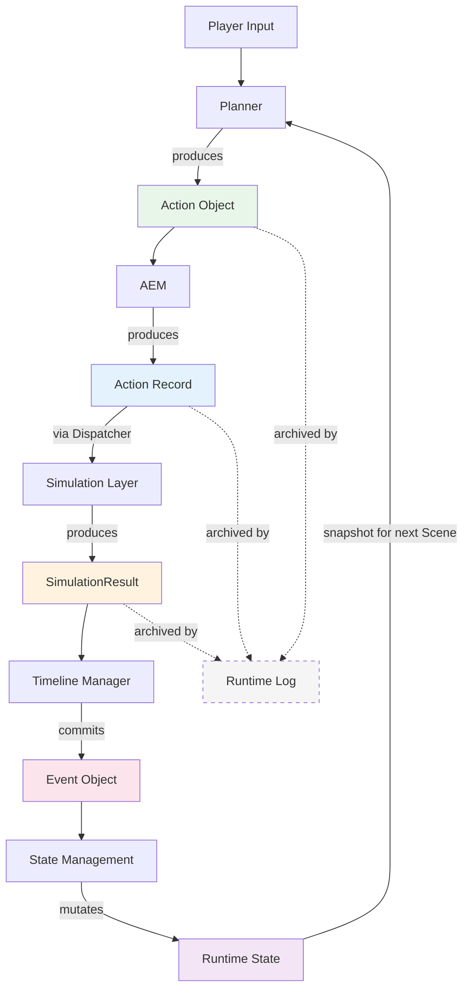
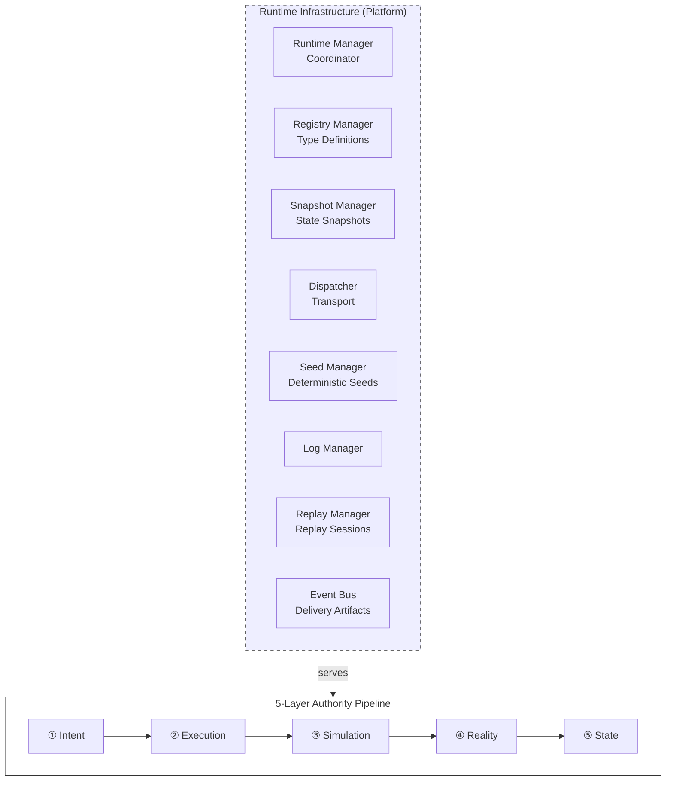

# Runtime Pipeline Blueprint

**Version:** v1.0 Draft  
**Status:** Draft  
**Last Updated:** 2026-07-14

**Depends On:** All Architecture and Data Blueprints (see §7 Document Map)

---

## 1. Purpose（文档目的）

This document is the **entry point** to the Runtime Blueprint collection. It serializes the end-to-end Runtime Pipeline — from Player Input to State Mutation — and maps each stage to its authoritative Blueprint.

本文档是 Runtime Blueprint 集合的**入口**。它将端到端运行时流水线 — 从玩家输入到状态变更 — 串联起来，并将每个阶段映射到其权威 Blueprint。

### Core Definition（核心定义）

**The Pipeline decides. Infrastructure serves.**

流水线决策。基础设施服务。

The 5-Layer Authority Pipeline defines *what happens*. Runtime Infrastructure defines *where it runs*. This document defines *how they connect*.

五层权威流水线定义*发生什么*。运行时基础设施定义*在哪里运行*。本文档定义*它们如何连接*。

### What This Document Is（本文档是什么）

- A **navigation map** for the entire Runtime Blueprint collection
- An **end-to-end flow diagram** showing how data transforms through the pipeline
- A **document index** mapping each pipeline stage to its authoritative Blueprint

### What This Document Is NOT（本文档不是什么）

- It does NOT define any Authority boundary (see individual Blueprints)
- It does NOT define any data schema (see Data Schemas)
- It does NOT define any infrastructure component (see Runtime Infrastructure Blueprint)
- It does NOT introduce new concepts — it only connects existing ones

---

## 2. The 5-Layer Authority Pipeline（五层权威流水线）

```mermaid
flowchart LR
    subgraph L1["① Intent Authority"]
        PL[Planner]
    end
    subgraph L2["② Execution Authority"]
        AEM[Action Execution Model]
    end
    subgraph L3["③ Simulation Authority"]
        SIM[Simulation Layer]
    end
    subgraph L4["④ Reality Authority"]
        TL[Timeline Manager]
    end
    subgraph L5["⑤ State Authority"]
        STA[State Management Layer]
    end

    PL -->|"Action Object"| AEM
    AEM -->|"Action Record"| SIM
    SIM -->|"SimulationResult"| TL
    TL -->|"Event Object(s)"| STA
    STA -->|"State Mutation"| STATE[Runtime State]

    style L1 fill:#e8f5e9,stroke:#2e7d32
    style L2 fill:#e3f2fd,stroke:#1565c0
    style L3 fill:#fff3e0,stroke:#e65100
    style L4 fill:#fce4ec,stroke:#c62828
    style L5 fill:#f3e5f5,stroke:#6a1b9a
```



Each layer has exactly one Authority — one owner that decides. Data flows strictly left to right. No layer may skip ahead or feed back directly.

每层有且只有一个权威 — 一个决策者。数据严格从左向右流动。任何层不得跳跃或直接回传。

---

## 3. Pipeline Stages（流水线阶段）

### ① Intent Authority — Planner

| Aspect | Description |
|--------|-------------|
| **Input** | Player input, Narrative Director goals, World State context |
| **Authority** | Decides *what Action to attempt* |
| **Output** | Action Object (declarative intent, not execution steps) |
| **Blueprint** | Future: Planner / Intent Parser |
| **Data Schema** | [Action Object Schema](../03_Data/Action_Object_Schema.md) |
| **Infrastructure Support** | Registry Manager (Discovery API for available Action Types) |

> The Action Object is a declaration of intent: "I want to do X." It contains no execution logic, no scheduling, no simulation parameters.

### ② Execution Authority — AEM (Action Execution Model)

| Aspect | Description |
|--------|-------------|
| **Input** | Action Object |
| **Authority** | Decides *whether the Action is valid and how to execute it* |
| **Output** | Action Record (validated, with execution metadata) |
| **Blueprint** | [Action Execution Model](./Action_Execution_Model.md) |
| **Data Schema** | Action Record (defined in AEM) |
| **Infrastructure Support** | Registry Manager (type lookup, schema validation), Dispatcher (transport to Simulation), Log Manager (archive Action Record) |

> AEM validates the Action against Registry type definitions and schema. If validation fails, AEM decides the Action's fate (cancel, retry, or reject). AEM does not simulate — it prepares and dispatches.

### ③ Simulation Authority — Simulation Layer

| Aspect | Description |
|--------|-------------|
| **Input** | Action Record + State Snapshot + Seed |
| **Authority** | Decides *what happens when the Action meets the world* |
| **Output** | SimulationResult (computed outcome, deltas, narrative seed) |
| **Blueprint** | [Simulation Layer Blueprint](./Simulation_Layer_Blueprint.md) |
| **Data Schema** | [SimulationResult Schema](../03_Data/SimulationResult_Schema.md) |
| **Infrastructure Support** | Snapshot Manager (state snapshot), Seed Manager (deterministic seed), Dispatcher (receives Action), Log Manager (archive SimulationResult) |

> The Simulation Layer is the core of the engine. It takes a declarative Action and computes what actually happens. The SimulationResult is transient — it exists during the Scene and is discarded after the Timeline commits it.

### ④ Reality Authority — Timeline Manager

| Aspect | Description |
|--------|-------------|
| **Input** | SimulationResult |
| **Authority** | Decides *what becomes objective reality* |
| **Output** | Event Object(s) (committed to Timeline) |
| **Blueprint** | [Event Object Schema](../03_Data/Event_Object_Schema.md) (+ future Timeline Manager Blueprint) |
| **Data Schema** | [Event Object Schema](../03_Data/Event_Object_Schema.md) |
| **Infrastructure Support** | Event Bus (notifies subscribers of committed Events), Log Manager (archive) |

> The Timeline Manager commits SimulationResults as immutable Event Objects. Once committed, an Event is objective reality — it cannot be revoked, modified, or undone. The Timeline is the authoritative record of what happened.

### ⑤ State Authority — State Management Layer

| Aspect | Description |
|--------|-------------|
| **Input** | Event Object(s) |
| **Authority** | Decides *how the world changes* |
| **Output** | State Mutation (Character State, Relationship State, World State, etc.) |
| **Blueprint** | [Runtime State Model Blueprint](./Runtime_State_Model_Blueprint.md) |
| **Data Schema** | [Character State Schema](../03_Data/Character_State_Schema.md), [Relationship State Schema](../03_Data/Relationship_State_Schema.md) |
| **Infrastructure Support** | Snapshot Manager (state snapshot for next Scene), Event Bus (notification) |

> State Authority applies Event Deltas to Runtime State. After mutation, the new State becomes the basis for the next Scene's snapshot. State is the ground truth of the world.

---

## 4. End-to-End Data Flow（端到端数据流）



> **Solid lines** are Authority data flow (the pipeline). **Dashed lines** are Infrastructure archival (Runtime Log). Every Runtime Object is archived by Log Manager, but archival does not affect the pipeline.

---

## 5. Infrastructure Platform（基础设施平台）

Runtime Infrastructure provides the platform on which all 5 layers run. Infrastructure never participates in Authority decisions.



| Infrastructure Component | Serves Which Layer(s) | How |
|-------------------------|----------------------|-----|
| Registry Manager | Intent, Execution, Simulation | Discovery API (Planner), Type Lookup (AEM), Handler Binding (Simulation) |
| Snapshot Manager | Simulation, State | State Snapshot (Simulation input), Snapshot after commit (State output) |
| Dispatcher | Execution, Simulation | Transports validated Actions from AEM to Simulation Layer |
| Seed Manager | Simulation, Replay | Deterministic seed for each Simulation Tick |
| Log Manager | All | Archives Action Objects, Action Records, SimulationResults |
| Event Bus | Reality, State, Memory | Notifies subscribers when Events are committed |
| Replay Manager | All (read-only) | Restores historical context for re-execution |
| Runtime Manager | All | Coordinates startup/shutdown ordering |

> **For full Infrastructure definitions:** See [Runtime Infrastructure Blueprint](./Runtime_Infrastructure_Blueprint.md).

---

## 6. Acyclic Data Flow Rule（无环数据流规则）

Data flow in the Runtime Pipeline is **strictly acyclic**:

运行时流水线中的数据流是**严格无环**的：

```
Action → SimulationResult → Event → State
```

- Action never depends on SimulationResult
- SimulationResult never depends on Event
- Event never depends on State
- State never feeds back into Action (State influences Planner via context, not via direct dependency)

> **Context vs. Dependency:** State Authority provides *context* to the Planner (what the world looks like now). This is not a pipeline dependency — the Planner reads State as input context, not as a pipeline stage. The pipeline flows forward only.

---

## 7. Document Map（文档导航）

This is the complete index of Runtime Blueprints. **New readers: start here.**

这是 Runtime Blueprint 的完整索引。**新读者：从这里开始。**

### Architecture Blueprints

| Blueprint | Status | Authority / Role | What It Defines |
|-----------|--------|-----------------|-----------------|
| **Runtime Pipeline Blueprint** (this document) | Draft | Navigation | End-to-end pipeline flow, document index |
| [Runtime Architecture Blueprint](./Runtime_Architecture_Blueprint.md) | Draft | Overview | Runtime principles, Scene lifecycle, module call order |
| [Runtime Infrastructure Blueprint](./Runtime_Infrastructure_Blueprint.md) | RC2 | Platform | 8 infrastructure components, lifecycle, quality attributes |
| [Runtime State Model Blueprint](./Runtime_State_Model_Blueprint.md) | Draft | State Authority | Persistent vs. Session State, snapshot semantics |
| [Action Execution Model](./Action_Execution_Model.md) | RC1 | Execution Authority | Action lifecycle, validation, dispatch rules |
| [Action Registry](./Action_Registry.md) | RC2 | Registry Authority | Type definitions, schemas, capabilities, discovery |
| [Simulation Layer Blueprint](./Simulation_Layer_Blueprint.md) | Draft | Simulation Authority | Simulation rules, handler execution, Tick model |
| [Scene Engine Blueprint](./Scene_Engine_Blueprint.md) | Draft | Scene Transaction | Scene lifecycle, transaction, commit, rollback |
| [Narrative Director Blueprint](./Narrative_Director_Blueprint.md) | Draft | Narrative Planning | Goal selection, story pacing, emotional timing |
| [Relationship Engine Blueprint](./Relationship_Engine_Blueprint.md) | Draft | Relationship Runtime | Relationship influence on events, dialogue, behavior |
| [Memory Architecture Blueprint](./Memory_Architecture_Blueprint.md) | Draft | Memory System | Memory creation, retrieval, embedding, indexing |
| [LLM Runtime Blueprint](./LLM_Runtime_Blueprint.md) | Draft | Generation | LLM execution, model switching, prompt management |
| [Image Pipeline](./Image_Pipeline.md) | Draft | Generation | Image generation, async queue, CG rendering |
| [Prompt Builder Blueprint](./Prompt_Builder_Blueprint.md) | Draft | Generation | Prompt assembly, context injection |
| [GPU Scheduler](./GPU_Scheduler.md) | Draft | Infrastructure | GPU resource allocation, model scheduling |
| [Renderer Layer](./Renderer_Layer.md) | Draft | Presentation | Visual rendering, UI |

### Data Schemas

| Schema | Status | What It Defines |
|--------|--------|-----------------|
| [Action Object Schema](../03_Data/Action_Object_Schema.md) | Locked | Declarative intent structure |
| [SimulationResult Schema](../03_Data/SimulationResult_Schema.md) | Draft | Computed outcome, deltas, narrative seed |
| [Event Object Schema](../03_Data/Event_Object_Schema.md) | RC4 | Committed reality, Timeline entry |
| [Character State Schema](../03_Data/Character_State_Schema.md) | RC | Character state structure |
| [Relationship State Schema](../03_Data/Relationship_State_Schema.md) | RC3 | Relationship state structure |

---

## 8. Quality Attributes（质量属性引用）

The Runtime Pipeline inherits all Quality Attributes defined in [Runtime Infrastructure Blueprint §10](./Runtime_Infrastructure_Blueprint.md):

| Attribute | Defined In | Pipeline Implication |
|-----------|-----------|---------------------|
| Determinism | Infrastructure §10.1 | Same Input → Same Output, end to end |
| Consistency | Infrastructure §10.2 | Pipeline state is consistent at every Scene boundary |
| Isolation | Infrastructure §10.3 | Each Authority layer is isolated from others |
| Recoverability | Infrastructure §10.4 | Pipeline can restore to any Scene boundary |
| Observability | Infrastructure §10.5 | Every pipeline stage is logged and queryable |

---

## 9. References

**Depends On:**

- All Architecture Blueprints (see §7 Document Map)
- All Data Schemas (see §7 Document Map)
- [Runtime Glossary](./Runtime_Glossary.md)

**Referenced By:**

- All Runtime Blueprints (Pipeline as navigation entry point)

---

## 10. Revision History

| Version | Date | Description |
|---------|------|-------------|
| v1.0 Draft | 2026-07-14 | Initial document: End-to-end Runtime Pipeline serialization. 5-Layer Authority Pipeline (Intent → Execution → Simulation → Reality → State). Pipeline stage definitions with data flow. Infrastructure platform mapping. Acyclic data flow rule. Complete document map for all Architecture Blueprints and Data Schemas. Quality attributes cross-reference to Infrastructure §10. |
