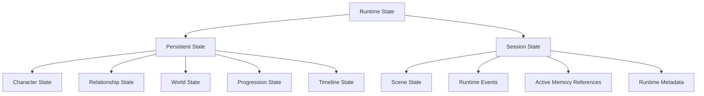
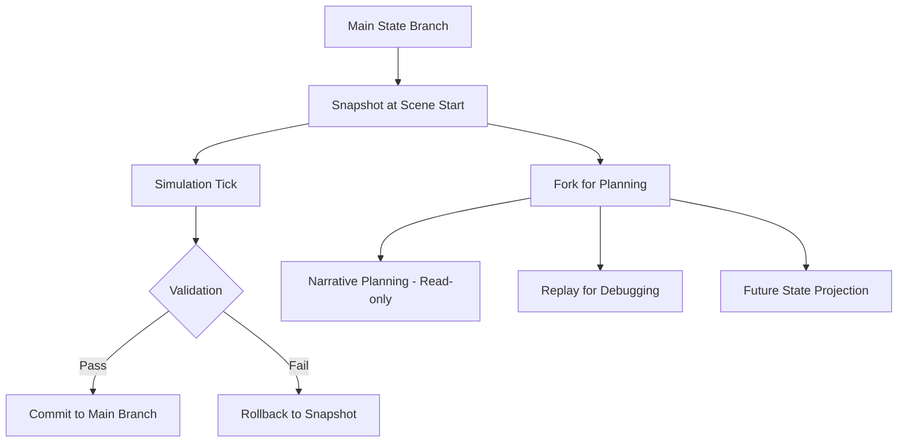

# Runtime State Model Blueprint

**Version:** v1.1  
**Status:** Draft  
**Last Updated:** 2026-07-14

**Depends On:** [Runtime Pipeline Blueprint](./Runtime_Pipeline_Blueprint.md), [Runtime Infrastructure Blueprint](./Runtime_Infrastructure_Blueprint.md), [Simulation Layer Blueprint](./Simulation_Layer_Blueprint.md), [Runtime Glossary](./Runtime_Glossary.md)

---

## 1. Purpose（文档目的）

Define the structure, ownership, lifecycle, and mutation rules of Runtime State in the AI Narrative RPG Engine.

定义 AI Narrative RPG Engine 中 Runtime State 的结构、归属、生命周期和变更规则。

### Core Definition（核心定义）

Runtime State is the **single source of ground truth** for the entire Engine at runtime.

Runtime State 是引擎运行时的**唯一事实来源**。

It encompasses all persistent game data and all transient runtime data that exist during a Scene execution.

它涵盖 Scene 执行期间存在的所有持久化游戏数据和所有瞬态运行时数据。

### Core Philosophy（核心理念）

Runtime State is fact. Generated content is expression.

Runtime State 是事实，生成内容是表达。

The Engine reads Runtime State to produce experiences, and writes back to Runtime State only through **State Authority (Layer ⑤)**. Simulation Authority (Layer ③) computes what should change (deltas); State Authority applies those changes.

引擎读取 Runtime State 产生体验，仅通过**状态权威（第⑤层）**写回 Runtime State。模拟权威（第③层）计算应该改变什么（delta）；状态权威应用这些改变。

> **Pipeline Alignment:** Runtime State is owned by **State Authority — Layer ⑤** of the [5-Layer Authority Pipeline](./Runtime_Pipeline_Blueprint.md). Simulation Authority (Layer ③) computes deltas; State Authority (Layer ⑤) applies mutations. See [Simulation Layer Blueprint](./Simulation_Layer_Blueprint.md) for the computation contract.

---

## 2. Responsibilities（职责）

### Responsible For（负责）

- Defining the structure of Runtime State
- Defining the boundary between Persistent State and Session State
- Defining ownership and access rights for each state domain
- Defining state mutation rules and guarantees
- Serving as the parent blueprint for all future schema documents

### Not Responsible For（不负责）

- Specific data schema implementation
- Database schema or storage format
- Prompt templates
- Module call order (see Runtime Architecture Blueprint)
- Scene lifecycle management (see Scene Engine Blueprint)

---

## 3. Document Governance（文档治理）

**Owner:** Runtime Architect

**Architecture Reviewers:**

- Engine Architect
- Simulation Architect
- Memory Architect

**Architecture Approval:** Architecture Review Required

**Last Reviewed:** 2026-07-14

**Parent Blueprint:** [Runtime Pipeline Blueprint](./Runtime_Pipeline_Blueprint.md)

**Update Policy:** Changes affecting state domain structure, ownership boundaries, Pipeline alignment, or snapshot/branch semantics require ADR approval.

---

## 4. Design Principles（设计原则）

| Principle | Description |
|-----------|-------------|
| State Is Fact | 状态是唯一事实来源。Runtime State is the single source of truth. |
| State Owns Mutation | 只有 State Authority（第⑤层）可以变更 Persistent State。Only State Authority (Layer ⑤) may mutate Persistent State. Simulation Authority (Layer ③) computes deltas; State Authority applies them. |
| Persistent vs Session Separation | 持久状态与会话状态严格分离。Persistent State survives across sessions; Session State is transient. |
| Reference, Not Own | Runtime State 引用记忆，不拥有记忆数据库。Runtime State references memories, not owns the Memory database. |
| Deterministic Snapshot | 相同状态 + 相同输入 = 相同输出。Identical state + identical input = identical output. |
| Branchable | 状态支持分支与回滚。State supports branching and rollback for deterministic simulation and replay. |

---

## 5. Runtime State Structure（Runtime State 结构）

Runtime State is divided into two layers: **Persistent State** and **Session State**.

### 5.1 Persistent State（持久状态）

Persistent State is long-lived game data that survives across sessions, scenes, and engine restarts.

持久状态是跨会话、跨 Scene、跨引擎重启存活的长期游戏数据。

| Domain | Description | Key Fields |
|--------|-------------|------------|
| Character State | 角色状态 — 人格、情绪、目标、内部状态 | personality, mood, goals, internal_state |
| **Relationship State** | **关系状态（核心）** — 多维度关系数据 | trust, affection, dependence, intimacy, respect, jealousy, attachment |
| World State | 世界状态 — 时间、地点、环境、全局事件 | time, location, environment, global_events |
| Progression State | 进度状态 — 任务、解锁、故事推进 | quest_progress, unlock_status, story_progression |
| Timeline State | 时间线状态 — 连续事件时间线 | timeline_entries, current_epoch |

**Relationship State is the core driver of the entire Engine.**

**Relationship State 是整个引擎的核心驱动。**

### 5.2 Session State（会话状态）

Session State is transient runtime data that exists only during the current Scene execution. It is discarded or committed at Scene completion.

会话状态是仅在当前 Scene 执行期间存在的瞬态运行时数据，在 Scene 完成时丢弃或提交。

| Domain | Description | Key Fields |
|--------|-------------|------------|
| Scene State | 场景状态 — 当前 Scene 执行状态 | scene_phase, active_participants, current_objective |
| Runtime Events | 运行时事件 — 当前 Tick 产生的瞬态事件 | trigger, actor, action, consequence, narrative_weight, priority |
| Active Memory References | 活跃记忆引用 — 当前 Scene 激活的记忆引用列表 | memory_id, activation_level, retrieval_priority |
| Runtime Metadata | 运行时元数据 — 标识和追踪当前执行上下文 | see Section 7 |

#### Scene State（场景状态）

Scene State tracks the execution progress of the current Scene.

| Field | Description |
|-------|-------------|
| scene_phase | Current phase (Created, Simulating, Planning, Generating, Completed) |
| active_participants | Characters involved in the current Scene |
| current_objective | The objective of the current Scene |

#### Runtime Events（运行时事件）

Runtime Events are **transient**. They exist only within the current Scene execution.

运行时事件是**瞬态的**，仅存在于当前 Scene 执行期间。

Historical events are not stored in Runtime State. They belong to the **Memory System**.

历史事件不存储在 Runtime State 中，它们属于 **Memory System**。

| Field | Description |
|-------|-------------|
| trigger | 触发条件 |
| actor | 参与者 |
| action | 行为 |
| consequence | 后果 |
| narrative_weight | 叙事权重 |
| priority | 优先级 |

#### Active Memory References（活跃记忆引用）

Runtime State does **NOT** own the Memory database. Instead, it holds a lightweight reference to memories activated for the current Scene.

Runtime State **不拥有** 记忆数据库。它持有当前 Scene 激活的记忆的轻量引用。

| Field | Description |
|-------|-------------|
| memory_id | Reference to a Memory Object in the Memory System |
| activation_level | 激活级别 (0.0 – 1.0) |
| retrieval_priority | 检索优先级 |

**Rule:** Memory Objects themselves are owned and managed by the Memory System. Runtime State only holds references.

**规则：** Memory Object 本身由 Memory System 拥有和管理，Runtime State 只持有引用。

---

## 6. Boundary Definition（边界定义）

### Owns（拥有）

- Persistent State structure definition
- Session State structure definition
- State mutation rules
- Snapshot / Branch semantics
- Runtime Metadata definition

### Does NOT Own（不拥有）

- Memory Objects (owned by Memory System)
- Historical Event Log (owned by Memory System)
- Prompt data (owned by Prompt Builder)
- Narrative plans (owned by Narrative Director)
- LLM output (owned by LLM Runtime)

---

## 7. Runtime Metadata（运行时元数据）

Runtime Metadata identifies and tracks the current execution context. It is part of Session State.

| Field | Description |
|-------|-------------|
| game_id | 当前游戏存档的唯一标识 |
| runtime_version | 引擎运行时版本 |
| save_version | 存档格式版本 |
| scene_id | 当前 Scene 的唯一标识 |
| tick | 当前 Simulation Tick 编号 |
| seed | 当前确定性种子 |
| created_at | 当前 Session 创建时间戳 |
| updated_at | 最近一次状态更新时间戳 |

Runtime Metadata is used for:

- Deterministic replay
- Save/load compatibility checking
- Debugging and observability
- Version migration

---

## 8. Runtime Ownership（运行时归属）

This section explicitly defines which module owns each runtime domain and which modules have read-only access.

### Ownership Matrix（归属矩阵）

| State Domain | Owner (Read/Write) | Read-Only Access |
|--------------|-------------------|-----------------|
| Character State | State Management (State Authority ⑤) | Simulation Layer, Narrative Director, Prompt Builder, Memory System, LLM Runtime |
| **Relationship State** | State Management (State Authority ⑤) | Simulation Layer, Narrative Director, Prompt Builder, Memory System |
| World State | State Management (State Authority ⑤) | Simulation Layer, Narrative Director, Prompt Builder, Memory System |
| Progression State | State Management (State Authority ⑤) | Simulation Layer, Narrative Director, Prompt Builder |
| Timeline State | State Management (State Authority ⑤) | Simulation Layer, Narrative Director, Prompt Builder, Memory System |
| Scene State | Scene Engine | Simulation Layer, Narrative Director |
| Runtime Events | Simulation Layer | Narrative Director, Prompt Builder |
| Active Memory References | Memory System | Narrative Director, Prompt Builder, Simulation Layer |
| Runtime Metadata | Scene Engine | All modules (read-only) |

### Ownership Rules（归属规则）

| Rule | Description |
|------|-------------|
| State Authority (Layer ⑤) is the sole mutation authority | 只有 State Authority 可以变更 Persistent State。Only State Authority may mutate Persistent State. Simulation Authority (Layer ③) computes deltas; State Authority applies them. |
| Relationship Engine computes deltas via Simulation Layer | Relationship Engine 计算 Relationship delta，delta 包含在 SimulationResult 中，State Authority 应用变更。Relationship Engine computes relationship deltas; deltas are included in SimulationResult; State Authority applies them. |
| Memory System manages Active Memory References | Memory System 负责激活和更新记忆引用，但不修改 Persistent State。 |
| Scene Engine manages Scene State and Runtime Metadata | Scene Engine 管理场景执行状态和元数据，但不修改 Persistent State。 |
| All other modules are read-only consumers | 所有其他模块只读消费 Runtime State。 |

---

## 9. Snapshot & Branch Semantics（快照与分支语义）

### 9.1 Snapshot（快照）

A Snapshot captures the complete Runtime State at a specific point in time.

快照捕获特定时间点的完整 Runtime State。

Every Scene begins from a Snapshot. If Scene execution fails, the Engine rolls back to the Snapshot.

每个 Scene 从快照开始。如果 Scene 执行失败，引擎回滚到快照。

### 9.2 Branch / Fork（分支 / 分叉）

Runtime State supports **Branch / Fork** semantics beyond simple snapshots.

Runtime State 支持超越简单快照的**分支 / 分叉**语义。

| Operation | Description |
|-----------|-------------|
| Snapshot | 捕获当前完整状态。Capture complete current state. |
| Branch | 从快照创建一个可独立演化的状态分支。Create an independently evolving state branch from a snapshot. |
| Fork | 复制当前状态用于只读推演或规划。Copy current state for read-only projection or planning. |
| Commit | 将分支变更合并回主分支。Merge branch changes back to main branch. |
| Rollback | 丢弃分支变更，恢复到快照。Discard branch changes, restore to snapshot. |

### 9.3 Use Cases（使用场景）

| Use Case | Branch Type | Description |
|----------|-------------|-------------|
| Scene Transaction | Snapshot + Rollback | Scene 失败时回滚到快照 |
| Deterministic Replay | Fork | 从历史快照重放，不影响主分支 |
| Future State Projection | Fork | Narrative Director 或 Simulation 预演未来可能状态 |
| Save / Load | Snapshot | 持久化当前状态到存档 |
| Debugging | Fork | 创建调试分支，不影响游戏主分支 |

---

## 10. State Transition Rules（状态转换规则）

All state transitions must satisfy:

| Property | Description |
|----------|-------------|
| Deterministic | 确定性 — 相同输入产生相同输出 |
| Traceable | 可追溯 — 每次转换都有记录 |
| Replayable | 可重放 — 支持从任意快照重新执行 |
| Recoverable | 可恢复 — 支持 Scene 失败时回滚 |
| Validated | 一致性验证 — 转换结果必须通过验证 |
| Branchable | 可分支 — 支持从任意快照创建分支 |

LLM 不允许直接修改任何 Runtime State。

---

## 11. Runtime Guarantees（运行时保证）

Runtime State Model guarantees:

- All Persistent State mutations go through State Authority (Layer ⑤). Simulation Authority (Layer ③) computes deltas; State Authority applies them.
- Session State is discarded or committed at Scene completion.
- Runtime State never owns Memory Objects — it only holds references.
- Historical events are not stored in Runtime State — they belong to Memory System.
- Every Scene begins from a validated Snapshot.
- Failed Scene execution rolls back to the Snapshot without corrupting Persistent State.
- Runtime Metadata is always present and versioned.
- State transitions are deterministic, traceable, and replayable.

---

## 12. Relationship to Other Blueprints（与其他 Blueprint 的关系）

This Blueprint is the **parent blueprint** for all future schema documents.

本 Blueprint 是所有未来 Schema 文档的**父 Blueprint**。

| Blueprint | Relationship |
|-----------|-------------|
| Runtime Architecture Blueprint | 定义 Runtime State 如何在运行时流转 |
| [Simulation Layer Blueprint](./Simulation_Layer_Blueprint.md) | 定义计算什么变更（deltas）；State Authority 应用变更。Simulation computes deltas; State Authority applies mutations. |
| Scene Engine Blueprint | 定义 Scene 事务如何保护 Runtime State |
| Relationship Engine Blueprint | 定义 Relationship State 的演化规则 |
| Memory Architecture Blueprint | 定义 Memory System 与 Runtime State 的引用关系 |
| Narrative Director Blueprint | 消费 Runtime State（只读） |
| Prompt Builder Blueprint | 消费 Runtime State（只读） |
| LLM Runtime Blueprint | 不直接访问 Runtime State |

Future schema documents (Character Schema, Relationship Schema, World Schema, etc.) must conform to the structure and ownership defined in this Blueprint.

---

## 13. Hardware Considerations（硬件考量）

**Target Hardware:** RTX 5060 8GB / 32GB RAM

| Consideration | Description |
|---------------|-------------|
| In-memory State | Runtime State 应在内存中维护，避免频繁磁盘 I/O |
| Snapshot Compression | 快照应支持压缩以减少内存占用 |
| Branch Efficiency | 分支 SHALL 使用高效复制语义避免完整状态复制。具体实现机制由 Runtime Infrastructure Blueprint 定义。Branches SHALL use efficient copy semantics to avoid full state duplication. Implementation mechanism is defined by Runtime Infrastructure Blueprint. |
| Background Persistence | 持久化应在后台异步执行，不阻塞 Scene 执行 |

---

## 14. Runtime State Mutation（运行时状态变更规则）

Ownership defines **who owns** a state domain. Mutation Rules define **who may modify** it. These are two separate concepts.

| Rule | Description |
|------|-------------|
| State Authority (Layer ⑤) is the sole mutation authority | 只有 State Authority 可以变更 Persistent State。Only State Authority may mutate Persistent State. Simulation Authority computes deltas; State Authority applies them. |
| Relationship Engine computes deltas, State Authority applies | Relationship Engine 计算 Relationship delta，包含在 SimulationResult 中，State Authority 通过 Commit Pipeline 应用变更。Relationship Engine computes deltas; State Authority applies them via Commit Pipeline. |
| Memory System mutates only Memory Domain | Memory System 只可变更 Memory 域（Active Memory References），不修改 Persistent State。 |
| Narrative Director is read-only | Narrative Director 只读消费 Runtime State。 |
| Prompt Builder is read-only | Prompt Builder 只读消费 Runtime State。 |
| LLM Runtime is read-only | LLM Runtime 不直接访问 Runtime State。 |
| No module may directly modify another module's owned domain | 任何模块不得直接修改其他模块拥有的状态域。 |

---

## References

**Depends On:**

- [Runtime Pipeline Blueprint](./Runtime_Pipeline_Blueprint.md) — defines Pipeline stage ⑤
- [Runtime Infrastructure Blueprint](./Runtime_Infrastructure_Blueprint.md) — defines snapshot, seed, log infrastructure
- [Simulation Layer Blueprint](./Simulation_Layer_Blueprint.md) — defines upstream delta computation
- [Runtime Glossary](./Runtime_Glossary.md) — defines terminology
- Overall Architecture Blueprint
- Runtime Architecture Blueprint

**Referenced By:**

- [Simulation Layer Blueprint](./Simulation_Layer_Blueprint.md) — State Model as Simulation's downstream
- [Scene Engine Blueprint](./Scene_Engine_Blueprint.md) — State Model as Scene's state foundation
- [Relationship Engine Blueprint](./Relationship_Engine_Blueprint.md) — State Model as relationship state owner
- [Memory Architecture Blueprint](./Memory_Architecture_Blueprint.md) — State Model as memory reference holder
- [Narrative Director Blueprint](./Narrative_Director_Blueprint.md) — State Model as read-only consumer
- [Prompt Builder Blueprint](./Prompt_Builder_Blueprint.md) — State Model as read-only consumer
- [Runtime Artifact Ownership Matrix](./Runtime_Artifact_Ownership_Matrix.md) — State Model as ownership reference
- Future Schema Documents (Character Schema, Relationship Schema, World Schema, etc.)

---

## Revision History

| Version | Date | Description |
|---------|------|-------------|
| v1.0 | 2026-07-13 | Initial Blueprint: Persistent/Session split, Active Memory References, Runtime Metadata, Branch/Fork semantics, Runtime Ownership matrix |
| v1.1 | 2026-07-14 | **Phase B-1.1a sync update:** (1) Pipeline alignment — repositioned as Layer ⑤ State Authority, added Pipeline Blueprint reference. (2) Ownership correction — "Simulation Layer is the sole state mutation authority" corrected to "State Authority (Layer ⑤) is the sole mutation authority; Simulation Authority (Layer ③) computes deltas". Applied to §4 Design Principles, §8 Ownership Matrix, §11 Guarantees, §14 Mutation Rules. (3) De-implementation — removed Copy-on-Write implementation detail from §13 Hardware, replaced with requirement-level language. (4) Cross-references — added Pipeline, Infrastructure, Glossary, Simulation Layer Blueprint to Depends On; added bidirectional references; added Runtime Artifact Ownership Matrix to Referenced By. (5) Governance fields updated (Architecture Reviewers, Architecture Approval, Last Reviewed, Parent Blueprint). |
