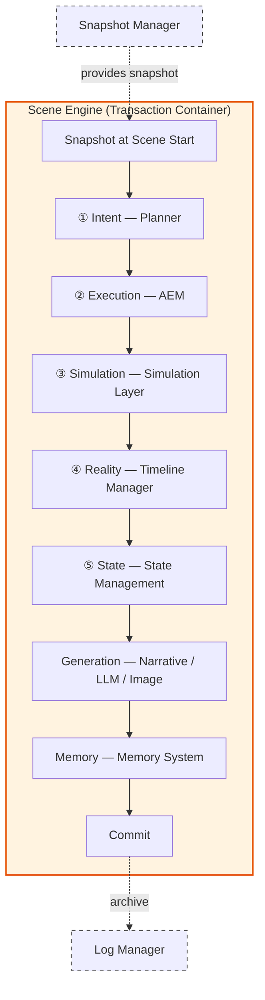
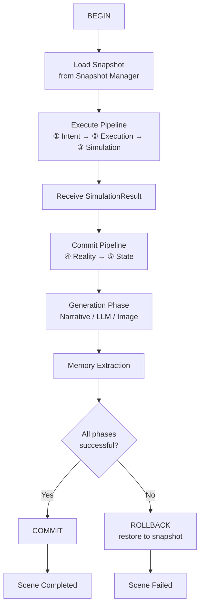
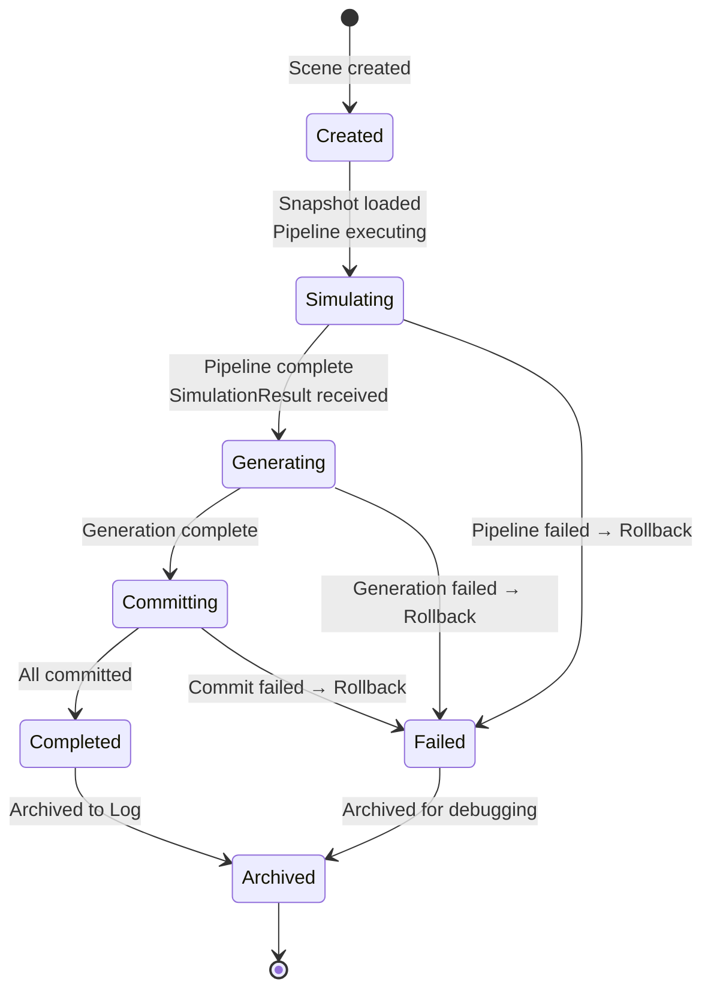

# Scene Engine Blueprint

**Version:** v2.0 Draft  
**Status:** Draft  
**Last Updated:** 2026-07-14

**Depends On:** [Runtime Pipeline Blueprint](./Runtime_Pipeline_Blueprint.md), [Runtime Infrastructure Blueprint](./Runtime_Infrastructure_Blueprint.md), [Simulation Layer Blueprint](./Simulation_Layer_Blueprint.md), [Runtime State Model Blueprint](./Runtime_State_Model_Blueprint.md), [Action Execution Model](./Action_Execution_Model.md), [Runtime Glossary](./Runtime_Glossary.md), [Runtime Artifact Ownership Matrix](./Runtime_Artifact_Ownership_Matrix.md), [SimulationResult Schema](../03_Data/SimulationResult_Schema.md), [Event Object Schema](../03_Data/Event_Object_Schema.md)

---

## 1. Purpose（文档目的）

Define the Scene Engine — the transaction container and pipeline coordinator of the AI Narrative RPG Engine.

定义 Scene Engine — AI Narrative RPG Engine 的事务容器和流水线协调者。

### Core Definition（核心定义）

**Scene Engine is the Transaction Container and Pipeline Coordinator.**

Scene Engine 是事务容器和流水线协调者。

> **Scene Engine is NOT an Authority layer.** It does not own any Pipeline artifact. It provides the transaction boundary (snapshot, rollback) within which the 5-Layer Authority Pipeline operates, and it coordinates the execution order of Pipeline stages and post-Pipeline generation.

> **Scene Engine 不是权威层。** 它不拥有任何流水线制品。它提供事务边界（快照、回滚），五层权威流水线在此边界内运行，并协调流水线阶段和流水线后生成的执行顺序。

### Core Philosophy（核心理念）

**Scene Engine orchestrates. It does not compute, commit, or generate.**

Scene Engine 编排。它不计算、不提交、不生成。

Scene Engine ensures transaction integrity — either all Pipeline stages and post-Pipeline generation commit successfully, or the Scene rolls back to its snapshot. It coordinates *when* things happen, not *what* happens.

Scene Engine 确保事务完整性——要么所有流水线阶段和流水线后生成成功提交，要么 Scene 回滚到快照。它协调*何时*发生，不决定*发生什么*。

> **Transaction Lifecycle vs Semantics:** Scene Engine owns transaction **lifecycle** (begin, commit, rollback). Transaction **semantics** (what commit means, how state is mutated, how events are committed) belong to the Pipeline, State Model, and Infrastructure. Scene Engine coordinates; it does not define the rules.
>
> **事务生命周期 vs 语义：** Scene Engine 拥有事务**生命周期**（开始、提交、回滚）。事务**语义**（提交意味着什么、状态如何变更、事件如何提交）属于 Pipeline、State Model 和 Infrastructure。Scene Engine 协调；它不定义规则。

### Pipeline Alignment（流水线对齐）

Scene Engine is **not** one of the 5 Authority layers (① Intent → ⑤ State). It is an **orthogonal coordinator** that spans all layers, providing the transaction boundary within which they execute. See [Runtime Pipeline Blueprint](./Runtime_Pipeline_Blueprint.md).

Scene Engine **不是**五层权威层之一（① Intent → ⑤ State）。它是一个**正交协调者**，横跨所有层，提供事务边界。见 [Runtime Pipeline Blueprint](./Runtime_Pipeline_Blueprint.md)。

---

## 2. Document Governance（文档治理）

**Status:** Draft

**Status Values:** Draft → RC → Locked → Deprecated

**Owner:** Engine Architect

**Architecture Reviewers:**

- Runtime Architect
- Simulation Architect
- Narrative Architect

**Architecture Approval:** Architecture Review Required

**Last Reviewed:** 2026-07-14

**Parent Blueprint:** [Runtime Pipeline Blueprint](./Runtime_Pipeline_Blueprint.md)

**Update Policy:** Changes affecting Scene lifecycle, transaction model, Pipeline coordination boundaries, or commit/rollback rules require ADR approval.

---

## 3. Blueprint Contract（蓝图契约）

| Item | Content |
|------|---------|
| **Role** | Transaction Container + Pipeline Coordinator (NOT an Authority layer) |
| **Owns** | Scene lifecycle, Scene State (session), Runtime Metadata (session), transaction integrity, Pipeline stage coordination |
| **Does NOT Own** | Any Pipeline artifact (Action, Action Record, SimulationResult, Event, State Mutation), Simulation computation, State mutation, Event commit, Narrative generation, Memory extraction, Infrastructure |
| **Inputs** | Player Action (from UI), State Snapshot (from Snapshot Manager) |
| **Outputs** | Committed Scene (state mutations applied, events committed, narrative generated, memory extracted) or Rolled Back Scene (no side effects) |
| **Pipeline Role** | Coordinator — drives execution order of Pipeline stages ① → ⑤ within a transaction |
| **Downstream** | None directly — Scene Engine coordinates, it does not produce Pipeline artifacts |
| **Infrastructure Dependencies** | Snapshot Manager (snapshot at Scene start), Log Manager (Scene archive), Dispatcher (Action transport) |
| **Consumed Artifacts** | State Snapshot, SimulationResult (read-only, received from Simulation Layer) |
| **Produced Artifacts** | Scene State (session), Runtime Metadata (session) |
| **Quality Attributes** | Atomicity, Consistency, Isolation, Durability (ACID transaction guarantees) |

> **Contract Stability:** This contract is frozen. Behavioral details below do not change any row in this table.

---

## 4. Design Principles（设计原则）

| Principle | Description |
|-----------|-------------|
| **Scene Is Atomic** | Scene 是最小不可分割事务单位。Scene is the atomic transaction unit. Either all operations commit, or the Scene rolls back. |
| **Orchestration Only** | 仅编排。Scene Engine coordinates execution order and transaction integrity. It does not compute, decide, or generate. |
| **Snapshot Boundary** | 快照边界。Every Scene begins from a Snapshot. If Scene execution fails, the Engine rolls back to the Snapshot. See [State Model §9](./Runtime_State_Model_Blueprint.md). |
| **Pipeline Coordinator** | 流水线协调者。Scene Engine drives the execution of Pipeline stages ① → ⑤ in order. It does not own any Pipeline artifact. |
| **State Safety** | 状态安全。Failed Scene execution SHALL NOT corrupt Persistent State. Rollback restores the snapshot. |
| **No Interpretation** | 不解释。Scene Engine receives SimulationResult but SHALL NOT interpret, modify, or filter its contents. It passes it downstream unchanged. |
| **Deterministic Flow** | 确定性流程。Given the same Snapshot and same Action, the Scene execution flow is deterministic. |

---

## 5. Authority Definition（权威定义）

### Scene Engine is NOT an Authority Layer

Scene Engine does not own any Authority in the 5-Layer Authority Pipeline. It is an **Orchestrator** — it coordinates *when* Pipeline stages execute, but each stage's Authority belongs to its respective layer.

Scene Engine 不拥有五层权威流水线中的任何权威。它是一个**编排者**——它协调流水线阶段*何时*执行，但每个阶段的权威属于各自的层。

### What Scene Engine Decides（Scene Engine 决定什么）

| Decision | Description |
|----------|-------------|
| Transaction Lifecycle | When a Scene begins, when it commits, when it rolls back |
| Pipeline Stage Coordination | The order in which Pipeline stages are invoked within a Scene |
| Generation Trigger | When to trigger Narrative Director, Prompt Builder, LLM Runtime, Image Pipeline |
| Scene State Transitions | Scene-phase state machine (Created → Simulating → ... → Completed) |
| Failure Response | Whether to retry, rollback, or report failure (within constraints defined by AEM and Scene policy) |

### What Scene Engine Does NOT Decide（Scene Engine 不决定什么）

| Decision | Belongs To |
|----------|------------|
| What Action to attempt | Intent Authority (Planner) |
| Whether Action is valid | Execution Authority (AEM) |
| What happens when Action meets world | Simulation Authority (Simulation Layer) |
| What becomes reality | Reality Authority (Timeline Manager) |
| How the world changes | State Authority (State Management Layer) |
| How to narrate the outcome | Narrative Director |
| What memories to extract | Memory System |

---

## 6. Boundary Definition（边界定义）

### Owns（拥有）

| Domain | Description |
|--------|-------------|
| Scene Lifecycle | Creating, executing, committing, or rolling back a Scene |
| Scene State | Session-level state tracking the current Scene's execution progress |
| Runtime Metadata | Session-level metadata (game_id, scene_id, tick, seed, timestamps) |
| Transaction Integrity | Ensuring atomicity — all-or-nothing commit or rollback |
| Pipeline Coordination | Driving the execution order of Pipeline stages within a Scene |
| Generation Trigger | Triggering post-Pipeline generation (Narrative, LLM, Image) at the right time |

### Does NOT Own（不拥有）

| Domain | Belongs To |
|--------|------------|
| Action Object structure and intent | Intent Authority (Planner) — [Action Object Schema](../03_Data/Action_Object_Schema.md) |
| Action validation and lifecycle | Execution Authority (AEM) — [Action Execution Model](./Action_Execution_Model.md) |
| SimulationResult production | Simulation Authority (Simulation Layer) — [Simulation Layer Blueprint](./Simulation_Layer_Blueprint.md) |
| Event commit and Timeline | Reality Authority (Timeline Manager) — [Event Object Schema](../03_Data/Event_Object_Schema.md) |
| State mutation | State Authority (State Management) — [Runtime State Model Blueprint](./Runtime_State_Model_Blueprint.md) |
| Narrative planning and generation | Narrative Director — [Narrative Director Blueprint](./Narrative_Director_Blueprint.md) |
| Memory extraction and storage | Memory System — [Memory Architecture Blueprint](./Memory_Architecture_Blueprint.md) |
| Snapshot creation, storage, fork | Infrastructure (Snapshot Manager) — [Runtime Infrastructure Blueprint](./Runtime_Infrastructure_Blueprint.md) |
| Log archival and indexing | Infrastructure (Log Manager) |
| Dispatch transport | Infrastructure (Dispatcher) |

---

## 7. Runtime Position（运行时定位）

Scene Engine spans all Pipeline layers as an orthogonal coordinator. It provides the transaction boundary; the Pipeline operates within it.

Scene Engine 作为正交协调者横跨所有流水线层。它提供事务边界；流水线在其中运行。

> **Dashed lines mean "serves, not decides".** Infrastructure provides services (snapshots, archival). Scene Engine provides the transaction boundary; Infrastructure provides the platform.

> **虚线表示"服务而非决策"。** 基础设施提供服务（快照、归档）。Scene Engine 提供事务边界；基础设施提供平台。

---

## 8. Scene Transaction Model（Scene 事务模型）

A Scene is an **Atomic Narrative Simulation Transaction**. It follows a strict transaction pattern: BEGIN → EXECUTE → COMMIT or ROLLBACK.

Scene 是一个**原子叙事模拟事务**。它遵循严格的事务模式：BEGIN → EXECUTE → COMMIT 或 ROLLBACK。

### Transaction Flow（事务流程）

### Transaction Rules（事务规则）

| Rule | Description |
|------|-------------|
| BEGIN | Scene Engine requests a Snapshot from Snapshot Manager. The Scene starts from this Snapshot. |
| EXECUTE | Scene Engine coordinates Pipeline stages ① → ⑤ and post-Pipeline generation. Each stage produces its artifact; Scene Engine passes it downstream. |
| COMMIT | If all phases succeed, Scene commits: Events committed, State mutated, Narrative generated, Memory extracted. |
| ROLLBACK | If any critical phase fails, Scene rolls back to the Snapshot. Persistent State is not modified. Generated content may be discarded or archived for debugging. |
| No partial commit | A Scene either commits entirely or rolls back entirely. Partial commit is NOT supported at the Scene level. (Partial commit within a Tick is handled by SimulationResult `partial_success` status — see [Simulation Layer §19](./Simulation_Layer_Blueprint.md).) |

> **Transaction Boundary:** The Snapshot at Scene start is the isolation boundary. Within a Scene, all operations see the same snapshot state. Other concurrent operations (if any) SHALL NOT see uncommitted results from this Scene.

> **事务边界：** Scene 开始时的快照是隔离边界。在 Scene 内，所有操作看到相同的快照状态。其他并发操作（如果有）不得看到此 Scene 未提交的结果。

---

## 9. Scene Lifecycle（Scene 生命周期）

The Scene lifecycle is simplified to 6 states, aligned with Pipeline phases.

Scene 生命周期简化为 6 个状态，与流水线阶段对齐。

| State | Description | Pipeline Activity |
|-------|-------------|-------------------|
| **Created** | Scene is created. Scene Engine requests Snapshot from Snapshot Manager. | None — waiting for snapshot |
| **Simulating** | Pipeline stages ① → ⑤ are executing. Scene Engine coordinates stage invocation. | Intent → Execution → Simulation → Reality → State |
| **Generating** | Post-Pipeline generation is running. Scene Engine triggers Narrative Director, LLM, Image Pipeline. | Narrative planning, prompt building, LLM generation, image generation |

> **Generation is Post-Pipeline:** Narrative generation consumes committed Runtime State and committed Events. It does not participate in Authority decisions. Generation results (text, images) are expressions, not facts. See [Pipeline Blueprint](./Runtime_Pipeline_Blueprint.md).
>
> **生成在流水线之后：** 叙事生成消费已提交的 Runtime State 和已提交的 Event。它不参与权威决策。生成结果（文本、图像）是表达，不是事实。
| **Committing** | Commit Pipeline is processing results. Memory extraction runs. | Event commit, State mutation, Memory extraction, Log archival |
| **Completed** | All phases committed successfully. Scene results are permanent. | None — Scene is done |
| **Failed** | A critical phase failed. Scene has rolled back to Snapshot. Persistent State is unmodified. | None — Scene is done (failed) |

> **Simplified from Legacy:** The Legacy v1.2 had 11 states (Created → Initialized → Context Loaded → Simulating → Directing → Generating → Evaluating → Memory Processing → Committing → Completed → Archived). The new lifecycle consolidates these into 6 states by merging initialization/context-loading into Created, merging directing/evaluating into Simulating/Generating, and merging memory processing into Committing.

> **从 Legacy 简化：** Legacy v1.2 有 11 个状态。新生命周期通过合并初始化/上下文加载到 Created，合并 directing/evaluating 到 Simulating/Generating，合并 memory processing 到 Committing，简化为 6 个状态。

---

## 10. SimulationResult Integration（SimulationResult 集成）

Scene Engine receives SimulationResult from the Simulation Layer but SHALL NOT interpret, modify, or filter its contents.

Scene Engine 从 Simulation Layer 接收 SimulationResult，但不得解释、修改或过滤其内容。

### Scene Engine's Role with SimulationResult（Scene Engine 对 SimulationResult 的角色）

| Aspect | Rule |
|--------|------|
| **Receive** | Scene Engine receives SimulationResult as the output of Simulation Layer (Layer ③) |
| **Do NOT Interpret** | Scene Engine SHALL NOT read `valid_deltas`, `invalid_deltas`, or `failure_info` to make decisions about Scene lifecycle — except reading `status` to determine commit vs rollback |
| **Do NOT Modify** | Scene Engine SHALL NOT modify any field in SimulationResult (see [Simulation Layer §8 Immutability](./Simulation_Layer_Blueprint.md)) |
| **Pass Downstream** | Scene Engine passes SimulationResult to Timeline Manager (Layer ④) for Event commit |
| **Status Check** | Scene Engine reads `status` field only: `success` → proceed to commit; `failure` → rollback; `partial_success` → proceed to subset commit; `interrupted` → Scene Engine decides; `cancelled` → discard |
| **Archive** | Scene Engine ensures SimulationResult is archived by Log Manager regardless of commit/rollback outcome |

> **SimulationResult Immutability:** SimulationResult is immutable once produced (see [Simulation Layer §8](./Simulation_Layer_Blueprint.md)). Scene Engine treats it as a read-only input to the Commit Pipeline.

---

## 11. Snapshot & Rollback（快照与回滚）

Scene Engine references the [Runtime State Model Blueprint §9](./Runtime_State_Model_Blueprint.md) for Snapshot and Branch semantics. This Blueprint does NOT redefine these concepts.

Scene Engine 引用 [Runtime State Model Blueprint §9](./Runtime_State_Model_Blueprint.md) 中的快照与分支语义。本 Blueprint 不重新定义这些概念。

### Scene Engine's Use of Snapshots（Scene Engine 对快照的使用）

| Operation | Description | Source |
|-----------|-------------|--------|
| **Load Snapshot** | At Scene start, Scene Engine requests a Snapshot from Snapshot Manager | [Infrastructure Blueprint](./Runtime_Infrastructure_Blueprint.md) — Snapshot Manager |
| **Pass to Simulation** | Scene Engine passes the Snapshot to Simulation Layer as input | [Simulation Layer §8](./Simulation_Layer_Blueprint.md) — Inputs |
| **Rollback on Failure** | If Scene fails, Scene Engine discards all changes and the Snapshot remains the current state | [State Model §9.1](./Runtime_State_Model_Blueprint.md) — Snapshot |
| **Commit on Success** | If Scene succeeds, the committed state becomes the new baseline for the next Scene | [State Model §9.2](./Runtime_State_Model_Blueprint.md) — Commit |

> **No Redefinition:** Scene Engine does not define Snapshot, Branch, Fork, or Rollback semantics. These are defined by [Runtime State Model Blueprint §9](./Runtime_State_Model_Blueprint.md) and supported by [Runtime Infrastructure Blueprint](./Runtime_Infrastructure_Blueprint.md).

---

## 12. Commit Rules（提交规则）

A Scene may commit only when all of the following conditions are met:

Scene 只有在满足以下所有条件时才能提交：

| # | Condition | Verified By |
|---|-----------|-------------|
| 1 | SimulationResult status is `success` or `partial_success` | Scene Engine (reads `status` field) |
| 2 | Timeline Manager has committed all Event Candidates | Timeline Manager (Layer ④) |
| 3 | State Management has applied all valid deltas | State Management (Layer ⑤) |
| 4 | Narrative generation has completed (or been explicitly skipped) | Narrative Director |
| 5 | Memory extraction has completed (or been explicitly deferred) | Memory System |
| 6 | No unresolvable conflicts detected | Scene Engine (transaction integrity check) |

### Commit Failure Handling（提交失败处理）

| Scenario | Action |
|----------|--------|
| SimulationResult status = `failure` | Rollback to Snapshot. No commit. |
| Timeline Manager rejects Event Candidates | Rollback to Snapshot. Scene failure. |
| State Management reports mutation conflict | Rollback to Snapshot. Scene failure. |
| Narrative generation fails | May skip narrative (degraded experience) or rollback, depending on Scene policy. **Generation retry must reuse the same committed Runtime State.** Generation retry SHALL NOT re-run Simulation — SimulationResult is immutable and reusable. |
| Memory extraction fails | May defer memory extraction to background. Does NOT block Scene commit. |

> **Memory extraction is non-blocking:** Memory extraction failure SHALL NOT block Scene commit. Memory can be extracted later from the archived SimulationResult and Events.
>
> **Memory extraction SHALL NOT mutate Persistent State.** Memory extraction produces Memory Objects only. It reads committed Events and State as input; it never writes to Character State, Relationship State, World State, or any other Persistent State domain. See [Artifact Ownership Matrix](./Runtime_Artifact_Ownership_Matrix.md).

> **记忆提取不阻塞：** 记忆提取失败不得阻塞 Scene 提交。记忆可以在之后从归档的 SimulationResult 和 Event 中提取。这与 [Artifact Ownership Matrix](./Runtime_Artifact_Ownership_Matrix.md) 一致——Memory Object 的 Confidence: Provisional。

---

## 13. Failure Recovery（失败恢复）

### Failure Scenarios（失败场景）

| Scenario | Cause | Action | Retry? |
|----------|-------|--------|--------|
| Simulation Failure | SimulationResult status = `failure` | Rollback to Snapshot | AEM decides retry policy |
| Event Commit Failure | Timeline Manager rejects Event Candidates | Rollback to Snapshot | No — investigate Event Candidate validity |
| State Mutation Conflict | State Management reports conflict | Rollback to Snapshot | No — investigate state consistency |
| Generation Failure | Narrative Director or LLM fails | Skip generation (degraded) or Rollback | May retry generation without re-simulating |
| Infrastructure Failure | Snapshot Manager, Log Manager, or Dispatcher failure | Rollback if possible; otherwise, engine-level error handling | Infrastructure-level retry |
| Interruption | Engine shutdown or Scene cancellation | Rollback to Snapshot if uncommitted; otherwise, archive committed results | No — manual recovery |

### Rollback Guarantee（回滚保证）

> **Rollback restores the Snapshot.** After rollback, Persistent State is identical to the Snapshot at Scene start. No side effects from the failed Scene persist. This guarantee is supported by [Handler Purity](./Simulation_Layer_Blueprint.md) (Handler does not mutate Persistent State) and [State Authority](./Runtime_State_Model_Blueprint.md) (only State Authority applies mutations).

> **回滚恢复快照。** 回滚后，Persistent State 与 Scene 开始时的快照完全相同。失败 Scene 的副作用不会持续。此保证由 [Handler Purity](./Simulation_Layer_Blueprint.md)（Handler 不变更 Persistent State）和 [State Authority](./Runtime_State_Model_Blueprint.md)（只有 State Authority 应用变更）支持。

---

## 14. Runtime Guarantees（运行时保证）

| Guarantee | Description |
|-----------|-------------|
| Atomicity | A Scene either commits entirely or rolls back entirely. No partial commit at Scene level. |
| Consistency | Committed Scene results are internally consistent — Events, State, and Memory are aligned. |
| Isolation | A Scene's uncommitted results are not visible to other concurrent operations. |
| Durability | Once committed, Runtime State, Runtime Log, Events, and Memory are persistent and durable. **Generated artifacts** (narrative text, images) are **regenerable** — they MAY be discarded and regenerated from the same committed state. Only facts are durable; expressions are regenerable. |
| Snapshot Start | Every Scene begins from a validated Snapshot. |
| Rollback Safety | Failed Scene execution SHALL NOT corrupt Persistent State. |
| No Bypass | No module may bypass Scene Engine to modify Persistent State outside a Scene transaction. |
| Archive | Every Scene (committed or failed) is archived to Runtime Log by Log Manager. |

---

## 15. Non-Goals（非目标）

This document intentionally does **not** define the following:

本文档有意**不**定义以下内容：

| Non-Goal | Owned By |
|----------|----------|
| Pipeline definition | [Runtime Pipeline Blueprint](./Runtime_Pipeline_Blueprint.md) |
| Simulation rules and computation | [Simulation Layer Blueprint](./Simulation_Layer_Blueprint.md) |
| SimulationResult structure | [SimulationResult Schema](../03_Data/SimulationResult_Schema.md) |
| State structure and mutation rules | [Runtime State Model Blueprint](./Runtime_State_Model_Blueprint.md) |
| Event structure and commit | [Event Object Schema](../03_Data/Event_Object_Schema.md) + Timeline Manager |
| Action validation and lifecycle | [Action Execution Model](./Action_Execution_Model.md) |
| Narrative planning and generation | [Narrative Director Blueprint](./Narrative_Director_Blueprint.md) |
| Memory extraction | [Memory Architecture Blueprint](./Memory_Architecture_Blueprint.md) |
| Infrastructure component definitions | [Runtime Infrastructure Blueprint](./Runtime_Infrastructure_Blueprint.md) |
| Snapshot / Branch / Fork semantics | [Runtime State Model Blueprint §9](./Runtime_State_Model_Blueprint.md) |
| Specific transaction implementation | Implementation (not Architecture) |

> **Boundary Summary:** Scene Engine owns *when things happen* (transaction lifecycle, Pipeline coordination, generation trigger). It does not own *what happens* (Simulation computes, State mutates, Timeline commits, Narrative generates, Memory extracts).

---

## 16. Hardware Considerations（硬件考量）

**Target Hardware:** RTX 5060 8GB / 32GB RAM

| Consideration | Description |
|---------------|-------------|
| Async Generation | Image generation SHALL be asynchronous. Scene SHALL NOT block on image generation if it can be deferred. |
| Background Memory | Memory extraction SHALL be non-blocking. It SHALL run in background after Scene commit. |
| Snapshot Efficiency | Snapshot loading SHALL be efficient. Implementation mechanism is defined by [Runtime Infrastructure Blueprint](./Runtime_Infrastructure_Blueprint.md). |
| Low Overhead | Scene Engine orchestration SHALL add minimal overhead. Coordination is metadata-driven, not computation-heavy. |

---

## 17. References

**Depends On:**

- [Runtime Pipeline Blueprint](./Runtime_Pipeline_Blueprint.md) — defines Pipeline stages
- [Runtime Infrastructure Blueprint](./Runtime_Infrastructure_Blueprint.md) — defines snapshot, log, dispatcher infrastructure
- [Simulation Layer Blueprint](./Simulation_Layer_Blueprint.md) — defines SimulationResult production
- [Runtime State Model Blueprint](./Runtime_State_Model_Blueprint.md) — defines state structure, snapshot, rollback
- [Action Execution Model](./Action_Execution_Model.md) — defines Action lifecycle
- [Runtime Glossary](./Runtime_Glossary.md) — defines terminology
- [SimulationResult Schema](../03_Data/SimulationResult_Schema.md) — defines SimulationResult structure
- [Event Object Schema](../03_Data/Event_Object_Schema.md) — defines Event structure
- [Runtime Artifact Ownership Matrix](./Runtime_Artifact_Ownership_Matrix.md) — defines artifact ownership (Scene Engine has the heaviest ownership boundary — see [Boundary Definition §6](#6-boundary-definition边界定义))

**Referenced By:**

- [Simulation Layer Blueprint](./Simulation_Layer_Blueprint.md) — Scene as Simulation's transaction context
- [Runtime State Model Blueprint](./Runtime_State_Model_Blueprint.md) — Scene as state mutation transaction boundary
- [Action Execution Model](./Action_Execution_Model.md) — Scene as AEM's execution context
- [Narrative Director Blueprint](./Narrative_Director_Blueprint.md) — Scene as generation trigger
- [Memory Architecture Blueprint](./Memory_Architecture_Blueprint.md) — Scene as memory extraction trigger
- [Runtime Pipeline Blueprint](./Runtime_Pipeline_Blueprint.md) — Scene as Pipeline transaction container

---

## 18. Revision History

| Version | Date | Description |
|---------|------|-------------|
| v1.0 | 2026-07-12 | Initial Blueprint |
| v1.1 | 2026-07-12 | Added Document Governance, Boundary Definition, Transaction Model, Runtime Guarantees |
| v1.2 | 2026-07-13 | Documentation enhancement: bilingual headings, Mermaid flowcharts, tables, consistent terminology |
| v2.0 Draft | 2026-07-14 | **Complete rewrite (Phase B-1.2):** Architecture paradigm migration from pre-Pipeline to 5-Layer Authority Pipeline. Repositioned as Transaction Container + Pipeline Coordinator (NOT an Authority layer). Added Blueprint Contract. Added Decision Ownership (B9 compliance). Corrected boundary: Scene Engine orchestrates but does not compute/commit/generate. Simplified lifecycle from 11 states to 6 (Created → Simulating → Generating → Committing → Completed/Failed → Archived). Added SimulationResult Integration rules (receive, do NOT interpret, pass downstream). Added Snapshot & Rollback section referencing State Model (no redefinition). Added Commit Rules with 6 conditions. Added Failure Recovery with 6 scenarios and rollback guarantee. Added ACID Runtime Guarantees. Replaced old Event Model (Trigger/Actor/Action/Consequence) with reference to Event Object Schema. Added Infrastructure dependency references (Snapshot Manager, Log Manager, Dispatcher). Aligned with RC Freeze Checklist Part B v1.1 requirements. |
