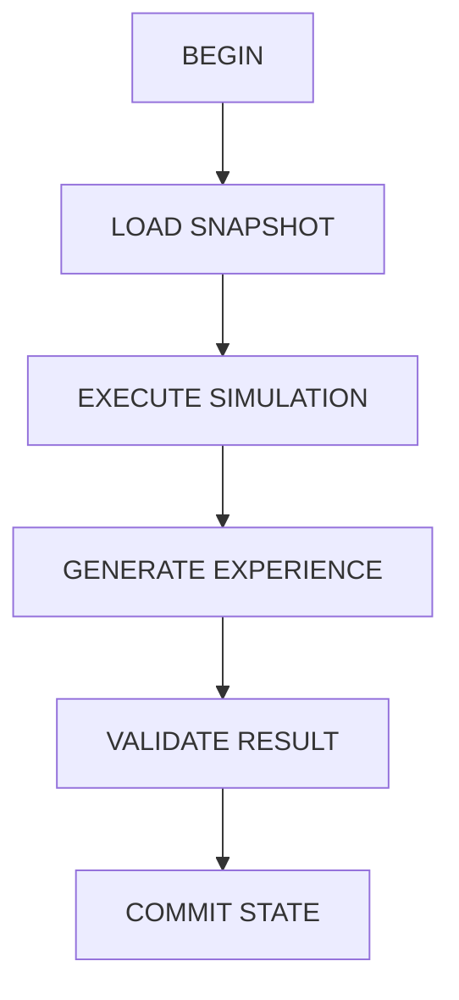

# Scene Engine Blueprint

**Version:** v1.2  
**Status:** Draft  
**Last Updated:** 2026-07-13

---

## 1. Purpose（文档目的）

Define the responsibilities, boundaries, and runtime mechanisms of the Scene Engine.

定义 Scene Engine 在 AI Narrative RPG Engine 中的职责、边界和运行机制。

### Core Definition（核心定义）

Scene Engine is the **core execution container** of the Runtime Architecture, responsible for coordinating one complete Atomic Narrative Simulation Transaction.

Scene Engine 是 Runtime Architecture 的核心执行容器，负责协调一次完整叙事模拟事务（Atomic Narrative Simulation Transaction）。

### Core Philosophy（核心理念）

Scene Engine is an Orchestration Layer, not a Simulation Layer.

Scene Engine 是编排层，不是模拟层。它负责编排执行顺序和事务完整性。

---

## 2. Responsibilities（职责）

### Responsible For（负责）

- Creating and managing the complete Scene lifecycle
- Coordinating the call order of Runtime modules
- Ensuring Scene integrity and consistency as an atomic transaction
- Managing Scene Context assembly and commit

### Not Responsible For（不负责）

- Relationship evolution rules
- Memory importance evaluation
- Text or image generation
- World rule calculation

---

## 3. Document Governance（文档治理）

**Owner:** Engine Architect

**Reviewers:**

- Runtime Architect
- Simulation Architect

**Approval:** Architecture Review Required

**Update Policy:** Changes affecting Scene lifecycle, transaction rules, or module boundaries require ADR approval.

---

## 4. Design Principles（设计原则）

| Principle | Description |
|-----------|-------------|
| Scene Is Atomic | Scene 是最小不可分割运行单位。Scene is the atomic runtime unit. |
| Transaction First | 事务优先。Scene execution follows transaction pattern with rollback support. |
| Orchestration Only | 仅编排。Scene Engine only orchestrates execution order, not logic. |
| State Safety | 状态安全。Failed Scene execution must not corrupt long-term assets. |
| Deterministic Flow | 确定性流程。Identical inputs produce identical execution flow. |

---

## 5. Boundary Definition（边界定义）

**Scene Engine is an Orchestration Layer.**

### Owns（拥有）

- Scene Lifecycle Management
- Module Call Ordering
- Transaction Integrity
- Scene Context Assembly
- Scene Commit & Rollback

### Does NOT Own（不拥有）

- World Simulation Logic
- Relationship Calculation
- Narrative Decision Logic
- Content Generation Logic

Scene Engine 只负责编排执行顺序和事务完整性。

---

## 6. Scene Definition（Scene 定义）

**Scene is an Atomic Narrative Simulation Transaction** — the smallest indivisible narrative simulation transaction in the system.

Scene 是系统最小不可分割的叙事模拟事务。

一个 Scene 代表一次完整的"数字人生事件"。

---

## 7. Scene Transaction Model（Scene 事务模型）

Scene follows a Transaction Pattern:

If validation fails → **ROLLBACK** to previous Snapshot.

---

## 8. Scene Lifecycle（Scene 生命周期）

---

## 9. Scene Context Model（Scene 上下文模型）

### Inputs（输入）

| Input | Description |
|-------|-------------|
| Character State | 角色状态 |
| Relationship State | 关系状态 |
| World State | 世界状态 |
| Relevant Memory | 相关记忆 |
| Active Quests | 活跃任务 |
| Player Action | 玩家行为 |

---

## 10. Scene Event Model（Scene 事件模型）

Event 包含以下结构：

| Field | Description |
|-------|-------------|
| Trigger | 触发条件 |
| Actor | 参与者 |
| Action | 行为 |
| Consequence | 后果 |

---

## 11. Scene Result（Scene 结果）

### Outputs（输出）

| Output | Description |
|--------|-------------|
| State Changes | 状态变更 |
| New Memory Entries | 新记忆条目 |
| Timeline Update | 时间线更新 |
| Optional Gallery Entry (CG) | 可选图鉴条目（CG） |

---

## 12. Scene Commit Rules（Scene 提交规则）

必须满足以下所有条件才能提交：

| Rule | Description |
|------|-------------|
| State Validated | 状态已验证 |
| Memory Extracted | 记忆已提取 |
| Persistence Completed | 持久化已完成 |

---

## 13. Runtime Guarantees（运行时保证）

- Every Scene must start from a valid State Snapshot.
- Every Scene must produce deterministic State Transition.
- No external module can modify Scene State directly.
- Scene Commit is the only entry point for persistent state update.
- Failed Scene execution must not corrupt long-term assets.

---

## 14. Failure Recovery（失败恢复）

定义以下情况下的回滚与重试策略：

| Scenario | Description |
|----------|-------------|
| Generation Failed | 生成失败 |
| Simulation Error | 模拟错误 |
| State Conflict | 状态冲突 |

---

## 15. Hardware Considerations（硬件考量）

针对 RTX 5060 8GB：

| Strategy | Description |
|----------|-------------|
| Async Image Generation | 图像生成必须异步 |
| Background Processing | 非核心计算可后台执行 |

---

## References

**Depends On:**

- Runtime Architecture
- Overall Architecture
- Glossary

**Referenced By:**

- Simulation Layer
- Relationship Engine
- Memory Architecture
- Narrative Director
- Image Pipeline

---

## Revision History

| Version | Date | Description |
|---------|------|-------------|
| v1.2 | 2026-07-13 | Documentation enhancement: bilingual headings, Mermaid flowcharts, tables, consistent terminology |
| v1.1 | 2026-07-12 | 增加 Document Governance、Boundary Definition、Transaction Model、Runtime Guarantees |
| v1.0 | 2026-07-12 | 初始 Blueprint |
