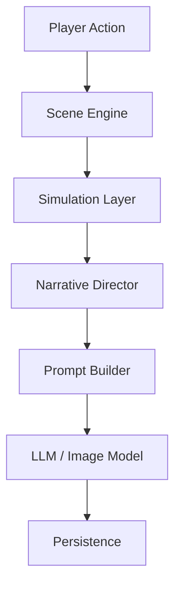
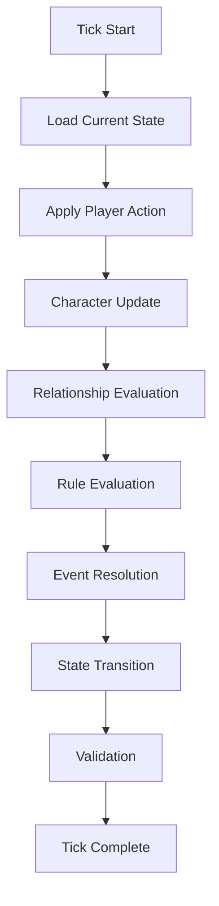

# Simulation Layer Blueprint

**Version:** v1.2  
**Status:** Draft  
**Last Updated:** 2026-07-13

---

## 1. Purpose（文档目的）

Define the responsibilities, boundaries, and runtime mechanisms of the Simulation Layer.

定义 Simulation Layer 在 AI Narrative RPG Engine 中的职责、边界和运行机制。

### Core Definition（核心定义）

**Simulation Layer is the Ground Truth Authority of the Engine.**

Simulation Layer 是 Engine 中唯一有权演化长期状态（Runtime State）的核心模块。

所有长期状态变化必须首先由 Simulation Layer 计算和验证，然后才能进入 Narrative Director、LLM 或其他生成系统。

### Core Philosophy（核心理念）

Simulation Layer 不是叙事系统，不是生成系统，也不是 UI 系统。

它负责维护世界的真实状态（Ground Truth）。

---

## 2. Responsibilities（职责）

### Responsible For（负责）

| Domain | Description |
|--------|-------------|
| World State Evolution | 世界状态演化 |
| Character State Evolution | 角色状态演化 |
| Relationship State Evolution | 关系状态演化 |
| Event Consequence Evaluation | 事件结果计算 |
| Rule Evaluation | 规则评估 |
| State Validation | 一致性验证 |
| Runtime State Transition | 运行时状态转换 |

### Not Responsible For（不负责）

- Narrative Planning
- Dialogue Generation
- Prompt Construction
- Image Generation
- Memory Extraction
- Persistence Commit
- UI Rendering

---

## 3. Document Governance（文档治理）

**Owner:** Simulation Architect

**Reviewers:**

- Engine Architect
- Runtime Architect

**Approval:** Architecture Review Required

**Update Policy:** Changes affecting state transition rules, simulation tick logic, runtime guarantees, or module boundaries require ADR approval.

---

## 4. Design Principles（设计原则）

| Principle | Description |
|-----------|-------------|
| Simulation Before Generation | 状态必须先于表现被确定。Simulation determines facts before any generation occurs. |
| State Is Fact | 状态是唯一的事实来源，文本只是表现。State is the single source of truth. |
| Ground Truth First | 真实状态优先于一切。Ground Truth takes precedence over all representations. |
| Deterministic State Transition | 同一输入必须产生同一输出。Identical inputs always produce identical state transitions. |
| Relationship First | 关系是核心驱动。Relationship is the primary driver of simulation. |
| Rule-Driven, Not Prompt-Driven | 规则是硬约束，AI 是软表达。Rules are hard constraints; LLM is soft expression. |
| Simulation Owns State | 只有 Simulation Layer 可以修改长期状态。Only Simulation Layer may modify Runtime State. |
| Scene Is Atomic | Scene 是最小不可分割运行单位。Scene is the atomic runtime unit. |

所有生成内容都建立在已经确定的状态之上，而不能反向决定状态。

---

## 5. Boundary Definition（边界定义）

**Simulation Layer is a Rule-Driven State Machine.**

Simulation Layer 是唯一允许修改长期运行状态（Runtime State）的模块。

所有其它模块的角色：

| Role | Description |
|------|-------------|
| Consumers（消费者） | 读取状态，不修改状态 |
| Coordinators（协调者） | 协调流程，不修改状态 |
| Presenters（表现层） | 呈现状态，不修改状态 |

### Owns（拥有）

- State Transition Logic
- Rule Evaluation
- Event Resolution
- State Validation

### Does NOT Own（不拥有）

- Narrative Planning
- Story Pacing
- Dialogue Generation
- Image Generation
- Memory Extraction
- Scene Orchestration
- UI

任何模块都不得绕过 Simulation Layer 修改长期状态。

---

## 6. Runtime Position（运行时定位）

Simulation Layer 位于所有内容生成之前。

它产生事实（Facts），而不是故事（Stories）。

---

## 7. Core Runtime Responsibilities（核心运行职责）

Simulation Layer 在每一个 Scene 中负责：

| Step | Action |
|------|--------|
| 1 | Load Current Runtime State |
| 2 | Update Character State |
| 3 | Update Relationship State |
| 4 | Update World State |
| 5 | Execute Rule Evaluation |
| 6 | Resolve Event Consequences |
| 7 | Produce State Transition |
| 8 | Validate State Consistency |

**Simulation produces facts.**

**Narrative Director produces stories.**

**LLM produces expressions.**

---

## 8. Core State Domains（核心状态域）

Simulation Layer 管理以下长期状态：

### Character State（角色状态）

角色人格、情绪、目标、内部状态。

### Relationship State（关系状态）— Core

Relationship 是 Engine 的核心驱动。

| Dimension | Description |
|-----------|-------------|
| Trust | 信任 |
| Affection | 好感 |
| Dependence | 依赖 |
| Intimacy | 亲密 |
| Respect | 尊重 |
| Jealousy | 嫉妒 |
| Attachment | 依恋 |

### World State（世界状态）

| Field | Description |
|-------|-------------|
| Time | 时间 |
| Location | 地点 |
| Environment | 环境 |
| Global Events | 全局事件 |

### Progression State（进度状态）

| Field | Description |
|-------|-------------|
| Quest Progress | 任务进度 |
| Unlock Status | 解锁状态 |
| Story Progression | 故事推进 |

### Timeline State（时间线状态）

保证所有事件具有连续时间顺序。

---

## 9. Simulation Tick（模拟 Tick）

Simulation Tick（模拟 Tick）是 Simulation Layer 的最小执行单元。

### Tick Rules（Tick 规则）

- A Scene must execute exactly **one** Simulation Tick.
- A Simulation Tick must produce exactly **one** validated State Transition.
- A State Transition must be committed exactly **once**.

---

## 10. State Transition（状态转换）

所有状态转换必须满足：

| Property | Description |
|----------|-------------|
| Deterministic | 确定性 — 相同输入产生相同输出 |
| Traceable | 可追溯 — 每次转换都有记录 |
| Replayable | 可重放 — 支持重新执行 |
| Recoverable | 可恢复 — 支持 Scene 失败时回滚 |
| Validated | 一致性验证 — 转换结果必须通过验证 |

LLM 不允许直接修改任何长期状态。

---

## 11. Rule Engine（规则引擎）

Rule Engine（规则引擎）是 Simulation Layer 的核心计算子系统。

### Responsibilities（职责）

| Responsibility | Description |
|----------------|-------------|
| Rule Evaluation | 规则评估 |
| State Validation | 状态验证 |
| Event Trigger | 事件触发 |
| State Transition Calculation | 状态转换计算 |

### Rule Categories（规则分类）

| Category | Description |
|----------|-------------|
| Relationship Rules | 关系规则 |
| Character Rules | 角色规则 |
| World Rules | 世界规则 |
| Progression Rules | 进度规则 |
| Environment Rules | 环境规则 |

未来支持：

- Plugin Rules
- Custom Rules

---

## 12. Event Resolution（事件解析）

Simulation Layer 负责决定：

| Field | Description |
|-------|-------------|
| Trigger | 触发条件 |
| Actor | 参与者 |
| Action | 行为 |
| Consequence | 后果 |

并计算：

| Metric | Description |
|--------|-------------|
| Narrative Weight | 叙事权重 |
| Importance | 重要性 |
| Priority | 优先级 |

Narrative Director 根据这些结果决定如何呈现故事。

---

## 13. Runtime Guarantees（运行时保证）

Simulation Layer 保证：

- Every Scene executes exactly one Simulation Tick.
- Every Tick produces one validated State Transition.
- Runtime State can only be modified by Simulation Layer.
- State Transition must be deterministic.
- State Transition must be replayable.
- State Transition must be recoverable.
- Simulation output must be independent from LLM responses.
- Long-term assets must never be corrupted.

---

## 14. Hardware Considerations（硬件考量）

### Target Hardware（目标硬件）

| Spec | Value |
|------|-------|
| GPU | RTX 5060 8GB |
| RAM | 32GB |
| Mode | Offline First |

### Design Requirements（设计要求）

| Requirement | Description |
|-------------|-------------|
| CPU-first | CPU 优先 |
| GPU Independent | 不依赖 GPU |
| Lightweight Rule Evaluation | 轻量规则评估 |
| Low Latency | 低延迟 |
| Background Friendly | 后台友好 |

Simulation Layer 必须能够在**没有任何 AI 模型加载**的情况下独立运行。

---

## References

**Depends On:**

- Overall Architecture
- Runtime Architecture
- Scene Engine Blueprint
- Glossary

**Referenced By:**

- Relationship Engine
- Narrative Director
- Memory Architecture
- Character System
- Quest System
- Scene Engine

---

## Revision History

| Version | Date | Description |
|----------|------------|--------------------------------------------------------------|
| v1.2 | 2026-07-13 | Documentation enhancement: bilingual headings, Mermaid flowcharts, tables, consistent terminology |
| v1.1 | 2026-07-13 | Engineering refinement, Ground Truth Authority, Runtime Position, Core State Domains, Runtime Guarantees |
| v1.0 | 2026-07-12 | Initial Blueprint |
