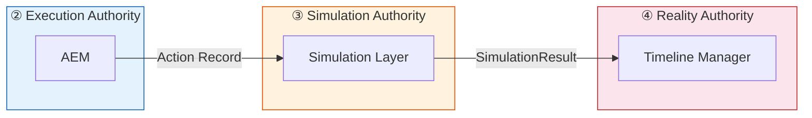
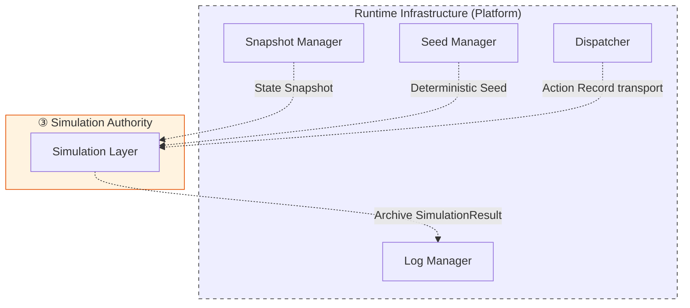
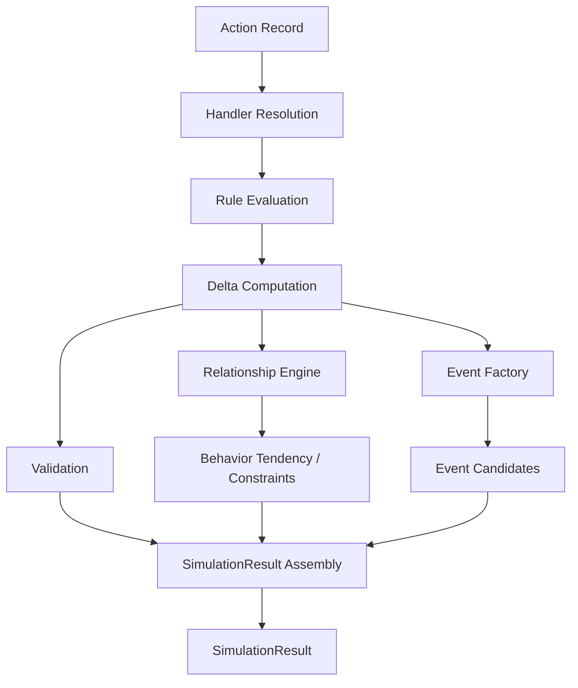
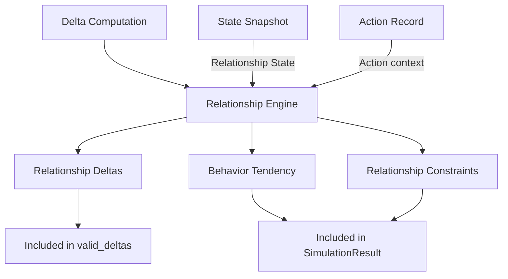
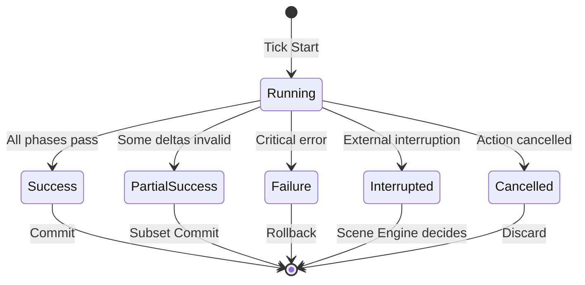
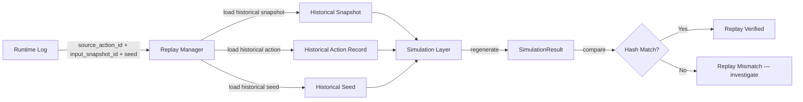

# Simulation Layer Blueprint

**Version:** v2.0 Draft  
**Status:** Draft  
**Last Updated:** 2026-07-14

**Depends On:** [Runtime Pipeline Blueprint](./Runtime_Pipeline_Blueprint.md), [Runtime Infrastructure Blueprint](./Runtime_Infrastructure_Blueprint.md), [Action Execution Model](./Action_Execution_Model.md), [Action Registry](./Action_Registry.md), [Runtime State Model Blueprint](./Runtime_State_Model_Blueprint.md), [Runtime Glossary](./Runtime_Glossary.md), [SimulationResult Schema](../03_Data/SimulationResult_Schema.md), [Action Object Schema](../03_Data/Action_Object_Schema.md), [Character State Schema](../03_Data/Character_State_Schema.md), [Relationship State Schema](../03_Data/Relationship_State_Schema.md)

---

## 1. Purpose（文档目的）

Define the Simulation Authority — Layer ③ of the 5-Layer Authority Pipeline — its responsibilities, boundaries, internal subsystems, and runtime mechanisms.

定义五层权威流水线的第③层——模拟权威——其职责、边界、内部子系统和运行机制。

### Core Definition（核心定义）

**Simulation Layer owns Simulation Authority — Layer ③.**

Simulation Layer 拥有模拟权威——第③层。

> **Simulation decides what happens. Simulation does not decide what becomes reality or how the world changes.**
>
> 模拟决定*发生什么*。模拟不决定*什么成为现实*或*世界如何变化*。

The Simulation Layer takes a validated Action Record and computes what happens when that Action meets the world state. It produces a [SimulationResult](../03_Data/SimulationResult_Schema.md) — a transient, self-contained computation artifact containing state change deltas, event candidates, and validation results. It does not commit Events, does not mutate Persistent State, and does not generate narrative.

Simulation Layer 接收已验证的 Action Record，计算当该 Action 遇到世界状态时发生什么。它产出 [SimulationResult](../03_Data/SimulationResult_Schema.md)——一个瞬态、自包含的计算产物，包含状态变更向量、事件候选和验证结果。它不提交事件，不变更持久状态，不生成叙事。

### Core Philosophy（核心理念）

**Simulation Before Generation. State Is Fact.**

模拟先于生成。状态是事实。

The Simulation Layer produces **facts** (computed outcomes), not **stories** (narrative expressions). Narrative Director, LLM, and Image Pipeline consume these facts to generate expressions. The dependency is strictly one-directional: Simulation produces facts → Generation produces expressions. Generation never feeds back into Simulation.

Simulation Layer 产出**事实**（计算结果），不是**故事**（叙事表达）。Narrative Director、LLM 和 Image Pipeline 消费这些事实来生成表达。依赖严格单向：模拟产出事实 → 生成产出表达。生成永不回传模拟。

### What This Document Is（本文档是什么）

- The authoritative definition of **Simulation Authority** (Layer ③) in the 5-Layer Authority Pipeline
- The boundary specification for what Simulation Layer owns and does not own
- The internal subsystem architecture (Handler system, Relationship Engine, Event Factory)
- The runtime behavior specification for Simulation Tick execution

### What This Document Is NOT（本文档不是什么）

- It does NOT define the Pipeline itself (see [Runtime Pipeline Blueprint](./Runtime_Pipeline_Blueprint.md))
- It does NOT define Infrastructure components (see [Runtime Infrastructure Blueprint](./Runtime_Infrastructure_Blueprint.md))
- It does NOT define SimulationResult structure (see [SimulationResult Schema](../03_Data/SimulationResult_Schema.md))
- It does NOT define Action structure (see [Action Object Schema](../03_Data/Action_Object_Schema.md))
- It does NOT define Action Type registration (see [Action Registry](./Action_Registry.md))

---

## 2. Document Governance（文档治理）

**Status:** Draft

**Status Values:** Draft → RC → Locked → Deprecated

**Owner:** Simulation Architect

**Architecture Reviewers:**

- Runtime Architect
- Engine Architect
- Narrative Architect

**Architecture Approval:** Architecture Review Required

**Last Reviewed:** 2026-07-14

**Update Policy:** Changes affecting Authority boundaries, internal subsystem positioning, Pipeline alignment, Blueprint Contract, or Determinism rules require ADR approval.

**Parent Blueprint:** [Runtime Pipeline Blueprint](./Runtime_Pipeline_Blueprint.md)

---

## 3. Blueprint Contract（蓝图契约）

This contract freezes the Simulation Layer's external interface. It is the stable anchor for downstream Blueprints (State Model, Scene Engine, Relationship Engine, Narrative Director).

本契约冻结 Simulation Layer 的外部接口。它是下游 Blueprint（State Model、Scene Engine、Relationship Engine、Narrative Director）的稳定锚点。

| Item | Content |
|------|---------|
| **Authority** | Layer ③ — Simulation Authority |
| **Pipeline Role** | Decides *what happens when the Action meets the world* |
| **Owns** | SimulationResult production, Simulation Tick lifecycle, Handler execution, Rule evaluation, Delta computation, Event Candidate generation |
| **Does NOT Own** | Event commit (Reality ④), State mutation (State ⑤), Action selection (Intent ①), Action validation (Execution ②), Narrative planning, Memory extraction, Infrastructure |
| **Inputs** | Action Record (via Dispatcher), State Snapshot (via Snapshot Manager), Deterministic Seed (via Seed Manager) |
| **Outputs** | SimulationResult (transient, self-contained) |
| **Downstream Consumers** | Timeline Manager (Reality Authority), Narrative Director (read-only consumer) |
| **Infrastructure Dependencies** | Snapshot Manager, Seed Manager, Dispatcher, Log Manager (see [Runtime Infrastructure Blueprint](./Runtime_Infrastructure_Blueprint.md)) |
| **Produced Artifacts** | SimulationResult (transient → archived by Log Manager) |
| **Consumed Artifacts** | Action Record, State Snapshot, Deterministic Seed, Memory Object (read-only, provided via Snapshot Context) |
| **Consumed Schemas** | [Action Object Schema](../03_Data/Action_Object_Schema.md), [SimulationResult Schema](../03_Data/SimulationResult_Schema.md), [Character State Schema](../03_Data/Character_State_Schema.md), [Relationship State Schema](../03_Data/Relationship_State_Schema.md) |
| **Internal Subsystems** | Simulation Handler system, [Relationship Engine](./Relationship_Engine_Blueprint.md) (internal subsystem), Event Factory (internal sub-component) |
| **Quality Attributes** | Determinism, Isolation, Replayability, Observability (see [Infrastructure §10](./Runtime_Infrastructure_Blueprint.md)) |

> **Contract Stability:** This contract is frozen at Stage 1. Stage 2 expansion adds internal behavioral details but does not change any row in this table.

> **契约稳定性：** 本契约在 Stage 1 冻结。Stage 2 扩展添加内部行为细节，但不改变本表中的任何行。

> **Memory Object Source:** The Simulation Layer does not directly access the Memory Database. Memory Objects are provided as read-only context within the State Snapshot. The Simulation Layer reads Memory through the Snapshot, not through a direct connection to the Memory System.
>
> **记忆对象来源：** Simulation Layer 不直接访问 Memory Database。Memory Object 作为只读上下文包含在 State Snapshot 中。Simulation Layer 通过 Snapshot 读取 Memory，而非通过直接连接 Memory System。

---

## 4. Design Principles（设计原则）

| Principle | Description |
|-----------|-------------|
| **Simulation Before Generation** | 模拟先于生成。State must be determined before any generation occurs. Facts before expressions. |
| **Computation, Not Mutation** | 计算而非变更。Simulation Layer computes what happens (deltas). State Authority (Layer ⑤) applies mutations. Simulation does not directly write to Persistent State. |
| **Deterministic Execution** | 确定性执行。Same State Snapshot + Same Action Record + Same Seed = Same SimulationResult. The entire simulation is replayable. |
| **Transient Output** | 瞬态输出。SimulationResult is transient — it exists during a Scene and is discarded after the Timeline commits it. The permanent record is the Event. |
| **Self-Contained Result** | 自包含结果。SimulationResult carries everything needed for Commit, Debug, and Replay — no external lookups required during Commit Pipeline. |
| **Relationship-Driven** | 关系驱动。Relationship State is the primary driver of simulation outcomes. The Relationship Engine is a first-class internal subsystem, not an afterthought. |
| **Rule-Driven, Not Prompt-Driven** | 规则驱动，非提示驱动。Simulation rules are hard constraints. LLM is soft expression. The LLM may never bypass the Rule system. |
| **Scene Is Atomic** | Scene 是原子的。A Scene executes one or more Simulation Ticks within a transaction. Either all Ticks commit, or the Scene rolls back. |
| **Acyclic Data Flow** | 无环数据流。SimulationResult never references downstream artifacts (Event, State, Memory, Narrative). Dependencies flow strictly forward. |

---

## 5. Authority Definition（权威定义）

### Simulation Authority — Layer ③

The Simulation Layer owns **Simulation Authority** — the right and responsibility to decide *what happens when an Action meets the world*.

Simulation Layer 拥有**模拟权威**——决定*当 Action 遇到世界时发生什么*的权利和责任。

### What Simulation Authority Decides（模拟权威决定什么）

| Decision | Description |
|----------|-------------|
| Rule Evaluation | Which game rules fire for a given Action + State combination |
| Delta Computation | What state changes (deltas) the Action produces |
| Event Candidate Generation | How deltas are packaged into Event Candidates |
| Relationship Delta Computation | How relationships change as a result of the Action |
| Behavior Tendency Computation | What behavioral tendencies the Action computes (via Relationship Engine) |
| Relationship Constraints Computation | What constraints the current relationship state imposes (via Relationship Engine) |
| Simulation Status | Whether the simulation succeeded, partially succeeded, failed, was interrupted, or was cancelled |
| Validation Result | Whether the computed state is internally consistent |

### What Simulation Authority Does NOT Decide（模拟权威不决定什么）

| Decision | Belongs To |
|----------|------------|
| What Action to attempt | Intent Authority (Planner) |
| Whether the Action is structurally valid | Execution Authority (AEM) |
| What becomes objective reality | Reality Authority (Timeline Manager) |
| How the world changes (state mutation) | State Authority (State Management Layer) |
| How to narrate the outcome | Narrative Director |
| What memories to extract | Memory System |

> **Critical Boundary — Computation vs Mutation:** The Simulation Layer computes deltas (what should change). The State Management Layer applies those deltas (how the world actually changes). This separation is fundamental: Simulation Authority owns the *computation*, State Authority owns the *mutation*. No module may bypass State Authority to directly mutate Persistent State.

> **关键边界——计算 vs 变更：** Simulation Layer 计算 delta（应该改变什么）。State Management Layer 应用这些 delta（世界实际如何变化）。这种分离是根本性的：模拟权威拥有*计算*，状态权威拥有*变更*。任何模块不得绕过状态权威直接变更持久状态。

---

## 6. Boundary Definition（边界定义）

### Owns（拥有）

| Domain | Description |
|--------|-------------|
| SimulationResult Production | The complete computation of what happens when an Action meets the world |
| Simulation Tick Lifecycle | The atomic execution unit: one Action dispatched → one SimulationResult produced |
| Handler Execution | Invoking the type-specific simulation logic bound via Action Registry |
| Rule Evaluation | Evaluating game rules against the current State Snapshot and Action |
| Delta Computation | Computing state change vectors (deltas) based on rule evaluation |
| Event Candidate Generation | Packaging valid deltas into Event Candidates via the Event Factory |
| Relationship Delta Computation | Computing relationship changes (via Relationship Engine subsystem) |
| Behavior Tendency Computation | Computing behavioral tendency signals for Narrative Director (via Relationship Engine) |
| Relationship Constraints Computation | Computing hard constraints for Narrative Director (via Relationship Engine) |
| Simulation Validation | Validating that the computed state is internally consistent |

### Does NOT Own（不拥有）

| Domain | Belongs To |
|--------|------------|
| Action Object structure and intent | Intent Authority (Planner) — [Action Object Schema](../03_Data/Action_Object_Schema.md) |
| Action validation (structural, precondition) | Execution Authority (AEM) — [Action Execution Model](./Action_Execution_Model.md) |
| Action scheduling, queue, retry, cancellation | Execution Authority (AEM) |
| Action Type definitions and handler binding identifiers | Registry Authority (Action Registry) — [Action Registry](./Action_Registry.md) |
| Event commit and Timeline | Reality Authority (Timeline Manager) — [Event Object Schema](../03_Data/Event_Object_Schema.md) |
| State mutation (Character, Relationship, World, Progression, Timeline) | State Authority (State Management Layer) — [Runtime State Model Blueprint](./Runtime_State_Model_Blueprint.md) |
| Scene transaction management | Scene Engine — [Scene Engine Blueprint](./Scene_Engine_Blueprint.md) |
| Narrative planning and generation | Narrative Director — [Narrative Director Blueprint](./Narrative_Director_Blueprint.md) |
| Memory extraction and storage | Memory System — [Memory Architecture Blueprint](./Memory_Architecture_Blueprint.md) |
| Snapshot creation, storage, fork | Infrastructure (Snapshot Manager) — [Runtime Infrastructure Blueprint](./Runtime_Infrastructure_Blueprint.md) |
| Seed generation and distribution | Infrastructure (Seed Manager) |
| Log archival and indexing | Infrastructure (Log Manager) |
| Dispatch transport | Infrastructure (Dispatcher) |

---

## 7. Runtime Position（运行时定位）

The Simulation Layer is Layer ③ in the 5-Layer Authority Pipeline. Data flows strictly forward: Action Record enters from Layer ②, SimulationResult exits to Layer ④.

Simulation Layer 是五层权威流水线的第③层。数据严格向前流动：Action Record 从第②层进入，SimulationResult 流向第④层。

### Pipeline Alignment（流水线对齐）



### Infrastructure Support（基础设施支持）



> **Dashed lines mean "serves, not decides".** All Infrastructure connections are dashed. Infrastructure provides services (snapshots, seeds, transport, archival). It never participates in simulation decisions. See [Runtime Infrastructure Blueprint](./Runtime_Infrastructure_Blueprint.md).

### Acyclic Data Flow（无环数据流）

```
Action Record → SimulationResult → Event Object → State Mutation
     ②                 ③               ④              ⑤
```

- SimulationResult never depends on Event or State
- SimulationResult never references Memory, Relationship (as external dependency), or Narrative
- The dependency is strictly one-directional: upstream → downstream

---

## 8. Inputs & Outputs（输入与输出）

### Inputs（输入）

| Input | Source | Via | Description |
|-------|--------|-----|-------------|
| **Action Record** | AEM (Execution Authority) | Dispatcher | Validated Action with execution metadata. Contains `action_id` referencing the immutable Action Object. The Action's `action_type` determines which Handler to invoke. |
| **State Snapshot** | State Management Layer | Snapshot Manager | Immutable, consistent copy of Runtime State at a point in time. Contains Character State, Relationship State, World State, Progression State, Timeline State. |
| **Deterministic Seed** | Seed Manager | Seed Manager | Reproducible random number source. Same seed + same snapshot + same action = same result. |

### Outputs（输出）

| Output | Target | Description |
|--------|--------|-------------|
| **SimulationResult** | Timeline Manager (Reality Authority), Narrative Director (consumer), Log Manager (archive) | Transient, self-contained computation artifact. Contains: identity, status, valid/invalid deltas, event candidates, validation result, failure info, diagnostics, commit metadata. See [SimulationResult Schema](../03_Data/SimulationResult_Schema.md). |

> **SimulationResult is the SOLE external output.** The Simulation Layer produces exactly one pipeline artifact. Internal products (Behavior Tendency, Relationship Constraints) are described in §9.2 — they are not pipeline artifacts. See [Artifact Ownership Matrix](./Runtime_Artifact_Ownership_Matrix.md) §5 (Confidence: Provisional).

> **SimulationResult 是唯一外部输出。** Simulation Layer 只产出一个流水线制品。内部计算产物（Behavior Tendency、Relationship Constraints）在 §9.2 中描述——它们不是流水线制品。见 [Artifact Ownership Matrix](./Runtime_Artifact_Ownership_Matrix.md) §5（Confidence: Provisional）。

> **SimulationResult Self-Contained Contract:** A SimulationResult SHALL be self-contained and sufficient for Timeline commit, replay, debugging, and deterministic verification without additional Simulation execution.

> **SimulationResult 自包含契约：** SimulationResult 必须自包含，足以支持 Timeline 提交、重放、调试和确定性验证，无需额外的 Simulation 执行。

> **SimulationResult Immutability:** Once produced, a SimulationResult SHALL NOT be modified by any downstream component. Timeline Manager, Narrative Director, Replay System, Debugger, and Log Manager may consume it, but SHALL NOT mutate its contents. Commit metadata is the only exception — it is updated by the Commit Pipeline, not by consumers.

> **SimulationResult 不可变性：** 一旦产出，SimulationResult 不得被任何下游组件修改。Timeline Manager、Narrative Director、Replay System、Debugger 和 Log Manager 可以消费它，但不得变更其内容。Commit metadata 是唯一例外——由 Commit Pipeline 更新，而非消费者。

---

## 9. Internal Subsystems（内部子系统）

The Simulation Layer contains three internal subsystems. Their boundaries are defined here at the architecture level; detailed behavior will be specified in Stage 2.

Simulation Layer 包含三个内部子系统。其边界在此架构层面定义；详细行为将在 Stage 2 中展开。

### 9.1 Simulation Handler System（模拟处理器系统）

| Aspect | Description |
|--------|-------------|
| **Role** | Executes type-specific simulation logic for each Action Type |
| **Binding** | Handler identifiers (`handler_id`) are bound in the [Action Registry](./Action_Registry.md). The Simulation Layer queries Registry to resolve which Handler to invoke for a given `action_type`. |
| **Owns** | Handler execution logic (gameplay rules for each Action Type) |
| **Does NOT Own** | Action Type definitions (Registry owns), Action validation (AEM owns) |
| **Registry Relationship** | Registry provides `handler_id`; Simulation Layer owns the Handler implementation. Handler binding is an identifier mapping, not lifecycle ownership. |

> **Handler is Simulation Authority:** Handlers contain the gameplay rules that determine what happens when an Action meets the world. This is the core of Simulation Authority — the rules that compute reality.

> **Handler Purity:** A Simulation Handler SHALL be functionally pure with respect to Persistent State. Handler input: Action + Snapshot + Seed. Handler output: Deltas + Diagnostics. A Handler SHALL NOT: modify Character State, modify Relationship State, modify Memory, commit Events, or access Infrastructure directly. A Handler only returns computation results — it never produces side effects on Persistent State.

> **Handler 纯净性：** Simulation Handler 对 Persistent State 必须是函数式纯净的。Handler 输入：Action + Snapshot + Seed。Handler 输出：Deltas + Diagnostics。Handler 不得：修改 Character State、修改 Relationship State、修改 Memory、提交 Event、或直接访问 Infrastructure。Handler 只返回计算结果——它永不产生 Persistent State 副作用。

### 9.2 Relationship Engine（关系引擎）

| Aspect | Description |
|--------|-------------|
| **Role** | Computes relationship deltas, behavior tendencies, and relationship constraints |
| **Positioning** | Internal subsystem of the Simulation Layer. It is NOT an independent Authority layer. |
| **Computes** | Relationship dimension rules, relationship evolution logic, behavior tendency inference, constraint generation |
| **Internal Products** | Behavior Tendency, Relationship Constraints (Confidence: Provisional — see [Artifact Ownership Matrix](./Runtime_Artifact_Ownership_Matrix.md) §5) |
| **Does NOT Own** | Relationship State mutation (State Authority owns mutation), Character State, World State |
| **State Mutation Path** | Relationship Engine computes relationship deltas → deltas are included in SimulationResult → State Authority applies deltas to Persistent State. The Relationship Engine never directly writes to Relationship State. |
| **Blueprint** | [Relationship Engine Blueprint](./Relationship_Engine_Blueprint.md) (⚠️ Partial — to be updated in Phase B-2) |

> **Relationship Engine is NOT an Authority Layer:** The Relationship Engine operates within Simulation Authority (Layer ③). It computes relationship deltas, but the actual state mutation flows through State Authority (Layer ⑤). This is the "State Owns Mutation" rule from the [Artifact Ownership Matrix](./Runtime_Artifact_Ownership_Matrix.md).

### 9.3 Event Factory（事件工厂）

| Aspect | Description |
|--------|-------------|
| **Role** | Packages computed deltas into Event Candidates following the [Event Object Schema](../03_Data/Event_Object_Schema.md) |
| **Positioning** | Internal sub-component of the Simulation Layer, as defined in [SimulationResult Schema §3](../03_Data/SimulationResult_Schema.md) |
| **Owns** | Event Candidate structure generation (lifecycle_state = `generated`) |
| **Does NOT Own** | Event commit (Timeline Manager owns), Event sequence assignment (Timeline Manager assigns at commit) |
| **Output** | Event Candidates in `event_candidates` field of SimulationResult. These are NOT committed Events — they are candidates pending Timeline Manager approval. |

> **Event Factory Produces Candidates, Not Reality:** Event Factory packages deltas into structured Event Candidates. These candidates are in the `generated` lifecycle state (see [Event Object Schema §11](../03_Data/Event_Object_Schema.md)). They become objective reality only when the Timeline Manager commits them. The Simulation Layer does not have the authority to declare reality.
>
> **Event Candidate Immutability:** Event Candidates are immutable once packaged. The Timeline Manager may accept or reject them, but SHALL NOT mutate candidate contents. This guarantee is essential for deterministic replay.

---

## 10. Quality Attributes（质量属性）

The Simulation Layer inherits all Quality Attributes from [Runtime Infrastructure Blueprint §10](./Runtime_Infrastructure_Blueprint.md). The following attributes have specific Simulation Layer implications:

| Attribute | Source | Simulation Layer Implication |
|-----------|--------|------------------------------|
| **Determinism** | Infrastructure §10.1 | Same Snapshot + Same Action Record + Same Seed = Same SimulationResult. The entire simulation is replayable. Seeds are consumed from Seed Manager, not generated internally. |
| **Consistency** | Infrastructure §10.2 | All queries within a Scene transaction see the same snapshot. SimulationResult is consistent with its input snapshot. |
| **Isolation** | Infrastructure §10.3 | Prediction (forked state simulation) SHALL NOT affect the main Timeline. Prediction results are never committed (`commit_scope = prediction`). Replay sessions SHALL NOT affect live Runtime state. |
| **Recoverability** | Infrastructure §10.4 | Simulation failure mandates rollback to the Scene snapshot. SimulationResult with `failure` status is never committed. |
| **Observability** | Infrastructure §10.5 | Diagnostics field in SimulationResult provides full rule trace, timing, and intermediate values (in Debug mode). Log Manager archives SimulationResults for replay and debugging. |

---

## 11. Simulation Tick Lifecycle（模拟 Tick 生命周期）

A Simulation Tick is the atomic execution unit of the Simulation Layer. One Action Record dispatched → one SimulationResult produced. A Tick is indivisible — it either completes entirely or fails entirely.

Simulation Tick 是 Simulation Layer 的原子执行单元。一个 Action Record 被调度 → 一个 SimulationResult 被产出。Tick 不可分割——要么完全完成，要么完全失败。

### Tick Execution Flow（Tick 执行流程）



Each node in this diagram corresponds to a section below (§12–§18). The flow is strictly sequential — each phase SHALL complete before the next begins.

此图中的每个节点对应下方一个章节（§12–§18）。流程严格顺序执行——每个阶段必须在下一个阶段开始前完成。

### Tick Phases（Tick 阶段）

| Phase | Section | Description |
|-------|---------|-------------|
| 1. Handler Resolution | §12 | Resolve `action_type` → `handler_id` via Registry |
| 2. Rule Evaluation | §13 | Evaluate applicable game rules against Snapshot + Action |
| 3. Delta Computation | §14 | Compute state change vectors (deltas) |
| 4. Relationship Engine | §15 | Compute relationship deltas, behavior tendency, constraints |
| 5. Event Factory | §16 | Package valid deltas into Event Candidates |
| 6. Validation | §17 | Validate computed state consistency |
| 7. Assembly | §18 | Assemble all results into SimulationResult |

### Tick Rules（Tick 规则）

| Rule | Description |
|------|-------------|
| One Action per Tick | A Tick processes exactly one Action Record |
| One Result per Tick | A Tick produces exactly one SimulationResult |
| Atomic Execution | A Tick either completes all phases or fails entirely — no partial execution persists |
| Deterministic | Same Snapshot + Same Action + Same Seed = Same SimulationResult |
| No Side Effects | A Tick does not mutate Persistent State — it only computes deltas |
| Scene-Bounded | A Tick executes within a Scene transaction. Scene failure rolls back all Ticks in the Scene |

---

## 12. Handler Resolution（处理器解析）

Handler Resolution is the first phase of a Tick. The Simulation Layer queries the [Action Registry](./Action_Registry.md) to resolve which Handler to invoke for the incoming Action Record.

处理器解析是 Tick 的第一阶段。Simulation Layer 查询 [Action Registry](./Action_Registry.md) 以确定要调用哪个 Handler 来处理传入的 Action Record。

### Resolution Flow（解析流程）

| Step | Operation | Source |
|------|-----------|--------|
| 1 | Extract `action_type` from Action Record | Action Record |
| 2 | Query `Registry.get_handler(action_type)` | Action Registry |
| 3 | Receive `handler_id` | Registry returns handler identifier |
| 4 | Invoke Handler with Action + Snapshot + Seed | Handler executes simulation logic |

### Resolution Rules（解析规则）

| Rule | Description |
|------|-------------|
| Handler SHALL be resolved before execution | The Simulation Layer SHALL NOT invoke a Handler without a valid `handler_id` from Registry |
| Handler not found → failure | If `Registry.get_handler` returns no handler, the Tick produces a `failure` SimulationResult with `failure_code = HANDLER_NOT_FOUND` |
| Handler is pure | See §9.1 Handler Purity — Handler receives inputs and returns outputs, never produces side effects |
| Registry is read-only | The Simulation Layer queries Registry but SHALL NOT modify Registry state during a Tick |

---

## 13. Rule Evaluation（规则评估）

Rule Evaluation is the second phase. The Handler evaluates which game rules fire for the given Action + State Snapshot combination.

规则评估是第二阶段。Handler 评估哪些游戏规则对给定的 Action + State Snapshot 组合触发。

### Rule Categories（规则分类）

| Category | Description | Example |
|----------|-------------|---------|
| Character Rules | Rules governing character state changes | Damage calculation, mood shift, skill progression |
| Relationship Rules | Rules governing relationship dimension changes | Trust increase from shared experience, jealousy from rivalry |
| World Rules | Rules governing world state changes | Time advancement, weather change, location transition |
| Progression Rules | Rules governing quest and story progression | Quest unlock, flag set, milestone reached |
| Environment Rules | Rules governing environmental context | Lighting, ambiance, NPC density |

### Evaluation Order（评估顺序）

| Rule | Description |
|------|-------------|
| All applicable rules SHALL be evaluated | The Handler SHALL evaluate every rule that matches the Action + State combination |
| Rule evaluation SHALL complete before Delta Computation | Deltas are computed from rule evaluation results — rules must finish first |
| Rule trace SHALL be recorded in Diagnostics | Every evaluated rule (fired or not) SHALL be logged in `diagnostics.rule_trace` for debugging and replay verification |
| Rule evaluation is deterministic | Given the same Action + Snapshot, the same rules fire in the same order |

> **Rules are Type-Specific:** Each Action Type's Handler contains its own rule set. The Handler is bound via Registry `handler_id`. The Simulation Layer does not define rules — it executes the rules embedded in the Handler.

---

## 14. Delta Computation（Delta 计算）

Delta Computation is the third phase. The Handler computes state change vectors (deltas) based on rule evaluation results.

Delta 计算是第三阶段。Handler 根据规则评估结果计算状态变更向量（delta）。

### Delta Structure（Delta 结构）

Each delta follows the structure defined in [SimulationResult Schema §5](../03_Data/SimulationResult_Schema.md):

| Field | Description |
|-------|-------------|
| `target_id` | The entity whose state changes (e.g., `char_001`) |
| `target_type` | Entity type (`character`, `relationship`, `world`, `progression`) |
| `op` | Operation (`set`, `add`, `remove`, `merge`) |
| `path` | Field path within the entity (e.g., `mood`, `trust`) |
| `val` | New value or delta value |
| `metadata` | Optional metadata (rule source, confidence, reason) |

### Delta Classification（Delta 分类）

| Category | Field | Description |
|----------|-------|-------------|
| Valid Delta | `valid_deltas` | Deltas that pass all validation checks — eligible for commit |
| Invalid Delta | `invalid_deltas` | Deltas that fail validation — rejected, with rejection reason recorded |

### Delta Rules（Delta 规则）

| Rule | Description |
|------|-------------|
| Deltas target Persistent State only | Deltas describe changes to Character, Relationship, World, Progression, or Timeline State |
| Deltas do NOT mutate state | The Handler computes deltas but SHALL NOT apply them — State Authority applies deltas |
| Delta ordering is deterministic | Deltas SHALL be ordered in a deterministic sequence to ensure replay produces identical results |
| Zero transformation to Event Schema | Deltas use the same structure as Event Object Schema deltas — Event Factory packages them without transformation |
| Relationship deltas are computed by Relationship Engine | Relationship-specific deltas are computed by the Relationship Engine subsystem (see §15) |

---

## 15. Relationship Engine Integration（关系引擎集成）

The Relationship Engine is invoked during Delta Computation to compute relationship-specific deltas, behavior tendencies, and relationship constraints.

Relationship Engine 在 Delta 计算阶段被调用，以计算关系特定的 delta、行为倾向和关系约束。

### Invocation Flow（调用流程）



### Relationship Engine Inputs & Outputs（关系引擎输入输出）

| Direction | Item | Description |
|-----------|------|-------------|
| Input | Relationship State (from Snapshot) | Current relationship dimensions between entities |
| Input | Action context | The Action being simulated and its participants |
| Input | Character personality traits | Personality modifiers affect relationship evolution |
| Output | Relationship Deltas | Changes to relationship dimensions (trust, affection, etc.) — included in `valid_deltas` |
| Output | Behavior Tendency | Structured signals for Narrative Director (internal product, Provisional) |
| Output | Relationship Constraints | Hard constraints for Narrative Director (internal product, Provisional) |

### State Mutation Path（状态变更路径）

> **Relationship Engine never directly mutates Relationship State.** The path is: Relationship Engine computes deltas → deltas included in `valid_deltas` of SimulationResult → Timeline Manager commits Event → State Authority applies deltas to Persistent State. The Relationship Engine is a computation subsystem, not a mutation authority.

> **Relationship Engine 永不直接变更 Relationship State。** 路径是：Relationship Engine 计算 delta → delta 包含在 SimulationResult 的 `valid_deltas` 中 → Timeline Manager 提交 Event → State Authority 将 delta 应用到 Persistent State。Relationship Engine 是计算子系统，不是变更权威。

---

## 16. Event Factory（事件工厂）

Event Factory is invoked after Delta Computation. It packages valid deltas into Event Candidates following the [Event Object Schema](../03_Data/Event_Object_Schema.md).

Event Factory 在 Delta 计算后被调用。它将 valid delta 打包为 Event Candidate，遵循 [Event Object Schema](../03_Data/Event_Object_Schema.md)。

### Packaging Process（打包流程）

| Step | Operation |
|------|-----------|
| 1 | Collect all `valid_deltas` from Delta Computation |
| 2 | Group deltas by target entity and causal relationship |
| 3 | Package each group into an Event Candidate following Event Object Schema |
| 4 | Set `lifecycle_state = generated` for each candidate |
| 5 | Assign preliminary metadata (trigger, actor, action, timestamp from Action Record) |
| 6 | Perform Delta-Event consistency check |

### Delta-Event Consistency Rule（Delta-Event 一致性规则）

> **Union of all Event Candidate deltas SHALL equal `valid_deltas`.** No delta may be lost or duplicated during packaging. This is verified before SimulationResult Assembly.

> **所有 Event Candidate delta 的并集 SHALL 等于 `valid_deltas`。** 打包过程中不允许丢失或重复 delta。在 SimulationResult Assembly 前验证。

### Event Candidate Rules（事件候选规则）

| Rule | Description |
|------|-------------|
| Candidates are immutable once packaged | See §9.3 Event Candidate Immutability |
| Candidates are NOT committed Events | Candidates have `lifecycle_state = generated`; they become reality only when Timeline Manager commits them |
| Sequence assignment is deferred | Event sequence numbers are assigned by Timeline Manager at commit, not by Event Factory |
| Candidates are self-contained | Each candidate contains all information needed for Timeline commit without additional Simulation execution |

---

## 17. Validation（验证）

Validation is the sixth phase. The Simulation Layer validates that the computed state is internally consistent before assembling the SimulationResult.

验证是第六阶段。Simulation Layer 在组装 SimulationResult 前验证计算状态内部一致。

### Validation Checks（验证检查）

| Check | Description |
|-------|-------------|
| Range Check | Every delta value is within valid range for its target field |
| Reference Check | Every entity reference in deltas points to an entity that exists in the Snapshot |
| Constraint Check | Computed values do not violate hard constraints (e.g., relationship dimension caps) |
| Invariant Check | Global invariants are not violated (e.g., timeline monotonicity, no duplicate entity IDs) |
| Delta-Event Consistency | Union of Event Candidate deltas equals `valid_deltas` (see §16) |
| Relationship Constraint Self-Consistency | Relationship Constraints produced by Relationship Engine do not contradict each other |

### Validation Rules（验证规则）

| Rule | Description |
|------|-------------|
| Validation is mandatory | Validation SHALL complete before SimulationResult Assembly |
| Validation failure → status = failure | If any check fails, SimulationResult status is set to `failure` with `failure_code` in `failure_info` |
| Validated state hash | A `validated_state_hash` SHALL be computed and included in SimulationResult for replay verification |
| Invalid deltas are recorded | Deltas that fail validation are moved to `invalid_deltas` with rejection reason |

---

## 18. SimulationResult Assembly（SimulationResult 组装）

Assembly is the final phase. All computation results are assembled into a single SimulationResult.

组装是最终阶段。所有计算结果被组装为一个 SimulationResult。

### Assembly Process（组装流程）

| Step | Content |
|------|---------|
| 1 | Set identity fields (`result_id`, `correlation_id`, `seed`, `source_action_id`, `input_snapshot_id`, `commit_scope`) |
| 2 | Set `status` field based on Tick outcome (`success` / `partial_success` / `failure` / `interrupted` / `cancelled`) |
| 3 | Populate `valid_deltas` and `invalid_deltas` from Delta Computation |
| 4 | Populate `event_candidates` from Event Factory |
| 5 | Populate `validation_result` from Validation phase |
| 6 | Populate `failure_info` if status is failure or partial_success |
| 7 | Populate `diagnostics` with rule trace, timing, and intermediate values (debug mode) |
| 8 | Populate `commit_metadata` (initially empty, filled by Commit Pipeline) |

### Assembly Rules（组装规则）

| Rule | Description |
|------|-------------|
| Self-contained | The assembled SimulationResult SHALL be self-contained (see §8 Self-Contained Contract) |
| Immutable after assembly | Once assembled, the SimulationResult SHALL NOT be modified (see §8 Immutability) — except `commit_metadata` by Commit Pipeline |
| All phases completed | Assembly SHALL NOT begin until all prior phases (§12–§17) have completed |
| No computation during assembly | Assembly is a data aggregation step — no further simulation logic SHALL execute during assembly |

> **See [SimulationResult Schema](../03_Data/SimulationResult_Schema.md) for the complete field specification.** This Blueprint defines the behavioral contract; the Schema defines the structural contract.

---

## 19. Failure Handling（失败处理）

Failure Handling defines how the Simulation Layer responds when a Tick cannot complete successfully.

失败处理定义 Simulation Layer 在 Tick 无法成功完成时的响应方式。

### SimulationResult Status Enum（状态枚举）

| Status | Description | Committed? | Rollback? |
|--------|-------------|------------|----------|
| `success` | All phases completed, all deltas valid, validation passed | Yes — full commit | No |
| `partial_success` | Some deltas valid, some invalid (non-critical failure) | Yes — subset commit of valid deltas only | No |
| `failure` | Critical failure — simulation cannot produce valid result | No | Yes — rollback to Scene snapshot |
| `interrupted` | Tick was interrupted (e.g., Scene cancellation, engine shutdown) | Scene Engine decides | Scene Engine decides |
| `cancelled` | Action was cancelled before or during simulation | No | Yes — discard all results |

### Failure Codes（失败代码）

| Code | Description | Source |
|------|-------------|-------|
| `HANDLER_NOT_FOUND` | No handler bound for `action_type` | Handler Resolution |
| `PRECONDITION_FAILED` | Required precondition not met (e.g., insufficient stamina) | Rule Evaluation |
| `RULE_VIOLATION` | Computed result violates a hard game rule | Rule Evaluation / Validation |
| `STATE_INVALID` | Computed state is internally inconsistent | Validation |
| `SEED_EXHAUSTED` | Deterministic seed pool exhausted (should not occur in normal operation) | Delta Computation |

### Status Flow（状态流转）



### Handling Rules（处理规则）

| Rule | Description |
|------|-------------|
| Failure mandates rollback | A `failure` SimulationResult SHALL NOT enter the Commit Pipeline. The Scene rolls back to its snapshot. |
| Partial success allows subset commit | Only `valid_deltas` and their Event Candidates are committed. `invalid_deltas` are recorded for debugging. |
| Retry is AEM's decision | The Simulation Layer SHALL NOT retry failed Ticks. Retry policy is owned by [Action Execution Model](./Action_Execution_Model.md). |
| Failure info is diagnostic | `failure_info` in SimulationResult provides failure code, phase, and context for debugging — never for retry logic. |
| No side effects on failure | A failed Tick SHALL NOT have modified Persistent State. The Handler Purity guarantee (§9.1) ensures this. |

---

## 20. Prediction（预测）

Prediction allows the Simulation Layer to compute hypothetical outcomes without affecting the live Runtime State. Prediction uses forked snapshots — read-only copies of the current state.

预测允许 Simulation Layer 计算假设结果而不影响实时 Runtime State。预测使用 fork 快照——当前状态的只读副本。

### Prediction Rules（预测规则）

| Rule | Description |
|------|-------------|
| Fork-based | Prediction SHALL use a forked snapshot from [Snapshot Manager](./Runtime_Infrastructure_Blueprint.md). The fork is read-only. |
| commit_scope = prediction | SimulationResult from prediction SHALL have `commit_scope = prediction`. This marks it as non-committable. |
| Never enters Commit Pipeline | Prediction results SHALL NOT be sent to Timeline Manager. They are consumed by the requesting module only. |
| Deterministic | Prediction follows the same determinism rules as live simulation: same forked state + same action + same seed = same result. |
| No side effects | Prediction SHALL NOT modify the original snapshot, the live Runtime State, or the Timeline. |

### Prediction Use Cases（预测用例）

| Use Case | Consumer |
|----------|----------|
| AI planning — "what if the player does X?" | Planner / Narrative Director |
| Debugging — "what would have happened?" | Debug Tools |
| Balance testing — "is this action too strong?" | Testing / Content Tools |

---

## 21. Replay（重放）

Replay regenerates a SimulationResult from historical inputs without executing against live Runtime State. Replay is the foundation of deterministic verification.

重放从历史输入重新生成 SimulationResult，而不对实时 Runtime State 执行。重放是确定性验证的基础。

### Replay Process（重放流程）



### Replay Rules（重放规则）

| Rule | Description |
|------|-------------|
| Replay regenerates, does not load | Replay SHALL regenerate SimulationResult from inputs, not load it from storage. The stored SimulationResult is used only for hash comparison. |
| Replay uses isolated snapshot | Replay SHALL use a snapshot from [Log Manager](./Runtime_Infrastructure_Blueprint.md) archive, not the live Runtime State. |
| Replay does not affect live state | Replay sessions SHALL NOT modify the Timeline, Runtime State, or any live data. |
| Hash verification | The `validated_state_hash` of the regenerated SimulationResult SHALL match the original. Mismatch indicates a determinism violation. |
| Handler version must match | Replay SHALL use the same Handler version that was active when the original Tick executed. Handler version is resolved via [Action Registry](./Action_Registry.md) Version Archive. |

---

## 22. Performance & Hardware（性能与硬件）

### Target Hardware（目标硬件）

| Spec | Value |
|------|-------|
| GPU | RTX 5060 8GB |
| RAM | 32GB |
| Mode | Offline First |

### Design Constraints（设计约束）

| Constraint | Description |
|------------|-------------|
| CPU-first | Simulation SHALL execute on CPU. It SHALL NOT require GPU for any computation. |
| GPU Independent | The Simulation Layer SHALL operate with no AI model loaded. Simulation rules are CPU-evaluated, not LLM-evaluated. |
| Low Latency | A single Simulation Tick SHALL complete within a target latency budget. Specific budget is implementation-defined. |
| Background Friendly | Simulation SHALL not block UI rendering or audio playback. Long-running Ticks (if any) SHALL yield control periodically. |
| Diagnostics Overhead | Diagnostics (rule trace, timing) SHALL be optional. Production mode MAY reduce diagnostics detail to improve performance. Debug mode SHALL provide full diagnostics. |

> **Simulation is CPU-first by design.** The Simulation Layer is a rule-driven state machine, not an AI model. It must be able to run independently of any GPU or AI runtime. This is the "Simulation Before Generation" principle in action.

> **模拟是 CPU 优先设计。** Simulation Layer 是规则驱动的状态机，不是 AI 模型。它必须能在没有任何 GPU 或 AI 运行时的情况下独立运行。这是"模拟先于生成"原则的体现。

---

## 23. Non-Goals（非目标）

This document intentionally does **not** define the following:

本文档有意**不**定义以下内容：

| Non-Goal | Owned By |
|----------|----------|
| Action Object structure | [Action Object Schema](../03_Data/Action_Object_Schema.md) (Locked) |
| Action validation and lifecycle | [Action Execution Model](./Action_Execution_Model.md) (RC1) |
| Action Type definitions and parameter schemas | [Action Registry](./Action_Registry.md) (RC2) |
| SimulationResult structure | [SimulationResult Schema](../03_Data/SimulationResult_Schema.md) (Draft) |
| Event structure and commit | [Event Object Schema](../03_Data/Event_Object_Schema.md) (RC4) + Timeline Manager |
| State mutation rules | [Runtime State Model Blueprint](./Runtime_State_Model_Blueprint.md) |
| Scene transaction management | [Scene Engine Blueprint](./Scene_Engine_Blueprint.md) |
| Relationship dimension definitions | [Relationship Engine Blueprint](./Relationship_Engine_Blueprint.md) + [Relationship State Schema](../03_Data/Relationship_State_Schema.md) |
| Narrative planning | [Narrative Director Blueprint](./Narrative_Director_Blueprint.md) |
| Memory extraction | [Memory Architecture Blueprint](./Memory_Architecture_Blueprint.md) |
| Infrastructure component definitions | [Runtime Infrastructure Blueprint](./Runtime_Infrastructure_Blueprint.md) |
| Pipeline definition | [Runtime Pipeline Blueprint](./Runtime_Pipeline_Blueprint.md) |
| Specific data structures or algorithms | Implementation (not Architecture) |

> **Boundary Summary:** Simulation Layer owns *what happens when an Action meets the world* — rule evaluation, delta computation, event candidate generation, relationship delta computation. It does not own *what Actions exist* (Registry), *whether Actions are valid* (AEM), *what becomes reality* (Timeline Manager), *how the world changes* (State Management), or *how to narrate the outcome* (Narrative Director).

---

## 24. References

**Depends On:**

- [Runtime Pipeline Blueprint](./Runtime_Pipeline_Blueprint.md) — defines Pipeline stage ③
- [Runtime Infrastructure Blueprint](./Runtime_Infrastructure_Blueprint.md) — defines infrastructure support
- [Action Execution Model](./Action_Execution_Model.md) — defines upstream (Action Record)
- [Action Registry](./Action_Registry.md) — defines handler_id binding
- [Runtime State Model Blueprint](./Runtime_State_Model_Blueprint.md) — defines state domains
- [Runtime Glossary](./Runtime_Glossary.md) — defines terminology
- [SimulationResult Schema](../03_Data/SimulationResult_Schema.md) — defines output structure
- [Action Object Schema](../03_Data/Action_Object_Schema.md) — defines input structure (referenced by Action Record)
- [Character State Schema](../03_Data/Character_State_Schema.md) — defines state domain consumed
- [Relationship State Schema](../03_Data/Relationship_State_Schema.md) — defines state domain consumed
- [Runtime Artifact Ownership Matrix](./Runtime_Artifact_Ownership_Matrix.md) — defines artifact ownership

**Referenced By:**

- [Action Execution Model](./Action_Execution_Model.md) — Simulation Layer as AEM's downstream
- [SimulationResult Schema](../03_Data/SimulationResult_Schema.md) — Simulation Layer as Schema's parent Blueprint
- [Relationship Engine Blueprint](./Relationship_Engine_Blueprint.md) — Simulation Layer as parent
- [Scene Engine Blueprint](./Scene_Engine_Blueprint.md) — Simulation Layer as Scene's core
- [Narrative Director Blueprint](./Narrative_Director_Blueprint.md) — SimulationResult as consumer input
- [Runtime Pipeline Blueprint](./Runtime_Pipeline_Blueprint.md) — Simulation Layer as stage ③
- [Runtime Infrastructure Blueprint](./Runtime_Infrastructure_Blueprint.md) — Simulation Layer as infrastructure consumer
- [Runtime State Model Blueprint](./Runtime_State_Model_Blueprint.md) — Simulation Layer as state mutation requester

---

## 25. Revision History

| Version | Date | Description |
|---------|------|-------------|
| v1.0 | 2026-07-12 | Initial Blueprint |
| v1.1 | 2026-07-13 | Engineering refinement: Ground Truth Authority, Runtime Position, Core State Domains, Runtime Guarantees |
| v1.2 | 2026-07-13 | Documentation enhancement: bilingual headings, Mermaid flowcharts, tables, consistent terminology |
| v2.0 Draft | 2026-07-14 | **Complete rewrite (Phase B-1.1):** Architecture paradigm migration from pre-Pipeline to 5-Layer Authority Pipeline. Repositioned as Layer ③ Simulation Authority. Added Blueprint Contract (frozen interface). Corrected critical boundary: Simulation Layer computes deltas but does NOT mutate Persistent State (State Authority owns mutation). Added Relationship Engine as internal subsystem with explicit state mutation path. Added Event Factory as internal sub-component. Replaced old flowchart with Pipeline-aligned diagrams. Added Decision Ownership (B9 compliance). Added Infrastructure dependency references. Aligned with RC Freeze Checklist Part B v1.1 requirements. Stage 1: Architecture Skeleton — boundary frozen. Stage 2: Behavior Design to follow. |
| v2.0 Draft (Rev 1) | 2026-07-14 | Stage 1 Contract micro-adjustments (GPT review): (1) Removed duplicate §14 Governance — §2 is canonical. (2) Blueprint Contract Outputs limited to external interface only; Behavior Tendency/Relationship Constraints moved to Relationship Engine Internal Products. (3) Memory Object source clarified: provided via Snapshot Context, not direct Memory Database access. (4) Relationship Engine wording: owns → computes for Provisional artifacts. (5) Added Event Candidate Immutability constraint. (6) Added SimulationResult Self-Contained Contract. Stage 1 Contract frozen. |
| v2.0 Draft (Rev 2) | 2026-07-14 | **Stage 2: Behavior Design.** Added 12 sections organized by Tick lifecycle: §11 Simulation Tick Lifecycle (master flow diagram, phases, rules), §12 Handler Resolution (Registry query, handler purity), §13 Rule Evaluation (categories, evaluation order, rule trace), §14 Delta Computation (structure, valid/invalid classification, zero transformation), §15 Relationship Engine Integration (invocation flow, inputs/outputs, state mutation path), §16 Event Factory (packaging, delta-event consistency, immutability), §17 Validation (6 check types, state hash), §18 SimulationResult Assembly (8-step process, assembly rules), §19 Failure Handling (5 status enums, 5 failure codes, status state machine, handling rules), §20 Prediction (fork-based, commit_scope, use cases), §21 Replay (regeneration, hash verification, handler version matching), §22 Performance & Hardware (CPU-first, GPU independent). Added SimulationResult Immutability and Handler Purity invariants (GPT suggestion). Fixed typo in §1. Blueprint complete: Stage 1 (Architecture Skeleton) + Stage 2 (Behavior Design). |
