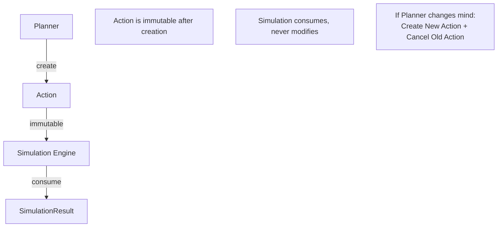
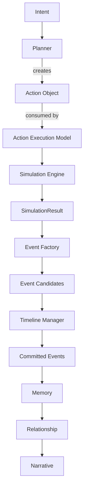
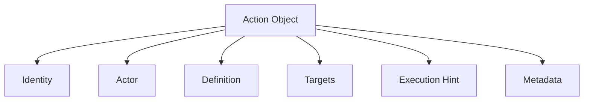
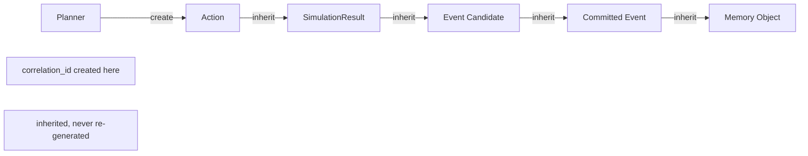
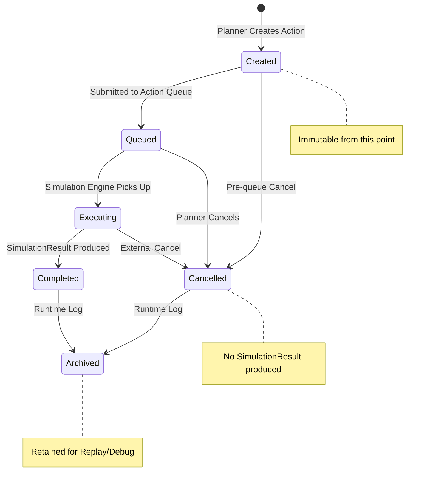

# Action Object Schema

**Version:** v1.0 Draft  
**Status:** Draft  
**Last Updated:** 2026-07-13

**Depends On:** [SimulationResult Schema v1.0 Draft](./SimulationResult_Schema.md), [Character State Schema v1.3](./Character_State_Schema.md)

---

## 1. Purpose（文档目的）

Define the structure, ownership, boundaries, lifecycle, and serialization rules of Action data in the AI Narrative RPG Engine.

定义 AI Narrative RPG Engine 中行为数据的结构、归属、边界、生命周期和序列化规则。

### Core Definition（核心定义）

**Action is a declarative intent submitted by the Planner to the Simulation Layer. It describes what the actor intends to do, but never how the world will respond.**

Action 是 Planner 提交给 Simulation Layer 的声明式意图（Declarative Intent）。它只描述行为主体想做什么，不描述世界将如何响应。

Three keywords define Action's identity:

三个关键词定义了 Action 的身份：

| Keyword | Meaning |
|---------|---------|
| **Declarative**（声明式） | Action 声明意图，不描述执行过程。Action declares intent, not execution process. |
| **Intent**（意图） | Action 是"想做"，不是"做了"。Action is "wants to do", not "did". |
| **Not Outcome**（不是结果） | Action 永远不携带结果信息。结果属于 SimulationResult。Action never carries outcome. Outcome belongs to SimulationResult. |

### Core Philosophy（核心理念）

**Planner owns Intent. Runtime owns Truth.**

Planner 拥有意图。Runtime 拥有事实。

Action is the **sole bridge** between Planner's intent and Runtime's truth. It is the only Runtime Object created by the Planner. Everything downstream — SimulationResult, Event, Memory, Relationship, Narrative — is owned by Runtime.

Action 是 Planner 意图与 Runtime 事实之间的**唯一桥梁**。它是 Planner 创建的唯一 Runtime Object。下游一切 — SimulationResult、Event、Memory、Relationship、Narrative — 均由 Runtime 拥有。

---

## 2. Design Principles（设计原则）

| Principle | Description |
|-----------|-------------|
| Declarative, Not Imperative | 声明式，非命令式。Action declares *what* the actor wants to do, not *how* the engine should execute it. |
| Planner Owns Intent, Runtime Owns Truth | Planner 拥有意图，Runtime 拥有事实。Action carries only what the Planner knows at creation time. Nothing computed, nothing validated, nothing predicted. |
| Immutable After Creation | 创建后不可变。Action is immutable once created. If the Planner changes its mind, it creates a new Action and cancels the old one. |
| Pure Input | 纯输入。Action can be serialized, transmitted, replayed, and predicted without depending on any Runtime object. It can exist independently of world state. |
| No Runtime Derivation | 不携带 Runtime 推导。Action must never contain fields that are computed, validated, or predicted by the Runtime (e.g., success_probability, predicted_result, validated_cost, final_duration, current_progress, snapshot, seed). |
| Field Admission Rule | 字段准入规则。For any new field, ask: *"Did the Planner know this at Action creation time?"* If the answer is no, the field does not belong to Action. |
| Hint, Not Constraint | 提示，非约束。Execution hints (priority, estimated cost, reservation) are suggestions from the Planner. The Simulation Layer has final authority to accept, modify, or reject them. |
| Single Correlation ID | 单一关联 ID。`correlation_id` is the sole transaction group identifier across the entire Engine. No other tracking ID (`trace_id`, `transaction_id`, `request_id`, `flow_id`) may be introduced. |
| Implementation-Agnostic | 实现无关。This document defines structure, not programming language classes or database schemas. |

### The Field Admission Rule（字段准入规则）

> **For any new field, ask: "Did the Planner know this at Action creation time?"**
>
> **If yes** → The field may belong to Action.
>
> **If no** → The field does not belong to Action. It belongs to SimulationResult, Runtime State, or another Runtime Object.
>
> This rule is more durable than a list of prohibited fields. A prohibited list enumerates what is known to be wrong today. The admission rule guards against unknown future violations.

This rule is the single most important governance mechanism for this Schema. It prevents Action from growing into a God Object over time.

这条规则是本 Schema 最重要的治理机制。它防止 Action 随时间演化为 God Object。

### What Action Does NOT Carry（Action 不携带什么）

| Prohibited Field | Why | Where It Belongs |
|------------------|-----|------------------|
| `success_probability` | Runtime 推导结果 | SimulationResult (Diagnostics) |
| `predicted_result` | Runtime 推导结果 | SimulationResult (Prediction mode) |
| `validated_cost` | Runtime 验证结果 | SimulationResult (Validation Result) |
| `final_duration` | Runtime 执行结果 | SimulationResult (Diagnostics → timing) |
| `current_progress` | Runtime 状态 | Runtime State (Session State) |
| `snapshot` | Runtime 状态 | Runtime State Model (Snapshot) |
| `seed` | Runtime 配置 | SimulationResult (Identity) |
| `runtime_context` | 已否决 — Runtime Context 应自然生长 | 不存在 |

---

## 3. Architecture Position（架构定位）

### 3.1 Single Responsibility（唯一职责）

Action has exactly one responsibility: **carry declarative intent from Planner to Simulation Layer.**

Action 有且仅有一个职责：**将声明式意图从 Planner 传递到 Simulation Layer。**

It does not execute. It does not validate. It does not predict. It does not compute.

它不执行。不验证。不预测。不计算。

### 3.2 Action Ownership（Action 所有权）



| Phase | Owner | Description |
|-------|-------|-------------|
| Create | Planner | Planner 创建 Action，分配 identity 和 correlation_id |
| Read | Simulation Engine | Simulation Engine 读取 Action 作为模拟输入 |
| Archive | Runtime Log | 已完成的 Action 归档到运行时日志，用于 Replay 和 Debug |
| Modify | **Nobody** | Action 一经创建即不可修改 |

> **Immutability Invariant:** Action is immutable. This is a non-negotiable architectural invariant. If the Planner changes its mind, the correct procedure is:
>
> 1. Create a new Action (new `action_id`, same or new `correlation_id`)
> 2. Cancel the old Action (lifecycle state → `Cancelled`)
>
> This ensures full auditability — the runtime log always contains the original Action, even if it was cancelled.

### 3.3 What Action Answers（Action 回答什么）

Action answers four questions and only four questions:

Action 只回答四个问题，且仅四个问题：

| Question | Field Domain |
|----------|-------------|
| **Who?** | Actor |
| **Wants to do what?** | Definition |
| **To whom?** | Targets |
| **With which parameters?** | Definition (parameters) |

Action **never** answers:

| Question | Who answers it |
|----------|---------------|
| Can it succeed? | SimulationResult (Status) |
| Will it succeed? | SimulationResult (Status) |
| How long will it take? | SimulationResult (Diagnostics → timing) |
| How much damage? | SimulationResult (Deltas) |
| How much mana actually consumed? | SimulationResult (Deltas) |
| What changed? | SimulationResult (Deltas) + Event (Payload) |

> **This boundary keeps the entire Runtime clean.** Every question about outcome has exactly one owner: SimulationResult. Every question about intent has exactly one owner: Action. There is no overlap, no ambiguity, no "who is authoritative?" conflict.

### 3.4 Runtime Pipeline Position（运行时流水线定位）



Action is the **first Runtime Object** in the pipeline. It is the entry point of all world-changing operations. Nothing upstream of Action is a Runtime Object — Intent is a player/NPC desire, Planner is a decision process, neither is a data structure.

Action 是流水线中的**第一个 Runtime Object**。它是所有改变世界的操作的入口。Action 上游的一切都不是 Runtime Object — Intent 是玩家/NPC 的愿望，Planner 是决策过程，两者都不是数据结构。

---

## 4. Action Data Architecture（行为数据架构）



| Domain | Purpose | Key Question |
|--------|---------|-------------|
| Identity | 唯一标识与版本 | Which Action is this? |
| Actor | 行为主体 | Who is acting? |
| Definition | 行为定义 | What does the actor want to do? |
| Targets | 行为目标 | To whom / to what? |
| Execution Hint | 执行提示 | How urgent? How costly? (estimates only) |
| Metadata | 元数据 | Supplementary info (debug, mod, tags) |

---

## 5. Identity（身份）

Identity provides unique identification, schema versioning, and correlation chain linkage.

| Field | Description | Mutability |
|-------|-------------|------------|
| action_id | 全局唯一行为标识 (UUID) | Immutable |
| correlation_id | 事务组标识（创建时由 Planner 分配，贯穿 SimulationResult → Event → Memory） | Immutable |
| schema_version | 此 Action 创建时使用的 Schema 版本（如 "1.0"） | Immutable |
| parent_action_id | 父 Action ID（如果此 Action 由另一个 Action 触发，如连击、连段；null 表示根 Action） | Immutable |
| trigger_event_sequence | 触发此 Action 的 Event Sequence（如果由世界事件触发，如反击；null 表示由玩家/NPC 主动发起） | Immutable |
| creation_tick | Action 创建时的 Simulation Tick | Immutable |

> **Correlation Origin:** `correlation_id` is created at Action creation time by the Planner. It is inherited — never re-generated — by all downstream objects (SimulationResult, Event Candidates, Committed Events, Memory Objects). No other tracking ID (`trace_id`, `transaction_id`, `request_id`, `flow_id`) may be introduced. `correlation_id` is the sole transaction group identifier across the entire Engine.
>
> **关联源头：** `correlation_id` 在 Action 创建时由 Planner 分配。它被所有下游对象继承，永不重新生成。整个引擎中不引入任何其他追踪 ID。`correlation_id` 是唯一的事务组标识符。
>
> **Parent Action vs Trigger Event:** `parent_action_id` links Actions in a Planner-defined chain (e.g., Combo Step 1 → Combo Step 2). `trigger_event_sequence` links an Action to a world event that caused it (e.g., Counter-Attack triggered by incoming Attack Event). These are orthogonal: parent is Planner's chain; trigger is the world's causal chain.

---

## 6. Actor（行为主体）

Actor identifies who is performing the action.

| Field | Description | Mutability |
|-------|-------------|------------|
| actor_id | 行为主体 Character ID | Immutable |
| actor_role | 行为主体角色类型（`player`, `npc`, `system`） | Immutable |

> **Actor is Reference, Not Embed:** `actor_id` references a Character. Action never embeds Character State. At simulation time, the Simulation Engine loads the referenced Character State from the Runtime State Snapshot.

---

## 7. Definition（行为定义）

Definition declares what the actor wants to do. This is the semantic core of the Action.

Definition 声明行为主体想做什么。这是 Action 的语义核心。

| Field | Description | Mutability |
|-------|-------------|------------|
| action_type | 行为类型枚举（`attack`, `dialogue`, `movement`, `interaction`, `use_item`, `cast_skill`, `wait`, `flee`, `custom`） | Immutable |
| action_subtype | 行为子类型（如 attack → `melee`, `ranged`, `spell`；dialogue → `greet`, `persuade`, `intimidate`, `flirt`） | Immutable |
| parameters | 结构化行为参数（键值对，语义取决于 action_type） | Immutable |

### Parameters by Action Type（按行为类型的参数）

| Action Type | Example Parameters |
|-------------|-------------------|
| `attack` | `{ target_entity_id, skill_id, stance }` |
| `dialogue` | `{ topic, dialogue_intent, tone, target_entity_id }` |
| `movement` | `{ destination_location_id, path_preference, speed }` |
| `interaction` | `{ object_id, interaction_type }` |
| `use_item` | `{ item_id, target_entity_id }` |
| `cast_skill` | `{ skill_id, target_entity_ids, charge_level }` |
| `wait` | `{ duration_ticks }` |
| `flee` | `{ escape_direction, urgency }` |
| `custom` | Mod-defined parameters |

> **Parameters are Declarative:** Parameters describe *what* the actor wants to do, not *how* the engine should resolve it. For example, `{ skill_id: "fireball_lv3" }` declares which skill to use — it does not specify damage calculation, mana cost, or animation. Those are Runtime concerns.

---

## 8. Targets（目标）

Targets identify the entities and locations affected by the action.

| Field | Description | Mutability |
|-------|-------------|------------|
| target_entity_ids | 目标实体 ID 列表 | Immutable |
| target_location_id | 目标地点 ID | Immutable |

> **Targets vs Parameters:** If a target is also specified in `parameters` (e.g., `target_entity_id` in attack parameters), the `Targets` domain is the canonical source. Parameters may duplicate target references for semantic clarity, but the `Targets` domain is what the Simulation Engine indexes for quick lookup.
>
> **Empty Targets:** Some actions have no explicit target (e.g., `wait`, `movement` to an open location). `target_entity_ids` may be empty. `target_location_id` may be null for actions that don't involve location.

---

## 9. Execution Hint（执行提示）

Execution Hint carries the Planner's **estimates and preferences** about how the action should be executed. These are **hints, not constraints** — the Simulation Layer has final authority.

Execution Hint 携带 Planner 对行为执行方式的**估计和偏好**。这些是**提示，非约束** — Simulation Layer 拥有最终决定权。

| Field | Description | Mutability |
|-------|-------------|------------|
| priority | 调度优先级（`urgent`, `high`, `normal`, `low`, `background`） | Immutable |
| estimated_cost | 预估资源消耗（结构化，如 `{ mana: 30, stamina: 10, time: 1 }`） | Immutable |
| reservation_requirement | 资源预留需求（如 `{ reserve_mana: 30, reserve_item: "potion_01" }`） | Immutable |
| execution_mode | 执行模式（`immediate`, `queued`, `delayed`） | Immutable |
| interrupt_policy | 中断策略（`interruptible`, `non_interruptible`, `interruptible_with_penalty`） | Immutable |

### Why "Hint"?（为什么叫 "Hint"？）

| Aspect | Hint (Action) | Truth (SimulationResult) |
|--------|--------------|-------------------------|
| Priority | Planner's requested priority | Simulation Engine's actual scheduling priority |
| Cost | Planner's estimate | Actual computed cost (may differ due to buffs, debuffs, environment) |
| Duration | Planner's estimate | Actual duration (may differ due to interrupts, speed modifiers) |
| Outcome | Not present | Actual outcome (Deltas, Events, Status) |

> **Naming as Semantic Protection:** The name "Hint" is a deliberate architectural choice. If this domain were named "Execution Config" or "Execution Requirements", downstream developers would assume these are hard constraints. "Hint" makes it explicit that the Simulation Layer may accept, modify, or reject these suggestions. The Commit Pipeline will never treat Hint values as factual costs or durations.
>
> **命名即语义防护：** "Hint" 这个名字是刻意的架构选择。如果叫 "Config" 或 "Requirements"，下游开发者会误以为是硬约束。"Hint" 明确表示 Simulation Layer 可以接受、修改或拒绝这些建议。Commit Pipeline 永远不会把 Hint 值当作实际成本或持续时间。

---

## 10. Metadata（元数据）

Metadata carries supplementary information for debugging, modding, and tagging. It is never used for simulation logic.

| Field | Description | Mutability |
|-------|-------------|------------|
| tags | 多标签列表（用于检索和分类，如 `["combat", "boss_fight", "main_story"]`） | Immutable |
| source | Action 来源（`player_input`, `npc_ai`, `quest_script`, `system_event`, `mod`） | Immutable |
| debug_info | 调试信息（可选，如 Planner 的决策理由摘要） | Immutable |
| mod_data | Mod 扩展数据（命名空间键值对，如 `{ "mod.mymod.variant": "rage" }`） | Immutable |

> **Metadata is Never Simulation Input:** Metadata fields (tags, debug_info, mod_data) are for observability and extensibility only. The Simulation Engine must never read Metadata to determine simulation outcomes. Metadata is invisible to the Rule Engine.

---

## 11. Ownership & Mutation Rules（归属与变更规则）

### Ownership（归属）

| Component | Owner | Read-Only Access |
|-----------|-------|-----------------|
| Action Identity | Planner (creates), Runtime Log (archives) | Simulation Engine, Debug System |
| Actor | Planner | Simulation Engine, Narrative Director |
| Definition | Planner | Simulation Engine, Action Execution Model |
| Targets | Planner | Simulation Engine, Action Execution Model |
| Execution Hint | Planner | Simulation Engine, Action Execution Model |
| Metadata | Planner | All (read-only) |
| Lifecycle State | Action Manager | Planner, Simulation Engine, Debug System |

### Mutation Rules（变更规则）

| Rule | Description |
|------|-------------|
| Planner creates, nobody modifies | Planner 创建 Action，之后任何模块不可修改其字段。 |
| Cancel replaces modify | 如需变更，创建新 Action 并取消旧 Action，而非修改旧 Action。 |
| Simulation consumes read-only | Simulation Engine 以只读方式消费 Action。 |
| Lifecycle state is the only mutable field | Action 的 lifecycle_state 是唯一可变更的字段，由 Action Manager 管理。 |

---

## 12. Correlation Chain（关联链）

`correlation_id` forms the Engine's sole transaction tracking chain:



| Rule | Description |
|------|-------------|
| Single ID | `correlation_id` 是整个引擎中唯一的事务追踪 ID。 |
| Created at Action | `correlation_id` 在 Action 创建时由 Planner 分配。 |
| Inherited downstream | 所有下游对象继承 `correlation_id`，永不重新生成。 |
| No alternative IDs | 禁止引入 `trace_id`, `transaction_id`, `request_id`, `flow_id` 或任何其他追踪 ID。 |
| Groups a transaction | 一次 Action 产生的所有产物（Result, Events, Memories）共享同一 `correlation_id`。 |

> **Why This Matters Now:** If this chain is not locked at the Action level, downstream systems will inevitably invent their own tracking IDs. Within two years, the codebase will have four or five different names for the same concept. Locking it here — at the source — prevents fragmentation permanently.

---

## 13. Action Lifecycle（行为生命周期）



### Lifecycle States（生命周期状态）

| State | Description | In Queue? | Produces Result? |
|-------|-------------|-----------|------------------|
| Created | Action 刚创建，尚未提交到队列 | No | No |
| Queued | Action 已提交到 Action Queue，等待 Simulation Engine 处理 | Yes | No |
| Executing | Simulation Engine 正在处理此 Action | No (removed from queue) | In progress |
| Completed | Simulation Engine 已产出 SimulationResult | No | Yes |
| Cancelled | Action 被取消（Planner 主动取消或外部取消） | No | No |
| Archived | Action 已归档到运行时日志 | No | N/A |

### Lifecycle Rules（生命周期规则）

| Rule | Description |
|------|-------------|
| Created → immutable | Action 一旦创建，所有字段（除 lifecycle_state）不可变。 |
| Cancel does not modify fields | 取消操作只变更 lifecycle_state，不修改任何其他字段。 |
| Cancelled produces no SimulationResult | 被取消的 Action 不进入 Simulation Engine，不产出 SimulationResult。 |
| Archived Actions are retained | 归档的 Action 保留在运行时日志中，用于 Replay 和 Debug。 |
| Only one terminal state | Action 的终态为 Completed 或 Cancelled，之后进入 Archived。不可逆。 |

---

## 14. Action is Pure Input（Action 是纯输入）

**Action is Pure Input.** This is a foundational design principle, not just a naming convention.

**Action 是纯输入。** 这是一个基础设计原则，不仅是命名约定。

### Definition（定义）

Action can exist and be fully valid without any Runtime object being active:

Action 可以在没有任何 Runtime 对象活跃的情况下存在且完全合法：

| Capability | Description |
|------------|-------------|
| **Serializable** | Action 可以序列化为 JSON / MessagePack / 任何格式。 |
| **Transmittable** | Action 可以通过网络传输（客户端 → 服务端，或 NPC AI → Engine）。 |
| **Replayable** | Action 可以从存档加载并重新提交给 Simulation Engine，产生相同的 SimulationResult（给定相同的 Snapshot + Seed）。 |
| **Predictable** | Action 可以在 Forked State 上执行，产出 Prediction SimulationResult，不影响主 Timeline。 |
| **Stateless** | Action 不依赖任何 Runtime State 即可存在。它只引用 Character ID 和 Location ID，不嵌入状态。 |

### Example Scenario（示例场景）

```
NPC A generates Attack Action
    ↓
Action serialized to save file
    ↓
Engine shuts down (3 hours pass)
    ↓
Engine restarts, loads save file
    ↓
Action deserialized — still fully valid
    ↓
Simulation Engine consumes Action
    ↓
SimulationResult produced normally
```

> **Why This Matters:** Many engines implicitly couple Action with Runtime Context, assuming the actor's current state is always available when the Action is created. This makes Actions non-portable, non-replayable, and non-serializable. By declaring Action as Pure Input, we guarantee that Actions can survive engine restarts, network transmission, and time shifts — enabling robust Replay, Save/Load, and Prediction systems.

---

## 15. Runtime Guarantees（运行时保证）

Action Object Schema guarantees:

### Structural Guarantees（结构保证）

- **Immutability:** Action is immutable after creation. Only `lifecycle_state` may change.
- **Self-Contained:** Action carries all information the Simulation Engine needs to execute — no external lookups required at execution time (Character State is loaded separately by Simulation Engine from the Snapshot).
- **Pure Input:** Action does not depend on any Runtime object to exist. It can be serialized, transmitted, replayed, and predicted independently.

### Architectural Invariants（架构不变量）

- **Action Never Carries Outcome:** Action must never contain fields that represent simulation results, predictions, or runtime-derived data. All such fields belong to SimulationResult.

  Action 永远不携带结果字段。所有结果、预测、推导数据属于 SimulationResult。

- **Action Never Carries Runtime State:** Action must never contain snapshots, seeds, progress, or any runtime state. These belong to Runtime State Model.

  Action 永远不携带 Runtime State。快照、种子、进度等属于 Runtime State Model。

- **Planner Owns Intent, Runtime Owns Truth:** The boundary between Action and SimulationResult is the boundary between intent and truth. No object may blur this boundary.

  Action 与 SimulationResult 之间的边界就是意图与事实的边界。任何对象不可模糊此边界。

- **Single Correlation ID:** `correlation_id` is the sole transaction tracking identifier. No alternative tracking IDs may be introduced anywhere in the Engine.

  `correlation_id` 是唯一的事务追踪标识符。引擎中任何位置不可引入替代追踪 ID。

### Replay Guarantees（重放保证）

- **Full Replay:** Given `input_snapshot_id` + Action + `seed`, the Simulation Layer can regenerate an identical SimulationResult.
- **Action is Replay Input:** Action is the primary input for Replay — not player input, not Intent, but the structured Action Object that the Planner produced.
- **Archived Actions are Replay-Ready:** Archived Actions in the Runtime Log can be directly used for Replay without any reconstruction.

### Prediction Guarantees（预测保证）

- **Fork-Based Prediction:** Action can be executed on a forked state (read-only projection) without affecting the main Timeline.
- **Prediction Actions are Real Actions:** Actions used for prediction are structurally identical to live Actions. No special "prediction action" type exists.
- **Prediction Results are Discarded:** The SimulationResult produced from a prediction Action has `commit_scope=prediction` and is never committed.

---

## 16. Serialization Rules（序列化规则）

| Rule | Description |
|------|-------------|
| Action is fully serializable | Action 完全可序列化 — 所有字段都是原始类型或结构化键值对。 |
| No external object embedding | Action 不嵌入任何外部对象 — Character, Location, Item 等仅通过 ID 引用。 |
| Archived Actions are serialized | 归档的 Action 序列化到运行时日志，用于 Replay 和 Debug。 |
| Serialization format is implementation-defined | 序列化格式由实现决定（JSON, MessagePack, etc.），但必须满足以上规则。 |
| Metadata is serialized | Metadata（tags, debug_info, mod_data）随 Action 一起序列化。 |

### Serialization Structure（序列化结构）

```
Action Object
├── identity
│   ├── action_id
│   ├── correlation_id
│   ├── schema_version
│   ├── parent_action_id
│   ├── trigger_event_sequence
│   └── creation_tick
├── actor
│   ├── actor_id
│   └── actor_role
├── definition
│   ├── action_type
│   ├── action_subtype
│   └── parameters
├── targets
│   ├── target_entity_ids[]
│   └── target_location_id
├── execution_hint
│   ├── priority
│   ├── estimated_cost
│   ├── reservation_requirement
│   ├── execution_mode
│   └── interrupt_policy
├── metadata
│   ├── tags[]
│   ├── source
│   ├── debug_info
│   └── mod_data
└── lifecycle_state
```

---

## 17. Future Extensibility（未来扩展）

| Feature | Description |
|---------|-------------|
| Action Templates | 预定义行为模板 — 快速生成标准 Action 结构。 |
| Action Composition | 组合行为 — 一个 Action 可包含子 Action 列表（如连击序列）。 |
| Action Validation Pipeline | Action 预验证管道 — 在提交到 Simulation 前检查 Action 合法性（不检查可执行性）。 |
| Action Priority Queue | 优先级行为队列 — 基于 Execution Hint 的 priority 字段调度。 |
| Action Replay Stream | 行为重放流 — 从运行时日志回放 Action 序列，用于 Debug 和 Replay。 |
| Custom Action Types | Mod 自定义行为类型 — 通过 `action_type=custom` 扩展。 |
| Action Dependencies | 行为依赖声明 — Action 可声明依赖于其他 Action 的完成。 |
| Batch Actions | 批量行为 — 一次提交多个 Action，按顺序或并行执行。 |

These features must conform to the Declarative Intent, Immutability, Pure Input, and Field Admission Rule in this document.

---

## 18. Schema Lock Policy（Schema 锁定策略）

Once this Schema is locked, the following governance rules apply:

一旦本 Schema 锁定，将遵循以下治理规则：

| Rule | Description |
|------|-------------|
| No outcome fields | 不接受任何携带结果、预测或推导数据的字段。 |
| No runtime state fields | 不接受任何携带 Runtime State 的字段。 |
| No alternative tracking IDs | 不接受 `trace_id`, `transaction_id`, `request_id`, `flow_id` 或任何替代 `correlation_id` 的追踪 ID。 |
| No runtime context | 不接受任何形式的 Runtime Context 容器字段。 |
| Field admission rule is mandatory | 所有新增字段必须通过字段准入规则验证："Planner 在创建时是否知道这个值？" |
| Only allowed | 仅允许：扩展 action_type 枚举、扩展 action_subtype、扩展 parameters 结构、扩展 Metadata。 |
| Structural changes | 任何结构修改需通过 ADR (Architecture Decision Record) 审批。 |

---

## 19. References

**Depends On:**

- [SimulationResult Schema](./SimulationResult_Schema.md)
- [Character State Schema](./Character_State_Schema.md)
- [Event Object Schema](./Event_Object_Schema.md)
- [Simulation Layer Blueprint](../02_Architecture/Simulation_Layer_Blueprint.md)
- [Runtime State Model Blueprint](../02_Architecture/Runtime_State_Model_Blueprint.md)
- [Glossary](../00_Project/Glossary.md)
- Future: Action Execution Model

**Referenced By:**

- SimulationResult Schema (`source_action_id`)
- Simulation Layer Blueprint (Action as simulation input)
- Future: Action Execution Model (Action preparation and validation)
- Future: Runtime Pipeline (Action as pipeline entry point)

---

## 20. Revision History

| Version | Date | Description |
|---------|------|-------------|
| v1.0 Draft | 2026-07-13 | Initial Schema: Architecture Position (Single Responsibility, Ownership, What Action Answers), 6 domains (Identity, Actor, Definition, Targets, Execution Hint, Metadata), Pure Input principle, Field Admission Rule, Correlation Chain lock, Action Lifecycle, Runtime Guarantees |

---

## 21. Document Governance（文档治理）

**Status:** Draft

**Status Values:** Draft → RC → Locked → Deprecated

**Owner:** Runtime Architect

**Reviewers:**

- Engine Architect
- Simulation Architect
- Narrative Architect

**Approval:** Architecture Review Required

**Update Policy:** Changes affecting immutability rules, Field Admission Rule, Correlation Chain, or Pure Input principle require ADR approval.

**Parent Blueprint:** [Runtime State Model Blueprint](../02_Architecture/Runtime_State_Model_Blueprint.md)
