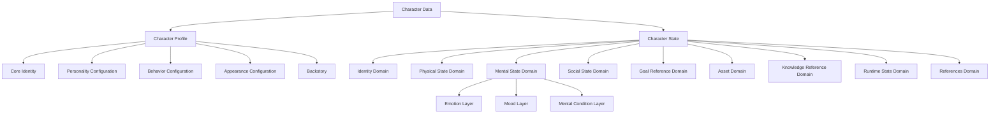
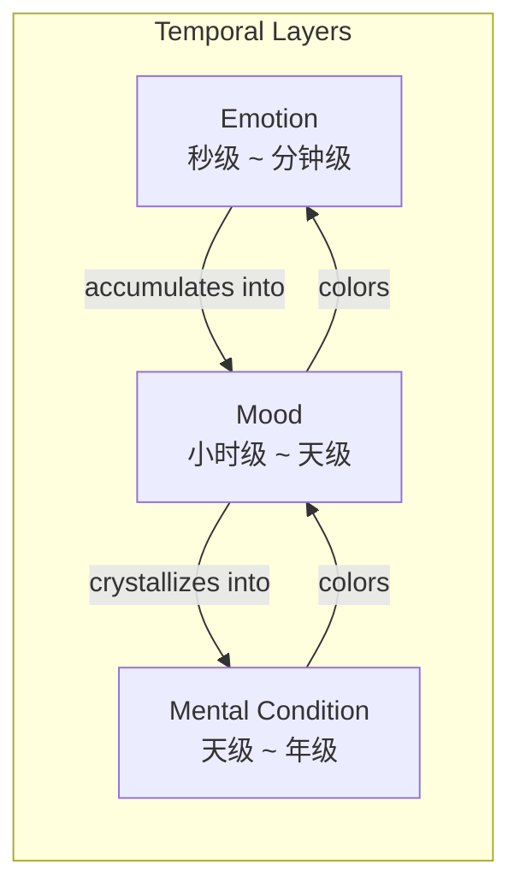
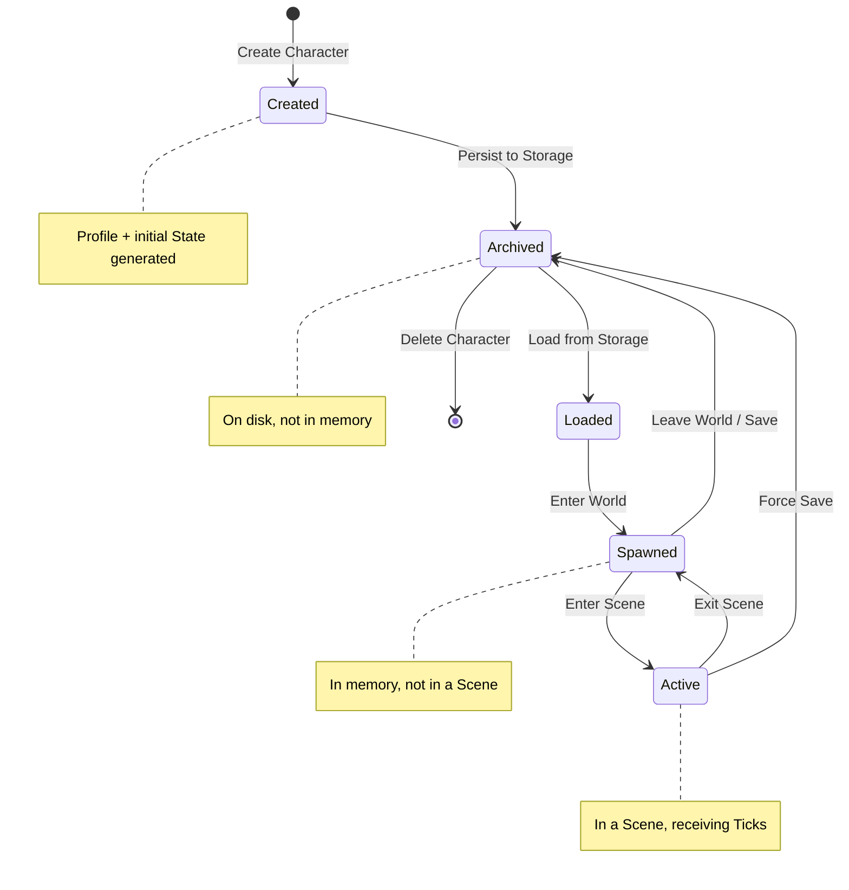

# Character State Schema

**Version:** v1.3  
**Status:** Draft  
**Last Updated:** 2026-07-13

---

## 1. Purpose（文档目的）

Define the structure, domains, ownership, lifecycle, and serialization rules of Character data in the AI Narrative RPG Engine.

定义 AI Narrative RPG Engine 中角色数据的结构、域划分、归属、生命周期和序列化规则。

### Core Definition（核心定义）

Character data is divided into two layers: **Character Profile** (mostly immutable identity and configuration) and **Character State** (runtime mutable data).

角色数据分为两层：**Character Profile**（基本不可变的身份与配置）和 **Character State**（运行时可变数据）。

This document is the **parent specification** for all future character-related implementations.

本文件是所有未来角色相关实现的**父规范**。

### Core Philosophy（核心理念）

Character is a persistent asset, not a prompt, not a chat log, not a JSON blob.

角色是永久资产，不是 Prompt，不是聊天记录，不是 JSON 数据块。

Characters should maintain personality consistency, continuous growth, persistent memory, long-term relationships, and cross-world reusability.

角色应保持人格一致、持续成长、持久记忆、长期关系和跨世界复用能力。

---

## 2. Responsibilities（职责）

### Responsible For（负责）

- Defining the structure of Character Profile and Character State
- Defining domain-based organization of Character State
- Defining ownership and mutation rules for each domain
- Defining serialization and snapshot rules
- Defining Character Lifecycle states and transitions
- Serving as the parent specification for all future character-related implementations

### Not Responsible For（不负责）

- Relationship State structure (see Relationship Engine Blueprint)
- Memory Object structure (see Memory Architecture Blueprint)
- Knowledge data / Semantic Memory (owned by Memory System)
- Goal data / Planning State (owned by future Planning System)
- Quest structure (see future Quest Schema)
- World State structure (see Runtime State Model Blueprint)
- Scene execution logic (see Scene Engine Blueprint)

---

## 3. Document Governance（文档治理）

**Owner:** Runtime Architect

**Architecture Reviewers:**

- Engine Architect
- Simulation Architect
- Narrative Architect

**Architecture Approval:** Architecture Review Required

**Update Policy:** Changes affecting domain structure, ownership boundaries, Profile/State separation, or Lifecycle states require ADR approval.

**Parent Blueprint:** [Runtime State Model Blueprint](../02_Architecture/Runtime_State_Model_Blueprint.md)

---

## 4. Design Principles（设计原则）

| Principle | Description |
|-----------|-------------|
| Profile Is Identity, State Is Life | Profile 是身份，State 是生命。Character Profile defines who the character is; Character State tracks how the character is living. |
| Domain-Based, Not Attribute-Based | 按域组织，不按 RPG 属性组织。Character State is organized into semantic domains, not flat RPG stat lists. |
| Reference, Not Embed | 引用，不嵌入。Relationship, Memory, Quest, World, and Image data are referenced by IDs only, never embedded. |
| Simulation Owns Mutation | Simulation Layer 拥有变更权。Only Simulation Layer may mutate Character State. |
| Profile Is Mostly Immutable | Profile 基本不可变。Character Profile changes only through deliberate, rare events (growth arcs, trauma). |
| Cross-World Reusable | 可跨世界复用。Character Profile should be portable across different worlds. |
| Reference Everything External | 外部数据一律引用。Knowledge, Goal, Relationship, Memory, Quest, World, and Image data are referenced by IDs only, never embedded. |
| Lifecycle-Aware | 生命周期感知。Every Character has a defined lifecycle from creation to archival. |
| Implementation-Agnostic | 实现无关。This document defines structure, not programming language classes or database schemas. |

---

## 5. Character Data Architecture（角色数据架构）



---

## 6. Character Profile（角色档案）

Character Profile is the **mostly immutable identity and configuration** of a character.

Character Profile 是角色的**基本不可变的身份与配置**。

Profile changes only through deliberate, rare events such as major growth arcs, trauma, or world-level transformations.

Profile 仅通过重大事件（如成长弧线、创伤、世界级转变）才会变化。

> **Future Modularization:** As the Engine grows, Character Profile will continue to gain sub-configurations (Communication Profile, Cognitive Profile, Narrative Profile, etc.). Profile is designed to be modular — each sub-configuration is an independent, versionable unit. This document defines the initial set; future versions may split Profile into multiple sub-profiles without breaking the Profile/State boundary.
>
> **未来模块化：** 随着引擎发展，Character Profile 将持续增加子配置（Communication Profile、Cognitive Profile、Narrative Profile 等）。Profile 设计为模块化 — 每个子配置是独立的、可版本化的单元。本文档定义初始集合；未来版本可将 Profile 拆分为多个子 Profile，而不破坏 Profile/State 边界。

### 6.1 Core Identity（核心身份）

| Field | Description | Mutability |
|-------|-------------|------------|
| character_id | 全局唯一角色标识 | Immutable |
| profile_version | Profile 数据版本（用于存档迁移） | Incremented on profile changes |
| schema_version | Schema 版本（此角色创建时使用的 Schema 版本） | Immutable at creation, migrated on upgrade |
| name | 角色名称 | Immutable |
| display_name | 显示名称（可包含昵称、别名） | Rarely changes |
| gender | 性别 | Immutable |
| birth_date | 出生日期/时间戳（由 Timeline 推导 current_age） | Immutable |
| origin_world | 角色来源世界 | Immutable |
| creation_date | 角色创建日期 | Immutable |

> **Note:** `age` is **NOT** stored in Profile. Age is derived at runtime from `birth_date` and the current Timeline epoch. This ensures correctness across time skips, time travel, and parallel worlds.

> **注意：** `age` **不**存储在 Profile 中。年龄在运行时由 `birth_date` 和当前 Timeline 纪元推导。这确保时间跳跃、时间旅行和平行世界场景下的正确性。

### 6.2 Personality Configuration（人格配置）

| Field | Description | Mutability |
|-------|-------------|------------|
| personality_traits | 核心人格特质列表（如 kind, stubborn, curious） | Mostly immutable |
| speaking_style | 说话风格配置（如 formal, casual, teasing） | Mostly immutable |
| values | 核心价值观（如 loyalty, freedom, justice） | Rarely changes |
| fears | 核心恐惧 | Rarely changes |
| desires | 核心渴望 | Rarely changes |

### 6.3 Behavior Configuration（行为配置）

Behavior Configuration defines **how** a character tends to act, independent of what they want or feel. This is critical for Relationship Engine, Narrative Director, and Prompt Builder — two characters with identical affinity but different attachment styles will behave completely differently.

行为配置定义角色**如何**行动，独立于他们想要什么或感受到什么。这对 Relationship Engine、Narrative Director 和 Prompt Builder 至关重要 — 两个好感度相同但依恋风格不同的角色行为会完全不同。

| Field | Description | Mutability |
|-------|-------------|------------|
| conflict_style | 冲突风格（assertive, avoidant, collaborative, competitive, accommodating） | Mostly immutable |
| attachment_style | 依恋风格（secure, anxious, avoidant, disorganized） | Mostly immutable |
| decision_style | 决策风格（impulsive, deliberate, analytical, intuitive, consensus-seeking） | Mostly immutable |
| risk_tolerance | 风险容忍度 (0.0 – 1.0) | Mostly immutable |
| emotional_expression | 情感表达方式（expressive, reserved, explosive, suppressed, controlled） | Mostly immutable |

> **Example:** Two characters both have high affection toward the player. Character A has `attachment_style: secure` — acts warm and direct. Character B has `attachment_style: avoidant` — acts distant and evasive. Same affinity, completely different behavior.

### 6.4 Appearance Configuration（外观配置）

| Field | Description | Mutability |
|-------|-------------|------------|
| body_description | 身体描述（身高、体型、特征） | Mostly immutable |
| hair_style | 发型 | Rarely changes |
| eye_color | 眼睛颜色 | Immutable |
| default_attire | 默认着装风格 | Rarely changes |
| distinguishing_features | 显著特征（疤痕、纹身、胎记） | Mostly immutable |

### 6.5 Backstory（背景故事）

| Field | Description | Mutability |
|-------|-------------|------------|
| background_summary | 背景摘要 | Immutable |
| key_events | 关键历史事件（角色创建前的背景） | Immutable |
| motivations | 行为动机来源 | Mostly immutable |
| secrets | 角色秘密 | Rarely revealed |

---

## 7. Character State（角色运行时状态）

Character State is the **runtime mutable data** that tracks how the character is currently living.

Character State 是**运行时可变数据**，追踪角色当前的生活状态。

Character State is organized into **domain-based sections**, not flat RPG attribute lists.

Character State 按**语义域**组织，不使用扁平的 RPG 属性列表。

### 7.1 Identity Domain（身份域）

Tracks the character's current sense of self and identity evolution.

| Field | Description | Owner |
|-------|-------------|-------|
| current_name | 当前使用的名字（可能不同于 Profile name） | Simulation Layer |
| current_title | 当前称号或头衔 | Simulation Layer |
| current_age | 当前年龄（由 birth_date + Timeline 推导，不直接存储原始值） | Simulation Layer (derived from Timeline) |
| self_perception | 当前自我认知 | Simulation Layer |
| identity_flags | 身份标志（如 "exiled", "renamed", "reborn"） | Simulation Layer |

> **Rule:** `current_age` is a derived value. The Engine computes it from `birth_date` and the current Timeline epoch at load time. It is never manually set.

> **Flags Boundary:** `identity_flags` describes how the character defines **themselves** (e.g., "renamed", "reborn", "disguised"). `social_flags` (§7.4) describes how **others or society** position the character (e.g., "exiled", "ostracized", "celebrated"). Rule: if the flag is about self-perception, use `identity_flags`; if it is about external social judgment, use `social_flags`.
>
> **标志边界：** `identity_flags` 描述角色对**自身**的身份认定。`social_flags`（§7.4）描述**外界或社会**对角色的定位。规则：如果标志是关于自我认知的，用 `identity_flags`；如果关于外部社会判断的，用 `social_flags`。

### 7.2 Physical State Domain（身体状态域）

Tracks the character's current physical condition.

| Field | Description | Owner |
|-------|-------------|-------|
| health_status | 健康状态（healthy, injured, sick, recovering） | Simulation Layer |
| energy_level | 精力水平 (0.0 – 1.0) | Simulation Layer |
| current_attire | 当前穿着 | Simulation Layer |
| physical_conditions | 持续性身体状态（如 pregnant, poisoned, cursed） | Simulation Layer |
| body_changes | 身体变化记录（如受伤疤痕、发型改变） | Simulation Layer |

### 7.3 Mental State Domain（精神状态域）

Mental State is structured into **three temporal layers**, each with a different lifecycle duration. This separation enables Simulation Layer to model psychological realism with appropriate granularity.

精神状态按**三个时间层级**结构化，每个层级有不同的生命周期。这种分离使 Simulation Layer 能够以适当的粒度建模心理真实感。



#### 7.3.1 Emotion Layer（情绪层 — 秒级到分钟级）

Instantaneous, reactive emotional responses. Changes within a single Scene or even a single Simulation Tick.

| Field | Description | Owner |
|-------|-------------|-------|
| dominant_emotion | 主导情绪（fear, anger, joy, sadness, disgust, surprise, anticipation） | Simulation Layer |
| emotion_intensity | 情绪强度 (0.0 – 1.0) | Simulation Layer |
| secondary_emotions | 次要情绪列表 | Simulation Layer |
| emotion_trend | 情绪趋势（rising, falling, stable）（**Derived** — 从当前与上一 Tick 的 emotion_intensity 对比推导） | Simulation Layer (derived) |

#### 7.3.2 Mood Layer（心境层 — 小时级到天级）

Prevailing emotional atmosphere that persists across Scenes. Emotions accumulate into moods over time.

| Field | Description | Owner |
|-------|-------------|-------|
| current_mood | 当前心境（anxious, melancholic, content, irritable, euphoric） | Simulation Layer |
| mood_volatility | 心境波动度 (0.0 – 1.0) | Simulation Layer |
| mood_trigger | 触发当前心境的来源（event_id 或 description） | Simulation Layer |

#### 7.3.3 Mental Condition Layer（精神状况层 — 天级到年级）

Long-lasting psychological states that persist across sessions. Moods can crystallize into mental conditions through repeated exposure or trauma.

| Field | Description | Owner |
|-------|-------------|-------|
| mental_conditions | 持续性精神状况（PTSD, inspired, heartbroken, depressed, obsessed） | Simulation Layer |
| stress_level | 压力水平 (0.0 – 1.0) | Simulation Layer |
| current_mindset | 当前思维模式（defensive, open, suspicious, paranoid, trusting） | Simulation Layer |

> **Design Rationale:** Separating these three layers allows the Simulation Layer to decay each at the appropriate rate — Emotions fade within minutes, Moods shift over hours, Mental Conditions evolve over days or story arcs. Without this separation, a single "mood" field would be forced to represent both fleeting fear and long-term PTSD, leading to unrealistic behavior.

### 7.4 Social State Domain（社交状态域）

Tracks the character's current social standing and interpersonal context.

| Field | Description | Owner |
|-------|-------------|-------|
| social_status | 当前社会地位 | Simulation Layer |
| reputation_tier | 当前声望等级 | Simulation Layer |
| active_social_roles | 当前社交角色（如 "mentor", "rival", "lover"） | Simulation Layer |
| social_flags | 社交标志（如 "ostracized", "celebrated", "suspected"） | Simulation Layer |

**Note:** Detailed relationship data is **NOT** stored here. It is referenced by IDs in the References Domain.

> **Flags Boundary:** See §7.1 for the `identity_flags` vs `social_flags` boundary rule. Example: "exiled" belongs in `social_flags` (society's action upon the character), not `identity_flags` (self-perception).

### 7.5 Goal Reference Domain（目标引用域）

Tracks the character's current active goals **by reference only**. Goals are NOT owned by Character — they are produced by multiple systems (Narrative Director, Relationship Engine, Quest System, Memory System) and will be managed by a future Planning System. Character only holds lightweight references.

通过引用追踪角色当前活跃目标 — **仅引用**。目标不由角色拥有 — 它们由多个系统（Narrative Director、Relationship Engine、Quest System、Memory System）产生，未来由 Planning System 管理。角色只持有轻量引用。

| Field | Description | Owner |
|-------|-------------|-------|
| active_goal_refs | 活跃目标引用列表（每项含 goal_id, goal_source, priority） | Simulation Layer |
| priority_goal_ref | 当前最高优先级目标引用（**Derived** — 从 active_goal_refs 按 priority 推导） | Simulation Layer (derived) |
| long_term_aspiration | 长期抱负（角色级，不属于 Planning System） | Simulation Layer |
| goal_history_refs | 已完成或放弃的目标引用列表 | Simulation Layer |

#### Goal Source（目标来源）

Every goal reference carries a `goal_source` field that explains **why** the character pursues this goal. This enables Narrative Director to generate coherent motivation narratives and allows Simulation Layer to resolve goal conflicts by source priority.

| Goal Source | Description | Example |
|-------------|-------------|---------|
| Player | 玩家通过对话或指令赋予 | "Help the player find the artifact" |
| Self | 角色自身内在驱动 | "Avenge my family" |
| Quest | 任务系统分配 | "Deliver the letter to the capital" |
| Relationship | 关系状态驱动 | "Protect my sister at all costs" |
| Memory | 记忆触发 | "Investigate the recurring nightmare" |
| Narrative | 叙事系统驱动（主线/支线） | "Uncover the conspiracy behind the throne" |

> **Design Rationale:** Goals are inherently a cross-system concept — Narrative Director, Relationship Engine, Quest System, and Memory System all produce goals. Embedding full goal data in Character State would create duplication and ownership ambiguity. By holding only references, Character State remains lightweight and the future Planning System can manage goals independently.

### 7.6 Asset Domain（资产域）

Tracks the character's current possessions and owned assets. This domain is **world-agnostic** — it uses abstract asset terminology that applies equally to fantasy, sci-fi, modern, or campus settings. "Inventory" is just one type of asset; this domain encompasses all ownable entities including items, vehicles, property, pets, and financial instruments.

追踪角色当前拥有和持有的资产。此域是**世界无关的** — 使用抽象资产术语，同样适用于奇幻、科幻、现代或校园设定。"Inventory" 只是资产的一种类型；此域涵盖所有可拥有实体，包括物品、车辆、房产、宠物和金融工具。

| Field | Description | Owner |
|-------|-------------|-------|
| owned_assets | 持有资产列表（通用，涵盖武器、手机、飞船、课本、车辆、房产、宠物等） | Simulation Layer |
| equipped_assets | 当前装备/使用中的资产 | Simulation Layer |
| containers | 容器/存储空间引用（背包、仓库、车辆储物箱、房屋等） | Simulation Layer |
| currencies | 货币/资源（多币种支持，如 gold, credits, reputation_points） | Simulation Layer |
| asset_references | 资产引用（资产可能存储在其他位置或由其他系统管理） | Simulation Layer |

> **Design Rationale:** A fantasy sword, a modern smartphone, a sci-fi starship, a campus textbook, a car, a house, and a pet are all `owned_assets`. Using "Asset Domain" instead of "Inventory Domain" ensures the Schema naturally accommodates any ownable entity without future renaming.

### 7.7 Knowledge Reference Domain（知识引用域）

Tracks what the character currently knows and believes — **by reference only**. Knowledge is derived from the Memory System's Semantic Memory layer. Character does not own Knowledge data; it holds lightweight references to knowledge concepts managed by the Memory System.

通过引用追踪角色当前知道和相信的内容 — **仅引用**。知识由 Memory System 的 Semantic Memory 层推导。角色不拥有知识数据；它持有由 Memory System 管理的知识概念的轻量引用。

| Field | Description | Owner |
|-------|-------------|-------|
| known_concepts | 已知概念引用列表（引用 Memory System 中的 Semantic Memory 对象） | Simulation Layer |
| belief_refs | 信念引用列表（可能不正确 — 角色相信但客观上可能为假） | Simulation Layer |
| skill_refs | 已学技能引用列表 | Simulation Layer |
| known_languages | 已知语言列表（轻量标签，无需引用） | Simulation Layer |
| discovered_location_refs | 已发现地点引用列表 | Simulation Layer |
| known_organization_refs | 已知组织引用列表 | Simulation Layer |
| known_character_ids | 已认识角色 ID 列表 | Simulation Layer |
| knowledge_flags | 知识标志（如 "knows_truth", "deceived", "misinformed"） | Simulation Layer |

> **Knowledge vs. Memory:** Knowledge is the *semantic distillation* of Memory — it is what a character has learned and internalized from their experiences. The Memory System owns the full Memory Objects (including episodic memories, accuracy, emotional weight, etc.). Character State only holds references to the *concepts* derived from those memories. This prevents duplication: a single Memory Object can produce multiple knowledge concepts, and multiple memories can reinforce a single concept.
>
> **Facts vs. Beliefs:** `known_concepts` reference knowledge that is objectively true within the world simulation. `belief_refs` reference what the character holds to be true — they may be incorrect. This mirrors the Memory System's `accuracy` dimension. An NPC may `believe` the king is evil (a belief), while the simulation knows the king is benevolent (a fact). This enables unreliable narration, manipulation, deception, and discovery mechanics.

### 7.8 Runtime State Domain（运行时状态域）

Tracks transient execution data relevant to the current Scene. Ownership is split between Scene Engine (execution context) and Simulation Layer (simulation context).

| Field | Description | Owner |
|-------|-------------|-------|
| current_scene_id | 当前所在 Scene ID | Scene Engine |
| current_location_id | 当前所在地点 ID | Simulation Layer |
| current_activity | 当前活动（如 "talking", "traveling", "resting"） | Scene Engine |
| current_interaction | 当前交互对象/状态 | Scene Engine |
| scene_engagement | 场景参与状态（engaged, observing, idle, departing） | Scene Engine |
| physical_availability | 物理可用性（conscious, unconscious, asleep, incapacitated） | Simulation Layer |
| last_tick_result | 最近一次 Simulation Tick 的结果摘要 | Simulation Layer |

> **Ownership Rationale:** Scene Engine owns `current_scene_id`, `current_activity`, `current_interaction`, and `scene_engagement` because these describe the execution context — what the character is currently doing in the narrative. Simulation Layer should not need to know whether a character is "talking" — that is a Scene-level concept. Simulation Layer owns `current_location_id`, `physical_availability`, and `last_tick_result` because these describe simulation-level state.
>
> **No Dual-Owner Fields:** `availability` was split into `scene_engagement` (Scene Engine) and `physical_availability` (Simulation Layer) to eliminate dual-ownership. The effective availability — whether a character can act in the current context — is computed by the consumer from both fields. No single field is co-owned by two modules.
>
> **无双 Owner 字段：** `availability` 被拆分为 `scene_engagement`（Scene Engine）和 `physical_availability`（Simulation Layer）以消除双重归属。有效可用性 — 角色是否能在当前上下文中行动 — 由消费方从两个字段组合计算。没有任何字段被两个模块共同拥有。

### 7.9 References Domain（引用域）

All external data is referenced by IDs only, **never embedded**.

所有外部数据仅通过 ID 引用，**永不嵌入**。

| Field | Description | Referenced System |
|-------|-------------|-------------------|
| relationship_ids | 关系 ID 列表 | Relationship Engine |
| pinned_memory_ids | 常驻记忆 ID 列表（角色永久引用的重要记忆，非 Scene 级激活） | Memory System |
| quest_ids | 相关任务 ID 列表 | Quest System (Future) |
| world_id | 当前所在世界 ID | World State |
| timeline_id | 当前时间线 ID | Timeline State |
| image_profile_id | 图像档案 ID（引用 Image Pipeline 的外观生成配置） | Image Pipeline (Future) |

**Rule:** These fields contain only IDs. The actual data objects are owned and managed by their respective systems.

**规则：** 这些字段仅包含 ID。实际数据对象由各自系统拥有和管理。

> **Pinned vs. Active Memory:** `pinned_memory_ids` are **permanent** references to memories the character always considers important (e.g., core trauma, defining moments). They persist across sessions. **Active Memory References** (activation_level, retrieval_priority) are **transient** Session State — they exist only during Scene execution and belong to Runtime State's Session State layer, NOT to Character State. See [Runtime State Model Blueprint §5.2](../02_Architecture/Runtime_State_Model_Blueprint.md).
>
> **常驻 vs. 活跃记忆：** `pinned_memory_ids` 是角色永久引用的重要记忆。**Active Memory References**（activation_level、retrieval_priority）是瞬态 Session State — 仅在 Scene 执行期间存在，属于 Runtime State 的 Session State 层，不属于 Character State。

> **Image Profile:** `image_profile_id` references an external Image Profile that contains appearance prompt, seed, LoRA reference, style preset, and negative prompt for visual generation. The Character does not own this data — it only references it. This keeps the Schema decoupled from the Image Pipeline while maintaining a binding for consistent character visualization.

---

## 8. Boundary Definition（边界定义）

### Owns（拥有）

- Character Profile structure definition
- Character State domain structure definition
- Character State mutation rules
- Character serialization rules
- Character Lifecycle state definitions

### Does NOT Own（不拥有）

- Relationship State (owned by Relationship Engine)
- Memory Objects (owned by Memory System)
- Knowledge data / Semantic Memory (owned by Memory System)
- Goal data / Planning State (owned by future Planning System)
- Quest data (owned by Quest System)
- World State (owned by Simulation Layer)
- Scene execution state (owned by Scene Engine)
- Image Profile data (owned by Image Pipeline)

---

## 9. Runtime Ownership & Mutation Rules（运行时归属与变更规则）

### Ownership（归属）

| Domain | Owner | Read-Only Access |
|--------|-------|-----------------|
| Character Profile | Simulation Layer (rare mutations only) | Narrative Director, Prompt Builder, Memory System |
| Character State — Identity | Simulation Layer | Narrative Director, Prompt Builder, Memory System |
| Character State — Physical | Simulation Layer | Narrative Director, Prompt Builder |
| Character State — Mental | Simulation Layer | Narrative Director, Prompt Builder |
| Character State — Social | Simulation Layer | Narrative Director, Prompt Builder |
| Character State — Goal Refs | Simulation Layer (refs only; goals owned by future Planning System) | Narrative Director, Prompt Builder |
| Character State — Assets | Simulation Layer | Narrative Director, Prompt Builder |
| Character State — Knowledge Refs | Simulation Layer (refs only; knowledge owned by Memory System) | Narrative Director, Prompt Builder, Memory System |
| Character State — Runtime | Scene Engine (activity/scene/interaction/engagement) + Simulation Layer (location/physical_availability/tick) | Narrative Director, Prompt Builder |
| Character State — References | Simulation Layer (IDs managed by respective systems) | Narrative Director, Prompt Builder, Memory System |

### Mutation Rules（变更规则）

| Rule | Description |
|------|-------------|
| Simulation Layer is the sole mutation authority | 只有 Simulation Layer 可以变更 Character State。Only Simulation Layer may mutate Character State. |
| Scene Engine owns execution-context fields | Scene Engine 拥有 current_scene_id、current_activity、current_interaction、scene_engagement。Simulation Layer 不直接修改这些字段。 |
| Profile mutations require special events | Profile 变更需要特殊事件触发（成长弧线、创伤等）。Profile mutations only occur through deliberate story events. |
| Narrative Director is read-only | Narrative Director 只读消费 Character State。 |
| Prompt Builder is read-only | Prompt Builder 只读消费 Character State。 |
| Memory System manages only pinned references | Memory System 只管理 pinned_memory_ids 引用，不修改 Character State。Scene 级 Active Memory References 属于 Session State，不属于 Character State。 |
| Knowledge is reference-only | 知识数据由 Memory System 拥有，角色只持有引用。Character holds knowledge references, not knowledge data. |
| Goals are reference-only | 目标数据由未来 Planning System 拥有，角色只持有引用。Character holds goal references, not goal data. |
| References are ID-only | 引用域只存 ID，不嵌入外部数据。References domain stores IDs only, never embeds external data. |

---

## 10. Runtime Guarantees（运行时保证）

Character State Schema guarantees:

- Character Profile is mostly immutable — changes only through deliberate story events.
- Character State mutations go through Simulation Layer only (except Scene Engine execution-context fields).
- All external data (Relationship, Memory, Quest, World, Image) is referenced by IDs, never embedded.
- Character State is included in Runtime State Snapshots.
- Character State supports Branch/Fork semantics for deterministic replay.
- Failed Scene execution rolls back Character State to the Snapshot without corruption.
- Character Profile is portable across different worlds.
- Character State transitions are deterministic, traceable, and replayable.
- `current_age` is always derived from `birth_date` + Timeline — never stored as a static value.
- All Derived Data (see §11.1) is recomputed on load and never serialized.
- No field in Character State has dual ownership — every field has exactly one mutation authority.
- Scene-level Active Memory References belong to Session State, not Character State — Character only holds permanent `pinned_memory_ids`.
- Mental State layers (Emotion, Mood, Condition) decay independently at their respective rates.
- Knowledge data is owned by Memory System — Character only holds references to Semantic Memory concepts.
- Goal data is owned by future Planning System — Character only holds references to active goals.
- Every Character has a defined Lifecycle from creation to archival (see Section 15).

---

## 11. Serialization Rules（序列化规则）

| Rule | Description |
|------|-------------|
| Profile and State are serialized separately | Profile 和 State 分开序列化。Profile changes rarely; State changes every Scene. |
| References are serialized as IDs only | 引用域序列化为 ID 列表，不序列化外部对象。 |
| Snapshot includes full Character State | 快照包含完整 Character State，用于回滚和重放。 |
| Profile versioning is per-character | 每个角色拥有独立的 profile_version 和 schema_version，支持存档迁移。 |
| State versioning is per-character | State 必须包含版本号，支持存档兼容性检查。 |
| Derived values are not serialized | 派生值（如 current_age）不序列化，在加载时重新计算。 |
| Serialization format is implementation-defined | 序列化格式由实现决定（JSON, MessagePack, etc.），但必须满足以上规则。 |

### 11.1 Derived Data Registry（派生数据注册表）

Derived Data is computed at runtime from other fields or external state. It is **never serialized** — it is recomputed on load. This prevents Save file bloat and eliminates consistency bugs.

派生数据在运行时从其他字段或外部状态计算。它**永不序列化** — 在加载时重新计算。这防止存档膨胀并消除一致性问题。

| Derived Field | Domain | Derivation Rule | Serialized? |
|---------------|--------|-----------------|-------------|
| current_age | Identity | `birth_date` + current Timeline epoch | No |
| priority_goal_ref | Goal Refs | `max(active_goal_refs, key=priority)` — highest priority from active goal refs | No |
| emotion_trend | Mental — Emotion | Compare current `emotion_intensity` vs previous Tick's value | No |
| effective_availability | Runtime | `scene_engagement` AND `physical_availability` — computed by consumer from both fields | No |

> **Rule:** If a field can be computed from other state without lossy transformation, it should be Derived. Derived fields reduce serialization size and eliminate consistency bugs. The trade-off is computation cost at load time — acceptable for small N (character count per scene).
>
> **Cached Derived (Reserved):** Some fields (e.g., `known_character_ids`) could theoretically be derived from the Memory System, but may be cached in Character State to avoid frequent Memory System queries. These are "cached derived" — serialized, but revalidated against the source system periodically. No fields currently use this pattern; it is reserved for future use.

### Serialization Structure（序列化结构）

```
Character Data
├── profile_version
├── schema_version
├── character_profile
│   ├── core_identity
│   │   ├── character_id
│   │   ├── name
│   │   ├── birth_date
│   │   └── ...
│   ├── personality_configuration
│   ├── behavior_configuration
│   ├── appearance_configuration
│   └── backstory
└── character_state
    ├── identity_domain
    │   └── (current_age: derived — not serialized)
    ├── physical_state_domain
    ├── mental_state_domain
    │   ├── emotion_layer
    │   │   └── (emotion_trend: derived — not serialized)
    │   ├── mood_layer
    │   └── mental_condition_layer
    ├── social_state_domain
    ├── goal_reference_domain
    │   └── active_goal_refs[] (each with goal_source)
    │       (priority_goal_ref: derived — not serialized)
    ├── asset_domain
    ├── knowledge_reference_domain
    │   ├── known_concepts
    │   ├── belief_refs
    │   ├── skill_refs
    │   ├── known_languages
    │   ├── discovered_location_refs
    │   ├── known_organization_refs
    │   ├── known_character_ids
    │   └── knowledge_flags
    ├── runtime_state_domain
    │   ├── (Scene Engine: scene_id, activity, interaction, engagement)
    │   └── (Simulation Layer: location_id, physical_availability, tick_result)
    └── references_domain
        ├── relationship_ids
        ├── pinned_memory_ids
        ├── quest_ids
        ├── world_id
        ├── timeline_id
        └── image_profile_id
```

---

## 12. Snapshot & Branch Behavior（快照与分支行为）

| Operation | Behavior |
|-----------|----------|
| Snapshot | 捕获完整 Character State（包括所有域）。Profile 不需要每次快照（基本不变）。 |
| Branch | 从快照创建 Character State 分支，用于推演或重放。 |
| Fork | 复制 Character State 用于只读推演（如 Narrative Director 预演未来状态）。 |
| Commit | 将分支变更合并回主分支。 |
| Rollback | 丢弃分支变更，恢复到快照时的 Character State。 |

---

## 13. Hardware Considerations（硬件考量）

**Target Hardware:** RTX 5060 8GB / 32GB RAM

| Consideration | Description |
|---------------|-------------|
| In-memory Character State | Character State 应在内存中维护，避免频繁磁盘 I/O |
| Profile Caching | Character Profile 可缓存，因为变更极少 |
| Reference Efficiency | 引用域应使用轻量 ID 列表，避免内存膨胀 |
| Snapshot Size | Character State 快照应保持精简，支持压缩 |
| Background Persistence | Profile 变更和 State 持久化应在后台异步执行 |
| Derived Value Computation | 派生值（如 current_age）在加载时计算，不占存储空间 |

---

## 14. Future Extensibility（未来扩展）

| Feature | Description |
|---------|-------------|
| Character Growth System | 基于经历的人格演化系统 — Profile 的受控变更 |
| Skill Tree | 结构化技能树 — Knowledge Reference Domain 的扩展 |
| Equipment System | 详细装备系统 — Asset Domain 的扩展 |
| Planning System | 独立规划系统 — 管理 Goal 生命周期，Character 只持有引用 |
| Semantic Knowledge System | 语义知识系统 — Memory System 的 Semantic Memory 层，Character 通过引用消费 |
| Character Portraits | 角色立绘管理 — 通过 image_profile_id 引用 Image Pipeline |
| Multi-World Sync | 跨世界角色同步 — Profile 可移植性的实现 |
| Character Templates | 角色模板系统 — 预设 Profile 用于快速创建 |
| NPC Behavioral Profiles | NPC 行为配置 — Profile 的 NPC 特化版本 |
| Belief Revision System | 信念修正系统 — 当 belief_refs 被证伪时自动转化为 known_concepts 或 discarded |
| Emotional Decay Tuning | 情绪衰减调优 — Emotion/Mood/Condition 三层独立衰减参数配置 |
| Profile Modularization | Profile 模块化 — 将 Profile 拆分为多个独立子 Profile（Identity Profile, Personality Profile, Behavior Profile, Appearance Profile, Communication Profile, Narrative Profile），每个子 Profile 可独立版本化和演化 |
| Cognitive Configuration | 认知配置 — Profile 新增 Cognitive 子域（reasoning_style, decision_bias, trust_baseline, emotional_regulation, social_cognition），待 Behavior/Relationship/Memory 稳定后引入，v1.5+ |
| Communication Profile | 通信档案 — 扩展 speaking_style 为结构化 Communication Profile（formality, vocabulary, humor, verbal_tics），由 Prompt Builder 需求驱动，v1.4+ |

These features must conform to the Profile/State separation, Reference-by-ID rules, and Lifecycle definitions in this document.

---

## 15. Character Lifecycle（角色生命周期）

Every Character has a defined lifecycle from creation to archival. Lifecycle states are managed by the Engine and transitions are triggered by specific Engine events.

每个角色都有从创建到归档的明确定义的生命周期。生命周期状态由引擎管理，状态转换由特定引擎事件触发。



### Lifecycle States（生命周期状态）

| State | Description | In Memory | In Storage | Receives Ticks |
|-------|-------------|-----------|------------|----------------|
| Created | 角色刚创建，Profile 和初始 State 已生成 | Yes | No | No |
| Archived | 角色已持久化到存储，不在内存中 | No | Yes | No |
| Loaded | 角色已从存储加载到内存，但未进入世界 | Yes | Yes | No |
| Spawned | 角色已进入世界，在内存中活跃，但不在当前 Scene 中 | Yes | Yes | No |
| Active | 角色在当前 Scene 中，接收 Simulation Ticks | Yes | Yes | Yes |

### Lifecycle Transitions（生命周期转换）

| Transition | Trigger | Description |
|-----------|---------|-------------|
| Create | Character creation request | 生成 Profile + 初始 Character State，进入 Created 状态 |
| Persist | Save / auto-save / scene commit | 将 Character Data 序列化到存储，进入 Archived 状态 |
| Load | Game load / world entry | 从存储反序列化到内存，进入 Loaded 状态。派生值（如 current_age）在此时重新计算 |
| Spawn | World entry / character summon | 将角色加入世界，进入 Spawned 状态 |
| Activate | Scene entry | 将角色加入当前 Scene 的 active_participants，进入 Active 状态 |
| Deactivate | Scene exit | 将角色移出当前 Scene，回到 Spawned 状态 |
| Update | Simulation Tick | 变更 Character State（仅 Active 状态可触发） |
| Snapshot | Scene start / save checkpoint | 捕获完整 Character State 快照，用于回滚 |
| Unload | World exit / memory pressure | 从内存卸载角色（先持久化），进入 Archived 状态 |
| Archive | Long-term storage / story completion | 将角色标记为已完成，长期归档保存 |
| Delete | Player request / cleanup | 永久删除角色数据 |

### Lifecycle Rules（生命周期规则）

| Rule | Description |
|------|-------------|
| Only Active characters receive Ticks | 只有 Active 状态的角色接收 Simulation Ticks。Spawned 角色存在于世界但不参与当前 Scene。 |
| Persist before Unload | 卸载前必须先持久化，防止数据丢失。 |
| Derived values recomputed on Load | 加载时重新计算所有派生值（如 current_age）。 |
| Profile changes trigger version increment | Profile 变更必须递增 profile_version。 |
| Archived characters are read-only | Archived 状态的角色不可修改，必须先 Load。 |
| Delete is irreversible | 删除操作不可逆，应要求二次确认。 |

---

## References

**Depends On:**

- [Runtime State Model Blueprint](../02_Architecture/Runtime_State_Model_Blueprint.md)
- [Simulation Layer Blueprint](../02_Architecture/Simulation_Layer_Blueprint.md)
- [Overall Architecture Blueprint](../02_Architecture/Overall_Architecture_Blueprint.md)
- [Glossary](../00_Project/Glossary.md)

**Referenced By:**

- Simulation Layer Blueprint (Character State mutation)
- Narrative Director Blueprint (Character State consumption)
- Prompt Builder Blueprint (Character State consumption)
- Memory Architecture Blueprint (pinned_memory_ids)
- Relationship Engine Blueprint (Relationship IDs)
- Future: Relationship State Schema
- Future: Quest Schema
- Future: World State Schema
- Future: Image Pipeline (image_profile_id)
- Future: Planning System (goal_refs)
- Future: Semantic Knowledge System (known_concepts)

---

## Revision History

| Version | Date | Description |
|---------|------|-------------|
| v1.0 | 2026-07-13 | Initial Schema: Profile/State separation, 9 state domains, References by ID, serialization rules, snapshot/branch behavior |
| v1.1 | 2026-07-13 | Major revision: birth_date replaces age; Behavior Configuration; Mental State three layers; Knowledge split; Inventory abstracted; Goal Source; image_profile_id; Runtime State ownership split; profile_version/schema_version; Character Lifecycle |
| v1.2 | 2026-07-13 | Architectural refactoring: Knowledge → Knowledge Reference Domain; Goal → Goal Reference Domain; Inventory → Asset Domain; Design Principle: Reference Everything External |
| v1.3 | 2026-07-13 | Architecture Review 收官: removed active_memory_refs (replaced with pinned_memory_ids; active memory refs belong to Session State); split availability into scene_engagement + physical_availability (eliminate dual-owner); added Derived Data Registry (current_age, priority_goal_ref, emotion_trend, effective_availability); clarified identity_flags vs social_flags boundary; added Profile Modularization extensibility note |
