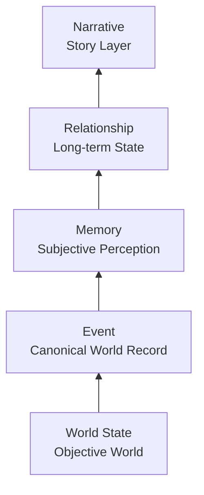
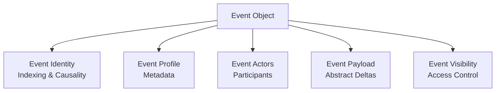
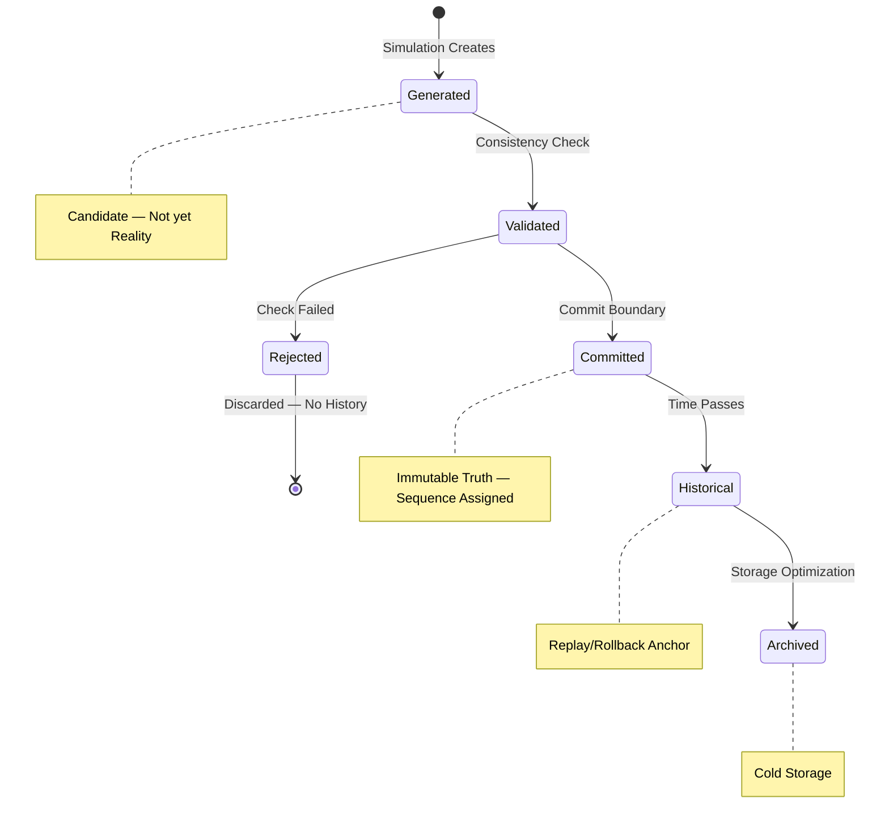
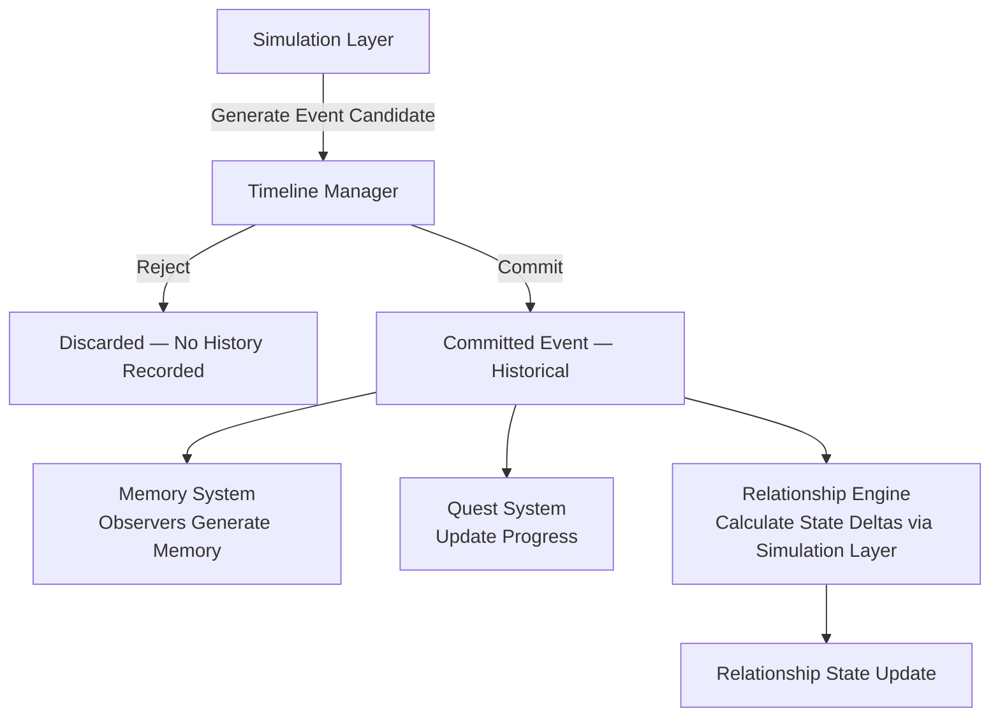

# Event Object Schema

**Version:** v1.0 RC4  
**Status:** RC  
**Last Updated:** 2026-07-13

**Depends On:** [Character State Schema v1.3](./Character_State_Schema.md), [Relationship State Schema v1.0 RC3](./Relationship_State_Schema.md)

---

## 1. Purpose（文档目的）

Define the structure, identity, payload, lifecycle, and serialization rules of Event data in the AI Narrative RPG Engine.

定义 AI Narrative RPG Engine 中事件数据的结构、身份、载荷、生命周期和序列化规则。

### Core Definition（核心定义）

An Event is the **minimal atomic unit of objective reality** — an immutable node in the World Timeline. It records *what happened in the world*, not *who thinks what happened*. It is the engine's **Canonical World Record**, providing the sole authoritative anchor of objective reality for Memory, Relationship, Quest, and Replay systems.

Event 是客观现实的**最小原子单元** — World Timeline 中的不可变节点。它记录*世界中发生了什么*，而非*谁觉得发生了什么*。它是引擎的**规范世界记录**，为 Memory、Relationship、Quest 和 Replay 系统提供唯一的客观现实锚点。

Event answers one question: **"What changed in the world?"**

Event 只回答一个问题：**"世界发生了什么改变？"**

### Canonical World Record, Not Source of Truth（规范世界记录，非唯一真源）

Event is the engine's Canonical World Record — the authoritative record of what objectively happened. However, it is **NOT** the "Source of Truth" in the sense that everything derives from it. Relationship State, for example, is computed by Simulation Layer reading multiple inputs (Traits, Mood, History, Personality, Trust, Context) — not directly derived from Events.

Event 是引擎的规范世界记录 — 客观发生的权威记录。然而，它**不是**"唯一真源"意义上的"一切皆由它推导"。例如，Relationship State 由 Simulation Layer 读取多种输入（特质、心境、历史、人格、信任、上下文）计算 — 而非直接从 Event 推导。

An Event records that "A saved B"; whether this increases or decreases Relationship is entirely Simulation Layer's decision. The dependency is **acyclic**: Event → Memory → Relationship → Narrative, never the reverse.

Event 记录"A 救了 B"；这是否增加或减少 Relationship 完全由 Simulation Layer 决定。依赖关系是**无环的**：Event → Memory → Relationship → Narrative，永不反向。

### Core Philosophy（核心理念）

Event is **not narrative**, **not perception**, and **not a relationship update**. It is a structured, immutable log of objective world change.

Event 不是叙事，不是感知，不是关系更新。它是客观世界变更的结构化、不可变日志。

---

## 2. Design Principles（设计原则）

| Principle | Description |
|-----------|-------------|
| Immutable Truth | 不可变事实。Once `Committed`, an Event cannot be modified or deleted. History is tamper-proof. |
| Commit Boundary | 提交边界。An Event exists in `Generated` (candidate) and `Committed` (reality) states. Only after Commit does it become history. |
| Append-Only | 只追加。Timeline only accepts new Events — never Update or Delete on committed Events. |
| World Owned | 世界拥有。Event belongs to World/Timeline, not to any Character. It is objective existence. |
| Delta Recording | 变更记录。Event records state *changes* (deltas), not state *snapshots*. |
| Logic Separation | 逻辑分离。Event does not directly trigger Relationship changes. Simulation Layer consumes Event and computes consequences. |
| No Narrative | 无叙事。Event must not contain natural language narrative. Narrative is generated by Narrative Layer from structured data. |
| Implementation-Agnostic | 实现无关。Delta structure is abstract and does not depend on specific attribute definitions. |

---

## 3. Responsibilities（职责）

### Responsible For（负责）

- Recording objective time, location, and participants of world changes
- Recording state change vectors (deltas)
- Serving as a node in the causal chain
- Defining observer scope and visibility

### Not Responsible For（不负责）

- Subjective Perception (owned by Memory System)
- Relationship Calculation (owned by Relationship Engine via Simulation Layer)
- Narrative Description (Event is a Log, not a Story)
- Character State structure (see Character State Schema)
- Relationship State structure (see Relationship State Schema)
- Quest execution logic (see future Quest Schema)

---

## 4. Architecture Overview（架构总览）

### Cognitive Pyramid（认知金字塔）

Event sits at the foundation of the engine's world-cognition stack — an acyclic dependency chain from objective reality up to narrative expression.

Event 位于引擎世界认知栈的底层 — 从客观现实到叙事表达的无环依赖链。



> **Acyclic Dependency:** Each layer depends only on layers below it. There are no circular references. This enables deterministic replay: given the same World State and Event Timeline, all upper layers can be regenerated.

### Event Object Structure（事件对象结构）



---

## 5. Event Identity（事件身份）

Event Identity provides indexing, causal chain tracking, and Timeline affiliation.

| Field | Description | Mutability |
|-------|-------------|------------|
| event_id | 全局唯一事件标识 (UUID) | Immutable |
| event_sequence | Timeline 内单调递增序列号（**Commit 时分配**，用于时间轴排序） | Assigned at Commit, then Immutable |
| trigger_event_sequence | 因果父事件的 sequence（null 表示根事件，由外部输入触发） | Immutable |
| correlation_id | 事务组标识（将同一次 Action 产生的多个 Event 关联为一组，如 `combat_round_000345`） | Immutable |
| schema_version | 此事件创建时使用的 Schema 版本（如 "1.0"），用于存档迁移和 Replay 兼容性检查 | Immutable |
| timeline_id | 所属 Timeline ID | Immutable |
| generation_tick | 事件生成时的 Simulation Tick | Immutable |

> **Causal Chain:** `trigger_event_sequence` forms a directed acyclic graph (DAG) of causality. Given any Event, the full causal chain can be traced backward to its root cause. This enables deterministic replay and debugging.
>
> **Sequence Assignment:** `event_sequence` is assigned at Commit time, not at Generation time. Generated (candidate) Events do not have a sequence — they are not yet reality. This ensures that rejected Events never leave gaps in the Timeline.
>
> **Correlation vs. Causality:** `correlation_id` groups Events from the same Action (e.g., Attack → Damage → Bleeding → Weapon Break all share one `correlation_id`). `trigger_event_sequence` traces the causal chain (which Event caused this one). They serve different purposes: correlation is for transaction grouping and debugging; causality is for replay and dependency tracking.
>
> **Schema Versioning:** `schema_version` enables forward/backward compatibility during Replay and Archive migration. When the Schema evolves (v1 → v2 → v3), the Runtime can identify which Schema version produced each Event and apply appropriate migration logic. Without this field, long-term save files become unmigratable.

---

## 6. Event Profile（事件元数据）

Event Profile records the metadata of *what kind* of event this is — when, where, and how significant.

| Field | Description | Mutability |
|-------|-------------|------------|
| event_type | 事件类型分类（combat, dialogue, social, movement, transaction, environmental, system, custom） | Immutable |
| severity | 严重程度（trivial, minor, major, critical） | Immutable |
| in_world_timestamp | 世界内时间戳（事件发生时的 in-world 时间） | Immutable |
| location_id | 事件发生地点 ID | Immutable |
| category | 大类标签（单一值，用于检索过滤，如 "relationship_milestone", "world_change", "combat_resolution"） | Immutable |
| tags | 多标签列表（用于多维检索，如 `["combat", "boss", "magic", "fire", "main_story"]`） | Immutable |

> **No Narrative Fields:** Event Profile must **never** contain natural language description, dialogue text, or narrative prose. If a human-readable summary is needed for debugging, it is stored as a `description_key` (localization key) — never as free-form text. Narrative is generated by Narrative Director from structured Event data.
>
> **Category vs. Tags:** `category` is a single-value classifier for broad filtering. `tags` is a multi-value list for fine-grained search and retrieval. Future systems (ElasticSearch, Embedding, semantic search) can leverage `tags` for efficient multi-dimensional queries. `category` answers "what broad type?"; `tags` answers "what themes/elements does this event touch?"
>
> **Tags are Unordered:** `tags` is an unordered set — position implies no priority. `tags[0]` is not more important than `tags[4]`. Implementations must not assign semantic meaning to tag ordering.

---

## 7. Event Actors（事件参与者）

Event Actors records the objective entities involved in the event, organized into four functional tiers.

| Field | Description | Mutability |
|-------|-------------|------------|
| actor_ids | 主动参与者 ID 列表（引发/执行事件的角色） | Immutable |
| target_ids | 被动参与者 ID 列表（直接受到事件影响的实体） | Immutable |
| potential_observer_ids | 潜在观察者 ID 列表（在事件发生范围内、**理论上可能感知**事件的角色） | Immutable |
| affected_entity_ids | 受影响实体 ID 列表（所有状态被 Delta 修改的实体） | Immutable |

### Actor Tiers（参与者层级）

| Tier | Role | Example |
|------|------|---------|
| Actor | 引发事件的角色 | 攻击者、说话者、行动者 |
| Target | 直接受事件影响的实体 | 被攻击者、对话对象、被移动物品的所有者 |
| Potential Observer | 在事件发生范围内、理论上可能感知事件的角色 | 旁观者、目击者（是否真正感知由 Memory System 判定） |
| Affected | 状态被 Delta 修改的实体 | HP 减少的角色、物品栏变化的角色、标志变更的世界 |

> **Potential Observer ≠ Actual Observer:** `potential_observer_ids` lists characters who are *in range* to perceive the event — not characters who *actually perceived* it. Actual perception is a **Memory System** concern, determined by the Perception Pipeline (visibility check, perception check, stealth/invisibility/fog/blindness modifiers). Event records *who could have seen it*; Memory System determines *who actually saw it*.
>
> **Reality vs. Perception Separation:** Event is a Reality Layer artifact. It must not perform Perception calculations. At Commit time, the Event only knows who was *present in range* — not who *successfully perceived* the event. Factors like stealth, invisibility, blindness, walls, and fog are Perception Layer concerns, not Reality Layer concerns.
>
> **Empty Potential Observers:** `potential_observer_ids` may be empty — this means the event occurred but no one was even in range to perceive it. This does NOT prevent the event from being committed. See §13 Runtime Guarantees.

---

## 8. Event Payload — Abstract Deltas（事件载荷 — 抽象变更）

### Purpose（目的）

Event Payload records the **objective state change vectors** — what was modified, how, and to what value. It uses a fully abstract, path-based structure to maximize extensibility.

### Delta Structure（Delta 结构）

Each Delta must contain five elements:

| Element | Description |
|---------|-------------|
| target_id | 目标实体 ID（Character ID, World ID, Relationship ID, etc.） |
| op | 操作类型（set, add, sub, mul, div, transfer, push, remove, clear） |
| path | 状态路径（点分隔，如 `stats.hp`, `inventory.sword_01`, `flags.war_started`） |
| val | 值（语义取决于 op：set=新值，add/sub=增量，transfer=目标位置，push=新增元素） |
| metadata | 操作元数据（可选键值对，如 `{ critical_hit: true, damage_type: "fire", source_skill: "fireball_lv3" }`） |

### Operations（操作类型）

| Op | Description | Example |
|----|-------------|---------|
| set | 设置为指定值 | `{ op: "set", path: "flags.war_started", val: true }` |
| add | 数值增加 | `{ op: "add", path: "stats.xp", val: 100 }` |
| sub | 数值减少 | `{ op: "sub", path: "stats.hp", val: 35 }` |
| mul | 数值乘以 | `{ op: "mul", path: "stats.speed", val: 1.5 }` |
| div | 数值除以 | `{ op: "div", path: "stats.cost", val: 2 }` |
| transfer | 转移所有权/位置 | `{ op: "transfer", path: "inventory.sword_01", val: "ground" }` |
| push | 添加到列表 | `{ op: "push", path: "known_characters", val: "char_b" }` |
| remove | 从列表移除 | `{ op: "remove", path: "active_effects", val: "poisoned" }` |
| clear | 清空列表/集合 | `{ op: "clear", path: "temporary_buffs" }` |

### Example Payload（示例载荷）

```json
{
  "deltas": [
    { "target_id": "char_b", "op": "sub", "path": "stats.hp", "val": 35, "metadata": { "combat.critical_hit": true, "combat.damage_type": "fire", "engine.source_skill": "fireball_lv3" } },
    { "target_id": "char_a", "op": "transfer", "path": "inventory.sword_01", "val": "ground", "metadata": {} },
    { "target_id": "world", "op": "set", "path": "flags.war_started", "val": true, "metadata": { "engine.trigger": "quest_completion" } }
  ]
}
```

### Delta Rules（Delta 规则）

| Rule | Description |
|------|-------------|
| Vector-Based, Not Snapshot-Based | Delta 记录变更向量（Op + Path + Val），不记录完整状态快照。 |
| Persistent State Only | Delta 只能指向 Persistent State 字段。Derived fields (如 `relationship_strength`, `power_rank`) **永远不是**合法的 Delta 目标。 |
| Path is Abstract | Path 使用点分隔的抽象路径，不绑定具体数据结构实现。 |
| Operations are Extensible | 未来可扩展新的 Operation 类型，但现有 Operation 语义不可变更。 |
| Deterministic Ordering | Deltas 必须严格按照数组顺序应用。Replay 实现必须保持原始顺序。不同执行顺序可能产生不同结果（尤其是 push / remove / transfer 操作），因此顺序是确定性 Replay 的硬约束。 |
| Metadata is Operation Context | metadata 是操作上下文，不是 Narrative。它记录操作的 *条件与来源*（如 critical_hit, damage_type, source_skill），而非操作的故事描述。Mod、Combat、Magic 系统可自由扩展 metadata 键值对。 |
| Metadata Uses Reserved Namespace | metadata 键名使用命名空间前缀（`engine.*`, `combat.*`, `magic.*`, `mod.*`），防止跨系统键名冲突。见下方 Metadata Namespace 规则。 |

> **No Derived Data Targets:** This is a critical architectural constraint. `relationship_strength` is a Derived field — it is computed from domain states. A Delta must target the underlying Persistent State (`trust`, `affection`), never the Derived output. This prevents circular dependencies and ensures that Derived Data remains reproducible. See §13 Runtime Guarantees.
>
> **Metadata is NOT Narrative:** `metadata` records operation context (e.g., `combat.critical_hit: true`, `combat.damage_type: "fire"`) — it is structured key-value data, never natural language text. It answers "under what conditions did this delta occur?", not "what happened in the story?". This maintains the No Narrative principle while enabling rich operation context for Mod, Combat, and Magic systems.

### Metadata Namespace（元数据命名空间）

To prevent key collisions across systems (e.g., Combat and Magic both defining `damage_type`), metadata keys **must** use namespaced prefixes:

| Namespace | Owner | Example Keys |
|-----------|-------|--------------|
| `engine.*` | Engine Core | `engine.source_skill`, `engine.trigger`, `engine.cause` |
| `combat.*` | Combat System | `combat.critical_hit`, `combat.damage_type`, `combat.weapon` |
| `magic.*` | Magic System | `magic.element`, `magic.spell_tier`, `magic.mana_cost` |
| `mod.*` | Mods (per-mod prefix) | `mod.mymod.special_effect`, `mod.mymod.variant` |

> **Rule:** Unnamespaced keys are **prohibited**. All metadata keys must belong to a reserved namespace. Mods must use their own `mod.<mod_id>.*` prefix to avoid collisions with other mods and engine systems.
>
> **Extensibility:** New namespaces may be added in future versions (e.g., `social.*`, `quest.*`, `narrative.*`). Existing namespaces are reserved — no system may use another system's namespace prefix.

---

## 9. Event Visibility（事件可见性）

Event Visibility controls which Perception Systems can access the event for Memory generation.

| Field | Description | Mutability |
|-------|-------------|------------|
| visibility_scope | 可见性范围（public, faction, private, simulation） | Immutable |
| faction_restriction | 派系限制 ID（仅 `visibility_scope=faction` 时有效） | Immutable |

### Visibility Levels（可见性级别）

| Level | Description | Memory Generation? |
|-------|-------------|---------------------|
| public | 公开 — 任何在场角色均可感知 | Yes (if observers present) |
| faction | 派系 — 仅特定派系成员可感知 | Yes (if faction members present) |
| private | 私有 — 仅直接参与者（actor + target）可感知 | Yes (participants only) |
| simulation | 模拟级 — 不可被角色感知的系统级变更 | Never |

> **Visibility ≠ Memory Generation:** `visibility_scope` defines the *maximum* perception range. Memory generation requires a full perception pipeline: Event → Visibility Check → Potential Observer Check → Perception Check (stealth, fog, walls, blindness) → Memory Generation. A `public` event with `potential_observer_ids=[]` (no one in range) generates **zero** Memory Objects — but the world state still changes. See §13 Runtime Guarantees.

---

## 10. Ownership & Mutation Rules（归属与变更规则）

### Ownership（归属）

| Component | Owner | Read-Only Access |
|-----------|-------|-----------------|
| Event Identity | Timeline Manager (assigns sequence at Commit) | Simulation Layer, Memory System, Relationship Engine |
| Event Profile | Simulation Layer (set at Generation) | Timeline Manager, Memory System, Narrative Director |
| Event Actors | Simulation Layer (set at Generation) | Timeline Manager, Memory System, Relationship Engine |
| Event Payload | Simulation Layer (set at Generation) | Timeline Manager, Memory System, Relationship Engine |
| Event Visibility | Simulation Layer (set at Generation) | Timeline Manager, Memory System |
| Event Lifecycle | Timeline Manager (state transitions) | All modules (read-only) |

### Mutation Rules（变更规则）

| Rule | Description |
|------|-------------|
| Simulation Layer generates Events | 只有 Simulation Layer 可以生成 Event Candidate。Only Simulation Layer may generate Event Candidates. |
| Timeline Manager owns Commit | Timeline Manager 拥有 Commit 权限。Simulation Layer 生成 Candidate，Timeline Manager 验证并提交。 |
| Committed Events are immutable | 已提交的 Event 不可修改、不可删除。Committed Events can never be modified or deleted. |
| Append-Only Timeline | Timeline 只接受追加新 Event，不接受 Update 或 Delete。 |
| No module may modify Event content | 任何模块不得修改 Event 的任何字段（包括 Profile、Actors、Payload、Visibility）。 |
| Rejected Events are discarded | 未通过验证的 Event Candidate 被丢弃，不记录在 Timeline 中。 |

---

## 11. Event Lifecycle（事件生命周期）

Every Event has a defined lifecycle from generation to archival.

每个 Event 都有从生成到归档的明确定义的生命周期。



### Lifecycle States（生命周期状态）

| State | Description | In Timeline? | Immutable? |
|-------|-------------|-------------|------------|
| Generated | Simulation 生成的 Event Candidate，尚未通过验证 | No | No (can be discarded) |
| Validated | 通过一致性检查，等待 Commit | No | No (can still be rejected) |
| Committed | 已写入 Timeline，分配 Sequence，成为不可变事实 | Yes | **Yes** — Commit Boundary crossed |
| Historical | 已进入历史记录，可用于 Replay/Rollback | Yes | Yes |
| Archived | 已移入冷存储，优化访问性能 | Yes (cold) | Yes |

### Lifecycle Transitions（生命周期转换）

| Transition | Trigger | Owner |
|-----------|---------|-------|
| Generate | Simulation Tick produces state change | Simulation Layer |
| Generated → Validated | Consistency check (World constraints, permissions) | Timeline Manager |
| Validated → Committed | Commit Boundary — write to Timeline, assign sequence | Timeline Manager |
| Validated → Rejected | Consistency check failed | Timeline Manager |
| Committed → Historical | Time passes (newer events committed after this one) | Timeline Manager |
| Historical → Archived | Storage optimization (cold storage migration) | Timeline Manager |

### Lifecycle Rules（生命周期规则）

| Rule | Description |
|------|-------------|
| Commit Boundary is one-way | Commit Boundary 是单向的 — 一旦 Committed，永远不可回到 Generated 或被修改。 |
| Rejected Events leave no trace | 被拒绝的 Event 不记录在 Timeline 中，不分配 Sequence，不影响任何状态。 |
| Archived Events are still queryable | 归档的 Event 仍可查询，只是访问速度可能较慢。归档不影响不可变性。 |
| Sequence is permanent | 一旦分配的 event_sequence 永不回收、永不重排。 |

---

## 12. Integration Flow（集成数据流）

### Event in the Architecture（Event 在架构中的位置）

Event is the hub that connects objective reality to all downstream systems. The data flow is strictly **unidirectional** — downstream systems consume Events, never the reverse.



### Data Flow Rules（数据流规则）

| Rule | Description |
|------|-------------|
| Simulation generates, Timeline commits | Simulation Layer 生成 Event Candidate，Timeline Manager 验证并提交。 |
| Committed Event → Memory System | Memory System 读取 Committed Event，通过 Perception Pipeline 为 Observer 生成 Memory Object。 |
| Committed Event → Quest System | Quest System 读取 Committed Event，更新任务进度。 |
| Committed Event → Relationship Engine | Relationship Engine 通过 Simulation Layer 读取 Committed Event，计算 Relationship State 变更。 |
| No downstream feedback | 下游系统（Memory, Quest, Relationship）永远不反向修改 Event。 |

> **Acyclic Dependency:** The entire data flow is acyclic. Event → Memory → Relationship → Narrative. No layer may reference a layer above it. This is the engine's most critical architectural invariant. See §13 Runtime Guarantees.

---

## 13. Runtime Guarantees（运行时保证）

Event Object Schema guarantees:

### Structural Guarantees（结构保证）

- **Immutability:** Committed Events can never be modified or deleted. The Timeline is append-only.
- **Integrity:** `event_sequence` guarantees Timeline monotonicity and continuity. No gaps, no reordering.
- **Causality:** `trigger_event_sequence` guarantees the causal chain is traceable to root cause.
- **Determinism:** Same Initial State + Same Committed Events = Same Final State. The entire simulation is replayable from World State + Event Timeline.
- **Separation:** Event Payload contains only structured data — never narrative text. This guarantees data purity.

### Architectural Invariants（架构不变量）

- **Event Never References Memory:** Memory may reference Event (via `source_event_id`). Event must **never** reference Memory. The dependency is strictly one-directional: Event → Memory. This ensures Replay integrity — Events can be replayed without Memory System being active.

  Memory 可以引用 Event（通过 `source_event_id`）。Event **永远不可**引用 Memory。依赖严格单向：Event → Memory。这确保 Replay 完整性 — Event 可以在 Memory System 未激活时重放。

- **Event Payload Targets Persistent State Only:** Event Deltas must only target Persistent State fields (`trust`, `affection`, `hp`, `inventory`, `position`, etc.). Derived fields (`relationship_strength`, `power_rank`, `danger_level`, etc.) are **never** valid Delta targets. Derived Data is computed from Persistent State — it cannot be set directly.

  Event Delta 只能指向 Persistent State 字段。Derived 字段**永远不是**合法的 Delta 目标。Derived Data 由 Persistent State 计算 — 不可直接设置。

- **Committed Event Does Not Imply Memory Generation:** A Committed Event is objective reality — it changes World State regardless of whether anyone perceived it. Memory Generation requires a full perception pipeline:

  Committed Event 是客观现实 — 无论是否有人感知，它都会改变 World State。Memory 生成需要完整的感知管道：

  ```
  Event (Committed)
      ↓
  Visibility Check (scope allows perception?)
      ↓
  Observer Check (any characters present?)
      ↓
  Perception Check (character can perceive this event type?)
      ↓
  Memory Generation (Memory System creates Memory Object)
  ```

  A `public` event with `potential_observer_ids=[]` (secret murder, empty room) generates **zero** Memory Objects. But World State, Quest, and Relationship still update normally. This is a classic RPG design pattern — the world changes even when no one is watching.

  `public` 事件但 `potential_observer_ids=[]`（秘密谋杀、空房间）生成**零** Memory Object。但 World State、Quest 和 Relationship 照常更新。

  Furthermore, even when `potential_observer_ids` is non-empty, Perception Check may filter out characters who fail to actually perceive the event (stealth, invisibility, blindness, fog, walls). Event records *who was in range*; Memory System determines *who actually perceived it*.

---

## 14. Serialization Rules（序列化规则）

| Rule | Description |
|------|-------------|
| Whole Event serialized | 整个 Event 对象必须完整序列化 — 不支持部分序列化。 |
| Deltas are vector-based | Delta 必须为 Vector-Based (Op + Path)，不可 Snapshot-Based。 |
| Committed Events only | 只有 Committed 及之后的状态的 Event 才会被序列化。Generated/Validated/Rejected 状态的 Event 不序列化。 |
| Sequence is permanent | event_sequence 永不回收、永不重排。序列化时保留原始 sequence。 |
| No narrative fields | 序列化数据不包含自然语言叙事文本。 |
| Format is implementation-defined | 序列化格式由实现决定（JSON, MessagePack, etc.），但必须满足以上规则。 |

### Serialization Structure（序列化结构）

```
Event Object
├── identity
│   ├── event_id
│   ├── event_sequence (Assigned at Commit)
│   ├── trigger_event_sequence
│   ├── correlation_id
│   ├── schema_version
│   ├── timeline_id
│   └── generation_tick
├── profile
│   ├── event_type
│   ├── severity
│   ├── in_world_timestamp
│   ├── location_id
│   ├── category
│   └── tags[]
├── actors
│   ├── actor_ids[]
│   ├── target_ids[]
│   ├── potential_observer_ids[]
│   └── affected_entity_ids[]
├── payload
│   └── deltas[]
│       └── { target_id, op, path, val, metadata }
└── visibility
    ├── visibility_scope
    └── faction_restriction
```

---

## 15. Future Extensibility（未来扩展）

| Feature | Description |
|---------|-------------|
| Event Rewinding | 基于 event_sequence 和反向 Delta 实现精确回滚 — 从任意历史点恢复 World State。 |
| Branching Timeline | 基于 Sequence Fork 实现平行世界 — 同一 Event Timeline 分叉出多条世界线。 |
| Hypothetical Simulation | 利用 `visibility_scope=simulation` 支持 AI 规划推演 — 推演事件不进入正式 Timeline。 |
| Event Compression | 对长期历史的 Event 进行压缩归档，减少存储占用。 |
| Event Templates | 预定义事件模板，快速生成标准事件结构。 |
| Custom Operations | 支持世界级自定义 Delta 操作类型（Mod-defined Operations）。 |
| Event Indexing | 多维索引（按角色、时间、类型、地点）优化查询性能。 |

These features must conform to the Immutable Truth, Commit Boundary, Append-Only, and Acyclic Dependency rules in this document.

---

## 16. Schema Lock Policy（Schema 锁定策略）

Once this Schema is locked, the following governance rules apply:

一旦本 Schema 锁定，将遵循以下治理规则：

| Rule | Description |
|------|-------------|
| No breaking immutability | 不接受对 Immutable/Commit 特性的破坏。 |
| No narrative fields | 不接受 Narrative 字段的引入。 |
| No Event → Memory references | 不接受 Event 反向引用 Memory 的任何字段。 |
| No Derived Data as Delta targets | 不接受 Derived Data 作为 Delta 目标。 |
| Only allowed | 仅允许：扩展 Visibility 类型、扩展 Operation 类型、扩展 event_type 枚举。 |
| Structural changes | 任何结构修改需通过 ADR (Architecture Decision Record) 审批。 |

---

## 17. References

**Depends On:**

- [Character State Schema](./Character_State_Schema.md)
- [Relationship State Schema](./Relationship_State_Schema.md)
- [Simulation Layer Blueprint](../02_Architecture/Simulation_Layer_Blueprint.md)
- [Runtime State Model Blueprint](../02_Architecture/Runtime_State_Model_Blueprint.md)
- [Memory Architecture Blueprint](../02_Architecture/Memory_Architecture_Blueprint.md)
- [Glossary](../00_Project/Glossary.md)
- Future: World State Schema
- Future: Timeline Schema

**Referenced By:**

- Memory Architecture Blueprint (Event → Memory generation)
- Relationship Engine Blueprint (Event → Relationship State calculation via Simulation Layer)
- Simulation Layer Blueprint (Event generation and resolution)
- Runtime Architecture Blueprint (Runtime Events in Session State)
- Future: Quest Schema (Event → Quest progress)
- Future: World State Schema (Event → World State mutation)

---

## 18. Revision History

| Version | Date | Description |
|---------|------|-------------|
| v1.0 RC1 | 2026-07-13 | Initial Schema: Event Identity, Profile, Actors, Payload (Abstract Deltas), Visibility, Lifecycle (Commit Boundary), Integration Flow |
| v1.0 RC2 | 2026-07-13 | Architecture Review refinements: replaced "Source of Truth" with "Canonical World Record" terminology; added 3 architectural invariants to Runtime Guarantees (Event never references Memory; Payload targets Persistent State only; Committed Event does not imply Memory generation); added Cognitive Pyramid diagram; added acyclic dependency declaration; strengthened Schema Lock Policy |
| v1.0 RC3 | 2026-07-13 | Pre-lock enhancements: added schema_version to Identity (Replay/Archive/Migration); added correlation_id to Identity (Transaction Group); added metadata to Delta structure (Operation Context); added tags to Profile (Multi-tag search); renamed observer_ids to potential_observer_ids (Reality vs. Perception separation — Event records who was in range, Memory System determines who actually perceived) |
| v1.0 RC4 | 2026-07-13 | Final pre-lock refinements: added Deterministic Ordering rule to Deltas (strict array order for Replay reproducibility); added Reserved Namespace convention for metadata keys (engine.*/combat.*/magic.*/mod.* — prevents cross-system key collisions); added Tags are Unordered declaration (no positional priority); updated example payload to use namespaced metadata keys |

---

## 19. Document Governance（文档治理）

**Status:** RC (Release Candidate)

**Status Values:** Draft → RC → Locked → Deprecated

**Owner:** Simulation Architect

**Architecture Reviewers:**

- Runtime Architect
- Engine Architect
- Memory Architect

**Architecture Approval:** Architecture Review Required

**Update Policy:** Changes affecting immutability rules, Commit Boundary semantics, Delta structure, visibility model, or acyclic dependency invariants require ADR approval.

**Parent Blueprint:** [Simulation Layer Blueprint](../02_Architecture/Simulation_Layer_Blueprint.md)

**Parent Schema:** [Runtime State Model Blueprint](../02_Architecture/Runtime_State_Model_Blueprint.md)
