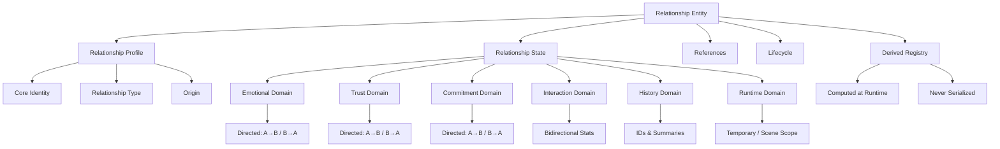
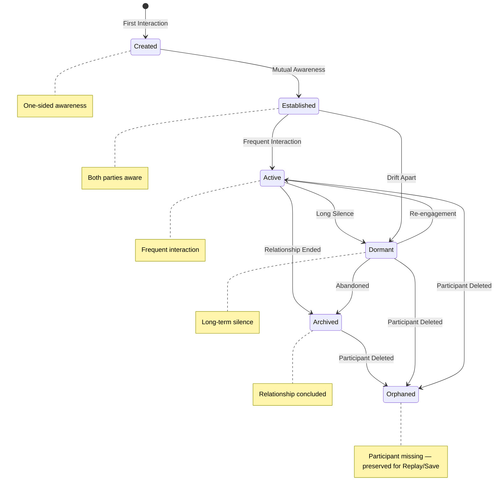

# Relationship State Schema

**Version:** v1.0 RC2  
**Status:** Release Candidate  
**Last Updated:** 2026-07-13

**Depends On:** [Character State Schema v1.3](./Character_State_Schema.md)

---

## 1. Purpose（文档目的）

Define the structure, domains, ownership, lifecycle, and serialization rules of Relationship data in the AI Narrative RPG Engine.

定义 AI Narrative RPG Engine 中关系数据的结构、域划分、归属、生命周期和序列化规则。

### Core Definition（核心定义）

A Relationship is an **independent Runtime Entity** that connects two Characters. It is not a collection of numbers — it is a **state flow on a directed graph**.

Relationship 是连接两个 Character 的**独立运行时实体**。它不是数值集合，而是**有向图上的状态流**。

This document is the **parent specification** for all future relationship-related implementations.

本文件是所有未来关系相关实现的**父规范**。

### Core Philosophy（核心理念）

Relationship is **not dialogue**, **not a single score**, and **not owned by either participant**.

关系不是对话，不是单一分数，不属于任何一方参与者。

It is a continuously evolving directed entity that lives independently between two Characters.

它是一个持续演化的有向实体，独立存在于两个角色之间。

---

## 2. Design Principles（设计原则）

| Principle | Description |
|-----------|-------------|
| Relationship Is Entity | 关系是独立实体。Relationship is an independent Runtime Entity, not owned by either Character — it belongs to the Relationship Manager. |
| Participant Independence | 参与者独立。Relationship always references Characters, never owns them. Participant lifecycle changes (e.g., deletion) do not destroy the Relationship Entity. |
| Directed Graph Model | 有向图模型。Relationship has directionality. `A→B` state ≠ `B→A` state. All state domains are directional by default unless explicitly marked `shared`. |
| Profile Is Identity | Profile 是身份。Profile defines "what this relationship is" — minimal and stable. |
| State Is Evolution | State 是演变。State defines "how this relationship is going" — complex and dynamic. |
| Temporal Separation | 时间尺度分离。Three temporal layers: Runtime (minutes), State (months/years), Profile (years). |
| Reference Everything External | 外部数据一律引用。Memory, Event, Topic, Quest data are referenced by IDs only, never embedded. |
| Derived Over Stored | 派生优于存储。Dynamic and phase fields are not stored — they are derived from State. Derived data is deterministic, reproducible, and traceable. |
| Implementation-Agnostic | 实现无关。This document defines structure, not programming language classes or database schemas. |

---

## 3. Responsibilities（职责）

### Responsible For（负责）

- Defining the structure of Relationship Profile and Relationship State
- Defining domain-based organization of Relationship State
- Defining the Directed State Pattern for bidirectional relationships
- Defining ownership and mutation rules for each domain
- Defining Relationship Lifecycle states and transitions
- Defining serialization and snapshot rules

### Not Responsible For（不负责）

- Character State structure (see Character State Schema)
- Memory Object structure (see Memory Architecture Blueprint)
- Quest structure (see future Quest Schema)
- Scene execution logic (see Scene Engine Blueprint)
- Behavior Tendency computation (owned by Relationship Engine)
- Relationship Constraints generation (owned by Relationship Engine)
- Determining Character behavior directly — Relationship only exposes state; Simulation / Narrative / Prompt consume it
- Hardware-specific implementation details (see Relationship Engine Blueprint)

---

## 4. Architecture Overview（架构总览）



---

## 5. Relationship Profile（关系档案）

Relationship Profile is the **minimal, stable identity** of a relationship. It defines *what this relationship is* — not how it is going.

Relationship Profile 是关系的**极简、稳定的身份**。它定义*这段关系是什么*，而非关系如何。

> **Future Modularization:** As the Engine grows, Relationship Profile may be split into multiple independent sub-profiles (Relationship Dynamics Profile, Relationship Communication Profile, Relationship Contract Profile). Profile is designed to be modular — each sub-profile would be an independent, versionable unit. This document defines the initial unified structure; future versions may split Profile without breaking the Profile/State boundary.

### 5.1 Core Identity（核心身份）

| Field | Description | Mutability |
|-------|-------------|------------|
| relationship_id | 全局唯一关系标识 | Immutable |
| profile_version | Profile 数据版本（用于存档迁移） | Incremented on profile changes |
| schema_version | Schema 版本（此关系创建时使用的 Schema 版本） | Immutable at creation, migrated on upgrade |
| participant_a_id | 参与者 A 的 Character ID | Immutable |
| participant_b_id | 参与者 B 的 Character ID | Immutable |
| creation_tick | 关系创建时的 Simulation Tick | Immutable |
| origin_world | 关系来源世界 | Immutable |

### 5.2 Relationship Type（关系类型）

| Field | Description | Mutability |
|-------|-------------|------------|
| relationship_type | 关系类型分类（acquaintance, friend, rival, family, romantic, mentor, enemy, ally） | Rarely changes |
| relationship_origin | 关系起源描述（如 "met at festival", "childhood friends"） | Immutable |
| formal_designation | 正式称谓（如 "sworn brothers", "betrothed"） | Rarely changes |

> **Note:** `relationship_type` is a high-level classification for quick filtering and UI display. The actual relationship nuance is always read from Relationship State domains.

---

## 6. Relationship State（关系运行时状态）

Relationship State is the **dynamic, directed evolution** of a relationship. It tracks how the relationship is going in each semantic dimension.

Relationship State 是关系的**动态、有向演变**。它追踪关系在每个语义维度上的进展。

### 6.1 Directed State Pattern（有向状态模式）

All persistent domains (except Interaction Domain and parts of History Domain) must implement the **Directed State Pattern**:

| Direction | Description |
|-----------|-------------|
| `a_to_b` | Participant A's state toward Participant B |
| `b_to_a` | Participant B's state toward Participant A |
| `shared` | *(Optional)* Consensus state — both parties agree |

> **Rule:** `A→B` and `B→A` are **independent** states. The system must **never** assume symmetry unless explicitly computed. This ensures realistic relationship modeling — A may trust B deeply while B remains suspicious of A.

### 6.2 Emotional Domain（情感域）

Records long-term emotional states between participants (temporal scale: months/years).

| Field | Direction | Description | Owner |
|-------|-----------|-------------|-------|
| affection | A→B / B→A | 好感度 (0.0 – 1.0) | Simulation Layer |
| jealousy | A→B / B→A | 嫉妒度 (0.0 – 1.0) | Simulation Layer |
| emotional_momentum | A→B / B→A | 情感动量 (−1.0 – 1.0, negative = deteriorating) | Simulation Layer |
| warmth | A→B / B→A | 温暖感 (0.0 – 1.0) | Simulation Layer |
| emotional_resonance | shared | 情感共鸣度 (0.0 – 1.0) | Simulation Layer |

> **Alignment:** These dimensions align with the Relationship Engine Blueprint's "Dynamic Dimensions" (Emotional Momentum, Jealousy) and core dimension (Affection).

### 6.3 Trust Domain（信任域）

Records trust-related dimensions (temporal scale: months/years).

| Field | Direction | Description | Owner |
|-------|-----------|-------------|-------|
| trust | A→B / B→A | 信任度 (0.0 – 1.0) | Simulation Layer |
| respect | A→B / B→A | 尊重度 (0.0 – 1.0) | Simulation Layer |
| familiarity | shared | 熟悉度 (0.0 – 1.0) | Simulation Layer |

> **Decay Rate:** Familiarity decays slowly; Trust changes through events; Respect is difficult to regain once lost. See Relationship Engine Blueprint §10.

### 6.4 Commitment Domain（承诺域）

Records commitment and bond-related dimensions (temporal scale: months/years).

| Field | Direction | Description | Owner |
|-------|-----------|-------------|-------|
| attachment | A→B / B→A | 依恋度 (0.0 – 1.0) | Simulation Layer |
| dependency | A→B / B→A | 依赖度 (0.0 – 1.0) | Simulation Layer |
| intimacy | shared | 亲密度 (0.0 – 1.0) | Simulation Layer |
| dedication | A→B / B→A | 奉献意愿 (0.0 – 1.0) | Simulation Layer |

> **Decay Rate:** Attachment rarely decreases naturally; Intimacy requires sustained interaction to maintain; Dependency may increase or decrease through life events. See Relationship Engine Blueprint §10.

### 6.5 Interaction Domain（交互域）

Records interaction frequency and patterns. This domain is **bidirectional** — interaction statistics are shared, not directed.

| Field | Direction | Description | Owner |
|-------|-----------|-------------|-------|
| total_interactions | shared | 总交互次数 | Simulation Layer |
| last_interaction_tick | shared | 最近一次交互的 Tick 编号 | Simulation Layer |
| interaction_frequency | shared | 交互频率分类（frequent, regular, occasional, rare, dormant） | Simulation Layer (derived) |
| preferred_interaction_modes | shared | 偏好交互模式列表（如 "deep_conversation", "shared_activity", "conflict"） | Simulation Layer |
| positive_ratio | shared | 正面交互占比 (0.0 – 1.0) | Simulation Layer (derived) |

### 6.6 History Domain（历史域）

Records the historical trajectory of the relationship. Only stores IDs and summaries — never full content.

| Field | Direction | Description | Owner |
|-------|-----------|-------------|-------|
| milestone_event_ids | shared | 里程碑事件 ID 列表（如 "first_meeting", "first_conflict", "reconciliation"） | Simulation Layer |
| conflict_event_ids | shared | 冲突事件 ID 列表 | Simulation Layer |
| positive_event_ids | shared | 正面事件 ID 列表 | Simulation Layer |
| arc_summary | shared | 关系弧线摘要（自由文本，定期更新） | Simulation Layer |
| last_major_shift_tick | shared | 最近一次重大转变的 Tick | Simulation Layer |

> **Rule:** Event IDs reference Memory System objects. Relationship State never stores event content — only references.

### 6.7 Runtime Domain（运行时域）

Scene-scoped temporary state. Exists only during the current Scene execution. Discarded at Scene completion unless explicitly promoted to Persistent State by Simulation Layer.

| Field | Direction | Description | Owner |
|-------|-----------|-------------|-------|
| interaction_context | shared | 当前交互上下文（如 "negotiation", "comfort", "argument"） | Scene Engine |
| scene_flags | shared | 当前 Scene 的临时关系标志（如 "forced_proximity", "mediated", "public_setting"） | Scene Engine |
| current_tension | shared | 当前张力 (0.0 – 1.0) | Simulation Layer |
| emotional_charge | A→B / B→A | 当前情感电荷 (−1.0 – 1.0) | Simulation Layer |
| temporary_modifiers | shared | 当前 Scene 的临时状态修正器列表 | Simulation Layer |
| pending_shift | shared | 是否有待提交的状态变更 | Simulation Layer |

> **Rule:** Runtime Domain data **must never** survive Scene transition unless explicitly promoted by Simulation Layer to a persistent domain. This mirrors the Session State / Persistent State separation in Runtime State Model Blueprint.
>
> **No scene_id Duplication:** Runtime Domain does **not** store `current_scene_id`. The current Scene is owned by Scene Engine — querying it through Scene Manager avoids SSOT violation. Relationship State only stores relationship-relevant execution context.

---

## 7. References（引用域）

All external data is referenced by IDs only, **never embedded**.

所有外部数据仅通过 ID 引用，**永不嵌入**。

| Field | Description | Referenced System |
|-------|-------------|-------------------|
| shared_memory_ids | 共享记忆 ID 列表（双方共同拥有的记忆） | Memory System |
| significant_event_ids | 重要事件 ID 列表 | Memory System |
| quest_ids | 相关任务 ID 列表 | Quest System (Future) |
| topic_ids | 相关话题 ID 列表 | Future Topic System |

> **Rule:** Relationship never owns participants. Participant lifecycle is managed exclusively by Character Manager. Relationship only stores references.
>
> **No scene_ids:** Relationship does not maintain a list of shared Scene IDs. Scene history belongs to Scene System; shared experiences are tracked through `shared_memory_ids` in Memory System, which is the single source of truth for experiential history. Querying shared Scenes is done through Memory → Scene reference, not through Relationship State.

---

## 8. Derived Registry（派生数据注册表）

Derived Data is computed at runtime from State fields. It is **never serialized** — it is recomputed on load. This prevents Save file bloat and eliminates consistency bugs.

派生数据在运行时从 State 字段计算。它**永不序列化** — 在加载时重新计算。

### 8.1 Derived Rules（派生规则）

| Rule | Description |
|------|-------------|
| Deterministic | 确定性 — 相同输入必须产生相同输出。Identical inputs always produce identical outputs. |
| Reproducible | 可重现 — 任何时候均可重新计算。Can be recomputed at any time. |
| Traceable | 可追溯 — 计算依赖必须有据可查。Computation dependencies must be traceable. |
| Never Serialized | 永不序列化 — 仅存在于 Runtime。Exists only in Runtime, never in Save files. |

### 8.2 Derived Fields（派生字段）

| Derived Field | Domain | Derivation Rule | Serialized? |
|---------------|--------|-----------------|-------------|
| relationship_strength | All | Weighted aggregate of all domain states — UI convenience metric only | No |
| relationship_tier | All | Tier classification from strength + type (e.g., "stranger", "acquaintance", "close_friend", "soulmate") | No |
| trust_asymmetry | Trust | `abs(a_to_b.trust - b_to_a.trust)` — measures trust gap | No |
| interaction_frequency | Interaction | Computed from `total_interactions` and `last_interaction_tick` relative to current Tick | No |
| positive_ratio | Interaction | `positive_event_ids.length / (positive_event_ids.length + conflict_event_ids.length)` | No |
| emotional_volatility | Emotional | Variance of `emotional_momentum` over recent history | No |
| stability_index | All | Composite metric from asymmetry, volatility, and decay rates | No |
| behavior_projection | All | Abstract projection of relationship state into behavioral implications (Scene-scoped, not persisted) | No |

> **Rule:** Relationship Strength is a **UI convenience metric** and must **never** be used as a simulation source of truth. All simulation decisions must read individual domain states directly. This aligns with the Relationship Engine Blueprint's principle: "Relationship Score is never used as the source of truth."
>
> **Abstract Naming:** `behavior_projection` is intentionally abstract — it does not reference any specific Engine output name (e.g., "Behavior Tendency"). This ensures the Schema remains stable even if the consuming Engine's output format changes.

---

## 9. Ownership & Mutation Rules（归属与变更规则）

### 9.1 Ownership Table（归属表）

| Domain | Owner | Read-Only Access |
|--------|-------|-----------------|
| Relationship Profile | Simulation Layer (rare mutations only) | Narrative Director, Prompt Builder, Memory System |
| Relationship State — Emotional | Simulation Layer | Narrative Director, Prompt Builder |
| Relationship State — Trust | Simulation Layer | Narrative Director, Prompt Builder |
| Relationship State — Commitment | Simulation Layer | Narrative Director, Prompt Builder |
| Relationship State — Interaction | Simulation Layer | Narrative Director, Prompt Builder |
| Relationship State — History | Simulation Layer | Narrative Director, Prompt Builder, Memory System |
| Relationship State — Runtime | Scene Engine (interaction_context, scene_flags) + Simulation Layer (tension, charge, modifiers, pending_shift) | Narrative Director, Prompt Builder |
| References | Simulation Layer (IDs managed by respective systems) | Narrative Director, Prompt Builder, Memory System |
| Derived Registry | Computed (no owner — recomputed on load) | All modules (read-only) |

### 9.2 Mutation Rights（变更权限）

| Rule | Description |
|------|-------------|
| Simulation Layer is the sole persistent mutation authority | 只有 Simulation Layer 可以变更 Persistent Relationship State。Only Simulation Layer may mutate Persistent Relationship State. |
| Scene Engine owns execution-context fields | Scene Engine 拥有 interaction_context、scene_flags。Simulation Layer 不直接修改这些字段。 |
| Runtime Domain is Scene-scoped only | Runtime Domain 数据在 Scene 结束时丢弃，除非 Simulation Layer 显式提升为 Persistent。 |
| Relationship Engine operates via Simulation Layer | Relationship Engine 通过 Simulation Layer 请求变更，不直接修改 Relationship State。 |
| Narrative Director is read-only | Narrative Director 只读消费 Relationship State。 |
| Prompt Builder is read-only | Prompt Builder 只读消费 Relationship State。 |
| No dual-ownership | 无双 Owner 字段 — 每个字段只有一个变更权威。 |
| Derived fields are never mutated | 派生字段永不被修改 — 只被重新计算。 |

---

## 10. Relationship Lifecycle（关系生命周期）

Every Relationship has a defined lifecycle from creation to archival.

每个 Relationship 都有从创建到归档的明确定义的生命周期。



### Lifecycle States（生命周期状态）

| State | Description | Persistent? | Receives Updates? |
|-------|-------------|-------------|-------------------|
| Created | 关系刚创建，可能仅一方认知对方 | Yes | No (awaiting interaction) |
| Established | 双方已相互认知，关系确立 | Yes | Yes |
| Active | 频繁互动，关系活跃 | Yes | Yes |
| Dormant | 长期静默，衰减中 | Yes | No (decay only) |
| Archived | 关系已结束，历史保留 | Yes (read-only) | No |
| Orphaned | 一方缺失（删除/离开），数据保留 | Yes (read-only) | No |

### Lifecycle Transitions（生命周期转换）

| Transition | Trigger | Owner |
|-----------|---------|-------|
| Create | First interaction between participants | Simulation Layer |
| Created → Established | Mutual awareness achieved | Simulation Layer |
| Established → Active | Frequent interaction detected | Simulation Layer |
| Active → Dormant | Long silence (decay threshold reached) | Simulation Layer |
| Dormant → Active | Re-engagement (new interaction) | Simulation Layer |
| Active → Archived | Relationship concluded (story event) | Simulation Layer |
| Dormant → Archived | Abandoned (long-term dormancy threshold) | Simulation Layer |
| Established → Dormant | Drift apart (gradual decay) | Simulation Layer |
| Any Active/Dormant/Archived → Orphaned | Participant deleted or permanently removed | Character Manager |

### Lifecycle Rules（生命周期规则）

| Rule | Description |
|------|-------------|
| Orphaned preserves data | Orphaned 状态保证历史数据完整性，支持 Replay/Save。Participant deletion does not destroy Relationship data. |
| Dormant applies decay | Dormant 状态下，Relationship State 持续衰减但不接收主动更新。 |
| Archived is read-only | Archived 状态的关系不可修改。如需重新激活，需创建新 Relationship 或通过特殊事件恢复。 |
| Re-engagement from Dormant | Dormant → Active 转换需要新的交互触发。 |
| No deletion of Orphaned | Orphaned 关系不自动删除，由系统策略决定保留期限。 |

---

## 11. Runtime Guarantees（运行时保证）

Relationship State Schema guarantees:

- Relationship is an independent Entity — it is not owned by either participant Character.
- All persistent state domains implement the Directed State Pattern — `A→B` ≠ `B→A`.
- All external data (Memory, Event, Quest, Topic) is referenced by IDs, never embedded.
- No field in Relationship State has dual ownership — every field has exactly one mutation authority.
- Runtime Domain data does not survive Scene transition unless explicitly promoted by Simulation Layer.
- Runtime Domain does not store `scene_id` — Scene context is queried through Scene Manager.
- References Domain does not store `scene_ids` — shared Scene history is queried through Memory System.
- All Derived Data is recomputed on load and never serialized.
- Relationship Strength is a UI convenience metric and must never be used as a simulation source of truth.
- Relationship State is included in Runtime State Snapshots.
- Relationship State supports Branch/Fork semantics for deterministic replay.
- Failed Scene execution rolls back Relationship State to the Snapshot without corruption.
- State transitions are deterministic, traceable, and replayable.
- **Directional Consistency:** The system must never assume symmetry between `A→B` and `B→A` unless explicitly computed.

---

## 12. Serialization Rules（序列化规则）

| Rule | Description |
|------|-------------|
| Profile and State are serialized separately | Profile 和 State 分开序列化。Profile changes rarely; State changes every Scene. |
| References are serialized as IDs only | 引用域序列化为 ID 列表，不序列化外部对象。 |
| Snapshot includes full Relationship State | 快照包含完整 Relationship State（Persistent domains only），用于回滚和重放。 |
| Runtime Domain is not serialized | Runtime Domain 不序列化 — 它是 Scene 级瞬态数据。 |
| Derived Registry is not serialized | 派生数据不序列化 — 在加载时重新计算。 |
| Profile versioning is per-relationship | 每个关系拥有独立的 profile_version 和 schema_version，支持存档迁移。 |
| Serialization format is implementation-defined | 序列化格式由实现决定（JSON, MessagePack, etc.），但必须满足以上规则。 |

### Serialization Structure（序列化结构）

```
Relationship Data
├── profile_version
├── schema_version
├── relationship_profile
│   ├── core_identity
│   │   ├── relationship_id
│   │   ├── participant_a_id
│   │   ├── participant_b_id
│   │   └── ...
│   └── relationship_type
└── relationship_state
    ├── emotional_domain
    │   ├── a_to_b (affection, jealousy, emotional_momentum, warmth)
    │   ├── b_to_a (affection, jealousy, emotional_momentum, warmth)
    │   └── shared (emotional_resonance)
    ├── trust_domain
    │   ├── a_to_b (trust, respect)
    │   ├── b_to_a (trust, respect)
    │   └── shared (familiarity)
    ├── commitment_domain
    │   ├── a_to_b (attachment, dependency, dedication)
    │   ├── b_to_a (attachment, dependency, dedication)
    │   └── shared (intimacy)
    ├── interaction_domain (bidirectional)
    │   ├── total_interactions
    │   ├── last_interaction_tick
    │   ├── preferred_interaction_modes
    │   ├── (interaction_frequency: Derived — not serialized)
    │   └── (positive_ratio: Derived — not serialized)
    ├── history_domain
    │   ├── milestone_event_ids
    │   ├── conflict_event_ids
    │   ├── positive_event_ids
    │   ├── arc_summary
    │   └── last_major_shift_tick
    ├── runtime_domain (Temporary — Not Serialized)
    │   ├── (Scene Engine: interaction_context, scene_flags)
    │   └── (Simulation Layer: tension, charge, temporary_modifiers, pending_shift)
    └── references_domain
        ├── shared_memory_ids
        ├── significant_event_ids
        ├── quest_ids
        └── topic_ids
```

---

## 13. Snapshot & Branch Behavior（快照与分支行为）

| Operation | Behavior |
|-----------|----------|
| Snapshot | 捕获完整 Persistent Relationship State（不包括 Runtime Domain）。 |
| Branch | 从快照创建 Relationship State 分支，用于推演或重放。 |
| Fork | 复制 Relationship State 用于只读推演（如 Narrative Director 预演未来关系走向）。 |
| Commit | 将分支变更合并回主分支。 |
| Rollback | 丢弃分支变更，恢复到快照时的 Relationship State。 |

---

## 14. Future Extensibility（未来扩展）

| Feature | Description |
|---------|-------------|
| Group Relationship | 扩展 participants 列表以支持多人关系（三角关系、团队关系） |
| Communication Channel | 为关系绑定专属通信频道和对话历史引用 |
| Social Organization | 支持组织、派系等群体关系结构 |
| Reputation Projection | 支持公开形象与私下态度的分离（public vs private relationship） |
| Cross-World Relationship | 支持跨世界的多重关系状态 |
| Relationship Templates | 预定义关系模板，快速生成初始关系 |
| Dynamic Dimension Injection | 支持世界级自定义关系维度（Mod-defined Dimensions） |
| Relationship Network Analysis | 关系网络分析 — 群体关系图谱、影响力传播、派系检测 |
| Profile Modularization | Profile 模块化 — 将 Profile 拆分为多个独立子 Profile（Relationship Dynamics Profile, Relationship Communication Profile, Relationship Contract Profile），每个子 Profile 可独立版本化和演化 |

These features must conform to the Directed State Pattern, Reference-by-ID rules, and Lifecycle definitions in this document.

---

## 15. Schema Lock Policy（Schema 锁定策略）

Once this Schema is locked, the following governance rules apply:

一旦本 Schema 锁定，将遵循以下治理规则：

| Rule | Description |
|------|-------------|
| No new core fields | 不接受新增核心字段。 |
| No structural changes | 不接受结构调整。 |
| Only allowed | 仅允许：Bug 修复、注释完善、引用修正。 |
| Structural changes | 任何结构修改需通过 ADR (Architecture Decision Record) 审批。 |

---

## 16. References

**Depends On:**

- [Relationship Engine Blueprint](../02_Architecture/Relationship_Engine_Blueprint.md)
- [Runtime State Model Blueprint](../02_Architecture/Runtime_State_Model_Blueprint.md)
- [Character State Schema](./Character_State_Schema.md)
- [Simulation Layer Blueprint](../02_Architecture/Simulation_Layer_Blueprint.md)
- [Glossary](../00_Project/Glossary.md)

**Referenced By:**

- Relationship Engine Blueprint (Relationship State structure)
- Simulation Layer Blueprint (Relationship State mutation)
- Narrative Director Blueprint (Relationship State consumption)
- Prompt Builder Blueprint (Relationship State consumption)
- Memory Architecture Blueprint (shared_memory_ids, significant_event_ids)
- Future: Quest Schema (quest_ids)
- Future: World State Schema

---

## 17. Revision History

| Version | Date | Description |
|---------|------|-------------|
| v1.0 RC1 | 2026-07-13 | Initial Schema: Profile/State separation; 6 state domains; Directed State Pattern; Derived Registry; Relationship Lifecycle; Serialization rules |
| v1.0 RC2 | 2026-07-13 | Style unification with Character v1.3: moved Document Governance to end; removed Hardware Considerations (belongs to Blueprint); removed scene_id from Runtime Domain (SSOT); removed scene_ids from References (SSOT); renamed behavior_tendency_ref to behavior_projection (abstract naming); strengthened relationship_strength UI-only declaration; added Lifecycle Transition Owner column; annotated Derived in Serialization Tree; added Profile Modularization to Future Extensibility; added Referenced By section |

---

## 18. Document Governance（文档治理）

**Owner:** Relationship Architect

**Reviewers:**

- Runtime Architect
- Simulation Architect
- Narrative Architect

**Approval:** Architecture Review Required

**Update Policy:** Changes affecting domain structure, ownership boundaries, Profile/State separation, or Lifecycle states require ADR approval.

**Parent Blueprint:** [Relationship Engine Blueprint](../02_Architecture/Relationship_Engine_Blueprint.md)

**Parent Schema:** [Runtime State Model Blueprint](../02_Architecture/Runtime_State_Model_Blueprint.md)
