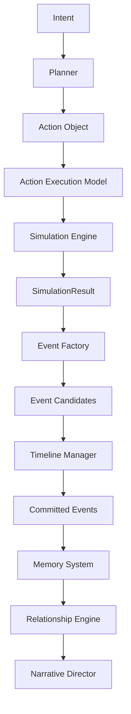
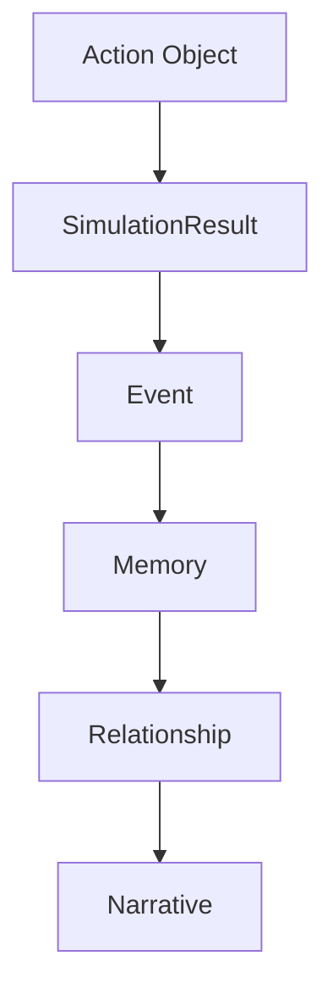
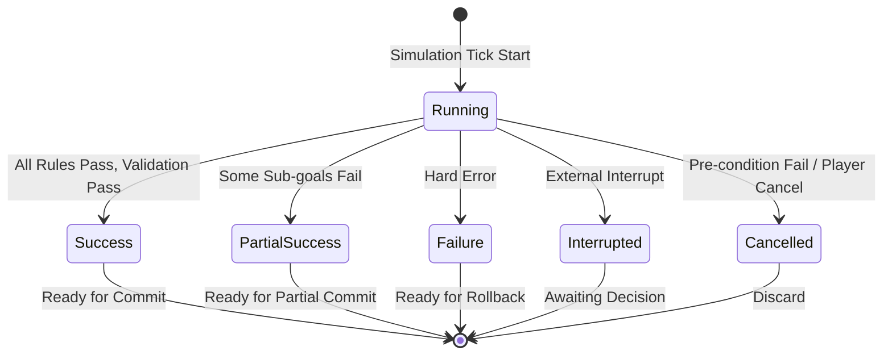
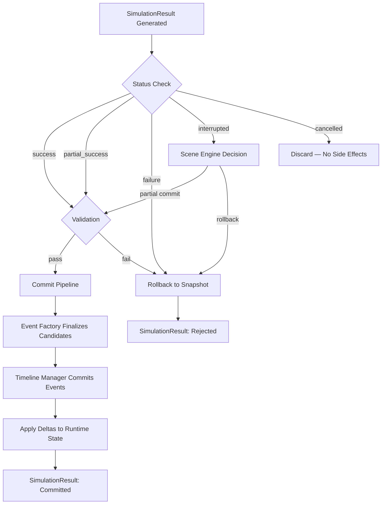
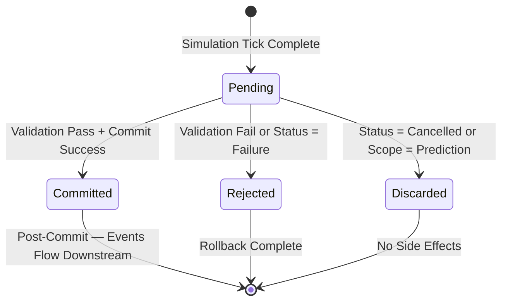

# SimulationResult Schema

**Version:** v1.0 Draft  
**Status:** Draft  
**Last Updated:** 2026-07-13

**Depends On:** [Event Object Schema v1.0 RC4](./Event_Object_Schema.md), [Character State Schema v1.3](./Character_State_Schema.md), [Relationship State Schema v1.0 RC3](./Relationship_State_Schema.md)

---

## 1. Purpose（文档目的）

Define the structure, status model, payload, lifecycle, and commit pipeline rules of SimulationResult data in the AI Narrative RPG Engine.

定义 AI Narrative RPG Engine 中模拟结果数据的结构、状态模型、载荷、生命周期和提交管道规则。

### Core Definition（核心定义）

A SimulationResult is the **standard output object of a Simulation Tick** — the complete, self-contained result of executing one Action against one Runtime State Snapshot. It is the bridge between the Simulation Engine's computation and the Event Factory's reality packaging.

SimulationResult 是**模拟 Tick 的标准输出对象** — 对一个 Runtime State Snapshot 执行一个 Action 的完整、自包含结果。它是 Simulation Engine 计算与 Event Factory 现实打包之间的桥梁。

SimulationResult answers one question: **"What did the simulation compute?"**

SimulationResult 只回答一个问题：**"模拟计算了什么？"**

### Core Philosophy（核心理念）

SimulationResult is computation, not reality. It is transient — it exists during a Simulation Tick and the subsequent Commit Pipeline, then is discarded. The permanent record of what happened is the Event; SimulationResult is the process output that produced it.

SimulationResult 是计算，不是现实。它是瞬态的 — 存在于 Simulation Tick 和随后的 Commit Pipeline 期间，然后被丢弃。发生的永久记录是 Event；SimulationResult 是产生它的过程输出。

### SimulationResult is NOT Runtime State（SimulationResult 不是 Runtime State）

SimulationResult is a **transient computation artifact**, not part of Runtime State. It is never persisted — it can be regenerated via Replay from the input Snapshot + Action + Seed. This ensures zero storage overhead and full determinism.

SimulationResult 是**瞬态计算产物**，不是 Runtime State 的一部分。它从不持久化 — 可以通过 Replay 从输入 Snapshot + Action + Seed 重新生成。这确保零存储开销和完全确定性。

---

## 2. Design Principles（设计原则）

| Principle | Description |
|-----------|-------------|
| Computation, Not Reality | SimulationResult 是计算产物，不是现实记录。Event is reality; SimulationResult is the process that produced it. |
| Deterministic | 确定性。Same Snapshot + Same Action + Same Seed = Same SimulationResult. |
| Transient | 瞬态。SimulationResult is never persisted. It can be regenerated via Replay. |
| Self-Contained | 自包含。SimulationResult carries everything needed for Commit, Debug, and Replay — no external lookups required. |
| Delta-Compatible | Delta 兼容。Deltas use the exact same structure as Event Object Schema Deltas — zero transformation required. |
| Status-First | 状态优先。Status determines whether the result can be committed, partially committed, or must be discarded. |
| Validation-Bound | 验证绑定。No SimulationResult may be committed without passing validation. |
| Prediction-Capable | 预测能力。SimulationResult can be produced on forked state for AI planning, without affecting the main Timeline. |
| Implementation-Agnostic | 实现无关。This document defines structure, not programming language classes or database schemas. |

---

## 3. Architecture Position（架构定位）

SimulationResult sits between Action Execution and Event Commit in the Runtime Pipeline.

SimulationResult 在 Runtime Pipeline 中位于 Action Execution 和 Event Commit 之间。

### Runtime Pipeline（运行时流水线）



### Pipeline Stage（流水线阶段）

| Stage | Input | Output | Owner |
|-------|-------|--------|-------|
| Simulation Engine | Action Object + Runtime State Snapshot | SimulationResult | Simulation Layer |
| Event Factory | SimulationResult (Deltas) | Event Candidates | Simulation Layer (sub-component) |
| Timeline Manager | Event Candidates | Committed Events | Timeline Manager |

### Acyclic Dependency（无环依赖）



> **Acyclic Dependency:** Each layer depends only on layers below it. SimulationResult depends on Action Object (upstream) and is consumed by Event Factory (downstream). It never depends on Memory, Relationship, or Narrative. This enables deterministic replay and prediction.
>
> **No Runtime Context:** SimulationResult does not depend on or reference any "Runtime Context" object. Runtime Context should emerge naturally from the real needs of Runtime Objects, not be pre-designed. SimulationResult is self-contained — it carries its own identity, input reference, and seed.

---

## 4. SimulationResult Identity（模拟结果身份）

| Field | Description | Mutability |
|-------|-------------|------------|
| result_id | 全局唯一结果标识 (UUID) | Immutable |
| simulation_tick | 生成此结果的 Simulation Tick 编号 | Immutable |
| correlation_id | 事务组标识（与 Action 和生成的 Events 共享，用于关联同一次 Action 的所有产物） | Immutable |
| schema_version | 此结果创建时使用的 Schema 版本（如 "1.0"），用于 Replay 兼容性检查 | Immutable |
| seed | 本次模拟使用的确定性种子 | Immutable |
| source_action_id | 触发本次模拟的 Action Object ID | Immutable |
| input_snapshot_id | 模拟输入的 Runtime State Snapshot ID | Immutable |
| commit_scope | 提交范围（`live`, `prediction`, `replay`）— 决定结果是否可提交到主 Timeline | Immutable |

> **Correlation ID Continuity:** `correlation_id` is shared across Action → SimulationResult → Event Candidates → Committed Events. This enables full traceability from player intent to world state change. See Event Object Schema §5.
>
> **Seed for Determinism:** `seed` guarantees that the same input state + same action + same seed always produces the same SimulationResult. This is the foundation of Replay and Prediction.
>
> **Snapshot Reference:** `input_snapshot_id` enables Replay — given the snapshot, the action, and the seed, the SimulationResult can be regenerated exactly.
>
> **Commit Scope:** `commit_scope` separates three execution modes:
> - `live` — Normal simulation, results can be committed to the main Timeline.
> - `prediction` — Forked state simulation for AI planning, results are **never committed**.
> - `replay` — Replaying a past simulation for debugging, results are **compared, not committed**.

---

## 5. Simulation Status（模拟状态）

Simulation Status is the **primary dispatch field** — it determines how the Commit Pipeline processes the result.

Simulation Status 是**主分派字段** — 它决定 Commit Pipeline 如何处理结果。

### Status Enum（状态枚举）

| Status | Description | Has Deltas? | Has Events? | Committable? |
|--------|-------------|-------------|-------------|--------------|
| `success` | 模拟完全成功。所有规则评估完成，所有状态变更已计算，验证通过。 | Yes | Yes | Yes |
| `partial_success` | 模拟部分成功。部分子目标达成，部分失败。有效的 Deltas 和 Events 子集可提交。 | Yes (subset) | Yes (subset) | Yes (valid subset only) |
| `failure` | 模拟遇到硬错误。状态变更无效或不完整。不可提交，必须回滚。 | No (invalid) | No | No — Rollback |
| `interrupted` | 模拟被外部因素中断（高优先级事件、系统中断、超时）。状态可能部分计算。 | Maybe (partial) | Maybe (partial) | Conditional — depends on what completed |
| `cancelled` | 模拟在执行前被取消（玩家取消、前置条件检查失败、Action 被 Planner 拒绝）。无状态变更，无事件。 | No | No | No — Discard |

### Status State Machine（状态状态机）



### Status Rules（状态规则）

| Rule | Description |
|------|-------------|
| Status is the primary dispatch field | Commit Pipeline 首先检查 status，决定处理路径。 |
| `failure` always means rollback | `failure` 状态的结果必须回滚到 Snapshot，不可部分提交。 |
| `partial_success` allows subset commit | `partial_success` 状态的结果中，仅 `valid_deltas` 和 `valid_event_candidates` 可提交。 |
| `interrupted` requires external decision | `interrupted` 状态的结果由 Scene Engine 决定是否部分提交或回滚。 |
| `cancelled` produces no side effects | `cancelled` 状态的结果不产生任何状态变更、不生成任何事件、不影响任何系统。 |
| Status is immutable once set | 一旦 SimulationResult 生成，status 不可变更。如需重试，生成新的 SimulationResult。 |

> **Partial Success vs Failure:** `partial_success` means the simulation completed execution but some sub-goals failed — the valid portions can be committed. `failure` means the simulation encountered a hard error during execution — nothing is trustworthy, everything must be rolled back. The distinction is critical: partial success commits a subset; failure commits nothing.
>
> **Interrupted vs Cancelled:** `interrupted` means the simulation started executing but was stopped midway — some computation may have completed. `cancelled` means the simulation never started executing — the action was rejected before any computation. Interrupted may have partial results; cancelled has nothing.

---

## 6. Deltas（状态变更向量）

Deltas are the **raw state change vectors** computed by the Rule Engine. They use the **exact same structure** as Event Object Schema Deltas — zero transformation required when packaging into Event Candidates.

Deltas 是 Rule Engine 计算的**原始状态变更向量**。它们使用与 Event Object Schema Deltas **完全相同的结构** — 打包为 Event Candidate 时无需任何转换。

### Delta Structure（Delta 结构）

Each Delta contains five elements, identical to Event Object Schema §8:

| Element | Description |
|---------|-------------|
| target_id | 目标实体 ID（Character ID, Relationship ID, World ID, etc.） |
| op | 操作类型（set, add, sub, mul, div, transfer, push, remove, clear） |
| path | 状态路径（点分隔，如 `stats.hp`, `emotional.a_to_b.affection`, `flags.war_started`） |
| val | 值（语义取决于 op：set=新值，add/sub=增量，transfer=目标位置，push=新增元素） |
| metadata | 操作元数据（可选键值对，使用命名空间前缀，如 `{ "combat.critical_hit": true, "engine.source_skill": "fireball_lv3" }`） |

### Delta Classification（Delta 分类）

| Field | Description |
|-------|-------------|
| `valid_deltas` | 有效 Delta 列表 — 通过验证，可安全应用 |
| `invalid_deltas` | 无效 Delta 列表 — 验证失败，不可应用（保留用于 Debug） |

> **Classification is only meaningful for `partial_success`:** For `success`, all deltas are valid. For `failure` / `cancelled`, `valid_deltas` is empty. For `interrupted`, classification depends on what was computed before interruption.

### Delta Rules（Delta 规则）

| Rule | Description |
|------|-------------|
| Structure identical to Event Schema | Delta 结构与 Event Object Schema §8 完全一致 — 相同的 `target_id`, `op`, `path`, `val`, `metadata`。 |
| Persistent State Only | Delta 只能指向 Persistent State 字段。Derived fields（如 `relationship_strength`, `power_rank`）**永远不是**合法的 Delta 目标。 |
| Metadata Uses Reserved Namespace | metadata 键名使用命名空间前缀（`engine.*`, `combat.*`, `magic.*`, `mod.*`），与 Event Schema 一致。 |
| Deterministic Ordering | Deltas 必须严格按照数组顺序应用。Replay 实现必须保持原始顺序。 |
| No Narrative | Delta metadata 是操作上下文，不是叙事文本。 |

> **Zero Transformation:** Because SimulationResult Deltas and Event Payload Deltas share the exact same structure, the Event Factory can directly embed Deltas into Event Payloads without any transformation. This eliminates an entire class of mapping bugs.
>
> **Path Alignment:** Delta `path` values must align with the domain structures defined in Character State Schema and Relationship State Schema. For example, `emotional.a_to_b.affection` maps to Relationship State §6.2 Emotional Domain, and `mental.emotion_layer.emotion_intensity` maps to Character State §7.3 Mental State Domain.

### Example Deltas（示例 Deltas）

```json
{
  "valid_deltas": [
    {
      "target_id": "char_b",
      "op": "sub",
      "path": "stats.hp",
      "val": 35,
      "metadata": {
        "combat.critical_hit": true,
        "combat.damage_type": "fire",
        "engine.source_skill": "fireball_lv3"
      }
    },
    {
      "target_id": "rel_001",
      "op": "add",
      "path": "emotional.a_to_b.affection",
      "val": 0.05,
      "metadata": {
        "engine.trigger": "combat_protection",
        "engine.cause": "char_a_protected_char_b"
      }
    },
    {
      "target_id": "char_a",
      "op": "sub",
      "path": "stats.mana",
      "val": 30,
      "metadata": {
        "engine.source_skill": "fireball_lv3",
        "magic.mana_cost": 30
      }
    }
  ],
  "invalid_deltas": []
}
```

---

## 7. Generated Events（生成的事件候选）

Generated Events are **Event Candidates** created by the Event Factory from Deltas. They are in the `Generated` lifecycle state (see Event Object Schema §11) — not yet committed, not yet reality.

Generated Events 是 Event Factory 从 Deltas 创建的**事件候选**。它们处于 `Generated` 生命周期状态（见 Event Object Schema §11）— 尚未提交，尚未成为现实。

### Event Candidate Structure（事件候选结构）

Each Event Candidate follows the Event Object Schema structure, with these constraints:

| Field | State | Note |
|-------|-------|------|
| event_id | Assigned | UUID generated at creation |
| event_sequence | **Null** | Assigned at Commit by Timeline Manager |
| trigger_event_sequence | Set if applicable | Causal parent (null for root events) |
| correlation_id | **Inherited** from SimulationResult | Transaction group — links Action → Result → Events |
| schema_version | **Inherited** from SimulationResult | Schema version for migration |
| profile | Fully set | event_type, severity, in_world_timestamp, location_id, category, tags |
| actors | Fully set | actor_ids, target_ids, potential_observer_ids, affected_entity_ids |
| payload.deltas | **Subset** of SimulationResult `valid_deltas` | Each Event packages relevant Deltas |
| visibility | Fully set | visibility_scope, faction_restriction |
| lifecycle_state | `generated` | See Event Object Schema §11 |

### Event Candidate Classification（事件候选分类）

| Field | Description |
|-------|-------------|
| `event_candidates` | 有效事件候选列表 — 通过内部验证，可提交给 Timeline Manager |
| `rejected_candidates` | 被内部拒绝的事件候选列表 — 保留用于 Debug，不提交 |

> **Rejected Candidates:** The Simulation may internally reject some Event Candidates (e.g., an event that violates world constraints). These are retained in `rejected_candidates` for debugging purposes but are never sent to Timeline Manager.

### Delta-Event Consistency（Delta-Event 一致性）

| Rule | Description |
|------|-------------|
| Union of Event Deltas = Valid Deltas | 所有 `event_candidates` 中 Delta 的并集必须等于 `valid_deltas` 列表（当 status 为 `success` 时）。 |
| No orphan deltas | 每个 valid delta 必须属于至少一个 event candidate。 |
| No phantom deltas | Event candidate 的 payload 中不可包含不在 `valid_deltas` 列表中的 delta。 |
| Consistency is a validation check | Delta-Event 一致性是验证检查的一部分。不一致的 SimulationResult 验证失败。 |

> **Why Both Deltas and Events?** Deltas provide a flat, granular view of state changes — ideal for direct state mutation and debugging. Events provide a structured, meaningful packaging — ideal for Timeline recording and downstream consumption. Both are needed: Deltas for state mutation, Events for reality record. The consistency rule ensures they never diverge.

---

## 8. Validation Result（验证结果）

Validation Result records the outcome of **state consistency validation** — whether the resulting state (after applying Deltas) is a valid world state.

Validation Result 记录**状态一致性验证**的结果 — 即应用 Deltas 后的结果状态是否是有效的世界状态。

### Structure（结构）

| Field | Description |
|-------|-------------|
| overall | 总体验证结果（`pass`, `fail`, `warning`） |
| checks | 验证检查列表（每项包含 check_id, check_name, check_type, result, detail） |
| violations | 违规列表（如果 overall 为 `fail`，每项包含 violation_code, violation_message, affected_path, severity） |
| validated_state_hash | 验证通过后的结果状态哈希（用于 Replay 比对） |

### Validation Check Types（验证检查类型）

| Check Type | Description |
|------------|-------------|
| `range_check` | 数值范围验证（如 affection 必须在 0.0 – 1.0） |
| `reference_check` | 引用完整性验证（如 target_id 指向的实体存在） |
| `constraint_check` | 世界约束验证（如角色不能同时出现在两个地点） |
| `invariant_check` | 不变量验证（如 Derived Data 必须等于其计算公式的结果） |
| `delta_event_consistency` | Delta-Event 一致性验证（见 §7） |
| `custom_check` | 自定义验证（Mod 定义） |

### Validation Rules（验证规则）

| Rule | Description |
|------|-------------|
| Validation is mandatory | 所有 SimulationResult 必须经过验证才能提交。 |
| `fail` blocks commit | 如果 overall 为 `fail`，Commit Pipeline 必须回滚。 |
| `warning` does not block | 如果 overall 为 `warning`，可以提交但警告被记录。 |
| `validated_state_hash` enables replay verification | Replay 时，重新计算的结果状态哈希必须与原始 `validated_state_hash` 一致。 |

> **Validation vs Status:** Status is set by the Simulation Engine during computation (did the rules fire correctly?). Validation is performed after computation (is the resulting state valid?). A simulation can succeed in computation but fail validation — for example, a rule might compute a Delta that pushes a value out of valid range.

---

## 9. Failure Info（失败信息）

Failure Info provides **structured, non-narrative** failure details when status is `failure` or when validation fails.

Failure Info 在状态为 `failure` 或验证失败时提供**结构化、非叙事**的失败详情。

### Structure（结构）

| Field | Description |
|-------|-------------|
| failure_code | 枚举失败代码（见下表） |
| failure_message | 结构化失败消息（非自然语言叙事，如 `"RULE_VIOLATION: character.char_a cannot perform action.attack while physical_availability=unconscious"`） |
| failure_context | 失败上下文数据（结构化键值对，如 `{ "rule_id": "combat_init_check", "entity_id": "char_a", "field": "physical_availability", "value": "unconscious" }`） |
| failure_phase | 失败发生的模拟阶段（`pre_check`, `rule_evaluation`, `delta_computation`, `event_generation`, `validation`） |
| recovery_hint | 建议的恢复操作（`retry`, `abort`, `rollback`, `fallback_action`） |

### Failure Codes（失败代码）

| Code | Description | Typical Recovery |
|------|-------------|------------------|
| `PRECONDITION_FAILED` | Action 前置条件不满足 | `abort` |
| `RULE_VIOLATION` | 规则硬约束违反 | `rollback` |
| `STATE_CONFLICT` | 状态冲突（如并发修改） | `retry` |
| `INVALID_DELTA` | 计算出的 Delta 无效（如路径不存在、操作非法） | `rollback` |
| `VALIDATION_FAILED` | 结果状态未通过一致性验证 | `rollback` |
| `RESOURCE_EXHAUSTED` | 资源耗尽（如 Action 所需资源不足） | `abort` |
| `SIMULATION_ERROR` | 模拟引擎内部错误 | `rollback` |
| `TIMEOUT` | 模拟超时 | `retry` |

### Failure Rules（失败规则）

| Rule | Description |
|------|-------------|
| Failure info is structured, not narrative | failure_message 是结构化消息，不是自然语言叙事。它描述 *what went wrong*，不描述 *what happened in the story*。 |
| Failure context is machine-readable | failure_context 是结构化键值对，用于程序化错误处理和调试。 |
| Failure code is enumerable | failure_code 来自预定义枚举，不可自由文本。新代码需通过 Schema 扩展。 |
| `failure` status always has failure_info | status 为 `failure` 时，failure_info 不可为空。 |
| Validation failure also populates failure_info | 验证失败时（overall = `fail`），failure_info 同样被填充，failure_code 为 `VALIDATION_FAILED`。 |

> **Diagnostics vs Failure Info:** Diagnostics record *how the simulation ran* (rules, timing, warnings). Failure Info records *why it failed* (code, message, context). A successful simulation has full Diagnostics but no Failure Info. A failed simulation has both.

---

## 10. Diagnostics（诊断信息）

Diagnostics provide **full observability** into the simulation process for Debug, Profiling, and Replay verification.

Diagnostics 为 Debug、性能分析和 Replay 验证提供**完整可观测性**。

### Structure（结构）

| Field | Description |
|-------|-------------|
| rules_evaluated | 评估的规则列表（每项包含 rule_id, rule_type, fired, result） |
| timing | 各模拟阶段的耗时（pre_check, rule_evaluation, delta_computation, event_generation, validation — 单位 ms） |
| warnings | 非关键警告列表（不影响结果，但值得记录） |
| intermediate_values | 中间计算值（可选，仅 Debug 模式 — 用于深度调试） |
| rule_trace | 规则追踪（可选 — 每个 Delta 的产生规则链，用于深度调试） |

### Diagnostics Rules（诊断规则）

| Rule | Description |
|------|-------------|
| Diagnostics are optional at runtime | 生产环境可降低诊断详细度以提升性能。Debug 模式启用完整诊断。 |
| Rule trace is Debug-only | `rule_trace` 仅在 Debug 模式下填充。它记录每个 Delta 的产生规则链，用于深度调试。 |
| Timing is always present | `timing` 始终填充，用于性能监控。 |
| Warnings are non-blocking | 警告不影响 SimulationResult 的 status 或可提交性。 |
| Diagnostics are not serialized | 诊断信息不持久化 — 仅存在于内存中的 SimulationResult 生命周期内。 |

> **Debug Support:** Diagnostics enable full debugging of the simulation process. Given a SimulationResult with full Diagnostics, a developer can trace exactly which rules fired, which Deltas they produced, how long each phase took, and what intermediate values were computed. This is the foundation of the Debug use case.

---

## 11. Ownership & Mutation Rules（归属与变更规则）

### Ownership（归属）

| Component | Owner | Read-Only Access |
|-----------|-------|-----------------|
| SimulationResult Identity | Simulation Layer | Scene Engine, Timeline Manager, Narrative Director |
| Simulation Status | Simulation Layer | All (read-only) |
| Deltas | Simulation Layer | Event Factory, Timeline Manager, Commit Pipeline |
| Generated Events | Simulation Layer (via Event Factory) | Timeline Manager, Memory System, Narrative Director |
| Validation Result | Simulation Layer | Scene Engine, Commit Pipeline |
| Failure Info | Simulation Layer | Scene Engine, Debug System |
| Diagnostics | Simulation Layer | Debug System, Profiler |
| Commit Metadata | Commit Pipeline | All (read-only) |

### Mutation Rules（变更规则）

| Rule | Description |
|------|-------------|
| Simulation Layer produces SimulationResult | 只有 Simulation Layer 可以生成 SimulationResult。 |
| Commit Pipeline updates commit metadata | 只有 Commit Pipeline 可以更新 commit_state, committed_event_sequences, committed_at。 |
| All other fields are immutable | 一旦生成，除 commit metadata 外所有字段不可变更。 |
| Retry creates new SimulationResult | 重试不修改原 SimulationResult，而是生成新的 SimulationResult（新的 result_id）。 |
| Prediction results are never mutated | `commit_scope=prediction` 的结果永远不进入 Commit Pipeline，commit_metadata 保持 `pending`。 |

---

## 12. Commit Pipeline（提交管道）

The Commit Pipeline processes a SimulationResult from generation to final commit or rejection.

Commit Pipeline 处理 SimulationResult 从生成到最终提交或拒绝的完整流程。

### Pipeline Flow（管道流程）



### Commit Steps（提交步骤）

| Step | Action | Owner |
|------|--------|-------|
| 1. Status Check | 检查 status，决定处理路径 | Commit Pipeline |
| 2. Validation | 检查 validation_result.overall | Commit Pipeline |
| 3. Event Finalization | Event Factory 最终化 Event Candidates | Event Factory |
| 4. Timeline Commit | Timeline Manager 提交 Events，分配 event_sequence | Timeline Manager |
| 5. State Mutation | 应用 `valid_deltas` 到 Runtime State | Commit Pipeline |
| 6. Commit Metadata | 更新 commit_state, committed_event_sequences, committed_at | Commit Pipeline |

### Commit Rules（提交规则）

| Rule | Description |
|------|-------------|
| No commit without validation | 未经验证的 SimulationResult 不可提交。 |
| No commit on failure | status 为 `failure` 的 SimulationResult 不可提交，必须回滚。 |
| Partial commit on partial_success | status 为 `partial_success` 的 SimulationResult 仅提交 valid 子集。 |
| Timeline commit is atomic | 所有 Event Candidates 必须在一次事务中全部提交或全部拒绝。不可部分提交 Events。 |
| State mutation follows event commit | Deltas 在 Events 提交后应用。如果 Event 提交失败，Deltas 不应用。 |
| Commit is one-way | 一旦 Committed，不可撤销。如需撤销，通过反向 Delta 生成新 Event。 |
| Prediction bypasses commit | `commit_scope=prediction` 的结果跳过整个 Commit Pipeline，直接标记为 `discarded`。 |

> **Atomicity:** The Commit Pipeline is atomic — either all valid Events are committed and all valid Deltas are applied, or nothing is committed and the state is rolled back. There is no intermediate state.
>
> **Ordering:** Deltas are applied in their array order (see §6 Deterministic Ordering). Events are committed in their array order. This ordering is a hard constraint for deterministic Replay.

---

## 13. SimulationResult Lifecycle（模拟结果生命周期）

SimulationResult has a short, well-defined lifecycle tied to the Scene Transaction.

SimulationResult 拥有与 Scene Transaction 绑定的短暂、明确定义的生命周期。



### Lifecycle States（生命周期状态）

| State | Description | Persisted? | Events Committed? |
|-------|-------------|------------|-------------------|
| Pending | SimulationResult 已生成，等待验证和提交 | No (in-memory) | No |
| Committed | Events 已提交，Deltas 已应用 | No (transient) | Yes |
| Rejected | 验证失败或状态为 Failure，已回滚 | No (transient) | No |
| Discarded | 状态为 Cancelled 或为 Prediction 结果，无副作用 | No (transient) | No |

### Lifecycle Rules（生命周期规则）

| Rule | Description |
|------|-------------|
| SimulationResult is transient | SimulationResult 是瞬态的 — 它不持久化，不跨 Session 存在。 |
| Committed SimulationResult is retained for Scene duration | 已提交的 SimulationResult 在 Scene 期间保留在内存中，供 Narrative Director 消费。Scene 结束后丢弃。 |
| Replay regenerates SimulationResult | Replay 通过 `input_snapshot_id` + `source_action_id` + `seed` 重新生成 SimulationResult，而非从存储加载。 |
| Lifecycle is one-way | 一旦进入 Committed / Rejected / Discarded，不可回到 Pending。 |

---

## 14. Runtime Guarantees（运行时保证）

SimulationResult Schema guarantees:

### Structural Guarantees（结构保证）

- **Determinism:** Same Snapshot + Same Action + Same Seed = Same SimulationResult. The entire simulation is replayable.
- **Self-Contained:** SimulationResult carries everything needed for Commit, Debug, and Replay — no external lookups required during Commit Pipeline.
- **Delta Compatibility:** Deltas use the exact same structure as Event Object Schema Deltas — zero transformation required.
- **Status Clarity:** Status is the primary dispatch field — the Commit Pipeline can determine the processing path from status alone.

### Architectural Invariants（架构不变量）

- **SimulationResult Never References Memory:** SimulationResult may reference Action (upstream) and produce Events (downstream). It must **never** reference Memory, Relationship, or Narrative. The dependency is strictly one-directional: Action → SimulationResult → Event → Memory → Relationship → Narrative.

  SimulationResult 可以引用 Action（上游）并生成 Events（下游）。它**永远不可**引用 Memory、Relationship 或 Narrative。依赖严格单向。

- **SimulationResult is Not Runtime State:** SimulationResult is a transient computation artifact. It is not part of Runtime State, not included in Snapshots, not persisted. The permanent record is the Event; SimulationResult is the process output.

  SimulationResult 是瞬态计算产物。它不是 Runtime State 的一部分，不包含在快照中，不持久化。永久记录是 Event；SimulationResult 是产生它的过程输出。

- **No Commit Without Validation:** No SimulationResult may be committed without passing validation. Validation failure mandates rollback. This is the Commit Pipeline's most critical invariant.

  未经验证的 SimulationResult 不可提交。验证失败强制回滚。这是 Commit Pipeline 最关键的不变量。

- **Delta-Event Consistency:** The union of all Event Candidate Deltas must equal the `valid_deltas` list (when status is `success`). This invariant is checked during validation.

  所有 Event Candidate Delta 的并集必须等于 `valid_deltas` 列表（当 status 为 `success` 时）。此不变量在验证期间检查。

### Replay Guarantees（重放保证）

- **Full Replay:** Given `input_snapshot_id` + `source_action_id` + `seed`, the Simulation Layer can regenerate an identical SimulationResult.
- **Hash Verification:** The replayed SimulationResult's `validated_state_hash` must match the original.
- **Event Sequence Independence:** SimulationResult does not contain `event_sequence` (assigned at Commit). Replay does not require committed Events — only the input state and action.

### Prediction Guarantees（预测保证）

- **Fork-Based Prediction:** SimulationResult can be produced on a forked state (read-only projection) without affecting the main Timeline.
- **Prediction Results Are Never Committed:** `commit_scope=prediction` results are discarded after consumption — they never enter the Commit Pipeline.
- **Prediction Is Deterministic:** A prediction on the same forked state with the same action and seed produces the same result as a live simulation would.

### Debug Guarantees（调试保证）

- **Full Traceability:** Given a SimulationResult with full Diagnostics, every Delta can be traced back to the rule that produced it, and every rule can be traced to its input conditions.
- **Timing Visibility:** `timing` field is always present, enabling performance profiling of every simulation phase.
- **Failure Diagnosability:** When status is `failure`, Failure Info provides structured failure code, context, and phase — enabling automated error handling and debugging.

---

## 15. Serialization Rules（序列化规则）

| Rule | Description |
|------|-------------|
| SimulationResult is not persisted | SimulationResult 不持久化 — 它是瞬态对象。 |
| In-memory only | SimulationResult 仅存在于内存中，生命周期与 Scene Transaction 绑定。 |
| Debug serialization is optional | Debug 模式可将 SimulationResult 序列化到调试日志（JSON 等），但这不是引擎正常运行的一部分。 |
| Replay regenerates, not loads | Replay 通过重放生成 SimulationResult，不从存储加载。 |
| Diagnostics are not serialized | 诊断信息不序列化 — 仅存在于内存中。 |

### In-Memory Structure（内存结构）

```
SimulationResult
├── identity
│   ├── result_id
│   ├── simulation_tick
│   ├── correlation_id
│   ├── schema_version
│   ├── seed
│   ├── source_action_id
│   ├── input_snapshot_id
│   └── commit_scope (live | prediction | replay)
├── status
│   ├── status (success | partial_success | failure | interrupted | cancelled)
│   └── status_detail
├── deltas
│   ├── valid_deltas[]
│   │   └── { target_id, op, path, val, metadata }
│   └── invalid_deltas[]
│       └── { target_id, op, path, val, metadata }
├── generated_events
│   ├── event_candidates[]
│   │   └── { identity, profile, actors, payload.deltas[], visibility }
│   └── rejected_candidates[]
│       └── { identity, profile, actors, payload.deltas[], visibility }
├── validation_result
│   ├── overall (pass | fail | warning)
│   ├── checks[]
│   ├── violations[]
│   └── validated_state_hash
├── failure_info (when applicable)
│   ├── failure_code
│   ├── failure_message
│   ├── failure_context
│   ├── failure_phase
│   └── recovery_hint
├── diagnostics
│   ├── rules_evaluated[]
│   ├── timing
│   ├── warnings[]
│   ├── intermediate_values (debug only)
│   └── rule_trace (debug only)
└── commit_metadata
    ├── commit_state (pending | committed | rejected | discarded)
    ├── committed_event_sequences[]
    └── committed_at
```

---

## 16. Future Extensibility（未来扩展）

| Feature | Description |
|---------|-------------|
| Sub-Action Simulation | 支持一个 Action 触发多个子模拟，每个子模拟产生独立 SimulationResult，通过 `parent_result_id` 关联。 |
| Simulation Branching | 支持一次模拟产生多个候选结果（Branch A / Branch B），由上层决策选择提交哪个。 |
| Causal Explanation | 为每个 Delta 生成完整因果解释链 — 从 Action 到 Rule 到 Delta 的完整追踪。 |
| Performance Profiling | 扩展 Diagnostics 支持细粒度性能分析 — 每条规则的执行时间、内存占用。 |
| Custom Validation | 支持 Mod 定义的自定义验证规则 — 通过 `custom_check` 类型扩展。 |
| Simulation Templates | 预定义模拟模板 — 常见 Action 类型的标准模拟流程。 |
| Predictive Caching | 预测结果缓存 — 对相同输入的预测结果进行缓存，避免重复计算。 |
| Batch Simulation | 批量模拟 — 一次提交多个 Action，产生多个 SimulationResult。 |
| Conditional Events | 支持条件事件 — Event Candidate 携带条件谓词，仅在条件满足时提交。 |

These features must conform to the Determinism, Transient, Delta-Compatible, and Acyclic Dependency rules in this document.

---

## 17. Schema Lock Policy（Schema 锁定策略）

Once this Schema is locked, the following governance rules apply:

一旦本 Schema 锁定，将遵循以下治理规则：

| Rule | Description |
|------|-------------|
| No breaking determinism | 不接受对确定性保证的破坏。 |
| No status enum reduction | 不接受删除或合并 Status 枚举值。 |
| No Delta structure changes | 不接受 Delta 结构的修改（必须与 Event Schema 保持一致）。 |
| No persistence | 不接受将 SimulationResult 持久化的任何提案。 |
| No Memory/Relationship references | 不接受 SimulationResult 反向引用 Memory 或 Relationship 的任何字段。 |
| Only allowed | 仅允许：扩展 Status 枚举（新增值）、扩展 Failure Codes、扩展 Validation Check Types、扩展 Diagnostics 字段。 |
| Structural changes | 任何结构修改需通过 ADR (Architecture Decision Record) 审批。 |

---

## 18. References

**Depends On:**

- [Event Object Schema](./Event_Object_Schema.md)
- [Character State Schema](./Character_State_Schema.md)
- [Relationship State Schema](./Relationship_State_Schema.md)
- [Simulation Layer Blueprint](../02_Architecture/Simulation_Layer_Blueprint.md)
- [Runtime State Model Blueprint](../02_Architecture/Runtime_State_Model_Blueprint.md)
- [Runtime Architecture Blueprint](../02_Architecture/Runtime_Architecture_Blueprint.md)
- [Glossary](../00_Project/Glossary.md)
- Future: Action Object Schema
- Future: Action Execution Model

**Referenced By:**

- Simulation Layer Blueprint (SimulationResult production)
- Event Object Schema (SimulationResult → Event Candidate generation)
- Narrative Director Blueprint (SimulationResult consumption for narrative planning)
- Runtime Architecture Blueprint (Runtime Pipeline)
- Future: Action Execution Model (SimulationResult as output)
- Future: Commit Pipeline (SimulationResult processing)

---

## 19. Revision History

| Version | Date | Description |
|---------|------|-------------|
| v1.0 Draft | 2026-07-13 | Initial Schema: Identity, Status (5 states), Deltas, Generated Events, Validation Result, Failure Info, Diagnostics, Commit Pipeline, Lifecycle, Runtime Guarantees (Replay/Prediction/Debug), Acyclic Dependency, Commit Scope |

---

## 20. Document Governance（文档治理）

**Status:** Draft

**Status Values:** Draft → RC → Locked → Deprecated

**Owner:** Simulation Architect

**Reviewers:**

- Runtime Architect
- Engine Architect
- Narrative Architect

**Approval:** Architecture Review Required

**Update Policy:** Changes affecting status model, Delta structure, commit pipeline semantics, or acyclic dependency invariants require ADR approval.

**Parent Blueprint:** [Simulation Layer Blueprint](../02_Architecture/Simulation_Layer_Blueprint.md)
